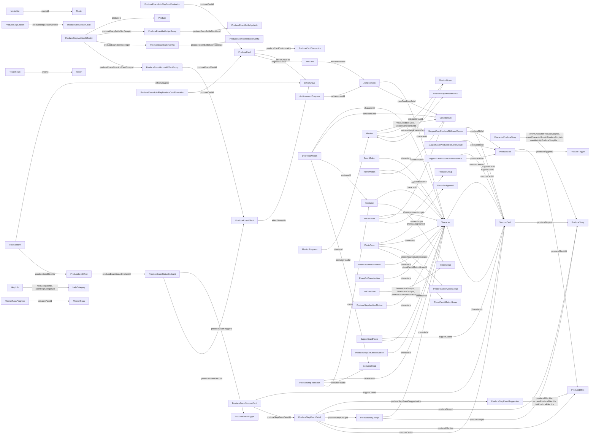

# Gakumas 游戏数据库格式分析

- 生成时间: `2026-03-16 09:41:57`
- YAML 表总数: `271`
- YAML 总记录数: `132959`
- 含本地化 JSON 的表数: `92`
- `id` 非唯一表数: `41`

## 总览

| 表名 | 记录数 | 字段数 | 嵌套字段数 | 本地化记录数 | id唯一 | id重复数 |
| --- | ---: | ---: | ---: | ---: | --- | ---: |
| Achievement | 1026 | 17 | 0 | 839 | Yes | 0 |
| AchievementProgress | 1912 | 5 | 1 | 0 | N/A | 0 |
| AppReview | 2 | 8 | 0 | 0 | N/A | 0 |
| AssetDownload | 3419 | 2 | 0 | 0 | Yes | 0 |
| Badge | 182 | 12 | 0 | 0 | Yes | 0 |
| Bgm | 2 | 6 | 0 | 0 | N/A | 0 |
| Character | 19 | 37 | 0 | 19 | Yes | 0 |
| CharacterActorLookEffector | 1 | 2 | 0 | 0 | N/A | 0 |
| CharacterAdv | 20 | 4 | 0 | 20 | N/A | 0 |
| CharacterColor | 22 | 8 | 0 | 0 | N/A | 0 |
| CharacterDearnessLevel | 323 | 16 | 2 | 261 | N/A | 0 |
| CharacterDearnessStoryGashaCampaign | 0 | 0 | 0 | 0 | N/A | 0 |
| CharacterDetail | 181 | 4 | 0 | 167 | N/A | 0 |
| CharacterProduceStory | 26 | 8 | 0 | 0 | N/A | 0 |
| CharacterPushMessage | 169 | 5 | 0 | 156 | N/A | 0 |
| CharacterTrueEndAchievement | 26 | 4 | 2 | 0 | N/A | 0 |
| CharacterTrueEndBonus | 26 | 9 | 0 | 0 | No | 13 |
| CoinGashaButton | 27 | 7 | 0 | 18 | Yes | 0 |
| CompetitionExamStatusEffectIcon | 6 | 3 | 0 | 0 | N/A | 0 |
| CompetitionSeason | 0 | 0 | 0 | 0 | N/A | 0 |
| CompetitionStageSectionLock | 24 | 3 | 0 | 0 | N/A | 0 |
| ConditionSet | 4202 | 12 | 0 | 0 | No | 1127 |
| ConsumptionSet | 794 | 5 | 0 | 0 | No | 612 |
| Costume | 445 | 19 | 0 | 343 | Yes | 0 |
| CostumeColorGroup | 228 | 3 | 0 | 0 | Yes | 0 |
| CostumeHead | 330 | 13 | 0 | 237 | Yes | 0 |
| CostumeMotion | 98 | 6 | 0 | 0 | N/A | 0 |
| CostumePhotoGroup | 15 | 4 | 0 | 0 | No | 14 |
| CostumeWaitMotion | 37 | 4 | 0 | 0 | N/A | 0 |
| DearnessBackground | 148 | 8 | 0 | 0 | N/A | 0 |
| DearnessBgm | 13 | 2 | 0 | 0 | N/A | 0 |
| DearnessBoostBgm | 9 | 2 | 0 | 0 | N/A | 0 |
| DearnessMotion | 2662 | 10 | 0 | 0 | N/A | 0 |
| DearnessStoryCampaign | 0 | 0 | 0 | 0 | N/A | 0 |
| DeepLinkTransition | 14 | 1 | 0 | 0 | N/A | 0 |
| EffectGroup | 66 | 9 | 0 | 66 | Yes | 0 |
| EventLabel | 12 | 3 | 0 | 10 | N/A | 0 |
| EventStoryCampaign | 0 | 0 | 0 | 0 | N/A | 0 |
| ExamContestEmbedProduceCard | 12 | 3 | 0 | 0 | No | 10 |
| ExamInitialDeck | 40 | 3 | 0 | 0 | Yes | 0 |
| ExamMotion | 1972 | 10 | 0 | 0 | N/A | 0 |
| ExamOutGameMotion | 780 | 9 | 0 | 0 | N/A | 0 |
| ExamSetting | 1 | 46 | 0 | 0 | Yes | 0 |
| ExamSimulation | 0 | 0 | 0 | 0 | N/A | 0 |
| ExchangeItemCategory | 6 | 6 | 0 | 6 | N/A | 0 |
| FeatureLock | 12 | 7 | 0 | 10 | N/A | 0 |
| ForceAppVersion | 4 | 4 | 0 | 0 | N/A | 0 |
| GashaAnimationStep | 143 | 6 | 0 | 0 | N/A | 0 |
| GashaButton | 46 | 25 | 0 | 26 | Yes | 0 |
| GuildDonationItem | 9 | 2 | 0 | 0 | N/A | 0 |
| GuildReaction | 44 | 3 | 0 | 0 | Yes | 0 |
| GvgRaid | 1 | 7 | 0 | 1 | Yes | 0 |
| GvgRaidStageLoop | 0 | 0 | 0 | 0 | N/A | 0 |
| HelpCategory | 33 | 6 | 0 | 30 | Yes | 0 |
| HelpContent | 248 | 5 | 0 | 228 | No | 1 |
| HelpInfo | 269 | 4 | 0 | 0 | N/A | 0 |
| HomeBackground | 10 | 5 | 0 | 0 | Yes | 0 |
| HomeBackgroundPrefabGroup | 65 | 3 | 0 | 0 | No | 57 |
| HomeBoard | 28 | 3 | 0 | 0 | N/A | 0 |
| HomeMonitor | 2 | 4 | 0 | 0 | N/A | 0 |
| HomeMotion | 1729 | 9 | 0 | 0 | N/A | 0 |
| HomeTime | 4 | 3 | 0 | 0 | N/A | 0 |
| IdolCard | 129 | 42 | 0 | 106 | Yes | 0 |
| IdolCardLevelLimit | 171 | 3 | 0 | 0 | No | 144 |
| IdolCardLevelLimitProduceSkill | 42 | 5 | 0 | 0 | No | 28 |
| IdolCardLevelLimitStatusUp | 26 | 8 | 0 | 0 | No | 22 |
| IdolCardPiece | 129 | 4 | 1 | 0 | N/A | 0 |
| IdolCardPieceQuantity | 3 | 2 | 0 | 0 | N/A | 0 |
| IdolCardPotential | 516 | 9 | 0 | 0 | No | 387 |
| IdolCardPotentialProduceSkill | 206 | 5 | 0 | 0 | No | 103 |
| IdolCardSimulation | 0 | 0 | 0 | 0 | N/A | 0 |
| IdolCardSkin | 235 | 38 | 0 | 0 | Yes | 0 |
| IdolCardSkinSelectReward | 12 | 5 | 0 | 0 | No | 11 |
| IdolCardSkinUnit | 3 | 4 | 0 | 0 | Yes | 0 |
| InvitationMission | 4 | 2 | 0 | 0 | N/A | 0 |
| InvitationPointReward | 8 | 2 | 1 | 0 | N/A | 0 |
| Item | 253 | 30 | 1 | 190 | Yes | 0 |
| JewelConsumptionCount | 3 | 4 | 0 | 0 | No | 2 |
| LimitItem | 23 | 2 | 0 | 0 | N/A | 0 |
| Localization | 45 | 2 | 0 | 15 | Yes | 0 |
| LoginBonusMotion | 26 | 6 | 0 | 0 | No | 14 |
| MainStoryChapter | 4 | 7 | 0 | 4 | Yes | 0 |
| MainStoryPart | 1 | 4 | 0 | 1 | Yes | 0 |
| MainTask | 310 | 17 | 2 | 260 | N/A | 0 |
| MainTaskGroup | 4 | 6 | 0 | 3 | Yes | 0 |
| MainTaskIcon | 124 | 2 | 0 | 0 | N/A | 0 |
| Media | 179 | 15 | 0 | 131 | Yes | 0 |
| MediaExternalLink | 6 | 6 | 0 | 0 | Yes | 0 |
| MeishiBaseAsset | 282 | 5 | 0 | 270 | Yes | 0 |
| MeishiBaseColor | 15 | 2 | 0 | 0 | Yes | 0 |
| MeishiIllustrationAsset | 574 | 11 | 0 | 296 | Yes | 0 |
| MeishiTextColor | 37 | 2 | 0 | 0 | Yes | 0 |
| MemoryAbility | 235 | 6 | 0 | 0 | Yes | 0 |
| MemoryExchangeItem | 3 | 2 | 0 | 0 | N/A | 0 |
| MemoryExchangeItemQuantity | 16 | 2 | 0 | 0 | N/A | 0 |
| MemoryGift | 5 | 16 | 3 | 3 | Yes | 0 |
| MemoryTag | 24 | 4 | 0 | 24 | Yes | 0 |
| Mission | 2802 | 16 | 0 | 2154 | Yes | 0 |
| MissionDailyRelease | 131 | 3 | 0 | 0 | N/A | 0 |
| MissionDailyReleaseGroup | 25 | 12 | 0 | 0 | Yes | 0 |
| MissionGroup | 205 | 11 | 1 | 140 | Yes | 0 |
| MissionPanelSheet | 29 | 11 | 0 | 13 | N/A | 0 |
| MissionPanelSheetGroup | 23 | 5 | 0 | 9 | Yes | 0 |
| MissionPass | 23 | 11 | 0 | 16 | Yes | 0 |
| MissionPassPoint | 1 | 3 | 0 | 1 | Yes | 0 |
| MissionPassProgress | 475 | 7 | 2 | 0 | N/A | 0 |
| MissionPoint | 29 | 4 | 0 | 23 | Yes | 0 |
| MissionPointRewardSet | 111 | 4 | 1 | 0 | N/A | 0 |
| MissionProgress | 2726 | 4 | 1 | 0 | N/A | 0 |
| Money | 80 | 4 | 0 | 0 | N/A | 0 |
| Music | 335 | 19 | 0 | 248 | Yes | 0 |
| MusicHot | 1342 | 4 | 0 | 0 | No | 1251 |
| MusicSinger | 305 | 5 | 0 | 0 | N/A | 0 |
| PhotoBackground | 7 | 15 | 0 | 6 | Yes | 0 |
| PhotoFacialLookTarget | 0 | 0 | 0 | 0 | N/A | 0 |
| PhotoFacialMotionGroup | 4 | 5 | 0 | 4 | No | 3 |
| PhotoLookEffectorCharacter | 13 | 2 | 0 | 0 | N/A | 0 |
| PhotoLookTargetVoiceCharacter | 13 | 3 | 0 | 0 | N/A | 0 |
| PhotoPose | 988 | 18 | 0 | 816 | Yes | 0 |
| PhotoReactionVoiceGroup | 436 | 6 | 0 | 0 | No | 302 |
| PhotoWaitVoiceCharacter | 65 | 3 | 0 | 0 | N/A | 0 |
| PhotoWaitVoiceGroup | 117 | 3 | 0 | 0 | No | 78 |
| Produce | 6 | 21 | 0 | 5 | Yes | 0 |
| ProduceAdv | 32 | 4 | 0 | 32 | N/A | 0 |
| ProduceCard | 1552 | 40 | 2 | 1177 | No | 1155 |
| ProduceCardConversion | 21 | 5 | 0 | 0 | N/A | 0 |
| ProduceCardCustomize | 316 | 6 | 0 | 171 | No | 87 |
| ProduceCardCustomizeRarityEvaluation | 4 | 2 | 0 | 0 | N/A | 0 |
| ProduceCardGrowEffect | 442 | 12 | 0 | 0 | Yes | 0 |
| ProduceCardPool | 4 | 2 | 1 | 0 | Yes | 0 |
| ProduceCardRandomPool | 269 | 4 | 0 | 0 | No | 265 |
| ProduceCardSearch | 150 | 22 | 1 | 110 | Yes | 0 |
| ProduceCardSimulation | 0 | 0 | 0 | 0 | N/A | 0 |
| ProduceCardSimulationGroup | 0 | 0 | 0 | 0 | N/A | 0 |
| ProduceCardStatusEffect | 0 | 0 | 0 | 0 | N/A | 0 |
| ProduceCardStatusEnchant | 68 | 6 | 1 | 52 | Yes | 0 |
| ProduceCardTag | 3 | 2 | 0 | 3 | Yes | 0 |
| ProduceChallengeCharacter | 39 | 3 | 0 | 0 | N/A | 0 |
| ProduceChallengeSlot | 54 | 5 | 0 | 36 | No | 48 |
| ProduceCharacter | 78 | 4 | 0 | 0 | N/A | 0 |
| ProduceCharacterAdv | 10 | 5 | 0 | 10 | N/A | 0 |
| ProduceDescriptionExamEffect | 81 | 8 | 0 | 81 | N/A | 0 |
| ProduceDescriptionLabel | 210 | 4 | 1 | 207 | Yes | 0 |
| ProduceDescriptionProduceCardGrowEffect | 53 | 6 | 0 | 53 | N/A | 0 |
| ProduceDescriptionProduceCardMovePosition | 7 | 3 | 0 | 0 | N/A | 0 |
| ProduceDescriptionProduceEffect | 86 | 3 | 0 | 85 | N/A | 0 |
| ProduceDescriptionProducePlan | 4 | 4 | 0 | 4 | N/A | 0 |
| ProduceDescriptionProduceStep | 2 | 3 | 0 | 2 | N/A | 0 |
| ProduceDescriptionSwap | 66 | 3 | 0 | 66 | No | 33 |
| ProduceDrink | 29 | 13 | 1 | 29 | Yes | 0 |
| ProduceDrinkEffect | 45 | 3 | 0 | 0 | Yes | 0 |
| ProduceEffect | 1818 | 13 | 1 | 0 | Yes | 0 |
| ProduceEffectIcon | 94 | 5 | 0 | 0 | N/A | 0 |
| ProduceEventCharacterGrowth | 39 | 8 | 0 | 36 | N/A | 0 |
| ProduceEventSupportCard | 443 | 4 | 0 | 0 | N/A | 0 |
| ProduceExamAutoCardSelectEvaluation | 210 | 5 | 0 | 0 | N/A | 0 |
| ProduceExamAutoEvaluation | 10290 | 6 | 0 | 0 | N/A | 0 |
| ProduceExamAutoGrowEffectEvaluation | 3710 | 6 | 0 | 0 | N/A | 0 |
| ProduceExamAutoPlayCardEvaluation | 2730 | 3 | 0 | 0 | N/A | 0 |
| ProduceExamAutoPlayProduceCardEvaluation | 661 | 4 | 0 | 0 | N/A | 0 |
| ProduceExamAutoResourceEvaluation | 0 | 0 | 0 | 0 | N/A | 0 |
| ProduceExamAutoTriggerEvaluation | 235 | 4 | 0 | 0 | N/A | 0 |
| ProduceExamBattleConfig | 625 | 12 | 0 | 0 | Yes | 0 |
| ProduceExamBattleNpcGroup | 11689 | 12 | 0 | 0 | No | 9320 |
| ProduceExamBattleNpcMob | 51 | 3 | 0 | 51 | Yes | 0 |
| ProduceExamBattleScoreConfig | 3766 | 5 | 0 | 0 | No | 3333 |
| ProduceExamEffect | 1770 | 23 | 2 | 1475 | Yes | 0 |
| ProduceExamGimmickEffectGroup | 3661 | 12 | 1 | 3590 | No | 2595 |
| ProduceExamStatusEnchant | 1039 | 5 | 1 | 819 | Yes | 0 |
| ProduceExamTrigger | 513 | 16 | 3 | 398 | Yes | 0 |
| ProduceGrade | 31 | 3 | 0 | 0 | N/A | 0 |
| ProduceGroup | 2 | 13 | 0 | 2 | Yes | 0 |
| ProduceGroupLiveCommon | 91 | 15 | 0 | 0 | N/A | 0 |
| ProduceGuide | 258 | 4 | 0 | 0 | N/A | 0 |
| ProduceGuideProduceCardCategory | 67 | 5 | 0 | 0 | Yes | 0 |
| ProduceGuideProduceCardCategoryGroup | 16 | 3 | 0 | 0 | Yes | 0 |
| ProduceGuideProduceCardSampleDeckCategory | 65 | 3 | 0 | 0 | Yes | 0 |
| ProduceGuideProduceCardSampleDeckCategoryGroup | 16 | 2 | 0 | 0 | Yes | 0 |
| ProduceHighScore | 14 | 5 | 0 | 8 | Yes | 0 |
| ProduceInitialDeck | 36 | 3 | 0 | 0 | N/A | 0 |
| ProduceItem | 933 | 25 | 2 | 715 | Yes | 0 |
| ProduceItemChallengeGroup | 390 | 4 | 0 | 0 | No | 336 |
| ProduceItemEffect | 832 | 6 | 0 | 0 | Yes | 0 |
| ProduceItemSimulation | 0 | 0 | 0 | 0 | N/A | 0 |
| ProduceItemSimulationGroup | 0 | 0 | 0 | 0 | N/A | 0 |
| ProduceLegendProduceCard | 6 | 3 | 0 | 0 | N/A | 0 |
| ProduceLive | 256 | 15 | 0 | 0 | N/A | 0 |
| ProduceNavigation | 261 | 3 | 0 | 261 | No | 253 |
| ProduceNextIdolAuditionMasterRankingSeason | 3 | 5 | 0 | 0 | Yes | 0 |
| ProduceResultMotion | 234 | 7 | 0 | 0 | N/A | 0 |
| ProduceScheduleBackground | 10 | 5 | 0 | 0 | N/A | 0 |
| ProduceScheduleMotion | 806 | 8 | 0 | 0 | N/A | 0 |
| ProduceSeason | 2 | 5 | 0 | 0 | Yes | 0 |
| ProduceSeasonZeroGrade | 30 | 3 | 0 | 0 | N/A | 0 |
| ProduceSetting | 6 | 13 | 0 | 0 | Yes | 0 |
| ProduceSkill | 1247 | 16 | 1 | 1156 | No | 722 |
| ProduceStartMotion | 39 | 6 | 0 | 0 | N/A | 0 |
| ProduceStepAuditionCharacter | 130 | 6 | 0 | 0 | N/A | 0 |
| ProduceStepAuditionDifficulty | 3108 | 16 | 0 | 0 | No | 2997 |
| ProduceStepAuditionMotion | 546 | 11 | 0 | 0 | N/A | 0 |
| ProduceStepEventDetail | 6648 | 11 | 1 | 6141 | Yes | 0 |
| ProduceStepEventSuggestion | 2994 | 19 | 1 | 2852 | Yes | 0 |
| ProduceStepFanPresentMotion | 39 | 6 | 0 | 0 | N/A | 0 |
| ProduceStepLesson | 955 | 3 | 0 | 895 | Yes | 0 |
| ProduceStepLessonLevel | 174 | 5 | 0 | 0 | Yes | 0 |
| ProduceStepSelfLesson | 6 | 4 | 0 | 0 | Yes | 0 |
| ProduceStepSelfLessonMotion | 416 | 10 | 0 | 0 | N/A | 0 |
| ProduceStepTransition | 1976 | 9 | 0 | 0 | N/A | 0 |
| ProduceStory | 2807 | 9 | 0 | 2331 | Yes | 0 |
| ProduceStoryGroup | 1456 | 3 | 0 | 0 | No | 1344 |
| ProduceTrigger | 161 | 2 | 0 | 0 | Yes | 0 |
| ProduceWeekMotion | 130 | 6 | 0 | 0 | N/A | 0 |
| ProducerLevel | 80 | 5 | 2 | 0 | N/A | 0 |
| ProducerRanking | 3 | 11 | 0 | 0 | Yes | 0 |
| ProducerRankingCharacter | 13 | 3 | 0 | 0 | N/A | 0 |
| ProducerRankingProduce | 8 | 2 | 0 | 0 | No | 5 |
| ProducerRankingRankGrade | 18 | 3 | 0 | 0 | No | 15 |
| ProducerRankingTower | 38 | 3 | 0 | 0 | No | 35 |
| PvpRateCommonProduceCard | 3 | 3 | 1 | 0 | No | 2 |
| PvpRateConfig | 41 | 14 | 1 | 29 | Yes | 0 |
| PvpRateMotion | 52 | 8 | 0 | 0 | N/A | 0 |
| PvpRateUnitSlotUnlock | 8 | 2 | 0 | 0 | N/A | 0 |
| ResearchMemoryRerollCost | 55 | 3 | 0 | 0 | N/A | 0 |
| ResultGradePattern | 46 | 3 | 0 | 0 | N/A | 0 |
| Rule | 23 | 4 | 0 | 23 | N/A | 0 |
| SeminarExamTransition | 12 | 9 | 1 | 12 | N/A | 0 |
| Setting | 1 | 220 | 0 | 1 | Yes | 0 |
| Shop | 5 | 11 | 0 | 4 | Yes | 0 |
| ShopItem | 227 | 23 | 1 | 143 | Yes | 0 |
| ShopProduct | 14 | 7 | 0 | 0 | Yes | 0 |
| Story | 235 | 11 | 1 | 197 | Yes | 0 |
| StoryEvent | 31 | 9 | 0 | 26 | Yes | 0 |
| StoryGroup | 76 | 15 | 0 | 60 | Yes | 0 |
| SupportCard | 175 | 22 | 2 | 136 | Yes | 0 |
| SupportCardBonus | 15 | 3 | 0 | 0 | N/A | 0 |
| SupportCardFlavor | 484 | 5 | 0 | 370 | N/A | 0 |
| SupportCardLevel | 150 | 3 | 0 | 0 | No | 147 |
| SupportCardLevelLimit | 15 | 3 | 0 | 0 | No | 12 |
| SupportCardProduceSkillFilter | 44 | 5 | 0 | 37 | Yes | 0 |
| SupportCardProduceSkillLevelAssist | 223 | 5 | 0 | 0 | N/A | 0 |
| SupportCardProduceSkillLevelDance | 4446 | 5 | 0 | 0 | N/A | 0 |
| SupportCardProduceSkillLevelVisual | 4161 | 5 | 0 | 0 | N/A | 0 |
| SupportCardProduceSkillLevelVocal | 4413 | 5 | 0 | 0 | N/A | 0 |
| SupportCardSimulation | 0 | 0 | 0 | 0 | N/A | 0 |
| SupportCardSimulationGroup | 0 | 0 | 0 | 0 | N/A | 0 |
| Terms | 3 | 3 | 0 | 3 | N/A | 0 |
| Tips | 30 | 10 | 0 | 30 | Yes | 0 |
| TitleAsset | 2 | 10 | 0 | 0 | Yes | 0 |
| TitleVoice | 14 | 3 | 0 | 0 | N/A | 0 |
| Tour | 2 | 9 | 0 | 0 | Yes | 0 |
| TourMotion | 26 | 8 | 0 | 0 | No | 25 |
| TourStageTimeline | 6 | 8 | 0 | 0 | No | 4 |
| Tower | 13 | 7 | 0 | 12 | Yes | 0 |
| TowerLayer | 0 | 0 | 0 | 0 | N/A | 0 |
| TowerLayerExam | 0 | 0 | 0 | 0 | N/A | 0 |
| TowerLayerRank | 0 | 0 | 0 | 0 | N/A | 0 |
| TowerReset | 950 | 3 | 0 | 0 | N/A | 0 |
| TowerTotalClearRankReward | 97 | 3 | 1 | 0 | N/A | 0 |
| Tutorial | 193 | 11 | 0 | 182 | N/A | 0 |
| TutorialCharacterVoice | 21 | 4 | 0 | 0 | N/A | 0 |
| TutorialProduce | 3 | 12 | 0 | 0 | N/A | 0 |
| TutorialProduceStep | 12 | 17 | 0 | 12 | N/A | 0 |
| Voice | 39 | 3 | 0 | 0 | N/A | 0 |
| VoiceGroup | 2717 | 6 | 0 | 1997 | No | 1843 |
| VoiceRoster | 1531 | 7 | 0 | 1291 | N/A | 0 |
| Work | 2 | 5 | 0 | 2 | N/A | 0 |
| WorkLevel | 24 | 3 | 0 | 0 | N/A | 0 |
| WorkLevelReward | 2016 | 7 | 0 | 0 | N/A | 0 |
| WorkMotion | 78 | 6 | 0 | 0 | N/A | 0 |
| WorkSkip | 5 | 2 | 0 | 0 | N/A | 0 |
| WorkTime | 6 | 4 | 0 | 0 | N/A | 0 |

## 字段用途解析与关系图（推测）

- 生成时间: `2026-03-16 10:02:19`
- 本节基于字段命名、类型分布、跨表ID命中率自动推断。
- 结论属于工程推测，不等同于官方字段文档。

### 外部术语锚点（互联网资料）

- 官方站 `Road to A+` 明确出现 `PLv`、`SPレッスン`、`Pドリンク`、`最終試験スコア`，用于解释 `ProducerLevel / ProduceDrink / Exam*` 相关表。
- App Store 介绍明确描述“通过反复 `プロデュース` 提升能力并通过 `試験`”，用于解释 `Produce*` / `Exam*` 主链路。
- CEDEC2024 官方会话说明本作存在“卡牌与卡组平衡”及“最新 `マスターデータ` 适配”，用于解释 `ProduceCard*` / `Effect*` / `Trigger*` 表的系统性。
- 参考链接：
  - https://gakuen.idolmaster-official.jp/road-to-a-plus/
  - https://apps.apple.com/jp/app/id6446659989
  - https://cedec.cesa.or.jp/2024/session/detail/s66040e2aeca6e/

### 关系图（Mermaid，Top 80 边）

### 关系清单（高/中置信）

| 源表 | 字段 | 目标表 | 命中 | 命中率 | 置信度 |
| --- | --- | --- | ---: | ---: | --- |
| Achievement | characterId | Character | 972/972 | 100.0% | high |
| Achievement | viewConditionSetId | ConditionSet | 476/476 | 100.0% | high |
| AchievementProgress | achievementId | Achievement | 1000/1000 | 100.0% | high |
| Badge | characterId | Character | 182/182 | 100.0% | high |
| Badge | producerRankingId | ProducerRanking | 182/182 | 100.0% | high |
| Character | achievementIds | Achievement | 348/348 | 100.0% | high |
| Character | characterTrueEndBonusId | CharacterTrueEndBonus | 13/13 | 100.0% | medium |
| Character | idolCardIds | IdolCard | 129/129 | 100.0% | high |
| Character | liveCostumeHeadId | CostumeHead | 14/14 | 100.0% | medium |
| Character | liveCostumeId | Costume | 14/14 | 100.0% | medium |
| Character | masterAchievementId | Achievement | 13/13 | 100.0% | medium |
| Character | normalCostumeHeadId | CostumeHead | 14/14 | 100.0% | medium |
| Character | normalCostumeId | Costume | 14/14 | 100.0% | medium |
| Character | otherStoryIds | Story | 25/25 | 100.0% | high |
| Character | supportCardIds | SupportCard | 491/491 | 100.0% | high |
| Character | trainingCostumeHeadId | CostumeHead | 14/14 | 100.0% | medium |
| Character | trainingCostumeId | Costume | 14/14 | 100.0% | medium |
| CharacterAdv | characterId | Character | 19/20 | 95.0% | medium |
| CharacterColor | characterId | Character | 19/22 | 86.4% | medium |
| CharacterDearnessLevel | characterId | Character | 323/323 | 100.0% | high |
| CharacterDearnessLevel | itemUnlockConditionSetId | ConditionSet | 63/63 | 100.0% | high |
| CharacterDearnessLevel | produceConditionAchievementId | Achievement | 13/13 | 100.0% | medium |
| CharacterDetail | characterId | Character | 181/181 | 100.0% | high |
| CharacterProduceStory | characterId | Character | 26/26 | 100.0% | high |
| CharacterProduceStory | eventActivityProduceStoryIds | ProduceStory | 520/520 | 100.0% | high |
| CharacterProduceStory | eventBusinessProduceStoryIds | ProduceStory | 624/624 | 100.0% | high |
| CharacterProduceStory | eventCharacterGrowthProduceStoryIds | ProduceStory | 39/39 | 100.0% | high |
| CharacterProduceStory | eventCharacterProduceStoryIds | ProduceStory | 546/546 | 100.0% | high |
| CharacterProduceStory | eventSchoolProduceStoryIds | ProduceStory | 143/143 | 100.0% | high |
| CharacterProduceStory | produceGroupId | ProduceGroup | 26/26 | 100.0% | high |
| CharacterPushMessage | characterId | Character | 169/169 | 100.0% | high |
| CharacterTrueEndAchievement | characterId | Character | 26/26 | 100.0% | high |
| Costume | characterId | Character | 445/445 | 100.0% | high |
| Costume | costumeColorGroupId | CostumeColorGroup | 295/295 | 100.0% | high |
| Costume | voiceGroupId | VoiceGroup | 443/443 | 100.0% | high |
| CostumeColorGroup | idolCardSkinId | IdolCardSkin | 197/197 | 100.0% | high |
| CostumeHead | characterId | Character | 330/330 | 100.0% | high |
| CostumeMotion | characterId | Character | 98/98 | 100.0% | high |
| CostumePhotoGroup | characterId | Character | 15/15 | 100.0% | medium |
| CostumePhotoGroup | costumeIds | Costume | 15/15 | 100.0% | medium |
| CostumeWaitMotion | characterId | Character | 37/37 | 100.0% | high |
| DearnessBackground | characterId | Character | 148/148 | 100.0% | high |
| DearnessBackground | conditionSetId | ConditionSet | 136/136 | 100.0% | high |
| DearnessBgm | characterId | Character | 13/13 | 100.0% | medium |
| DearnessMotion | characterId | Character | 1000/1000 | 100.0% | high |
| DearnessMotion | conditionSetId | ConditionSet | 1000/1000 | 100.0% | high |
| DearnessMotion | costumeHeadId | CostumeHead | 1000/1000 | 100.0% | high |
| DearnessMotion | costumeId | Costume | 1000/1000 | 100.0% | high |
| ExamContestEmbedProduceCard | produceCardIds | ProduceCard | 174/174 | 100.0% | high |
| ExamInitialDeck | produceCardIds | ProduceCard | 184/184 | 100.0% | high |
| ExamMotion | characterId | Character | 1000/1000 | 100.0% | high |
| ExamOutGameMotion | characterId | Character | 780/780 | 100.0% | high |
| FeatureLock | unlockConditionSetId | ConditionSet | 12/12 | 100.0% | medium |
| HelpContent | helpCategoryId | HelpCategory | 248/248 | 100.0% | high |
| HelpInfo | helpCategoryIds | HelpCategory | 269/269 | 100.0% | high |
| HelpInfo | openHelpCategoryId | HelpCategory | 235/235 | 100.0% | high |
| HelpInfo | openHelpContentId | HelpContent | 157/157 | 100.0% | high |
| HomeBackground | conditionSetId | ConditionSet | 10/10 | 100.0% | medium |
| HomeBackground | homeBackgroundPrefabGroupId | HomeBackgroundPrefabGroup | 10/10 | 100.0% | medium |
| HomeBoard | conditionSetId | ConditionSet | 28/28 | 100.0% | high |
| HomeMotion | characterId | Character | 1000/1000 | 100.0% | high |
| HomeMotion | conditionSetId | ConditionSet | 1000/1000 | 100.0% | high |
| IdolCard | achievementIds | Achievement | 624/624 | 100.0% | high |
| IdolCard | afterProduceItemId | ProduceItem | 129/129 | 100.0% | high |
| IdolCard | anotherCostumeHeadId | CostumeHead | 62/62 | 100.0% | high |
| IdolCard | anotherCostumeId | Costume | 80/80 | 100.0% | high |
| IdolCard | beforeProduceItemId | ProduceItem | 129/129 | 100.0% | high |
| IdolCard | characterId | Character | 129/129 | 100.0% | high |
| IdolCard | examInitialDeckId | ExamInitialDeck | 129/129 | 100.0% | high |
| IdolCard | idolCardLevelLimitId | IdolCardLevelLimit | 129/129 | 100.0% | high |
| IdolCard | idolCardLevelLimitProduceSkillId | IdolCardLevelLimitProduceSkill | 129/129 | 100.0% | high |
| IdolCard | idolCardLevelLimitStatusUpId | IdolCardLevelLimitStatusUp | 129/129 | 100.0% | high |
| IdolCard | idolCardPotentialId | IdolCardPotential | 129/129 | 100.0% | high |
| IdolCard | idolCardPotentialProduceSkillId | IdolCardPotentialProduceSkill | 129/129 | 100.0% | high |
| IdolCard | originalIdolCardSkinId | IdolCardSkin | 129/129 | 100.0% | high |
| IdolCard | produceCardId | ProduceCard | 129/129 | 100.0% | high |
| IdolCard | produceChallengeSlotId | ProduceChallengeSlot | 129/129 | 100.0% | high |
| IdolCard | produceScheduleFrontVoiceGroupId | VoiceGroup | 91/91 | 100.0% | high |
| IdolCard | produceStepAuditionDifficultyId | ProduceStepAuditionDifficulty | 129/129 | 100.0% | high |
| IdolCard | produceStoryIds | ProduceStory | 273/273 | 100.0% | high |
| IdolCardLevelLimit | consumptionSetId | ConsumptionSet | 171/171 | 100.0% | high |
| IdolCardLevelLimitProduceSkill | produceSkillId | ProduceSkill | 42/42 | 100.0% | high |
| IdolCardPiece | idolCardId | IdolCard | 129/129 | 100.0% | high |
| IdolCardPiece | itemId | Item | 129/129 | 100.0% | high |
| IdolCardPotentialProduceSkill | produceSkillId | ProduceSkill | 206/206 | 100.0% | high |
| IdolCardSkin | additionalCostumeHeadIds | CostumeHead | 16/16 | 100.0% | medium |
| IdolCardSkin | costumeHeadId | CostumeHead | 196/196 | 100.0% | high |
| IdolCardSkin | costumeId | Costume | 197/197 | 100.0% | high |
| IdolCardSkin | detailVoiceGroupId | VoiceGroup | 235/235 | 100.0% | high |
| IdolCardSkin | homeVoiceGroupId | VoiceGroup | 197/197 | 100.0% | high |
| IdolCardSkin | idolCardId | IdolCard | 235/235 | 100.0% | high |
| IdolCardSkin | musicId | Music | 235/235 | 100.0% | high |
| IdolCardSkin | produceScheduleVoiceGroupId | VoiceGroup | 197/197 | 100.0% | high |
| IdolCardSkinSelectReward | idolCardSkinId | IdolCardSkin | 12/12 | 100.0% | medium |
| Item | storyEventId | StoryEvent | 31/31 | 100.0% | high |
| Item | viewConditionSetId | ConditionSet | 20/20 | 100.0% | high |
| MainTask | mainTaskGroupId | MainTaskGroup | 310/310 | 100.0% | high |
| MainTask | missionId | Mission | 310/310 | 100.0% | high |
| MainTask | unlockConditionSetId | ConditionSet | 309/309 | 100.0% | high |
| Media | characterIds | Character | 378/378 | 100.0% | high |
| Media | viewConditionSetId | ConditionSet | 131/131 | 100.0% | high |
| MemoryAbility | produceGroupIds | ProduceGroup | 198/198 | 100.0% | high |
| Mission | missionDailyReleaseGroupId | MissionDailyReleaseGroup | 743/743 | 100.0% | high |
| Mission | missionGroupId | MissionGroup | 1000/1000 | 100.0% | high |
| Mission | unlockConditionSetId | ConditionSet | 338/338 | 100.0% | high |
| Mission | viewConditionSetId | ConditionSet | 727/727 | 100.0% | high |
| MissionDailyRelease | missionDailyReleaseGroupId | MissionDailyReleaseGroup | 131/131 | 100.0% | high |
| MissionDailyRelease | missionGroupId | MissionGroup | 131/131 | 100.0% | high |
| MissionDailyReleaseGroup | conditionSetId | ConditionSet | 24/24 | 100.0% | high |
| MissionDailyReleaseGroup | missionPointId | MissionPoint | 25/25 | 100.0% | high |
| MissionGroup | conditionSetId | ConditionSet | 27/27 | 100.0% | high |
| MissionGroup | missionIds | Mission | 1007/1007 | 100.0% | high |
| MissionGroup | missionPointId | MissionPoint | 78/78 | 100.0% | high |
| MissionPanelSheet | missionGroupId | MissionGroup | 29/29 | 100.0% | high |
| MissionPanelSheet | missionPanelSheetGroupId | MissionPanelSheetGroup | 29/29 | 100.0% | high |
| MissionPanelSheetGroup | conditionSetId | ConditionSet | 23/23 | 100.0% | high |
| MissionPanelSheetGroup | dearnessCharacterId | Character | 15/15 | 100.0% | medium |
| MissionPass | missionPassPointId | MissionPassPoint | 23/23 | 100.0% | high |
| MissionPass | premiumPassShopItemId | ShopItem | 23/23 | 100.0% | high |
| MissionPassProgress | missionPassId | MissionPass | 475/475 | 100.0% | high |
| MissionPointRewardSet | missionPointId | MissionPoint | 111/111 | 100.0% | high |
| MissionProgress | missionId | Mission | 1000/1000 | 100.0% | high |
| Music | unlockConditionSetId | ConditionSet | 97/97 | 100.0% | high |
| Music | unlockMusicIds | Music | 216/216 | 100.0% | high |
| Music | viewConditionSetId | ConditionSet | 52/52 | 100.0% | high |
| MusicHot | musicId | Music | 1000/1000 | 100.0% | high |
| MusicSinger | characterId | Character | 305/305 | 100.0% | high |
| MusicSinger | idolCardId | IdolCard | 208/208 | 100.0% | high |
| MusicSinger | idolCardSkinId | IdolCardSkin | 208/208 | 100.0% | high |
| MusicSinger | musicId | Music | 305/305 | 100.0% | high |
| PhotoLookEffectorCharacter | characterId | Character | 13/13 | 100.0% | medium |
| PhotoLookTargetVoiceCharacter | characterId | Character | 13/13 | 100.0% | medium |
| PhotoPose | characterId | Character | 988/988 | 100.0% | high |
| PhotoPose | photoBackgroundId | PhotoBackground | 988/988 | 100.0% | high |
| PhotoPose | photoFacialMotionGroupId | PhotoFacialMotionGroup | 735/735 | 100.0% | high |
| PhotoPose | photoReactionVoiceGroupId | PhotoReactionVoiceGroup | 741/741 | 100.0% | high |
| PhotoPose | photoWaitVoiceGroupId | PhotoWaitVoiceGroup | 39/39 | 100.0% | high |
| PhotoWaitVoiceCharacter | characterId | Character | 65/65 | 100.0% | high |
| ProduceCard | effectGroupIds | EffectGroup | 1001/1001 | 100.0% | high |
| ProduceCard | originIdolCardId | IdolCard | 516/516 | 100.0% | high |
| ProduceCard | originSupportCardId | SupportCard | 204/204 | 100.0% | high |
| ProduceCard | playProduceExamTriggerId | ProduceExamTrigger | 174/174 | 100.0% | high |
| ProduceCard | produceCardCustomizeIds | ProduceCardCustomize | 1002/1002 | 100.0% | high |
| ProduceCard | produceCardStatusEnchantId | ProduceCardStatusEnchant | 45/45 | 100.0% | high |
| ProduceCardConversion | afterProduceCardId | ProduceCard | 21/21 | 100.0% | high |
| ProduceCardConversion | beforeProduceCardId | ProduceCard | 21/21 | 100.0% | high |
| ProduceCardConversion | conditionSetId | ConditionSet | 21/21 | 100.0% | high |
| ProduceCardCustomize | produceCardGrowEffectIds | ProduceCardGrowEffect | 320/320 | 100.0% | high |
| ProduceCardGrowEffect | effectGroupIds | EffectGroup | 91/91 | 100.0% | high |
| ProduceCardGrowEffect | playProduceExamEffectId | ProduceExamEffect | 68/68 | 100.0% | high |
| ProduceCardGrowEffect | produceCardStatusEnchantId | ProduceCardStatusEnchant | 15/15 | 100.0% | medium |
| ProduceCardGrowEffect | targetPlayProduceExamEffectIds | ProduceExamEffect | 17/17 | 100.0% | medium |
| ProduceCardRandomPool | produceCardId | ProduceCard | 269/269 | 100.0% | high |
| ProduceCardSearch | effectGroupIds | EffectGroup | 32/32 | 100.0% | high |
| ProduceCardSearch | produceCardIds | ProduceCard | 67/67 | 100.0% | high |
| ProduceCardStatusEnchant | produceCardGrowEffectIds | ProduceCardGrowEffect | 92/92 | 100.0% | high |
| ProduceCardStatusEnchant | produceExamTriggerId | ProduceExamTrigger | 68/68 | 100.0% | high |
| ProduceChallengeCharacter | characterId | Character | 39/39 | 100.0% | high |
| ProduceChallengeCharacter | produceId | Produce | 39/39 | 100.0% | high |
| ProduceChallengeCharacter | unlockConditionSetId | ConditionSet | 39/39 | 100.0% | high |
| ProduceChallengeSlot | produceId | Produce | 54/54 | 100.0% | high |
| ProduceChallengeSlot | produceItemChallengeGroupId | ProduceItemChallengeGroup | 54/54 | 100.0% | high |
| ProduceCharacter | characterId | Character | 78/78 | 100.0% | high |
| ProduceCharacter | forceLiveCommonIdolCardId | IdolCard | 26/26 | 100.0% | high |
| ProduceCharacter | produceId | Produce | 78/78 | 100.0% | high |
| ProduceCharacter | unlockConditionSetId | ConditionSet | 78/78 | 100.0% | high |
| ProduceCharacterAdv | characterId | Character | 10/10 | 100.0% | medium |
| ProduceDescriptionExamEffect | examProduceDescriptionLabelId | ProduceDescriptionLabel | 81/81 | 100.0% | high |
| ProduceDescriptionExamEffect | produceDescriptionLabelId | ProduceDescriptionLabel | 81/81 | 100.0% | high |
| ProduceDescriptionLabel | produceDescriptionSwapId | ProduceDescriptionSwap | 33/33 | 100.0% | high |
| ProduceDescriptionProduceCardGrowEffect | produceDescriptionLabelId | ProduceDescriptionLabel | 53/53 | 100.0% | high |
| ProduceDrink | effectGroupIds | EffectGroup | 55/55 | 100.0% | high |
| ProduceDrink | produceDrinkEffectIds | ProduceDrinkEffect | 51/51 | 100.0% | high |
| ProduceDrinkEffect | produceExamEffectId | ProduceExamEffect | 45/45 | 100.0% | high |
| ProduceEffect | produceCardSearchId | ProduceCardSearch | 96/96 | 100.0% | high |
| ProduceEffect | produceExamStatusEnchantId | ProduceExamStatusEnchant | 136/136 | 100.0% | high |
| ProduceEventCharacterGrowth | characterId | Character | 39/39 | 100.0% | high |
| ProduceEventCharacterGrowth | produceStepEventDetailId | ProduceStepEventDetail | 39/39 | 100.0% | high |
| ProduceEventSupportCard | produceStepEventDetailId | ProduceStepEventDetail | 443/443 | 100.0% | high |
| ProduceEventSupportCard | supportCardId | SupportCard | 443/443 | 100.0% | high |
| ProduceExamAutoPlayCardEvaluation | produceCardId | ProduceCard | 1000/1000 | 100.0% | high |
| ProduceExamAutoPlayProduceCardEvaluation | produceCardId | ProduceCard | 661/661 | 100.0% | high |
| ProduceExamAutoTriggerEvaluation | examStatusEnchantProduceExamTriggerId | ProduceExamTrigger | 235/235 | 100.0% | high |
| ProduceExamBattleConfig | produceExamBattleScoreConfigId | ProduceExamBattleScoreConfig | 625/625 | 100.0% | high |
| ProduceExamBattleNpcGroup | characterId | Character | 403/403 | 100.0% | high |
| ProduceExamBattleNpcGroup | produceExamBattleNpcMobId | ProduceExamBattleNpcMob | 1000/1000 | 100.0% | high |
| ProduceExamEffect | chainProduceExamEffectId | ProduceExamEffect | 118/118 | 100.0% | high |
| ProduceExamEffect | effectGroupIds | EffectGroup | 1001/1001 | 100.0% | high |
| ProduceExamEffect | produceCardGrowEffectIds | ProduceCardGrowEffect | 186/186 | 100.0% | high |
| ProduceExamEffect | produceCardSearchId | ProduceCardSearch | 255/255 | 100.0% | high |
| ProduceExamEffect | produceExamStatusEnchantId | ProduceExamStatusEnchant | 309/309 | 100.0% | high |
| ProduceExamEffect | targetProduceCardId | ProduceCard | 14/14 | 100.0% | medium |
| ProduceExamGimmickEffectGroup | produceExamEffectId | ProduceExamEffect | 1000/1000 | 100.0% | high |
| ProduceExamStatusEnchant | produceExamEffectIds | ProduceExamEffect | 1000/1000 | 100.0% | high |
| ProduceExamStatusEnchant | produceExamTriggerId | ProduceExamTrigger | 1000/1000 | 100.0% | high |
| ProduceExamTrigger | fieldStatusProduceCardSearchIds | ProduceCardSearch | 17/17 | 100.0% | medium |
| ProduceExamTrigger | produceCardSearchId | ProduceCardSearch | 148/148 | 100.0% | high |
| ProduceGrade | produceGroupId | ProduceGroup | 31/31 | 100.0% | high |
| ProduceGroupLiveCommon | characterId | Character | 91/91 | 100.0% | high |
| ProduceGroupLiveCommon | musicId | Music | 91/91 | 100.0% | high |
| ProduceGroupLiveCommon | produceGroupId | ProduceGroup | 91/91 | 100.0% | high |
| ProduceGuide | idolCardId | IdolCard | 258/258 | 100.0% | high |
| ProduceGuide | produceGuideProduceCardCategoryGroupId | ProduceGuideProduceCardCategoryGroup | 258/258 | 100.0% | high |
| ProduceGuide | produceGuideProduceCardSampleDeckCategoryGroupId | ProduceGuideProduceCardSampleDeckCategoryGroup | 258/258 | 100.0% | high |
| ProduceGuideProduceCardCategory | effectGroupIds | EffectGroup | 51/51 | 100.0% | high |
| ProduceGuideProduceCardCategory | produceCardIds | ProduceCard | 223/223 | 100.0% | high |
| ProduceGuideProduceCardCategoryGroup | produceGuideProduceCardCategoryIds | ProduceGuideProduceCardCategory | 67/67 | 100.0% | high |
| ProduceGuideProduceCardSampleDeckCategory | produceCardIds | ProduceCard | 302/302 | 100.0% | high |
| ProduceGuideProduceCardSampleDeckCategoryGroup | produceGuideProduceCardSampleDeckCategoryIds | ProduceGuideProduceCardSampleDeckCategory | 65/65 | 100.0% | high |
| ProduceInitialDeck | examInitialDeckId | ExamInitialDeck | 36/36 | 100.0% | high |
| ProduceInitialDeck | produceId | Produce | 36/36 | 100.0% | high |
| ProduceItem | effectGroupIds | EffectGroup | 1002/1002 | 100.0% | high |
| ProduceItem | originIdolCardId | IdolCard | 258/258 | 100.0% | high |
| ProduceItem | originSupportCardId | SupportCard | 111/111 | 100.0% | high |
| ProduceItem | produceItemEffectIds | ProduceItemEffect | 1000/1000 | 100.0% | high |
| ProduceItem | produceTriggerId | ProduceTrigger | 326/326 | 100.0% | high |
| ProduceItemChallengeGroup | produceItemId | ProduceItem | 390/390 | 100.0% | high |
| ProduceItemEffect | produceEffectId | ProduceEffect | 227/227 | 100.0% | high |
| ProduceItemEffect | produceExamStatusEnchantId | ProduceExamStatusEnchant | 605/605 | 100.0% | high |
| ProduceLegendProduceCard | produceCardIds | ProduceCard | 22/22 | 100.0% | high |
| ProduceLive | musicId | Music | 256/256 | 100.0% | high |
| ProduceResultMotion | characterId | Character | 234/234 | 100.0% | high |
| ProduceResultMotion | produceGroupIds | ProduceGroup | 91/91 | 100.0% | high |
| ProduceScheduleMotion | characterId | Character | 806/806 | 100.0% | high |
| ProduceSeasonZeroGrade | produceGroupId | ProduceGroup | 30/30 | 100.0% | high |
| ProduceSkill | produceEffectId1 | ProduceEffect | 1000/1000 | 100.0% | high |
| ProduceSkill | produceTriggerId1 | ProduceTrigger | 1000/1000 | 100.0% | high |
| ProduceStartMotion | characterId | Character | 39/39 | 100.0% | high |
| ProduceStepAuditionCharacter | characterId | Character | 130/130 | 100.0% | high |
| ProduceStepAuditionDifficulty | produceExamBattleConfigId | ProduceExamBattleConfig | 1000/1000 | 100.0% | high |
| ProduceStepAuditionDifficulty | produceExamBattleNpcGroupId | ProduceExamBattleNpcGroup | 1000/1000 | 100.0% | high |
| ProduceStepAuditionDifficulty | produceExamGimmickEffectGroupId | ProduceExamGimmickEffectGroup | 1000/1000 | 100.0% | high |
| ProduceStepAuditionDifficulty | produceId | Produce | 1000/1000 | 100.0% | high |
| ProduceStepAuditionMotion | characterId | Character | 546/546 | 100.0% | high |
| ProduceStepAuditionMotion | produceGroupIds | ProduceGroup | 338/338 | 100.0% | high |
| ProduceStepEventDetail | produceEffectIds | ProduceEffect | 1000/1000 | 100.0% | high |
| ProduceStepEventDetail | produceStepEventSuggestionIds | ProduceStepEventSuggestion | 1001/1001 | 100.0% | high |
| ProduceStepEventDetail | produceStoryGroupId | ProduceStoryGroup | 1000/1000 | 100.0% | high |
| ProduceStepEventDetail | produceStoryId | ProduceStory | 1000/1000 | 100.0% | high |
| ProduceStepEventDetail | supportCardId | SupportCard | 443/443 | 100.0% | high |
| ProduceStepEventSuggestion | failProduceEffectIds | ProduceEffect | 60/60 | 100.0% | high |
| ProduceStepEventSuggestion | produceCardId | ProduceCard | 224/224 | 100.0% | high |
| ProduceStepEventSuggestion | produceEffectIds | ProduceEffect | 1001/1001 | 100.0% | high |
| ProduceStepEventSuggestion | successProduceEffectIds | ProduceEffect | 99/99 | 100.0% | high |
| ProduceStepFanPresentMotion | characterId | Character | 39/39 | 100.0% | high |
| ProduceStepLesson | produceStepLessonLevelId | ProduceStepLessonLevel | 955/955 | 100.0% | high |
| ProduceStepSelfLessonMotion | characterId | Character | 416/416 | 100.0% | high |
| ProduceStepTransition | characterId | Character | 1000/1000 | 100.0% | high |
| ProduceStepTransition | costumeHeadId | CostumeHead | 936/936 | 100.0% | high |
| ProduceStepTransition | costumeId | Costume | 936/936 | 100.0% | high |
| ProduceStory | viewConditionSetId | ConditionSet | 10/10 | 100.0% | medium |
| ProduceStoryGroup | characterId | Character | 1000/1000 | 100.0% | high |
| ProduceStoryGroup | produceStoryId | ProduceStory | 1000/1000 | 100.0% | high |
| ProduceWeekMotion | characterId | Character | 130/130 | 100.0% | high |
| ProduceWeekMotion | costumeHeadId | CostumeHead | 130/130 | 100.0% | high |
| ProduceWeekMotion | costumeId | Costume | 130/130 | 100.0% | high |
| ProducerRanking | characterIds | Character | 38/38 | 100.0% | high |
| ProducerRankingCharacter | characterId | Character | 13/13 | 100.0% | medium |
| ProducerRankingTower | towerId | Tower | 38/38 | 100.0% | high |
| PvpRateConfig | examSettingId | ExamSetting | 41/41 | 100.0% | high |
| PvpRateConfig | produceExamBattleScoreConfigId | ProduceExamBattleScoreConfig | 41/41 | 100.0% | high |
| PvpRateConfig | pvpRateCommonProduceCardId | PvpRateCommonProduceCard | 41/41 | 100.0% | high |
| PvpRateMotion | characterId | Character | 52/52 | 100.0% | high |
| SeminarExamTransition | produceIds | Produce | 12/12 | 100.0% | medium |
| ShopItem | shopId | Shop | 227/227 | 100.0% | high |
| ShopItem | shopProductId | ShopProduct | 46/46 | 100.0% | high |
| ShopItem | viewConditionSetId | ConditionSet | 203/203 | 100.0% | high |
| Story | characterId | Character | 49/49 | 100.0% | high |
| Story | previousStoryId | Story | 149/149 | 100.0% | high |
| Story | unlockConditionSetId | ConditionSet | 201/201 | 100.0% | high |
| Story | viewConditionSetId | ConditionSet | 213/213 | 100.0% | high |
| StoryEvent | storyGroupId | StoryGroup | 31/31 | 100.0% | high |
| StoryGroup | characterId | Character | 35/35 | 100.0% | high |
| StoryGroup | storyEventId | StoryEvent | 31/31 | 100.0% | high |
| StoryGroup | storyIds | Story | 252/252 | 100.0% | high |
| StoryGroup | viewConditionSetId | ConditionSet | 48/48 | 100.0% | high |
| SupportCard | characterIds | Character | 491/491 | 100.0% | high |
| SupportCard | produceStoryIds | ProduceStory | 443/443 | 100.0% | high |
| SupportCard | supportCardLevelId | SupportCardLevel | 175/175 | 100.0% | high |
| SupportCard | supportCardLevelLimitId | SupportCardLevelLimit | 175/175 | 100.0% | high |
| SupportCard | upgradeProduceCardSearchId | ProduceCardSearch | 175/175 | 100.0% | high |
| SupportCardFlavor | characterIds | Character | 484/484 | 100.0% | high |
| SupportCardFlavor | supportCardId | SupportCard | 484/484 | 100.0% | high |
| SupportCardProduceSkillFilter | produceTriggerIds | ProduceTrigger | 59/59 | 100.0% | high |
| SupportCardProduceSkillLevelAssist | produceSkillId | ProduceSkill | 223/223 | 100.0% | high |
| SupportCardProduceSkillLevelAssist | supportCardId | SupportCard | 223/223 | 100.0% | high |
| SupportCardProduceSkillLevelDance | produceSkillId | ProduceSkill | 1000/1000 | 100.0% | high |
| SupportCardProduceSkillLevelDance | supportCardId | SupportCard | 1000/1000 | 100.0% | high |
| SupportCardProduceSkillLevelVisual | produceSkillId | ProduceSkill | 1000/1000 | 100.0% | high |
| SupportCardProduceSkillLevelVisual | supportCardId | SupportCard | 1000/1000 | 100.0% | high |
| SupportCardProduceSkillLevelVocal | produceSkillId | ProduceSkill | 1000/1000 | 100.0% | high |
| SupportCardProduceSkillLevelVocal | supportCardId | SupportCard | 1000/1000 | 100.0% | high |
| Tips | mediaId | Media | 23/23 | 100.0% | high |
| TourMotion | characterId | Character | 26/26 | 100.0% | high |
| Tower | achievementId | Achievement | 13/13 | 100.0% | medium |
| Tower | characterId | Character | 13/13 | 100.0% | medium |
| Tower | unlockConditionSetId | ConditionSet | 13/13 | 100.0% | medium |
| TowerReset | towerId | Tower | 950/950 | 100.0% | high |
| Tutorial | idolCardId | IdolCard | 91/91 | 100.0% | high |
| TutorialCharacterVoice | characterId | Character | 21/21 | 100.0% | high |
| TutorialProduce | produceCardIds | ProduceCard | 27/27 | 100.0% | high |
| TutorialProduceStep | idolCardId | IdolCard | 12/12 | 100.0% | medium |
| Voice | characterId | Character | 39/39 | 100.0% | high |
| VoiceRoster | characterId | Character | 1000/1000 | 100.0% | high |
| VoiceRoster | conditionSetId | ConditionSet | 852/852 | 100.0% | high |
| VoiceRoster | produceGroupId | ProduceGroup | 559/559 | 100.0% | high |
| WorkLevel | unlockConditionSetId | ConditionSet | 22/22 | 100.0% | high |
| WorkMotion | characterId | Character | 78/78 | 100.0% | high |

### 字段用途推测（按表）

#### Achievement

| 字段 | 主类型 | 分类 | 用途推测 | 关系目标 | 依据 |
| --- | --- | --- | --- | --- | --- |
| id | str | 主键 | 业务主标识（部分表非唯一） |  | 命名规则 |
| category | str | 未分类 | 用途不明，需结合玩法验证 |  | 弱规则推断 |
| name | str | 显示文本 | 展示名称/标题 |  | 命名规则 |
| description | str | 显示文本 | 描述文本（UI/提示/条目说明） |  | 命名规则 |
| missionType | str | 枚举 | 类型枚举/分类标签 |  | 命名规则 |
| targetIds1 | list(empty) | 集合 | 列表字段（复数值/子结构） |  | 类型分布 |
| targetIds2 | list(empty) | 集合 | 列表字段（复数值/子结构） |  | 类型分布 |
| targetIds3 | list(empty) | 集合 | 列表字段（复数值/子结构） |  | 类型分布 |
| targetValue | int | 数值参数 | 数值/状态参数 |  | 类型分布 |
| viewConditionSetId | str | 关系键 | 外键，指向 `ConditionSet` | ConditionSet | 命中 476/476 (100.0%), high |
| unlockConditionSetId | str | 条件键 | 条件集合ID（解锁/显示/可用） |  | 命名规则 |
| masterAchievementInitialRank | int | 进度参数 | 等级/阶段/流程节点 |  | 命名规则 |
| isTrueEndAchievement | bool | 开关 | 布尔开关（功能/状态/限制） |  | 命名规则 |
| isMasterAchievement | bool | 开关 | 布尔开关（功能/状态/限制） |  | 命名规则 |
| characterId | str | 关系键 | 外键，指向 `Character` | Character | 命中 972/972 (100.0%), high |
| viewProduceResult | bool | 数值参数 | 数值/状态参数 |  | 类型分布 |
| order | int | 排序 | 展示或处理排序 |  | 命名规则 |

#### AchievementProgress

| 字段 | 主类型 | 分类 | 用途推测 | 关系目标 | 依据 |
| --- | --- | --- | --- | --- | --- |
| achievementId | str | 关系键 | 外键，指向 `Achievement` | Achievement | 命中 1000/1000 (100.0%), high |
| threshold | int | 数值参数 | 数值/状态参数 |  | 类型分布 |
| assetId | str | 资源键 | 客户端资源ID（图像/音频/动作/3D） |  | 命名规则 |
| rewards | list(dict) | 集合 | 列表字段（复数值/子结构） |  | 类型分布 |
| index | int | 数值参数 | 数值/状态参数 |  | 类型分布 |

#### AppReview

| 字段 | 主类型 | 分类 | 用途推测 | 关系目标 | 依据 |
| --- | --- | --- | --- | --- | --- |
| type | str | 枚举 | 类型枚举/分类标签 |  | 命名规则 |
| conditionSetId | str | 条件键 | 条件集合ID（解锁/显示/可用） |  | 命名规则 |
| gashaId | str | 未分类 | 用途不明，需结合玩法验证 |  | 弱规则推断 |
| mainTaskGroupId | str | 未分类 | 用途不明，需结合玩法验证 |  | 弱规则推断 |
| mainTaskNumber | int | 数值参数 | 数值/状态参数 |  | 类型分布 |
| achievementId | str | 未分类 | 用途不明，需结合玩法验证 |  | 弱规则推断 |
| achievementProgressThreshold | int | 数值参数 | 数值/状态参数 |  | 类型分布 |
| produceId | str | 未分类 | 用途不明，需结合玩法验证 |  | 弱规则推断 |

#### AssetDownload

| 字段 | 主类型 | 分类 | 用途推测 | 关系目标 | 依据 |
| --- | --- | --- | --- | --- | --- |
| id | str | 主键 | 业务主标识（部分表非唯一） |  | 命名规则 |
| type | str | 枚举 | 类型枚举/分类标签 |  | 命名规则 |

#### Badge

| 字段 | 主类型 | 分类 | 用途推测 | 关系目标 | 依据 |
| --- | --- | --- | --- | --- | --- |
| id | str | 主键 | 业务主标识（部分表非唯一） |  | 命名规则 |
| characterId | str | 关系键 | 外键，指向 `Character` | Character | 命中 182/182 (100.0%), high |
| name | str | 显示文本 | 展示名称/标题 |  | 命名规则 |
| description | str | 显示文本 | 描述文本（UI/提示/条目说明） |  | 命名规则 |
| type | str | 枚举 | 类型枚举/分类标签 |  | 命名规则 |
| targetId | str | 未分类 | 用途不明，需结合玩法验证 |  | 弱规则推断 |
| grade | str | 未分类 | 用途不明，需结合玩法验证 |  | 弱规则推断 |
| producerRankingId | str | 关系键 | 外键，指向 `ProducerRanking` | ProducerRanking | 命中 182/182 (100.0%), high |
| targetIdentityName | str | 未分类 | 用途不明，需结合玩法验证 |  | 弱规则推断 |
| targetContentName | str | 未分类 | 用途不明，需结合玩法验证 |  | 弱规则推断 |
| targetGradeName | str | 未分类 | 用途不明，需结合玩法验证 |  | 弱规则推断 |
| order | int | 排序 | 展示或处理排序 |  | 命名规则 |

#### Bgm

| 字段 | 主类型 | 分类 | 用途推测 | 关系目标 | 依据 |
| --- | --- | --- | --- | --- | --- |
| page | str | 未分类 | 用途不明，需结合玩法验证 |  | 弱规则推断 |
| name | str | 显示文本 | 展示名称/标题 |  | 命名规则 |
| bgmAssetId | str | 资源键 | 客户端资源ID（图像/音频/动作/3D） |  | 命名规则 |
| order | int | 排序 | 展示或处理排序 |  | 命名规则 |
| viewStartTime | str | 时间 | 时间点/生效区间 |  | 命名规则 |
| viewEndTime | str | 时间 | 时间点/生效区间 |  | 命名规则 |

#### Character

| 字段 | 主类型 | 分类 | 用途推测 | 关系目标 | 依据 |
| --- | --- | --- | --- | --- | --- |
| id | str | 主键 | 业务主标识（部分表非唯一） |  | 命名规则 |
| lastName | str | 显示文本 | 展示名称/标题 |  | 命名规则 |
| firstName | str | 显示文本 | 展示名称/标题 |  | 命名规则 |
| alphabetLastName | str | 未分类 | 用途不明，需结合玩法验证 |  | 弱规则推断 |
| alphabetFirstName | str | 未分类 | 用途不明，需结合玩法验证 |  | 弱规则推断 |
| isPlayable | bool | 开关 | 布尔开关（功能/状态/限制） |  | 命名规则 |
| personalityType | str | 枚举 | 类型枚举/分类标签 |  | 命名规则 |
| characterTrueEndBonusId | str | 关系键 | 外键，指向 `CharacterTrueEndBonus` | CharacterTrueEndBonus | 命中 13/13 (100.0%), medium |
| achievementIds | list(str) | 关系键 | 外键，指向 `Achievement` | Achievement | 命中 348/348 (100.0%), high |
| masterAchievementId | str | 关系键 | 外键，指向 `Achievement` | Achievement | 命中 13/13 (100.0%), medium |
| idolCardIds | list(str) | 关系键 | 外键，指向 `IdolCard` | IdolCard | 命中 129/129 (100.0%), high |
| supportCardIds | list(str) | 关系键 | 外键，指向 `SupportCard` | SupportCard | 命中 491/491 (100.0%), high |
| changeCostumeConditionSetId | str | 条件键 | 条件集合ID（解锁/显示/可用） |  | 命名规则 |
| viewConditionSetId | str | 条件键 | 条件集合ID（解锁/显示/可用） |  | 命名规则 |
| normalCostumeHeadId | str | 关系键 | 外键，指向 `CostumeHead` | CostumeHead | 命中 14/14 (100.0%), medium |
| trainingCostumeHeadId | str | 关系键 | 外键，指向 `CostumeHead` | CostumeHead | 命中 14/14 (100.0%), medium |
| liveCostumeHeadId | str | 关系键 | 外键，指向 `CostumeHead` | CostumeHead | 命中 14/14 (100.0%), medium |
| normalCostumeId | str | 关系键 | 外键，指向 `Costume` | Costume | 命中 14/14 (100.0%), medium |
| trainingCostumeId | str | 关系键 | 外键，指向 `Costume` | Costume | 命中 14/14 (100.0%), medium |
| liveCostumeId | str | 关系键 | 外键，指向 `Costume` | Costume | 命中 14/14 (100.0%), medium |
| dearnessMissionGroupId | str | 关系键 | 外键，指向 `MissionGroup` | MissionGroup | 命中 9/9 (100.0%), low |
| dearnessStoryUnlockItemId | str | 关系键 | 外键，指向 `Item` | Item | 命中 9/9 (100.0%), low |
| otherStoryIds | list(str) | 关系键 | 外键，指向 `Story` | Story | 命中 25/25 (100.0%), high |
| potentialRank1VoiceAssetId | str | 资源键 | 客户端资源ID（图像/音频/动作/3D） |  | 命名规则 |
| potentialRank3VoiceAssetId | str | 资源键 | 客户端资源ID（图像/音频/动作/3D） |  | 命名规则 |
| potentialRank4VoiceAssetId | str | 资源键 | 客户端资源ID（图像/音频/动作/3D） |  | 命名规则 |
| standingListPositionX | int | 数值参数 | 数值/状态参数 |  | 类型分布 |
| standingListPositionY | int | 数值参数 | 数值/状态参数 |  | 类型分布 |
| rosterDetailPositionX | int | 数值参数 | 数值/状态参数 |  | 类型分布 |
| rosterDetailPositionY | int | 数值参数 | 数值/状态参数 |  | 类型分布 |
| storyPositionX | int | 数值参数 | 数值/状态参数 |  | 类型分布 |
| storyPositionY | int | 数值参数 | 数值/状态参数 |  | 类型分布 |
| produceHighScorePositionX | int | 数值参数 | 数值/状态参数 |  | 类型分布 |
| produceHighScorePositionY | int | 数值参数 | 数值/状态参数 |  | 类型分布 |
| produceHighScoreRushPositionX | int | 数值参数 | 数值/状态参数 |  | 类型分布 |
| produceHighScoreRushPositionY | int | 数值参数 | 数值/状态参数 |  | 类型分布 |
| order | int | 排序 | 展示或处理排序 |  | 命名规则 |

#### CharacterActorLookEffector

| 字段 | 主类型 | 分类 | 用途推测 | 关系目标 | 依据 |
| --- | --- | --- | --- | --- | --- |
| characterId | str | 未分类 | 用途不明，需结合玩法验证 |  | 弱规则推断 |
| jointLimitAssetId | str | 资源键 | 客户端资源ID（图像/音频/动作/3D） |  | 命名规则 |

#### CharacterAdv

| 字段 | 主类型 | 分类 | 用途推测 | 关系目标 | 依据 |
| --- | --- | --- | --- | --- | --- |
| characterId | str | 关系键 | 外键，指向 `Character` | Character | 命中 19/20 (95.0%), medium |
| name | str | 显示文本 | 展示名称/标题 |  | 命名规则 |
| regexp | str | 未分类 | 用途不明，需结合玩法验证 |  | 弱规则推断 |
| notIdol | bool | 数值参数 | 数值/状态参数 |  | 类型分布 |

#### CharacterColor

| 字段 | 主类型 | 分类 | 用途推测 | 关系目标 | 依据 |
| --- | --- | --- | --- | --- | --- |
| characterId | str | 关系键 | 外键，指向 `Character` | Character | 命中 19/22 (86.4%), medium |
| mainColor | str | 未分类 | 用途不明，需结合玩法验证 |  | 弱规则推断 |
| gradientColor1 | str | 未分类 | 用途不明，需结合玩法验证 |  | 弱规则推断 |
| gradientColor2 | str | 未分类 | 用途不明，需结合玩法验证 |  | 弱规则推断 |
| textColor | str | 未分类 | 用途不明，需结合玩法验证 |  | 弱规则推断 |
| labelTextColor | str | 未分类 | 用途不明，需结合玩法验证 |  | 弱规则推断 |
| transitionGradientColor1 | str | 未分类 | 用途不明，需结合玩法验证 |  | 弱规则推断 |
| transitionGradientColor2 | str | 未分类 | 用途不明，需结合玩法验证 |  | 弱规则推断 |

#### CharacterDearnessLevel

| 字段 | 主类型 | 分类 | 用途推测 | 关系目标 | 依据 |
| --- | --- | --- | --- | --- | --- |
| characterId | str | 关系键 | 外键，指向 `Character` | Character | 命中 323/323 (100.0%), high |
| dearnessLevel | int | 进度参数 | 等级/阶段/流程节点 |  | 命名规则 |
| advAssetId | str | 资源键 | 客户端资源ID（图像/音频/动作/3D） |  | 命名规则 |
| storyId | str | 未分类 | 用途不明，需结合玩法验证 |  | 弱规则推断 |
| produceConditionDescription | str | 显示文本 | 描述文本（UI/提示/条目说明） |  | 命名规则 |
| produceConditionAchievementId | str | 关系键 | 外键，指向 `Achievement` | Achievement | 命中 13/13 (100.0%), medium |
| produceConditionAchievementThreshold | int | 数值参数 | 数值/状态参数 |  | 类型分布 |
| produceSkills | list(dict) | 集合 | 列表字段（复数值/子结构） |  | 类型分布 |
| rewards | list(empty) | 集合 | 列表字段（复数值/子结构） |  | 类型分布 |
| ignoreReport | bool | 数值参数 | 数值/状态参数 |  | 类型分布 |
| itemUnlockConditionSetId | str | 关系键 | 外键，指向 `ConditionSet` | ConditionSet | 命中 63/63 (100.0%), high |
| isStepThresholdLevel | bool | 开关 | 布尔开关（功能/状态/限制） |  | 命名规则 |
| isTargetLevel | bool | 开关 | 布尔开关（功能/状态/限制） |  | 命名规则 |
| targetDescription | str | 显示文本 | 描述文本（UI/提示/条目说明） |  | 命名规则 |
| trueEndAchievementProduceType | str | 枚举 | 类型枚举/分类标签 |  | 命名规则 |
| dearnessPointThreshold | int | 数值参数 | 数值/状态参数 |  | 类型分布 |

#### CharacterDetail

| 字段 | 主类型 | 分类 | 用途推测 | 关系目标 | 依据 |
| --- | --- | --- | --- | --- | --- |
| characterId | str | 关系键 | 外键，指向 `Character` | Character | 命中 181/181 (100.0%), high |
| type | str | 枚举 | 类型枚举/分类标签 |  | 命名规则 |
| content | str | 未分类 | 用途不明，需结合玩法验证 |  | 弱规则推断 |
| order | int | 排序 | 展示或处理排序 |  | 命名规则 |

#### CharacterProduceStory

| 字段 | 主类型 | 分类 | 用途推测 | 关系目标 | 依据 |
| --- | --- | --- | --- | --- | --- |
| characterId | str | 关系键 | 外键，指向 `Character` | Character | 命中 26/26 (100.0%), high |
| produceGroupId | str | 关系键 | 外键，指向 `ProduceGroup` | ProduceGroup | 命中 26/26 (100.0%), high |
| eventCharacterProduceStoryIds | list(str) | 关系键 | 外键，指向 `ProduceStory` | ProduceStory | 命中 546/546 (100.0%), high |
| eventCharacterGrowthProduceStoryIds | list(str) | 关系键 | 外键，指向 `ProduceStory` | ProduceStory | 命中 39/39 (100.0%), high |
| eventCampaignProduceStoryIds | list(empty) | 集合 | 列表字段（复数值/子结构） |  | 类型分布 |
| eventActivityProduceStoryIds | list(str) | 关系键 | 外键，指向 `ProduceStory` | ProduceStory | 命中 520/520 (100.0%), high |
| eventSchoolProduceStoryIds | list(str) | 关系键 | 外键，指向 `ProduceStory` | ProduceStory | 命中 143/143 (100.0%), high |
| eventBusinessProduceStoryIds | list(empty) | 关系键 | 外键，指向 `ProduceStory` | ProduceStory | 命中 624/624 (100.0%), high |

#### CharacterPushMessage

| 字段 | 主类型 | 分类 | 用途推测 | 关系目标 | 依据 |
| --- | --- | --- | --- | --- | --- |
| characterId | str | 关系键 | 外键，指向 `Character` | Character | 命中 169/169 (100.0%), high |
| type | str | 枚举 | 类型枚举/分类标签 |  | 命名规则 |
| number | int | 数值参数 | 数值/状态参数 |  | 类型分布 |
| title | str | 显示文本 | 展示名称/标题 |  | 命名规则 |
| message | str | 未分类 | 用途不明，需结合玩法验证 |  | 弱规则推断 |

#### CharacterTrueEndAchievement

| 字段 | 主类型 | 分类 | 用途推测 | 关系目标 | 依据 |
| --- | --- | --- | --- | --- | --- |
| characterId | str | 关系键 | 外键，指向 `Character` | Character | 命中 26/26 (100.0%), high |
| produceType | str | 枚举 | 类型枚举/分类标签 |  | 命名规则 |
| trueEndAchievement | dict | 结构体 | 嵌套结构字段 |  | 类型分布 |
| targetAchievements | list(dict) | 集合 | 列表字段（复数值/子结构） |  | 类型分布 |

#### CharacterTrueEndBonus

| 字段 | 主类型 | 分类 | 用途推测 | 关系目标 | 依据 |
| --- | --- | --- | --- | --- | --- |
| id | str | 主键 | 业务主标识（部分表非唯一） |  | 命名规则 |
| produceType | str | 枚举 | 类型枚举/分类标签 |  | 命名规则 |
| produceVocal | int | 数值参数 | 数值/状态参数 |  | 类型分布 |
| produceDance | int | 数值参数 | 数值/状态参数 |  | 类型分布 |
| produceVisual | int | 数值参数 | 数值/状态参数 |  | 类型分布 |
| produceVocalGrowthRatePermil | int | 数值参数 | 比例/概率参数 |  | 命名规则 |
| produceDanceGrowthRatePermil | int | 数值参数 | 比例/概率参数 |  | 命名规则 |
| produceVisualGrowthRatePermil | int | 数值参数 | 比例/概率参数 |  | 命名规则 |
| produceStamina | int | 数值参数 | 数值/状态参数 |  | 类型分布 |

#### CoinGashaButton

| 字段 | 主类型 | 分类 | 用途推测 | 关系目标 | 依据 |
| --- | --- | --- | --- | --- | --- |
| id | str | 主键 | 业务主标识（部分表非唯一） |  | 命名规则 |
| name | str | 显示文本 | 展示名称/标题 |  | 命名规则 |
| description | str | 显示文本 | 描述文本（UI/提示/条目说明） |  | 命名规则 |
| resourceType | str | 枚举 | 类型枚举/分类标签 |  | 命名规则 |
| resourceId | str | 未分类 | 用途不明，需结合玩法验证 |  | 弱规则推断 |
| quantity | int | 数值参数 | 次数/数量参数 |  | 命名规则 |
| maxDrawCount | int | 数值参数 | 次数/数量参数 |  | 命名规则 |

#### CompetitionExamStatusEffectIcon

| 字段 | 主类型 | 分类 | 用途推测 | 关系目标 | 依据 |
| --- | --- | --- | --- | --- | --- |
| planType | str | 枚举 | 类型枚举/分类标签 |  | 命名规则 |
| examStatusEffectType | str | 枚举 | 类型枚举/分类标签 |  | 命名规则 |
| order | int | 排序 | 展示或处理排序 |  | 命名规则 |

#### CompetitionStageSectionLock

| 字段 | 主类型 | 分类 | 用途推测 | 关系目标 | 依据 |
| --- | --- | --- | --- | --- | --- |
| grade | str | 未分类 | 用途不明，需结合玩法验证 |  | 弱规则推断 |
| stageType | str | 枚举 | 类型枚举/分类标签 |  | 命名规则 |
| sectionTypes | list(str) | 枚举 | 类型枚举/分类标签 |  | 命名规则 |

#### ConditionSet

| 字段 | 主类型 | 分类 | 用途推测 | 关系目标 | 依据 |
| --- | --- | --- | --- | --- | --- |
| id | str | 主键 | 业务主标识（部分表非唯一） |  | 命名规则 |
| number | int | 数值参数 | 数值/状态参数 |  | 类型分布 |
| conditionOperatorType | str | 枚举 | 类型枚举/分类标签 |  | 命名规则 |
| conditionType | str | 枚举 | 类型枚举/分类标签 |  | 命名规则 |
| resourceId1 | str | 未分类 | 用途不明，需结合玩法验证 |  | 弱规则推断 |
| resourceId2 | str | 未分类 | 用途不明，需结合玩法验证 |  | 弱规则推断 |
| minMaxType | str | 枚举 | 类型枚举/分类标签 |  | 命名规则 |
| min | str | 未分类 | 用途不明，需结合玩法验证 |  | 弱规则推断 |
| max | str | 未分类 | 用途不明，需结合玩法验证 |  | 弱规则推断 |
| beforeTime | str | 时间 | 时间点/生效区间 |  | 命名规则 |
| afterTime | str | 时间 | 时间点/生效区间 |  | 命名规则 |
| description | str | 显示文本 | 描述文本（UI/提示/条目说明） |  | 命名规则 |

#### ConsumptionSet

| 字段 | 主类型 | 分类 | 用途推测 | 关系目标 | 依据 |
| --- | --- | --- | --- | --- | --- |
| id | str | 主键 | 业务主标识（部分表非唯一） |  | 命名规则 |
| number | int | 数值参数 | 数值/状态参数 |  | 类型分布 |
| resourceType | str | 枚举 | 类型枚举/分类标签 |  | 命名规则 |
| resourceId | str | 未分类 | 用途不明，需结合玩法验证 |  | 弱规则推断 |
| quantity | int | 数值参数 | 次数/数量参数 |  | 命名规则 |

#### Costume

| 字段 | 主类型 | 分类 | 用途推测 | 关系目标 | 依据 |
| --- | --- | --- | --- | --- | --- |
| id | str | 主键 | 业务主标识（部分表非唯一） |  | 命名规则 |
| characterId | str | 关系键 | 外键，指向 `Character` | Character | 命中 445/445 (100.0%), high |
| name | str | 显示文本 | 展示名称/标题 |  | 命名规则 |
| motifId | str | 未分类 | 用途不明，需结合玩法验证 |  | 弱规则推断 |
| description | str | 显示文本 | 描述文本（UI/提示/条目说明） |  | 命名规则 |
| costumeColorGroupId | str | 关系键 | 外键，指向 `CostumeColorGroup` | CostumeColorGroup | 命中 295/295 (100.0%), high |
| costumeHeadId | str | 未分类 | 用途不明，需结合玩法验证 |  | 弱规则推断 |
| defaultCostumeHeadId | str | 未分类 | 用途不明，需结合玩法验证 |  | 弱规则推断 |
| voiceGroupId | str | 关系键 | 外键，指向 `VoiceGroup` | VoiceGroup | 命中 443/443 (100.0%), high |
| resourceOriginType | str | 枚举 | 类型枚举/分类标签 |  | 命名规则 |
| targetId | str | 未分类 | 用途不明，需结合玩法验证 |  | 弱规则推断 |
| isTraining | bool | 开关 | 布尔开关（功能/状态/限制） |  | 命名规则 |
| isBarefoot | bool | 开关 | 布尔开关（功能/状态/限制） |  | 命名规则 |
| isCommonThumbnail | bool | 开关 | 布尔开关（功能/状态/限制） |  | 命名规则 |
| invalidCostumeFeatureTypes | list(empty) | 枚举 | 类型枚举/分类标签 |  | 命名规则 |
| costumeWaitMotionNumber | int | 数值参数 | 数值/状态参数 |  | 类型分布 |
| viewConditionSetId | str | 关系键 | 外键，指向 `ConditionSet` | ConditionSet | 命中 5/5 (100.0%), low |
| viewStartTime | str | 时间 | 时间点/生效区间 |  | 命名规则 |
| order | int | 排序 | 展示或处理排序 |  | 命名规则 |

#### CostumeColorGroup

| 字段 | 主类型 | 分类 | 用途推测 | 关系目标 | 依据 |
| --- | --- | --- | --- | --- | --- |
| id | str | 主键 | 业务主标识（部分表非唯一） |  | 命名规则 |
| costumeHeadIds | list(empty) | 集合 | 列表字段（复数值/子结构） |  | 类型分布 |
| idolCardSkinId | str | 关系键 | 外键，指向 `IdolCardSkin` | IdolCardSkin | 命中 197/197 (100.0%), high |

#### CostumeHead

| 字段 | 主类型 | 分类 | 用途推测 | 关系目标 | 依据 |
| --- | --- | --- | --- | --- | --- |
| id | str | 主键 | 业务主标识（部分表非唯一） |  | 命名规则 |
| characterId | str | 关系键 | 外键，指向 `Character` | Character | 命中 330/330 (100.0%), high |
| name | str | 显示文本 | 展示名称/标题 |  | 命名规则 |
| hairAssetId | str | 资源键 | 客户端资源ID（图像/音频/动作/3D） |  | 命名规则 |
| faceAssetId | str | 资源键 | 客户端资源ID（图像/音频/动作/3D） |  | 命名规则 |
| description | str | 显示文本 | 描述文本（UI/提示/条目说明） |  | 命名规则 |
| resourceOriginType | str | 枚举 | 类型枚举/分类标签 |  | 命名规则 |
| targetId | str | 未分类 | 用途不明，需结合玩法验证 |  | 弱规则推断 |
| isTraining | bool | 开关 | 布尔开关（功能/状态/限制） |  | 命名规则 |
| noGashaAppeal | bool | 数值参数 | 数值/状态参数 |  | 类型分布 |
| viewConditionSetId | str | 关系键 | 外键，指向 `ConditionSet` | ConditionSet | 命中 6/6 (100.0%), low |
| viewStartTime | str | 时间 | 时间点/生效区间 |  | 命名规则 |
| order | int | 排序 | 展示或处理排序 |  | 命名规则 |

#### CostumeMotion

| 字段 | 主类型 | 分类 | 用途推测 | 关系目标 | 依据 |
| --- | --- | --- | --- | --- | --- |
| characterId | str | 关系键 | 外键，指向 `Character` | Character | 命中 98/98 (100.0%), high |
| motionType | str | 枚举 | 类型枚举/分类标签 |  | 命名规则 |
| number | int | 数值参数 | 数值/状态参数 |  | 类型分布 |
| facialAssetIds | list(empty) | 资源键 | 客户端资源ID（图像/音频/动作/3D） |  | 命名规则 |
| bodyAssetIds | list(str) | 资源键 | 客户端资源ID（图像/音频/动作/3D） |  | 命名规则 |
| voiceAssetId | str | 资源键 | 客户端资源ID（图像/音频/动作/3D） |  | 命名规则 |

#### CostumePhotoGroup

| 字段 | 主类型 | 分类 | 用途推测 | 关系目标 | 依据 |
| --- | --- | --- | --- | --- | --- |
| id | str | 主键 | 业务主标识（部分表非唯一） |  | 命名规则 |
| characterId | str | 关系键 | 外键，指向 `Character` | Character | 命中 15/15 (100.0%), medium |
| number | int | 数值参数 | 数值/状态参数 |  | 类型分布 |
| costumeIds | list(str) | 关系键 | 外键，指向 `Costume` | Costume | 命中 15/15 (100.0%), medium |

#### CostumeWaitMotion

| 字段 | 主类型 | 分类 | 用途推测 | 关系目标 | 依据 |
| --- | --- | --- | --- | --- | --- |
| characterId | str | 关系键 | 外键，指向 `Character` | Character | 命中 37/37 (100.0%), high |
| number | int | 数值参数 | 数值/状态参数 |  | 类型分布 |
| facialAssetId | str | 资源键 | 客户端资源ID（图像/音频/动作/3D） |  | 命名规则 |
| bodyAssetId | str | 资源键 | 客户端资源ID（图像/音频/动作/3D） |  | 命名规则 |

#### DearnessBackground

| 字段 | 主类型 | 分类 | 用途推测 | 关系目标 | 依据 |
| --- | --- | --- | --- | --- | --- |
| characterId | str | 关系键 | 外键，指向 `Character` | Character | 命中 148/148 (100.0%), high |
| dearnessLevel | int | 进度参数 | 等级/阶段/流程节点 |  | 命名规则 |
| number | int | 数值参数 | 数值/状态参数 |  | 类型分布 |
| backgroundAssetId | str | 资源键 | 客户端资源ID（图像/音频/动作/3D） |  | 命名规则 |
| sceneLayoutCollectionId | str | 未分类 | 用途不明，需结合玩法验证 |  | 弱规则推断 |
| sceneLayoutId | str | 未分类 | 用途不明，需结合玩法验证 |  | 弱规则推断 |
| conditionSetId | str | 关系键 | 外键，指向 `ConditionSet` | ConditionSet | 命中 136/136 (100.0%), high |
| isDearnessBoost | bool | 开关 | 布尔开关（功能/状态/限制） |  | 命名规则 |

#### DearnessBgm

| 字段 | 主类型 | 分类 | 用途推测 | 关系目标 | 依据 |
| --- | --- | --- | --- | --- | --- |
| characterId | str | 关系键 | 外键，指向 `Character` | Character | 命中 13/13 (100.0%), medium |
| bgmAssetId | str | 资源键 | 客户端资源ID（图像/音频/动作/3D） |  | 命名规则 |

#### DearnessBoostBgm

| 字段 | 主类型 | 分类 | 用途推测 | 关系目标 | 依据 |
| --- | --- | --- | --- | --- | --- |
| characterId | str | 关系键 | 外键，指向 `Character` | Character | 命中 9/9 (100.0%), low |
| bgmAssetId | str | 资源键 | 客户端资源ID（图像/音频/动作/3D） |  | 命名规则 |

#### DearnessMotion

| 字段 | 主类型 | 分类 | 用途推测 | 关系目标 | 依据 |
| --- | --- | --- | --- | --- | --- |
| characterId | str | 关系键 | 外键，指向 `Character` | Character | 命中 1000/1000 (100.0%), high |
| motionType | str | 枚举 | 类型枚举/分类标签 |  | 命名规则 |
| number | int | 数值参数 | 数值/状态参数 |  | 类型分布 |
| conditionSetId | str | 关系键 | 外键，指向 `ConditionSet` | ConditionSet | 命中 1000/1000 (100.0%), high |
| facialAssetIds | list(empty) | 资源键 | 客户端资源ID（图像/音频/动作/3D） |  | 命名规则 |
| bodyAssetIds | list(str) | 资源键 | 客户端资源ID（图像/音频/动作/3D） |  | 命名规则 |
| voiceAssetId | str | 资源键 | 客户端资源ID（图像/音频/动作/3D） |  | 命名规则 |
| costumeId | str | 关系键 | 外键，指向 `Costume` | Costume | 命中 1000/1000 (100.0%), high |
| costumeHeadId | str | 关系键 | 外键，指向 `CostumeHead` | CostumeHead | 命中 1000/1000 (100.0%), high |
| isPrioritized | bool | 开关 | 布尔开关（功能/状态/限制） |  | 命名规则 |

#### DeepLinkTransition

| 字段 | 主类型 | 分类 | 用途推测 | 关系目标 | 依据 |
| --- | --- | --- | --- | --- | --- |
| type | str | 枚举 | 类型枚举/分类标签 |  | 命名规则 |

#### EffectGroup

| 字段 | 主类型 | 分类 | 用途推测 | 关系目标 | 依据 |
| --- | --- | --- | --- | --- | --- |
| id | str | 主键 | 业务主标识（部分表非唯一） |  | 命名规则 |
| name | str | 显示文本 | 展示名称/标题 |  | 命名规则 |
| examEffectType | str | 枚举 | 类型枚举/分类标签 |  | 命名规则 |
| produceEffectType | str | 枚举 | 类型枚举/分类标签 |  | 命名规则 |
| examEffectTypes | list(str) | 枚举 | 类型枚举/分类标签 |  | 命名规则 |
| produceEffectTypes | list(empty) | 枚举 | 类型枚举/分类标签 |  | 命名规则 |
| hiddenFilter | bool | 数值参数 | 数值/状态参数 |  | 类型分布 |
| produceCardGrowEffectTypes | list(empty) | 枚举 | 类型枚举/分类标签 |  | 命名规则 |
| order | int | 排序 | 展示或处理排序 |  | 命名规则 |

#### EventLabel

| 字段 | 主类型 | 分类 | 用途推测 | 关系目标 | 依据 |
| --- | --- | --- | --- | --- | --- |
| eventType | str | 枚举 | 类型枚举/分类标签 |  | 命名规则 |
| name | str | 显示文本 | 展示名称/标题 |  | 命名规则 |
| color | str | 未分类 | 用途不明，需结合玩法验证 |  | 弱规则推断 |

#### ExamContestEmbedProduceCard

| 字段 | 主类型 | 分类 | 用途推测 | 关系目标 | 依据 |
| --- | --- | --- | --- | --- | --- |
| id | str | 主键 | 业务主标识（部分表非唯一） |  | 命名规则 |
| examEffectType | str | 枚举 | 类型枚举/分类标签 |  | 命名规则 |
| produceCardIds | list(str) | 关系键 | 外键，指向 `ProduceCard` | ProduceCard | 命中 174/174 (100.0%), high |

#### ExamInitialDeck

| 字段 | 主类型 | 分类 | 用途推测 | 关系目标 | 依据 |
| --- | --- | --- | --- | --- | --- |
| id | str | 主键 | 业务主标识（部分表非唯一） |  | 命名规则 |
| produceCardIds | list(str) | 关系键 | 外键，指向 `ProduceCard` | ProduceCard | 命中 184/184 (100.0%), high |
| produceCardUpgradeCounts | list(empty) | 数值参数 | 次数/数量参数 |  | 命名规则 |

#### ExamMotion

| 字段 | 主类型 | 分类 | 用途推测 | 关系目标 | 依据 |
| --- | --- | --- | --- | --- | --- |
| characterId | str | 关系键 | 外键，指向 `Character` | Character | 命中 1000/1000 (100.0%), high |
| type | str | 枚举 | 类型枚举/分类标签 |  | 命名规则 |
| motionType | str | 枚举 | 类型枚举/分类标签 |  | 命名规则 |
| number | int | 数值参数 | 数值/状态参数 |  | 类型分布 |
| facialMotionId | str | 未分类 | 用途不明，需结合玩法验证 |  | 弱规则推断 |
| bodyMotionId | str | 未分类 | 用途不明，需结合玩法验证 |  | 弱规则推断 |
| voiceAssetId | str | 资源键 | 客户端资源ID（图像/音频/动作/3D） |  | 命名规则 |
| sceneLayoutId | str | 未分类 | 用途不明，需结合玩法验证 |  | 弱规则推断 |
| cameraId | str | 未分类 | 用途不明，需结合玩法验证 |  | 弱规则推断 |
| targetIds | list(empty) | 集合 | 列表字段（复数值/子结构） |  | 类型分布 |

#### ExamOutGameMotion

| 字段 | 主类型 | 分类 | 用途推测 | 关系目标 | 依据 |
| --- | --- | --- | --- | --- | --- |
| characterId | str | 关系键 | 外键，指向 `Character` | Character | 命中 780/780 (100.0%), high |
| type | str | 枚举 | 类型枚举/分类标签 |  | 命名规则 |
| motionType | str | 枚举 | 类型枚举/分类标签 |  | 命名规则 |
| number | int | 数值参数 | 数值/状态参数 |  | 类型分布 |
| facialAssetIds | list(empty) | 资源键 | 客户端资源ID（图像/音频/动作/3D） |  | 命名规则 |
| bodyAssetIds | list(str) | 资源键 | 客户端资源ID（图像/音频/动作/3D） |  | 命名规则 |
| voiceAssetId | str | 资源键 | 客户端资源ID（图像/音频/动作/3D） |  | 命名规则 |
| sceneLayoutId | str | 未分类 | 用途不明，需结合玩法验证 |  | 弱规则推断 |
| cameraId | str | 未分类 | 用途不明，需结合玩法验证 |  | 弱规则推断 |

#### ExamSetting

| 字段 | 主类型 | 分类 | 用途推测 | 关系目标 | 依据 |
| --- | --- | --- | --- | --- | --- |
| id | str | 主键 | 业务主标识（部分表非唯一） |  | 命名规则 |
| examStaminaConsumptionDownPermil | int | 数值参数 | 比例/概率参数 |  | 命名规则 |
| examStaminaConsumptionAddPermil | int | 数值参数 | 比例/概率参数 |  | 命名规则 |
| examBlockAddDownPermil | int | 数值参数 | 比例/概率参数 |  | 命名规则 |
| examStaminaConsumptionAddDownPermil | int | 数值参数 | 比例/概率参数 |  | 命名规则 |
| examStaminaReduceChange | int | 数值参数 | 数值/状态参数 |  | 类型分布 |
| examStaminaConsumptionDownAddPermil | int | 数值参数 | 比例/概率参数 |  | 命名规则 |
| examConcentrationLessonValueMultiplePermil | int | 数值参数 | 比例/概率参数 |  | 命名规则 |
| fullPowerPlayableValueAdd | int | 数值参数 | 数值/状态参数 |  | 类型分布 |
| examFullPowerLessonValueMultiplePermil | int | 数值参数 | 比例/概率参数 |  | 命名规则 |
| holdLimit | int | 数值参数 | 数值/状态参数 |  | 类型分布 |
| handLimit | int | 数值参数 | 数值/状态参数 |  | 类型分布 |
| turnStartDistribute | int | 数值参数 | 数值/状态参数 |  | 类型分布 |
| examGimmickParameterDebuffPermil | int | 数值参数 | 比例/概率参数 |  | 命名规则 |
| examParameterBuffPermil | int | 数值参数 | 比例/概率参数 |  | 命名规则 |
| examTurnEndRecoveryStamina | int | 数值参数 | 数值/状态参数 |  | 类型分布 |
| produceExamPanicStaminaCandidates | list(int) | 集合 | 列表字段（复数值/子结构） |  | 类型分布 |
| examParameterBuffMultiplePerTurnPermil | int | 数值参数 | 比例/概率参数 |  | 命名规则 |
| preservationReleasePlayableValueAdd1 | int | 数值参数 | 数值/状态参数 |  | 类型分布 |
| preservationReleasePlayableValueAdd2 | int | 数值参数 | 数值/状态参数 |  | 类型分布 |
| preservationReleaseBlockAdd1 | int | 数值参数 | 数值/状态参数 |  | 类型分布 |
| preservationReleaseBlockAdd2 | int | 数值参数 | 数值/状态参数 |  | 类型分布 |
| preservationReleaseEnthusiastic1 | int | 数值参数 | 数值/状态参数 |  | 类型分布 |
| preservationReleaseEnthusiastic2 | int | 数值参数 | 数值/状态参数 |  | 类型分布 |
| examConcentrationLessonValueMultiplePermil1 | int | 数值参数 | 比例/概率参数 |  | 命名规则 |
| examConcentrationLessonValueMultiplePermil2 | int | 数值参数 | 比例/概率参数 |  | 命名规则 |
| examPreservationLessonValueMultiplePermil1 | int | 数值参数 | 比例/概率参数 |  | 命名规则 |
| examPreservationLessonValueMultiplePermil2 | int | 数值参数 | 比例/概率参数 |  | 命名规则 |
| examConcentrationStaminaMultiplePermil1 | int | 数值参数 | 比例/概率参数 |  | 命名规则 |
| examConcentrationStaminaMultiplePermil2 | int | 数值参数 | 比例/概率参数 |  | 命名规则 |
| examPreservationStaminaMultiplePermil1 | int | 数值参数 | 比例/概率参数 |  | 命名规则 |
| examPreservationStaminaMultiplePermil2 | int | 数值参数 | 比例/概率参数 |  | 命名规则 |
| examConcentrationStaminaPenetrateReduce1 | int | 数值参数 | 比例/概率参数 |  | 命名规则 |
| examConcentrationStaminaPenetrateReduce2 | int | 数值参数 | 比例/概率参数 |  | 命名规则 |
| examAutoPlayEnableVersion | int | 数值参数 | 数值/状态参数 |  | 类型分布 |
| examAutoPlaySearchCommandLimit | int | 数值参数 | 数值/状态参数 |  | 类型分布 |
| overPreservationReleasePlayableValueAdd | int | 数值参数 | 数值/状态参数 |  | 类型分布 |
| overPreservationReleaseBlockAdd | int | 数值参数 | 数值/状态参数 |  | 类型分布 |
| overPreservationReleaseEnthusiastic | int | 数值参数 | 数值/状态参数 |  | 类型分布 |
| examOverPreservationLessonValueMultiplePermil | int | 数值参数 | 比例/概率参数 |  | 命名规则 |
| examOverPreservationStaminaMultiplePermil | int | 数值参数 | 比例/概率参数 |  | 命名规则 |
| overPreservationReleaseToFullPowerGrowEffectLessonAdd | int | 数值参数 | 数值/状态参数 |  | 类型分布 |
| examAutoPlaySearchCommandPlanLimits | list(int) | 集合 | 列表字段（复数值/子结构） |  | 类型分布 |
| examLessonValueMultipleDependReviewOrAggressiveMultiplePermil | int | 数值参数 | 比例/概率参数 |  | 命名规则 |
| examLessonValueMultipleDependReviewOrAggressiveMaxPermil | int | 数值参数 | 比例/概率参数 |  | 命名规则 |
| fixMoveCardShuffleDeckEnable | bool | 数值参数 | 数值/状态参数 |  | 类型分布 |

#### ExchangeItemCategory

| 字段 | 主类型 | 分类 | 用途推测 | 关系目标 | 依据 |
| --- | --- | --- | --- | --- | --- |
| exchangeId | str | 未分类 | 用途不明，需结合玩法验证 |  | 弱规则推断 |
| number | int | 数值参数 | 数值/状态参数 |  | 类型分布 |
| name | str | 显示文本 | 展示名称/标题 |  | 命名规则 |
| categoryType | str | 枚举 | 类型枚举/分类标签 |  | 命名规则 |
| resourceType | str | 枚举 | 类型枚举/分类标签 |  | 命名规则 |
| itemType | str | 枚举 | 类型枚举/分类标签 |  | 命名规则 |

#### FeatureLock

| 字段 | 主类型 | 分类 | 用途推测 | 关系目标 | 依据 |
| --- | --- | --- | --- | --- | --- |
| tutorialType | str | 枚举 | 类型枚举/分类标签 |  | 命名规则 |
| name | str | 显示文本 | 展示名称/标题 |  | 命名规则 |
| description | str | 显示文本 | 描述文本（UI/提示/条目说明） |  | 命名规则 |
| routeDescription | str | 显示文本 | 描述文本（UI/提示/条目说明） |  | 命名规则 |
| unlockConditionSetId | str | 关系键 | 外键，指向 `ConditionSet` | ConditionSet | 命中 12/12 (100.0%), medium |
| isForce | bool | 开关 | 布尔开关（功能/状态/限制） |  | 命名规则 |
| viewConditionSetId | str | 条件键 | 条件集合ID（解锁/显示/可用） |  | 命名规则 |

#### ForceAppVersion

| 字段 | 主类型 | 分类 | 用途推测 | 关系目标 | 依据 |
| --- | --- | --- | --- | --- | --- |
| platformType | str | 枚举 | 类型枚举/分类标签 |  | 命名规则 |
| majorVersion | int | 数值参数 | 数值/状态参数 |  | 类型分布 |
| minorVersion | int | 数值参数 | 数值/状态参数 |  | 类型分布 |
| patchVersion | int | 数值参数 | 数值/状态参数 |  | 类型分布 |

#### GashaAnimationStep

| 字段 | 主类型 | 分类 | 用途推测 | 关系目标 | 依据 |
| --- | --- | --- | --- | --- | --- |
| rarity | str | 未分类 | 用途不明，需结合玩法验证 |  | 弱规则推断 |
| currentStepType | str | 枚举 | 类型枚举/分类标签 |  | 命名规则 |
| currentNumber | int | 数值参数 | 数值/状态参数 |  | 类型分布 |
| nextStepType | str | 枚举 | 类型枚举/分类标签 |  | 命名规则 |
| nextNumber | int | 数值参数 | 数值/状态参数 |  | 类型分布 |
| ratio | int | 数值参数 | 数值/状态参数 |  | 类型分布 |

#### GashaButton

| 字段 | 主类型 | 分类 | 用途推测 | 关系目标 | 依据 |
| --- | --- | --- | --- | --- | --- |
| id | str | 主键 | 业务主标识（部分表非唯一） |  | 命名规则 |
| name | str | 显示文本 | 展示名称/标题 |  | 命名规则 |
| description | str | 显示文本 | 描述文本（UI/提示/条目说明） |  | 命名规则 |
| type | str | 枚举 | 类型枚举/分类标签 |  | 命名规则 |
| rewardCount | int | 数值参数 | 次数/数量参数 |  | 命名规则 |
| fixRewardCount | int | 数值参数 | 次数/数量参数 |  | 命名规则 |
| resourceType | str | 枚举 | 类型枚举/分类标签 |  | 命名规则 |
| resourceId | str | 未分类 | 用途不明，需结合玩法验证 |  | 弱规则推断 |
| limitType | str | 枚举 | 类型枚举/分类标签 |  | 命名规则 |
| limitCount | int | 数值参数 | 次数/数量参数 |  | 命名规则 |
| resourceQuantity | int | 数值参数 | 次数/数量参数 |  | 命名规则 |
| maxDrawCount | int | 数值参数 | 次数/数量参数 |  | 命名规则 |
| discountLimitType | str | 枚举 | 类型枚举/分类标签 |  | 命名规则 |
| discountLimitCount | int | 数值参数 | 次数/数量参数 |  | 命名规则 |
| discountResourceQuantity | int | 数值参数 | 次数/数量参数 |  | 命名规则 |
| viewConditionSetId | str | 关系键 | 外键，指向 `ConditionSet` | ConditionSet | 命中 5/5 (100.0%), low |
| unlockConditionSetId | str | 条件键 | 条件集合ID（解锁/显示/可用） |  | 命名规则 |
| order | int | 排序 | 展示或处理排序 |  | 命名规则 |
| appealType | str | 枚举 | 类型枚举/分类标签 |  | 命名规则 |
| appealText | str | 未分类 | 用途不明，需结合玩法验证 |  | 弱规则推断 |
| highAppealType | str | 枚举 | 类型枚举/分类标签 |  | 命名规则 |
| highAppealText | str | 未分类 | 用途不明，需结合玩法验证 |  | 弱规则推断 |
| bottomAppealType | str | 枚举 | 类型枚举/分类标签 |  | 命名规则 |
| bottomAppealText | str | 未分类 | 用途不明，需结合玩法验证 |  | 弱规则推断 |
| isOverride | bool | 开关 | 布尔开关（功能/状态/限制） |  | 命名规则 |

#### GuildDonationItem

| 字段 | 主类型 | 分类 | 用途推测 | 关系目标 | 依据 |
| --- | --- | --- | --- | --- | --- |
| itemId | str | 关系键 | 外键，指向 `Item` | Item | 命中 9/9 (100.0%), low |
| order | int | 排序 | 展示或处理排序 |  | 命名规则 |

#### GuildReaction

| 字段 | 主类型 | 分类 | 用途推测 | 关系目标 | 依据 |
| --- | --- | --- | --- | --- | --- |
| id | str | 主键 | 业务主标识（部分表非唯一） |  | 命名规则 |
| assetId | str | 资源键 | 客户端资源ID（图像/音频/动作/3D） |  | 命名规则 |
| order | int | 排序 | 展示或处理排序 |  | 命名规则 |

#### GvgRaid

| 字段 | 主类型 | 分类 | 用途推测 | 关系目标 | 依据 |
| --- | --- | --- | --- | --- | --- |
| id | str | 主键 | 业务主标识（部分表非唯一） |  | 命名规则 |
| name | str | 显示文本 | 展示名称/标题 |  | 命名规则 |
| titleAssetId | str | 资源键 | 客户端资源ID（图像/音频/动作/3D） |  | 命名规则 |
| bannerAssetId | str | 资源键 | 客户端资源ID（图像/音频/动作/3D） |  | 命名规则 |
| storyGroupId | str | 未分类 | 用途不明，需结合玩法验证 |  | 弱规则推断 |
| examSettingId | str | 未分类 | 用途不明，需结合玩法验证 |  | 弱规则推断 |
| order | int | 排序 | 展示或处理排序 |  | 命名规则 |

#### HelpCategory

| 字段 | 主类型 | 分类 | 用途推测 | 关系目标 | 依据 |
| --- | --- | --- | --- | --- | --- |
| id | str | 主键 | 业务主标识（部分表非唯一） |  | 命名规则 |
| name | str | 显示文本 | 展示名称/标题 |  | 命名规则 |
| assetIds | list(empty) | 资源键 | 客户端资源ID（图像/音频/动作/3D） |  | 命名规则 |
| texts | list(empty) | 集合 | 列表字段（复数值/子结构） |  | 类型分布 |
| hiddenHelpList | bool | 数值参数 | 数值/状态参数 |  | 类型分布 |
| order | int | 排序 | 展示或处理排序 |  | 命名规则 |

#### HelpContent

| 字段 | 主类型 | 分类 | 用途推测 | 关系目标 | 依据 |
| --- | --- | --- | --- | --- | --- |
| helpCategoryId | str | 关系键 | 外键，指向 `HelpCategory` | HelpCategory | 命中 248/248 (100.0%), high |
| id | str | 主键 | 业务主标识（部分表非唯一） |  | 命名规则 |
| name | str | 显示文本 | 展示名称/标题 |  | 命名规则 |
| order | int | 排序 | 展示或处理排序 |  | 命名规则 |
| detailUrl | str | 未分类 | 用途不明，需结合玩法验证 |  | 弱规则推断 |

#### HelpInfo

| 字段 | 主类型 | 分类 | 用途推测 | 关系目标 | 依据 |
| --- | --- | --- | --- | --- | --- |
| type | str | 枚举 | 类型枚举/分类标签 |  | 命名规则 |
| helpCategoryIds | list(str) | 关系键 | 外键，指向 `HelpCategory` | HelpCategory | 命中 269/269 (100.0%), high |
| openHelpCategoryId | str | 关系键 | 外键，指向 `HelpCategory` | HelpCategory | 命中 235/235 (100.0%), high |
| openHelpContentId | str | 关系键 | 外键，指向 `HelpContent` | HelpContent | 命中 157/157 (100.0%), high |

#### HomeBackground

| 字段 | 主类型 | 分类 | 用途推测 | 关系目标 | 依据 |
| --- | --- | --- | --- | --- | --- |
| id | str | 主键 | 业务主标识（部分表非唯一） |  | 命名规则 |
| homeBackgroundAssetId | str | 资源键 | 客户端资源ID（图像/音频/动作/3D） |  | 命名规则 |
| homeBackgroundPrefabGroupId | str | 关系键 | 外键，指向 `HomeBackgroundPrefabGroup` | HomeBackgroundPrefabGroup | 命中 10/10 (100.0%), medium |
| conditionSetId | str | 关系键 | 外键，指向 `ConditionSet` | ConditionSet | 命中 10/10 (100.0%), medium |
| priority | int | 数值参数 | 数值/状态参数 |  | 类型分布 |

#### HomeBackgroundPrefabGroup

| 字段 | 主类型 | 分类 | 用途推测 | 关系目标 | 依据 |
| --- | --- | --- | --- | --- | --- |
| id | str | 主键 | 业务主标识（部分表非唯一） |  | 命名规则 |
| prefabId | str | 未分类 | 用途不明，需结合玩法验证 |  | 弱规则推断 |
| homeTimeTypes | list(empty) | 枚举 | 类型枚举/分类标签 |  | 命名规则 |

#### HomeBoard

| 字段 | 主类型 | 分类 | 用途推测 | 关系目标 | 依据 |
| --- | --- | --- | --- | --- | --- |
| prefabId | str | 未分类 | 用途不明，需结合玩法验证 |  | 弱规则推断 |
| conditionSetId | str | 关系键 | 外键，指向 `ConditionSet` | ConditionSet | 命中 28/28 (100.0%), high |
| priority | int | 数值参数 | 数值/状态参数 |  | 类型分布 |

#### HomeMonitor

| 字段 | 主类型 | 分类 | 用途推测 | 关系目标 | 依据 |
| --- | --- | --- | --- | --- | --- |
| movieAssetId | str | 资源键 | 客户端资源ID（图像/音频/动作/3D） |  | 命名规则 |
| characterId | str | 未分类 | 用途不明，需结合玩法验证 |  | 弱规则推断 |
| conditionSetId | str | 条件键 | 条件集合ID（解锁/显示/可用） |  | 命名规则 |
| priority | int | 数值参数 | 数值/状态参数 |  | 类型分布 |

#### HomeMotion

| 字段 | 主类型 | 分类 | 用途推测 | 关系目标 | 依据 |
| --- | --- | --- | --- | --- | --- |
| characterId | str | 关系键 | 外键，指向 `Character` | Character | 命中 1000/1000 (100.0%), high |
| locationType | str | 枚举 | 类型枚举/分类标签 |  | 命名规则 |
| motionType | str | 枚举 | 类型枚举/分类标签 |  | 命名规则 |
| number | int | 数值参数 | 数值/状态参数 |  | 类型分布 |
| conditionSetId | str | 关系键 | 外键，指向 `ConditionSet` | ConditionSet | 命中 1000/1000 (100.0%), high |
| facialAssetIds | list(empty) | 资源键 | 客户端资源ID（图像/音频/动作/3D） |  | 命名规则 |
| bodyAssetIds | list(str) | 资源键 | 客户端资源ID（图像/音频/动作/3D） |  | 命名规则 |
| voiceAssetId | str | 资源键 | 客户端资源ID（图像/音频/动作/3D） |  | 命名规则 |
| isPrioritized | bool | 开关 | 布尔开关（功能/状态/限制） |  | 命名规则 |

#### HomeTime

| 字段 | 主类型 | 分类 | 用途推测 | 关系目标 | 依据 |
| --- | --- | --- | --- | --- | --- |
| startHour | int | 数值参数 | 数值/状态参数 |  | 类型分布 |
| startMinute | int | 数值参数 | 数值/状态参数 |  | 类型分布 |
| type | str | 枚举 | 类型枚举/分类标签 |  | 命名规则 |

#### IdolCard

| 字段 | 主类型 | 分类 | 用途推测 | 关系目标 | 依据 |
| --- | --- | --- | --- | --- | --- |
| id | str | 主键 | 业务主标识（部分表非唯一） |  | 命名规则 |
| characterId | str | 关系键 | 外键，指向 `Character` | Character | 命中 129/129 (100.0%), high |
| originalIdolCardSkinId | str | 关系键 | 外键，指向 `IdolCardSkin` | IdolCardSkin | 命中 129/129 (100.0%), high |
| assetId | str | 资源键 | 客户端资源ID（图像/音频/动作/3D） |  | 命名规则 |
| name | str | 显示文本 | 展示名称/标题 |  | 命名规则 |
| rarity | str | 未分类 | 用途不明，需结合玩法验证 |  | 弱规则推断 |
| isLimited | bool | 开关 | 布尔开关（功能/状态/限制） |  | 命名规则 |
| anotherCostumeHeadId | str | 关系键 | 外键，指向 `CostumeHead` | CostumeHead | 命中 62/62 (100.0%), high |
| anotherCostumeId | str | 关系键 | 外键，指向 `Costume` | Costume | 命中 80/80 (100.0%), high |
| idolCardPotentialId | str | 关系键 | 外键，指向 `IdolCardPotential` | IdolCardPotential | 命中 129/129 (100.0%), high |
| idolCardPotentialProduceSkillId | str | 关系键 | 外键，指向 `IdolCardPotentialProduceSkill` | IdolCardPotentialProduceSkill | 命中 129/129 (100.0%), high |
| idolCardLevelLimitId | str | 关系键 | 外键，指向 `IdolCardLevelLimit` | IdolCardLevelLimit | 命中 129/129 (100.0%), high |
| idolCardLevelLimitProduceSkillId | str | 关系键 | 外键，指向 `IdolCardLevelLimitProduceSkill` | IdolCardLevelLimitProduceSkill | 命中 129/129 (100.0%), high |
| maxIdolCardLevelLimitRank | str | 进度参数 | 等级/阶段/流程节点 |  | 命名规则 |
| additionalAnotherCostumeHeadIds | list(empty) | 集合 | 列表字段（复数值/子结构） |  | 类型分布 |
| additionalAnotherCostumeIds | list(empty) | 集合 | 列表字段（复数值/子结构） |  | 类型分布 |
| planType | str | 枚举 | 类型枚举/分类标签 |  | 命名规则 |
| idolCardLevelLimitStatusUpId | str | 关系键 | 外键，指向 `IdolCardLevelLimitStatusUp` | IdolCardLevelLimitStatusUp | 命中 129/129 (100.0%), high |
| produceVocal | int | 数值参数 | 数值/状态参数 |  | 类型分布 |
| produceDance | int | 数值参数 | 数值/状态参数 |  | 类型分布 |
| produceVisual | int | 数值参数 | 数值/状态参数 |  | 类型分布 |
| produceVocalGrowthRatePermil | int | 数值参数 | 比例/概率参数 |  | 命名规则 |
| produceDanceGrowthRatePermil | int | 数值参数 | 比例/概率参数 |  | 命名规则 |
| produceVisualGrowthRatePermil | int | 数值参数 | 比例/概率参数 |  | 命名规则 |
| produceStamina | int | 数值参数 | 数值/状态参数 |  | 类型分布 |
| produceStepAuditionDifficultyId | str | 关系键 | 外键，指向 `ProduceStepAuditionDifficulty` | ProduceStepAuditionDifficulty | 命中 129/129 (100.0%), high |
| examInitialDeckId | str | 关系键 | 外键，指向 `ExamInitialDeck` | ExamInitialDeck | 命中 129/129 (100.0%), high |
| produceCardId | str | 关系键 | 外键，指向 `ProduceCard` | ProduceCard | 命中 129/129 (100.0%), high |
| beforeProduceItemId | str | 关系键 | 外键，指向 `ProduceItem` | ProduceItem | 命中 129/129 (100.0%), high |
| afterProduceItemId | str | 关系键 | 外键，指向 `ProduceItem` | ProduceItem | 命中 129/129 (100.0%), high |
| examEffectType | str | 枚举 | 类型枚举/分类标签 |  | 命名规则 |
| produceChallengeSlotId | str | 关系键 | 外键，指向 `ProduceChallengeSlot` | ProduceChallengeSlot | 命中 129/129 (100.0%), high |
| showExamEffectType | str | 枚举 | 类型枚举/分类标签 |  | 命名规则 |
| potentialRankVoiceAssetId | str | 资源键 | 客户端资源ID（图像/音频/动作/3D） |  | 命名规则 |
| produceSelectVoiceAssetId | str | 资源键 | 客户端资源ID（图像/音频/动作/3D） |  | 命名规则 |
| produceScheduleFrontVoiceGroupId | str | 关系键 | 外键，指向 `VoiceGroup` | VoiceGroup | 命中 91/91 (100.0%), high |
| produceScheduleBackVoiceGroupId | str | 未分类 | 用途不明，需结合玩法验证 |  | 弱规则推断 |
| useProduceCardVoiceAssetId | str | 资源键 | 客户端资源ID（图像/音频/动作/3D） |  | 命名规则 |
| viewStartTime | str | 时间 | 时间点/生效区间 |  | 命名规则 |
| order | str | 排序 | 展示或处理排序 |  | 命名规则 |
| produceStoryIds | list(str) | 关系键 | 外键，指向 `ProduceStory` | ProduceStory | 命中 273/273 (100.0%), high |
| achievementIds | list(str) | 关系键 | 外键，指向 `Achievement` | Achievement | 命中 624/624 (100.0%), high |

#### IdolCardLevelLimit

| 字段 | 主类型 | 分类 | 用途推测 | 关系目标 | 依据 |
| --- | --- | --- | --- | --- | --- |
| id | str | 主键 | 业务主标识（部分表非唯一） |  | 命名规则 |
| rank | str | 进度参数 | 等级/阶段/流程节点 |  | 命名规则 |
| consumptionSetId | str | 关系键 | 外键，指向 `ConsumptionSet` | ConsumptionSet | 命中 171/171 (100.0%), high |

#### IdolCardLevelLimitProduceSkill

| 字段 | 主类型 | 分类 | 用途推测 | 关系目标 | 依据 |
| --- | --- | --- | --- | --- | --- |
| id | str | 主键 | 业务主标识（部分表非唯一） |  | 命名规则 |
| produceSkillId | str | 关系键 | 外键，指向 `ProduceSkill` | ProduceSkill | 命中 42/42 (100.0%), high |
| produceSkillLevel | int | 进度参数 | 等级/阶段/流程节点 |  | 命名规则 |
| rank | str | 进度参数 | 等级/阶段/流程节点 |  | 命名规则 |
| order | int | 排序 | 展示或处理排序 |  | 命名规则 |

#### IdolCardLevelLimitStatusUp

| 字段 | 主类型 | 分类 | 用途推测 | 关系目标 | 依据 |
| --- | --- | --- | --- | --- | --- |
| id | str | 主键 | 业务主标识（部分表非唯一） |  | 命名规则 |
| rank | str | 进度参数 | 等级/阶段/流程节点 |  | 命名规则 |
| effectTypes | list(str) | 枚举 | 类型枚举/分类标签 |  | 命名规则 |
| effectValue | int | 数值参数 | 数值/状态参数 |  | 类型分布 |
| produceVocal | int | 数值参数 | 数值/状态参数 |  | 类型分布 |
| produceDance | int | 数值参数 | 数值/状态参数 |  | 类型分布 |
| produceVisual | int | 数值参数 | 数值/状态参数 |  | 类型分布 |
| isIllustrationChange | bool | 开关 | 布尔开关（功能/状态/限制） |  | 命名规则 |

#### IdolCardPiece

| 字段 | 主类型 | 分类 | 用途推测 | 关系目标 | 依据 |
| --- | --- | --- | --- | --- | --- |
| idolCardId | str | 关系键 | 外键，指向 `IdolCard` | IdolCard | 命中 129/129 (100.0%), high |
| itemId | str | 关系键 | 外键，指向 `Item` | Item | 命中 129/129 (100.0%), high |
| releaseConsumptionQuantity | int | 数值参数 | 次数/数量参数 |  | 命名规则 |
| exchangeReward | dict | 结构体 | 嵌套结构字段 |  | 类型分布 |

#### IdolCardPieceQuantity

| 字段 | 主类型 | 分类 | 用途推测 | 关系目标 | 依据 |
| --- | --- | --- | --- | --- | --- |
| rarity | str | 未分类 | 用途不明，需结合玩法验证 |  | 弱规则推断 |
| quantity | int | 数值参数 | 次数/数量参数 |  | 命名规则 |

#### IdolCardPotential

| 字段 | 主类型 | 分类 | 用途推测 | 关系目标 | 依据 |
| --- | --- | --- | --- | --- | --- |
| id | str | 主键 | 业务主标识（部分表非唯一） |  | 命名规则 |
| rank | str | 进度参数 | 等级/阶段/流程节点 |  | 命名规则 |
| effectTypes | list(str) | 枚举 | 类型枚举/分类标签 |  | 命名规则 |
| effectValue | int | 数值参数 | 数值/状态参数 |  | 类型分布 |
| produceVocalGrowthRatePermil | int | 数值参数 | 比例/概率参数 |  | 命名规则 |
| produceDanceGrowthRatePermil | int | 数值参数 | 比例/概率参数 |  | 命名规则 |
| produceVisualGrowthRatePermil | int | 数值参数 | 比例/概率参数 |  | 命名规则 |
| anotherCostumeProvide | bool | 数值参数 | 数值/状态参数 |  | 类型分布 |
| consumptionPiece | int | 数值参数 | 数值/状态参数 |  | 类型分布 |

#### IdolCardPotentialProduceSkill

| 字段 | 主类型 | 分类 | 用途推测 | 关系目标 | 依据 |
| --- | --- | --- | --- | --- | --- |
| id | str | 主键 | 业务主标识（部分表非唯一） |  | 命名规则 |
| produceSkillId | str | 关系键 | 外键，指向 `ProduceSkill` | ProduceSkill | 命中 206/206 (100.0%), high |
| produceSkillLevel | int | 进度参数 | 等级/阶段/流程节点 |  | 命名规则 |
| rank | str | 进度参数 | 等级/阶段/流程节点 |  | 命名规则 |
| order | int | 排序 | 展示或处理排序 |  | 命名规则 |

#### IdolCardSkin

| 字段 | 主类型 | 分类 | 用途推测 | 关系目标 | 依据 |
| --- | --- | --- | --- | --- | --- |
| id | str | 主键 | 业务主标识（部分表非唯一） |  | 命名规则 |
| idolCardId | str | 关系键 | 外键，指向 `IdolCard` | IdolCard | 命中 235/235 (100.0%), high |
| name | str | 显示文本 | 展示名称/标题 |  | 命名规则 |
| assetId | str | 资源键 | 客户端资源ID（图像/音频/动作/3D） |  | 命名规则 |
| costumeHeadId | str | 关系键 | 外键，指向 `CostumeHead` | CostumeHead | 命中 196/196 (100.0%), high |
| costumeId | str | 关系键 | 外键，指向 `Costume` | Costume | 命中 197/197 (100.0%), high |
| musicId | str | 关系键 | 外键，指向 `Music` | Music | 命中 235/235 (100.0%), high |
| idolCardSsrAnimationStartMilliseconds | int | 数值参数 | 数值/状态参数 |  | 类型分布 |
| additionalCostumeHeadIds | list(empty) | 关系键 | 外键，指向 `CostumeHead` | CostumeHead | 命中 16/16 (100.0%), medium |
| additionalCostumeIds | list(empty) | 集合 | 列表字段（复数值/子结构） |  | 类型分布 |
| homeVoiceGroupId | str | 关系键 | 外键，指向 `VoiceGroup` | VoiceGroup | 命中 197/197 (100.0%), high |
| detailVoiceGroupId | str | 关系键 | 外键，指向 `VoiceGroup` | VoiceGroup | 命中 235/235 (100.0%), high |
| beforeLevelLimitRankVoiceAssetId | str | 资源键 | 客户端资源ID（图像/音频/动作/3D） |  | 命名规则 |
| afterLevelLimitRankVoiceAssetId | str | 资源键 | 客户端资源ID（图像/音频/动作/3D） |  | 命名规则 |
| produceSelectVoiceAssetId | str | 资源键 | 客户端资源ID（图像/音频/动作/3D） |  | 命名规则 |
| produceSelectFacialAssetId | str | 资源键 | 客户端资源ID（图像/音频/动作/3D） |  | 命名规则 |
| produceSelectBodyAssetId | str | 资源键 | 客户端资源ID（图像/音频/动作/3D） |  | 命名规则 |
| produceScheduleVoiceGroupId | str | 关系键 | 外键，指向 `VoiceGroup` | VoiceGroup | 命中 197/197 (100.0%), high |
| levelLimitRank7VoiceAssetId | str | 资源键 | 客户端资源ID（图像/音频/动作/3D） |  | 命名规则 |
| hasProduceIdolAnimation | bool | 开关 | 布尔开关（功能/状态/限制） |  | 命名规则 |
| hasGashaAnimation | bool | 开关 | 布尔开关（功能/状态/限制） |  | 命名规则 |
| isProduceIdolAnimationStillCard | bool | 开关 | 布尔开关（功能/状态/限制） |  | 命名规则 |
| beforeListPositionX | int | 数值参数 | 数值/状态参数 |  | 类型分布 |
| beforeListPositionY | int | 数值参数 | 数值/状态参数 |  | 类型分布 |
| beforeListScale | int | 数值参数 | 数值/状态参数 |  | 类型分布 |
| afterListPositionX | int | 数值参数 | 数值/状态参数 |  | 类型分布 |
| afterListPositionY | int | 数值参数 | 数值/状态参数 |  | 类型分布 |
| afterListScale | int | 数值参数 | 数值/状态参数 |  | 类型分布 |
| beforeDetailPositionX | int | 数值参数 | 数值/状态参数 |  | 类型分布 |
| beforeDetailPositionY | int | 数值参数 | 数值/状态参数 |  | 类型分布 |
| beforeDetailScale | int | 数值参数 | 数值/状态参数 |  | 类型分布 |
| afterDetailPositionX | int | 数值参数 | 数值/状态参数 |  | 类型分布 |
| afterDetailPositionY | int | 数值参数 | 数值/状态参数 |  | 类型分布 |
| afterDetailScale | int | 数值参数 | 数值/状态参数 |  | 类型分布 |
| beforeLevelLimitRankPositionPattern | int | 进度参数 | 等级/阶段/流程节点 |  | 命名规则 |
| afterLevelLimitRankPositionPattern | int | 进度参数 | 等级/阶段/流程节点 |  | 命名规则 |
| viewStartTime | str | 时间 | 时间点/生效区间 |  | 命名规则 |
| order | str | 排序 | 展示或处理排序 |  | 命名规则 |

#### IdolCardSkinSelectReward

| 字段 | 主类型 | 分类 | 用途推测 | 关系目标 | 依据 |
| --- | --- | --- | --- | --- | --- |
| id | str | 主键 | 业务主标识（部分表非唯一） |  | 命名规则 |
| idolCardSkinId | str | 关系键 | 外键，指向 `IdolCardSkin` | IdolCardSkin | 命中 12/12 (100.0%), medium |
| movieAssetId | str | 资源键 | 客户端资源ID（图像/音频/动作/3D） |  | 命名规则 |
| difficultyType | str | 枚举 | 类型枚举/分类标签 |  | 命名规则 |
| order | int | 排序 | 展示或处理排序 |  | 命名规则 |

#### IdolCardSkinUnit

| 字段 | 主类型 | 分类 | 用途推测 | 关系目标 | 依据 |
| --- | --- | --- | --- | --- | --- |
| id | str | 主键 | 业务主标识（部分表非唯一） |  | 命名规则 |
| idolCardSkinIds | list(str) | 关系键 | 外键，指向 `IdolCardSkin` | IdolCardSkin | 命中 8/8 (100.0%), low |
| unitCharacters | list(empty) | 集合 | 列表字段（复数值/子结构） |  | 类型分布 |
| liveOrderCharacterIds | list(str) | 关系键 | 外键，指向 `Character` | Character | 命中 8/8 (100.0%), low |

#### InvitationMission

| 字段 | 主类型 | 分类 | 用途推测 | 关系目标 | 依据 |
| --- | --- | --- | --- | --- | --- |
| producerLevel | int | 进度参数 | 等级/阶段/流程节点 |  | 命名规则 |
| rewardQuantity | int | 数值参数 | 次数/数量参数 |  | 命名规则 |

#### InvitationPointReward

| 字段 | 主类型 | 分类 | 用途推测 | 关系目标 | 依据 |
| --- | --- | --- | --- | --- | --- |
| threshold | int | 数值参数 | 数值/状态参数 |  | 类型分布 |
| reward | dict | 结构体 | 嵌套结构字段 |  | 类型分布 |

#### Item

| 字段 | 主类型 | 分类 | 用途推测 | 关系目标 | 依据 |
| --- | --- | --- | --- | --- | --- |
| id | str | 主键 | 业务主标识（部分表非唯一） |  | 命名规则 |
| name | str | 显示文本 | 展示名称/标题 |  | 命名规则 |
| description | str | 显示文本 | 描述文本（UI/提示/条目说明） |  | 命名规则 |
| acquisitionRouteDescription | str | 显示文本 | 描述文本（UI/提示/条目说明） |  | 命名规则 |
| assetId | str | 资源键 | 客户端资源ID（图像/音频/动作/3D） |  | 命名规则 |
| type | str | 枚举 | 类型枚举/分类标签 |  | 命名规则 |
| rarity | str | 未分类 | 用途不明，需结合玩法验证 |  | 弱规则推断 |
| commonLimitTime | str | 时间 | 时间点/生效区间 |  | 命名规则 |
| personalLimitDay | int | 数值参数 | 数值/状态参数 |  | 类型分布 |
| sellPrice | int | 数值参数 | 数值/状态参数 |  | 类型分布 |
| effectValue | int | 数值参数 | 数值/状态参数 |  | 类型分布 |
| viewWithoutPossession | bool | 数值参数 | 数值/状态参数 |  | 类型分布 |
| exchangeType | str | 枚举 | 类型枚举/分类标签 |  | 命名规则 |
| exchangeId | str | 未分类 | 用途不明，需结合玩法验证 |  | 弱规则推断 |
| gashaId | str | 未分类 | 用途不明，需结合玩法验证 |  | 弱规则推断 |
| coinGashaId | str | 未分类 | 用途不明，需结合玩法验证 |  | 弱规则推断 |
| shopCoinGashaId | str | 未分类 | 用途不明，需结合玩法验证 |  | 弱规则推断 |
| storyEventId | str | 关系键 | 外键，指向 `StoryEvent` | StoryEvent | 命中 31/31 (100.0%), high |
| produceHighScoreEventId | str | 未分类 | 用途不明，需结合玩法验证 |  | 弱规则推断 |
| tourEventId | str | 未分类 | 用途不明，需结合玩法验证 |  | 弱规则推断 |
| researchEventId | str | 未分类 | 用途不明，需结合玩法验证 |  | 弱规则推断 |
| idolCardRarity | str | 未分类 | 用途不明，需结合玩法验证 |  | 弱规则推断 |
| supportCardRarity | str | 未分类 | 用途不明，需结合玩法验证 |  | 弱规则推断 |
| characterId | str | 关系键 | 外键，指向 `Character` | Character | 命中 9/9 (100.0%), low |
| gashas | list(empty) | 集合 | 列表字段（复数值/子结构） |  | 类型分布 |
| viewConditionSetId | str | 关系键 | 外键，指向 `ConditionSet` | ConditionSet | 命中 20/20 (100.0%), high |
| unlockConditionSetId | str | 条件键 | 条件集合ID（解锁/显示/可用） |  | 命名规则 |
| startTime | str | 时间 | 时间点/生效区间 |  | 命名规则 |
| endTime | str | 时间 | 时间点/生效区间 |  | 命名规则 |
| order | int | 排序 | 展示或处理排序 |  | 命名规则 |

#### JewelConsumptionCount

| 字段 | 主类型 | 分类 | 用途推测 | 关系目标 | 依据 |
| --- | --- | --- | --- | --- | --- |
| id | str | 主键 | 业务主标识（部分表非唯一） |  | 命名规则 |
| minCount | int | 数值参数 | 次数/数量参数 |  | 命名规则 |
| maxCount | int | 数值参数 | 次数/数量参数 |  | 命名规则 |
| quantity | int | 数值参数 | 次数/数量参数 |  | 命名规则 |

#### LimitItem

| 字段 | 主类型 | 分类 | 用途推测 | 关系目标 | 依据 |
| --- | --- | --- | --- | --- | --- |
| type | str | 枚举 | 类型枚举/分类标签 |  | 命名规则 |
| limit | int | 数值参数 | 数值/状态参数 |  | 类型分布 |

#### Localization

| 字段 | 主类型 | 分类 | 用途推测 | 关系目标 | 依据 |
| --- | --- | --- | --- | --- | --- |
| id | str | 主键 | 业务主标识（部分表非唯一） |  | 命名规则 |
| description | str | 显示文本 | 描述文本（UI/提示/条目说明） |  | 命名规则 |

#### LoginBonusMotion

| 字段 | 主类型 | 分类 | 用途推测 | 关系目标 | 依据 |
| --- | --- | --- | --- | --- | --- |
| id | str | 主键 | 业务主标识（部分表非唯一） |  | 命名规则 |
| order | int | 排序 | 展示或处理排序 |  | 命名规则 |
| number | int | 数值参数 | 数值/状态参数 |  | 类型分布 |
| facialAssetIds | list(empty) | 资源键 | 客户端资源ID（图像/音频/动作/3D） |  | 命名规则 |
| motionAssetIds | list(str) | 资源键 | 客户端资源ID（图像/音频/动作/3D） |  | 命名规则 |
| voiceAssetIds | list(str) | 资源键 | 客户端资源ID（图像/音频/动作/3D） |  | 命名规则 |

#### MainStoryChapter

| 字段 | 主类型 | 分类 | 用途推测 | 关系目标 | 依据 |
| --- | --- | --- | --- | --- | --- |
| mainStoryPartId | str | 未分类 | 用途不明，需结合玩法验证 |  | 弱规则推断 |
| id | str | 主键 | 业务主标识（部分表非唯一） |  | 命名规则 |
| title | str | 显示文本 | 展示名称/标题 |  | 命名规则 |
| description | str | 显示文本 | 描述文本（UI/提示/条目说明） |  | 命名规则 |
| storyAssetId | str | 资源键 | 客户端资源ID（图像/音频/动作/3D） |  | 命名规则 |
| mainStoryGroupId | str | 未分类 | 用途不明，需结合玩法验证 |  | 弱规则推断 |
| order | int | 排序 | 展示或处理排序 |  | 命名规则 |

#### MainStoryPart

| 字段 | 主类型 | 分类 | 用途推测 | 关系目标 | 依据 |
| --- | --- | --- | --- | --- | --- |
| id | str | 主键 | 业务主标识（部分表非唯一） |  | 命名规则 |
| title | str | 显示文本 | 展示名称/标题 |  | 命名规则 |
| assetId | str | 资源键 | 客户端资源ID（图像/音频/动作/3D） |  | 命名规则 |
| order | int | 排序 | 展示或处理排序 |  | 命名规则 |

#### MainTask

| 字段 | 主类型 | 分类 | 用途推测 | 关系目标 | 依据 |
| --- | --- | --- | --- | --- | --- |
| mainTaskGroupId | str | 关系键 | 外键，指向 `MainTaskGroup` | MainTaskGroup | 命中 310/310 (100.0%), high |
| number | int | 数值参数 | 数值/状态参数 |  | 类型分布 |
| title | str | 显示文本 | 展示名称/标题 |  | 命名规则 |
| description | str | 显示文本 | 描述文本（UI/提示/条目说明） |  | 命名规则 |
| homeDescription | str | 显示文本 | 描述文本（UI/提示/条目说明） |  | 命名规则 |
| missionType | str | 枚举 | 类型枚举/分类标签 |  | 命名规则 |
| targetIds1 | list(empty) | 集合 | 列表字段（复数值/子结构） |  | 类型分布 |
| targetIds2 | list(empty) | 集合 | 列表字段（复数值/子结构） |  | 类型分布 |
| targetIds3 | list(empty) | 集合 | 列表字段（复数值/子结构） |  | 类型分布 |
| targetValue | int | 数值参数 | 数值/状态参数 |  | 类型分布 |
| missionId | str | 关系键 | 外键，指向 `Mission` | Mission | 命中 310/310 (100.0%), high |
| threshold | int | 数值参数 | 数值/状态参数 |  | 类型分布 |
| viewConditionSetId | str | 条件键 | 条件集合ID（解锁/显示/可用） |  | 命名规则 |
| unlockConditionSetId | str | 关系键 | 外键，指向 `ConditionSet` | ConditionSet | 命中 309/309 (100.0%), high |
| rewards | list(dict) | 集合 | 列表字段（复数值/子结构） |  | 类型分布 |
| additionalRewards | list(empty) | 集合 | 列表字段（复数值/子结构） |  | 类型分布 |
| unlockFeatureTutorialType | str | 枚举 | 类型枚举/分类标签 |  | 命名规则 |

#### MainTaskGroup

| 字段 | 主类型 | 分类 | 用途推测 | 关系目标 | 依据 |
| --- | --- | --- | --- | --- | --- |
| id | str | 主键 | 业务主标识（部分表非唯一） |  | 命名规则 |
| title | str | 显示文本 | 展示名称/标题 |  | 命名规则 |
| mainTaskType | str | 枚举 | 类型枚举/分类标签 |  | 命名规则 |
| viewConditionSetId | str | 条件键 | 条件集合ID（解锁/显示/可用） |  | 命名规则 |
| backgroundAssetId | str | 资源键 | 客户端资源ID（图像/音频/动作/3D） |  | 命名规则 |
| order | int | 排序 | 展示或处理排序 |  | 命名规则 |

#### MainTaskIcon

| 字段 | 主类型 | 分类 | 用途推测 | 关系目标 | 依据 |
| --- | --- | --- | --- | --- | --- |
| missionType | str | 枚举 | 类型枚举/分类标签 |  | 命名规则 |
| assetId | str | 资源键 | 客户端资源ID（图像/音频/动作/3D） |  | 命名规则 |

#### Media

| 字段 | 主类型 | 分类 | 用途推测 | 关系目标 | 依据 |
| --- | --- | --- | --- | --- | --- |
| id | str | 主键 | 业务主标识（部分表非唯一） |  | 命名规则 |
| name | str | 显示文本 | 展示名称/标题 |  | 命名规则 |
| mediaType | str | 枚举 | 类型枚举/分类标签 |  | 命名规则 |
| assetId | str | 资源键 | 客户端资源ID（图像/音频/动作/3D） |  | 命名规则 |
| thumbnailAssetId | str | 资源键 | 客户端资源ID（图像/音频/动作/3D） |  | 命名规则 |
| viewConditionSetId | str | 关系键 | 外键，指向 `ConditionSet` | ConditionSet | 命中 131/131 (100.0%), high |
| characterIds | list(str) | 关系键 | 外键，指向 `Character` | Character | 命中 378/378 (100.0%), high |
| externalUrl | str | 未分类 | 用途不明，需结合玩法验证 |  | 弱规则推断 |
| fourPanelComicEpisode | int | 数值参数 | 数值/状态参数 |  | 类型分布 |
| caption | str | 未分类 | 用途不明，需结合玩法验证 |  | 弱规则推断 |
| fourPanelComicSeries | str | 未分类 | 用途不明，需结合玩法验证 |  | 弱规则推断 |
| mediaMovieType | str | 枚举 | 类型枚举/分类标签 |  | 命名规则 |
| startTime | str | 时间 | 时间点/生效区间 |  | 命名规则 |
| endTime | str | 时间 | 时间点/生效区间 |  | 命名规则 |
| order | int | 排序 | 展示或处理排序 |  | 命名规则 |

#### MediaExternalLink

| 字段 | 主类型 | 分类 | 用途推测 | 关系目标 | 依据 |
| --- | --- | --- | --- | --- | --- |
| id | str | 主键 | 业务主标识（部分表非唯一） |  | 命名规则 |
| url | str | 未分类 | 用途不明，需结合玩法验证 |  | 弱规则推断 |
| assetId | str | 资源键 | 客户端资源ID（图像/音频/动作/3D） |  | 命名规则 |
| ignorePlatformTypes | list(empty) | 枚举 | 类型枚举/分类标签 |  | 命名规则 |
| viewConditionSetId | str | 条件键 | 条件集合ID（解锁/显示/可用） |  | 命名规则 |
| order | int | 排序 | 展示或处理排序 |  | 命名规则 |

#### MeishiBaseAsset

| 字段 | 主类型 | 分类 | 用途推测 | 关系目标 | 依据 |
| --- | --- | --- | --- | --- | --- |
| id | str | 主键 | 业务主标识（部分表非唯一） |  | 命名规则 |
| name | str | 显示文本 | 展示名称/标题 |  | 命名规则 |
| isDefault | bool | 开关 | 布尔开关（功能/状态/限制） |  | 命名规则 |
| meishiBaseAssetType | str | 枚举 | 类型枚举/分类标签 |  | 命名规则 |
| order | int | 排序 | 展示或处理排序 |  | 命名规则 |

#### MeishiBaseColor

| 字段 | 主类型 | 分类 | 用途推测 | 关系目标 | 依据 |
| --- | --- | --- | --- | --- | --- |
| id | str | 主键 | 业务主标识（部分表非唯一） |  | 命名规则 |
| order | int | 排序 | 展示或处理排序 |  | 命名规则 |

#### MeishiIllustrationAsset

| 字段 | 主类型 | 分类 | 用途推测 | 关系目标 | 依据 |
| --- | --- | --- | --- | --- | --- |
| id | str | 主键 | 业务主标识（部分表非唯一） |  | 命名规则 |
| type | str | 枚举 | 类型枚举/分类标签 |  | 命名规则 |
| isDefault | bool | 开关 | 布尔开关（功能/状态/限制） |  | 命名规则 |
| leftTopPositionX | int | 数值参数 | 数值/状态参数 |  | 类型分布 |
| leftTopPositionY | int | 数值参数 | 数值/状态参数 |  | 类型分布 |
| rightBottomPositionX | int | 数值参数 | 数值/状态参数 |  | 类型分布 |
| rightBottomPositionY | int | 数值参数 | 数值/状态参数 |  | 类型分布 |
| name | str | 显示文本 | 展示名称/标题 |  | 命名规则 |
| weight | int | 数值参数 | 数值/状态参数 |  | 类型分布 |
| height | int | 数值参数 | 数值/状态参数 |  | 类型分布 |
| order | int | 排序 | 展示或处理排序 |  | 命名规则 |

#### MeishiTextColor

| 字段 | 主类型 | 分类 | 用途推测 | 关系目标 | 依据 |
| --- | --- | --- | --- | --- | --- |
| id | str | 主键 | 业务主标识（部分表非唯一） |  | 命名规则 |
| order | int | 排序 | 展示或处理排序 |  | 命名规则 |

#### MemoryAbility

| 字段 | 主类型 | 分类 | 用途推测 | 关系目标 | 依据 |
| --- | --- | --- | --- | --- | --- |
| id | str | 主键 | 业务主标识（部分表非唯一） |  | 命名规则 |
| level | int | 进度参数 | 等级/阶段/流程节点 |  | 命名规则 |
| skillId | str | 未分类 | 用途不明，需结合玩法验证 |  | 弱规则推断 |
| evaluation | int | 数值参数 | 数值/状态参数 |  | 类型分布 |
| rarity | str | 未分类 | 用途不明，需结合玩法验证 |  | 弱规则推断 |
| produceGroupIds | list(str) | 关系键 | 外键，指向 `ProduceGroup` | ProduceGroup | 命中 198/198 (100.0%), high |

#### MemoryExchangeItem

| 字段 | 主类型 | 分类 | 用途推测 | 关系目标 | 依据 |
| --- | --- | --- | --- | --- | --- |
| planType | str | 枚举 | 类型枚举/分类标签 |  | 命名规则 |
| itemId | str | 未分类 | 用途不明，需结合玩法验证 |  | 弱规则推断 |

#### MemoryExchangeItemQuantity

| 字段 | 主类型 | 分类 | 用途推测 | 关系目标 | 依据 |
| --- | --- | --- | --- | --- | --- |
| grade | str | 未分类 | 用途不明，需结合玩法验证 |  | 弱规则推断 |
| quantity | int | 数值参数 | 次数/数量参数 |  | 命名规则 |

#### MemoryGift

| 字段 | 主类型 | 分类 | 用途推测 | 关系目标 | 依据 |
| --- | --- | --- | --- | --- | --- |
| id | str | 主键 | 业务主标识（部分表非唯一） |  | 命名规则 |
| name | str | 显示文本 | 展示名称/标题 |  | 命名规则 |
| description | str | 显示文本 | 描述文本（UI/提示/条目说明） |  | 命名规则 |
| assetId | str | 资源键 | 客户端资源ID（图像/音频/动作/3D） |  | 命名规则 |
| grade | str | 未分类 | 用途不明，需结合玩法验证 |  | 弱规则推断 |
| idolCardId | str | 关系键 | 外键，指向 `IdolCard` | IdolCard | 命中 5/5 (100.0%), low |
| planType | str | 枚举 | 类型枚举/分类标签 |  | 命名规则 |
| produceCard | dict | 结构体 | 嵌套结构字段 |  | 类型分布 |
| produceCardPhaseType | str | 枚举 | 类型枚举/分类标签 |  | 命名规则 |
| memoryAbilities | list(dict) | 集合 | 列表字段（复数值/子结构） |  | 类型分布 |
| vocal | int | 数值参数 | 数值/状态参数 |  | 类型分布 |
| dance | int | 数值参数 | 数值/状态参数 |  | 类型分布 |
| visual | int | 数值参数 | 数值/状态参数 |  | 类型分布 |
| stamina | int | 数值参数 | 数值/状态参数 |  | 类型分布 |
| examBattleProduceCards | list(dict) | 集合 | 列表字段（复数值/子结构） |  | 类型分布 |
| examBattleProduceItemIds | list(str) | 关系键 | 外键，指向 `ProduceItem` | ProduceItem | 命中 5/5 (100.0%), low |

#### MemoryTag

| 字段 | 主类型 | 分类 | 用途推测 | 关系目标 | 依据 |
| --- | --- | --- | --- | --- | --- |
| id | str | 主键 | 业务主标识（部分表非唯一） |  | 命名规则 |
| defaultName | str | 未分类 | 用途不明，需结合玩法验证 |  | 弱规则推断 |
| assetId | str | 资源键 | 客户端资源ID（图像/音频/动作/3D） |  | 命名规则 |
| order | int | 排序 | 展示或处理排序 |  | 命名规则 |

#### Mission

| 字段 | 主类型 | 分类 | 用途推测 | 关系目标 | 依据 |
| --- | --- | --- | --- | --- | --- |
| id | str | 主键 | 业务主标识（部分表非唯一） |  | 命名规则 |
| missionGroupId | str | 关系键 | 外键，指向 `MissionGroup` | MissionGroup | 命中 1000/1000 (100.0%), high |
| name | str | 显示文本 | 展示名称/标题 |  | 命名规则 |
| category | str | 未分类 | 用途不明，需结合玩法验证 |  | 弱规则推断 |
| type | str | 枚举 | 类型枚举/分类标签 |  | 命名规则 |
| targetIds1 | list(empty) | 集合 | 列表字段（复数值/子结构） |  | 类型分布 |
| targetIds2 | list(empty) | 集合 | 列表字段（复数值/子结构） |  | 类型分布 |
| targetIds3 | list(empty) | 集合 | 列表字段（复数值/子结构） |  | 类型分布 |
| targetValue | int | 数值参数 | 数值/状态参数 |  | 类型分布 |
| isLessThanTargetValue | bool | 开关 | 布尔开关（功能/状态/限制） |  | 命名规则 |
| isEventMission | bool | 开关 | 布尔开关（功能/状态/限制） |  | 命名规则 |
| missionDailyReleaseGroupId | str | 关系键 | 外键，指向 `MissionDailyReleaseGroup` | MissionDailyReleaseGroup | 命中 743/743 (100.0%), high |
| missionDailyReleaseDay | int | 数值参数 | 数值/状态参数 |  | 类型分布 |
| viewConditionSetId | str | 关系键 | 外键，指向 `ConditionSet` | ConditionSet | 命中 727/727 (100.0%), high |
| unlockConditionSetId | str | 关系键 | 外键，指向 `ConditionSet` | ConditionSet | 命中 338/338 (100.0%), high |
| order | int | 排序 | 展示或处理排序 |  | 命名规则 |

#### MissionDailyRelease

| 字段 | 主类型 | 分类 | 用途推测 | 关系目标 | 依据 |
| --- | --- | --- | --- | --- | --- |
| missionDailyReleaseGroupId | str | 关系键 | 外键，指向 `MissionDailyReleaseGroup` | MissionDailyReleaseGroup | 命中 131/131 (100.0%), high |
| number | int | 数值参数 | 数值/状态参数 |  | 类型分布 |
| missionGroupId | str | 关系键 | 外键，指向 `MissionGroup` | MissionGroup | 命中 131/131 (100.0%), high |

#### MissionDailyReleaseGroup

| 字段 | 主类型 | 分类 | 用途推测 | 关系目标 | 依据 |
| --- | --- | --- | --- | --- | --- |
| id | str | 主键 | 业务主标识（部分表非唯一） |  | 命名规则 |
| name | str | 显示文本 | 展示名称/标题 |  | 命名规则 |
| logoAssetId | str | 资源键 | 客户端资源ID（图像/音频/动作/3D） |  | 命名规则 |
| bannerAssetId | str | 资源键 | 客户端资源ID（图像/音频/动作/3D） |  | 命名规则 |
| gradientColor1 | str | 未分类 | 用途不明，需结合玩法验证 |  | 弱规则推断 |
| gradientColor2 | str | 未分类 | 用途不明，需结合玩法验证 |  | 弱规则推断 |
| gradientColor3 | str | 未分类 | 用途不明，需结合玩法验证 |  | 弱规则推断 |
| missionPointId | str | 关系键 | 外键，指向 `MissionPoint` | MissionPoint | 命中 25/25 (100.0%), high |
| conditionSetId | str | 关系键 | 外键，指向 `ConditionSet` | ConditionSet | 命中 24/24 (100.0%), high |
| fromStartTimeUnlock | bool | 数值参数 | 数值/状态参数 |  | 类型分布 |
| startTime | str | 时间 | 时间点/生效区间 |  | 命名规则 |
| endTime | str | 时间 | 时间点/生效区间 |  | 命名规则 |

#### MissionGroup

| 字段 | 主类型 | 分类 | 用途推测 | 关系目标 | 依据 |
| --- | --- | --- | --- | --- | --- |
| id | str | 主键 | 业务主标识（部分表非唯一） |  | 命名规则 |
| name | str | 显示文本 | 展示名称/标题 |  | 命名规则 |
| assetId | str | 资源键 | 客户端资源ID（图像/音频/动作/3D） |  | 命名规则 |
| missionPointId | str | 关系键 | 外键，指向 `MissionPoint` | MissionPoint | 命中 78/78 (100.0%), high |
| missionIds | list(str) | 关系键 | 外键，指向 `Mission` | Mission | 命中 1007/1007 (100.0%), high |
| rewards | list(empty) | 集合 | 列表字段（复数值/子结构） |  | 类型分布 |
| showHomeLimitedMission | bool | 数值参数 | 数值/状态参数 |  | 类型分布 |
| rewardName | str | 未分类 | 用途不明，需结合玩法验证 |  | 弱规则推断 |
| rewardAssetId | str | 资源键 | 客户端资源ID（图像/音频/动作/3D） |  | 命名规则 |
| conditionSetId | str | 关系键 | 外键，指向 `ConditionSet` | ConditionSet | 命中 27/27 (100.0%), high |
| order | int | 排序 | 展示或处理排序 |  | 命名规则 |

#### MissionPanelSheet

| 字段 | 主类型 | 分类 | 用途推测 | 关系目标 | 依据 |
| --- | --- | --- | --- | --- | --- |
| missionPanelSheetGroupId | str | 关系键 | 外键，指向 `MissionPanelSheetGroup` | MissionPanelSheetGroup | 命中 29/29 (100.0%), high |
| number | int | 数值参数 | 数值/状态参数 |  | 类型分布 |
| name | str | 显示文本 | 展示名称/标题 |  | 命名规则 |
| missionGroupId | str | 关系键 | 外键，指向 `MissionGroup` | MissionGroup | 命中 29/29 (100.0%), high |
| iconAssetId | str | 资源键 | 客户端资源ID（图像/音频/动作/3D） |  | 命名规则 |
| backgroundAssetId | str | 资源键 | 客户端资源ID（图像/音频/动作/3D） |  | 命名规则 |
| rewardAssetId | str | 资源键 | 客户端资源ID（图像/音频/动作/3D） |  | 命名规则 |
| backgroundGradientColor1 | str | 未分类 | 用途不明，需结合玩法验证 |  | 弱规则推断 |
| backgroundGradientColor2 | str | 未分类 | 用途不明，需结合玩法验证 |  | 弱规则推断 |
| panelGradientColors1 | list(empty) | 集合 | 列表字段（复数值/子结构） |  | 类型分布 |
| panelGradientColors2 | list(empty) | 集合 | 列表字段（复数值/子结构） |  | 类型分布 |

#### MissionPanelSheetGroup

| 字段 | 主类型 | 分类 | 用途推测 | 关系目标 | 依据 |
| --- | --- | --- | --- | --- | --- |
| id | str | 主键 | 业务主标识（部分表非唯一） |  | 命名规则 |
| name | str | 显示文本 | 展示名称/标题 |  | 命名规则 |
| bannerAssetId | str | 资源键 | 客户端资源ID（图像/音频/动作/3D） |  | 命名规则 |
| conditionSetId | str | 关系键 | 外键，指向 `ConditionSet` | ConditionSet | 命中 23/23 (100.0%), high |
| dearnessCharacterId | str | 关系键 | 外键，指向 `Character` | Character | 命中 15/15 (100.0%), medium |

#### MissionPass

| 字段 | 主类型 | 分类 | 用途推测 | 关系目标 | 依据 |
| --- | --- | --- | --- | --- | --- |
| id | str | 主键 | 业务主标识（部分表非唯一） |  | 命名规则 |
| name | str | 显示文本 | 展示名称/标题 |  | 命名规则 |
| description | str | 显示文本 | 描述文本（UI/提示/条目说明） |  | 命名规则 |
| assetId | str | 资源键 | 客户端资源ID（图像/音频/动作/3D） |  | 命名规则 |
| missionPassPointId | str | 关系键 | 外键，指向 `MissionPassPoint` | MissionPassPoint | 命中 23/23 (100.0%), high |
| premiumPassShopItemId | str | 关系键 | 外键，指向 `ShopItem` | ShopItem | 命中 23/23 (100.0%), high |
| viewConditionSetId | str | 条件键 | 条件集合ID（解锁/显示/可用） |  | 命名规则 |
| unlockConditionSetId | str | 条件键 | 条件集合ID（解锁/显示/可用） |  | 命名规则 |
| startTime | str | 时间 | 时间点/生效区间 |  | 命名规则 |
| endTime | str | 时间 | 时间点/生效区间 |  | 命名规则 |
| order | int | 排序 | 展示或处理排序 |  | 命名规则 |

#### MissionPassPoint

| 字段 | 主类型 | 分类 | 用途推测 | 关系目标 | 依据 |
| --- | --- | --- | --- | --- | --- |
| id | str | 主键 | 业务主标识（部分表非唯一） |  | 命名规则 |
| name | str | 显示文本 | 展示名称/标题 |  | 命名规则 |
| assetId | str | 资源键 | 客户端资源ID（图像/音频/动作/3D） |  | 命名规则 |

#### MissionPassProgress

| 字段 | 主类型 | 分类 | 用途推测 | 关系目标 | 依据 |
| --- | --- | --- | --- | --- | --- |
| missionPassId | str | 关系键 | 外键，指向 `MissionPass` | MissionPass | 命中 475/475 (100.0%), high |
| threshold | int | 数值参数 | 数值/状态参数 |  | 类型分布 |
| normalReward | dict | 结构体 | 嵌套结构字段 |  | 类型分布 |
| premiumReward | dict | 结构体 | 嵌套结构字段 |  | 类型分布 |
| feature | bool | 数值参数 | 数值/状态参数 |  | 类型分布 |
| repeat | bool | 数值参数 | 数值/状态参数 |  | 类型分布 |
| repeatPoint | int | 数值参数 | 数值/状态参数 |  | 类型分布 |

#### MissionPoint

| 字段 | 主类型 | 分类 | 用途推测 | 关系目标 | 依据 |
| --- | --- | --- | --- | --- | --- |
| id | str | 主键 | 业务主标识（部分表非唯一） |  | 命名规则 |
| name | str | 显示文本 | 展示名称/标题 |  | 命名规则 |
| resetTimingType | str | 枚举 | 类型枚举/分类标签 |  | 命名规则 |
| assetId | str | 资源键 | 客户端资源ID（图像/音频/动作/3D） |  | 命名规则 |

#### MissionPointRewardSet

| 字段 | 主类型 | 分类 | 用途推测 | 关系目标 | 依据 |
| --- | --- | --- | --- | --- | --- |
| missionPointId | str | 关系键 | 外键，指向 `MissionPoint` | MissionPoint | 命中 111/111 (100.0%), high |
| point | int | 数值参数 | 数值/状态参数 |  | 类型分布 |
| isFeature | bool | 开关 | 布尔开关（功能/状态/限制） |  | 命名规则 |
| rewards | list(dict) | 集合 | 列表字段（复数值/子结构） |  | 类型分布 |

#### MissionProgress

| 字段 | 主类型 | 分类 | 用途推测 | 关系目标 | 依据 |
| --- | --- | --- | --- | --- | --- |
| missionId | str | 关系键 | 外键，指向 `Mission` | Mission | 命中 1000/1000 (100.0%), high |
| threshold | int | 数值参数 | 数值/状态参数 |  | 类型分布 |
| missionPoint | int | 数值参数 | 数值/状态参数 |  | 类型分布 |
| rewards | list(dict) | 集合 | 列表字段（复数值/子结构） |  | 类型分布 |

#### Money

| 字段 | 主类型 | 分类 | 用途推测 | 关系目标 | 依据 |
| --- | --- | --- | --- | --- | --- |
| level | int | 进度参数 | 等级/阶段/流程节点 |  | 命名规则 |
| makeMinutes | int | 数值参数 | 数值/状态参数 |  | 类型分布 |
| makeQuantity | int | 数值参数 | 次数/数量参数 |  | 命名规则 |
| makeQuantityLimit | int | 数值参数 | 次数/数量参数 |  | 命名规则 |

#### Music

| 字段 | 主类型 | 分类 | 用途推测 | 关系目标 | 依据 |
| --- | --- | --- | --- | --- | --- |
| id | str | 主键 | 业务主标识（部分表非唯一） |  | 命名规则 |
| title | str | 显示文本 | 展示名称/标题 |  | 命名规则 |
| displayTitle | str | 未分类 | 用途不明，需结合玩法验证 |  | 弱规则推断 |
| lyrics | str | 未分类 | 用途不明，需结合玩法验证 |  | 弱规则推断 |
| composer | str | 未分类 | 用途不明，需结合玩法验证 |  | 弱规则推断 |
| arranger | str | 未分类 | 用途不明，需结合玩法验证 |  | 弱规则推断 |
| type | str | 枚举 | 类型枚举/分类标签 |  | 命名规则 |
| jacketAssetId | str | 资源键 | 客户端资源ID（图像/音频/动作/3D） |  | 命名规则 |
| gameVersionAssetId | str | 资源键 | 客户端资源ID（图像/音频/动作/3D） |  | 命名规则 |
| idolCardSkinUnitId | str | 未分类 | 用途不明，需结合玩法验证 |  | 弱规则推断 |
| shortVersionStartMilliseconds | int | 数值参数 | 数值/状态参数 |  | 类型分布 |
| shortVersionEndMilliseconds | int | 数值参数 | 数值/状态参数 |  | 类型分布 |
| viewConditionSetId | str | 关系键 | 外键，指向 `ConditionSet` | ConditionSet | 命中 52/52 (100.0%), high |
| unlockConditionSetId | str | 关系键 | 外键，指向 `ConditionSet` | ConditionSet | 命中 97/97 (100.0%), high |
| produceLiveUnlockItemConditionSetId | str | 条件键 | 条件集合ID（解锁/显示/可用） |  | 命名规则 |
| externalUrl | str | 未分类 | 用途不明，需结合玩法验证 |  | 弱规则推断 |
| unlockMusicIds | list(empty) | 关系键 | 外键，指向 `Music` | Music | 命中 216/216 (100.0%), high |
| viewStartTime | str | 时间 | 时间点/生效区间 |  | 命名规则 |
| order | int | 排序 | 展示或处理排序 |  | 命名规则 |

#### MusicHot

| 字段 | 主类型 | 分类 | 用途推测 | 关系目标 | 依据 |
| --- | --- | --- | --- | --- | --- |
| id | str | 主键 | 业务主标识（部分表非唯一） |  | 命名规则 |
| musicId | str | 关系键 | 外键，指向 `Music` | Music | 命中 1000/1000 (100.0%), high |
| startTime | str | 时间 | 时间点/生效区间 |  | 命名规则 |
| endTime | str | 时间 | 时间点/生效区间 |  | 命名规则 |

#### MusicSinger

| 字段 | 主类型 | 分类 | 用途推测 | 关系目标 | 依据 |
| --- | --- | --- | --- | --- | --- |
| musicId | str | 关系键 | 外键，指向 `Music` | Music | 命中 305/305 (100.0%), high |
| number | int | 数值参数 | 数值/状态参数 |  | 类型分布 |
| characterId | str | 关系键 | 外键，指向 `Character` | Character | 命中 305/305 (100.0%), high |
| idolCardId | str | 关系键 | 外键，指向 `IdolCard` | IdolCard | 命中 208/208 (100.0%), high |
| idolCardSkinId | str | 关系键 | 外键，指向 `IdolCardSkin` | IdolCardSkin | 命中 208/208 (100.0%), high |

#### PhotoBackground

| 字段 | 主类型 | 分类 | 用途推测 | 关系目标 | 依据 |
| --- | --- | --- | --- | --- | --- |
| id | str | 主键 | 业务主标识（部分表非唯一） |  | 命名规则 |
| name | str | 显示文本 | 展示名称/标题 |  | 命名规则 |
| bgmAssetId | str | 资源键 | 客户端资源ID（图像/音频/动作/3D） |  | 命名规则 |
| category | str | 未分类 | 用途不明，需结合玩法验证 |  | 弱规则推断 |
| maxCharacterCount | int | 数值参数 | 次数/数量参数 |  | 命名规则 |
| enableLookTargetPositionNumbers | list(empty) | 集合 | 列表字段（复数值/子结构） |  | 类型分布 |
| backgroundAssetId | str | 资源键 | 客户端资源ID（图像/音频/动作/3D） |  | 命名规则 |
| timeTypes | list(str) | 枚举 | 类型枚举/分类标签 |  | 命名规则 |
| photoBackgroundPrefab | str | 未分类 | 用途不明，需结合玩法验证 |  | 弱规则推断 |
| sceneLayoutId | str | 未分类 | 用途不明，需结合玩法验证 |  | 弱规则推断 |
| costumePhotoGroup | str | 未分类 | 用途不明，需结合玩法验证 |  | 弱规则推断 |
| ngCostumePhotoGroupId | str | 关系键 | 外键，指向 `CostumePhotoGroup` | CostumePhotoGroup | 命中 6/6 (100.0%), low |
| viewConditionSetId | str | 关系键 | 外键，指向 `ConditionSet` | ConditionSet | 命中 6/6 (100.0%), low |
| unlockConditionSetId | str | 条件键 | 条件集合ID（解锁/显示/可用） |  | 命名规则 |
| order | int | 排序 | 展示或处理排序 |  | 命名规则 |

#### PhotoFacialMotionGroup

| 字段 | 主类型 | 分类 | 用途推测 | 关系目标 | 依据 |
| --- | --- | --- | --- | --- | --- |
| id | str | 主键 | 业务主标识（部分表非唯一） |  | 命名规则 |
| number | int | 数值参数 | 数值/状态参数 |  | 类型分布 |
| facialAssetId | str | 资源键 | 客户端资源ID（图像/音频/动作/3D） |  | 命名规则 |
| name | str | 显示文本 | 展示名称/标题 |  | 命名规则 |
| disableAutoBlink | bool | 数值参数 | 数值/状态参数 |  | 类型分布 |

#### PhotoLookEffectorCharacter

| 字段 | 主类型 | 分类 | 用途推测 | 关系目标 | 依据 |
| --- | --- | --- | --- | --- | --- |
| characterId | str | 关系键 | 外键，指向 `Character` | Character | 命中 13/13 (100.0%), medium |
| lookAtSettingAssetId | str | 资源键 | 客户端资源ID（图像/音频/动作/3D） |  | 命名规则 |

#### PhotoLookTargetVoiceCharacter

| 字段 | 主类型 | 分类 | 用途推测 | 关系目标 | 依据 |
| --- | --- | --- | --- | --- | --- |
| characterId | str | 关系键 | 外键，指向 `Character` | Character | 命中 13/13 (100.0%), medium |
| number | int | 数值参数 | 数值/状态参数 |  | 类型分布 |
| voiceAssetId | str | 资源键 | 客户端资源ID（图像/音频/动作/3D） |  | 命名规则 |

#### PhotoPose

| 字段 | 主类型 | 分类 | 用途推测 | 关系目标 | 依据 |
| --- | --- | --- | --- | --- | --- |
| id | str | 主键 | 业务主标识（部分表非唯一） |  | 命名规则 |
| photoBackgroundId | str | 关系键 | 外键，指向 `PhotoBackground` | PhotoBackground | 命中 988/988 (100.0%), high |
| cameraNumbers | list(int) | 集合 | 列表字段（复数值/子结构） |  | 类型分布 |
| positionNumbers | list(int) | 集合 | 列表字段（复数值/子结构） |  | 类型分布 |
| characterId | str | 关系键 | 外键，指向 `Character` | Character | 命中 988/988 (100.0%), high |
| motionType | str | 枚举 | 类型枚举/分类标签 |  | 命名规则 |
| name | str | 显示文本 | 展示名称/标题 |  | 命名规则 |
| lookTargetType | str | 枚举 | 类型枚举/分类标签 |  | 命名规则 |
| disableLookTargetIdol | bool | 数值参数 | 数值/状态参数 |  | 类型分布 |
| motionAssetIds | list(str) | 资源键 | 客户端资源ID（图像/音频/动作/3D） |  | 命名规则 |
| facialAssetIds | list(empty) | 资源键 | 客户端资源ID（图像/音频/动作/3D） |  | 命名规则 |
| propAssetIds | list(empty) | 资源键 | 客户端资源ID（图像/音频/动作/3D） |  | 命名规则 |
| photoReactionVoiceGroupId | str | 关系键 | 外键，指向 `PhotoReactionVoiceGroup` | PhotoReactionVoiceGroup | 命中 741/741 (100.0%), high |
| photoWaitVoiceGroupId | str | 关系键 | 外键，指向 `PhotoWaitVoiceGroup` | PhotoWaitVoiceGroup | 命中 39/39 (100.0%), high |
| photoFacialMotionGroupId | str | 关系键 | 外键，指向 `PhotoFacialMotionGroup` | PhotoFacialMotionGroup | 命中 735/735 (100.0%), high |
| viewConditionSetId | str | 条件键 | 条件集合ID（解锁/显示/可用） |  | 命名规则 |
| unlockConditionSetId | str | 条件键 | 条件集合ID（解锁/显示/可用） |  | 命名规则 |
| order | int | 排序 | 展示或处理排序 |  | 命名规则 |

#### PhotoReactionVoiceGroup

| 字段 | 主类型 | 分类 | 用途推测 | 关系目标 | 依据 |
| --- | --- | --- | --- | --- | --- |
| id | str | 主键 | 业务主标识（部分表非唯一） |  | 命名规则 |
| number | int | 数值参数 | 数值/状态参数 |  | 类型分布 |
| poseVoiceAssetId | str | 资源键 | 客户端资源ID（图像/音频/动作/3D） |  | 命名规则 |
| poseVoiceDelayMilliseconds | int | 数值参数 | 数值/状态参数 |  | 类型分布 |
| reactionVoiceAssetId | str | 资源键 | 客户端资源ID（图像/音频/动作/3D） |  | 命名规则 |
| reactionVoiceDelayMilliseconds | int | 数值参数 | 数值/状态参数 |  | 类型分布 |

#### PhotoWaitVoiceCharacter

| 字段 | 主类型 | 分类 | 用途推测 | 关系目标 | 依据 |
| --- | --- | --- | --- | --- | --- |
| characterId | str | 关系键 | 外键，指向 `Character` | Character | 命中 65/65 (100.0%), high |
| number | int | 数值参数 | 数值/状态参数 |  | 类型分布 |
| voiceAssetId | str | 资源键 | 客户端资源ID（图像/音频/动作/3D） |  | 命名规则 |

#### PhotoWaitVoiceGroup

| 字段 | 主类型 | 分类 | 用途推测 | 关系目标 | 依据 |
| --- | --- | --- | --- | --- | --- |
| id | str | 主键 | 业务主标识（部分表非唯一） |  | 命名规则 |
| number | int | 数值参数 | 数值/状态参数 |  | 类型分布 |
| voiceAssetId | str | 资源键 | 客户端资源ID（图像/音频/动作/3D） |  | 命名规则 |

#### Produce

| 字段 | 主类型 | 分类 | 用途推测 | 关系目标 | 依据 |
| --- | --- | --- | --- | --- | --- |
| id | str | 主键 | 业务主标识（部分表非唯一） |  | 命名规则 |
| name | str | 显示文本 | 展示名称/标题 |  | 命名规则 |
| baseStepLevel | int | 进度参数 | 等级/阶段/流程节点 |  | 命名规则 |
| maxRefreshCount | int | 数值参数 | 次数/数量参数 |  | 命名规则 |
| produceSelectScreenOrderType | str | 枚举 | 类型枚举/分类标签 |  | 命名规则 |
| challengeViewConditionSetId | str | 条件键 | 条件集合ID（解锁/显示/可用） |  | 命名规则 |
| viewConditionSetId | str | 条件键 | 条件集合ID（解锁/显示/可用） |  | 命名规则 |
| unlockConditionSetId | str | 关系键 | 外键，指向 `ConditionSet` | ConditionSet | 命中 5/5 (100.0%), low |
| examSettingId | str | 关系键 | 外键，指向 `ExamSetting` | ExamSetting | 命中 6/6 (100.0%), low |
| produceSettingId | str | 关系键 | 外键，指向 `ProduceSetting` | ProduceSetting | 命中 6/6 (100.0%), low |
| idolCardParameterGrowthLimit | int | 数值参数 | 数值/状态参数 |  | 类型分布 |
| maxProduceEventCharacterGrowthNumber | int | 数值参数 | 数值/状态参数 |  | 类型分布 |
| steps | int | 进度参数 | 等级/阶段/流程节点 |  | 命名规则 |
| actionPointQuantity | int | 数值参数 | 次数/数量参数 |  | 命名规则 |
| assetId | str | 资源键 | 客户端资源ID（图像/音频/动作/3D） |  | 命名规则 |
| produceNavigationNormalId | str | 未分类 | 用途不明，需结合玩法验证 |  | 弱规则推断 |
| produceNavigationAuditionId | str | 未分类 | 用途不明，需结合玩法验证 |  | 弱规则推断 |
| produceNavigationLoseId | str | 未分类 | 用途不明，需结合玩法验证 |  | 弱规则推断 |
| gradientColor1 | str | 未分类 | 用途不明，需结合玩法验证 |  | 弱规则推断 |
| gradientColor2 | str | 未分类 | 用途不明，需结合玩法验证 |  | 弱规则推断 |
| order | int | 排序 | 展示或处理排序 |  | 命名规则 |

#### ProduceAdv

| 字段 | 主类型 | 分类 | 用途推测 | 关系目标 | 依据 |
| --- | --- | --- | --- | --- | --- |
| produceType | str | 枚举 | 类型枚举/分类标签 |  | 命名规则 |
| type | str | 枚举 | 类型枚举/分类标签 |  | 命名规则 |
| title | str | 显示文本 | 展示名称/标题 |  | 命名规则 |
| assetId | str | 资源键 | 客户端资源ID（图像/音频/动作/3D） |  | 命名规则 |

#### ProduceCard

| 字段 | 主类型 | 分类 | 用途推测 | 关系目标 | 依据 |
| --- | --- | --- | --- | --- | --- |
| id | str | 主键 | 业务主标识（部分表非唯一） |  | 命名规则 |
| upgradeCount | int | 数值参数 | 次数/数量参数 |  | 命名规则 |
| name | str | 显示文本 | 展示名称/标题 |  | 命名规则 |
| assetId | str | 资源键 | 客户端资源ID（图像/音频/动作/3D） |  | 命名规则 |
| isCharacterAsset | bool | 开关 | 布尔开关（功能/状态/限制） |  | 命名规则 |
| rarity | str | 未分类 | 用途不明，需结合玩法验证 |  | 弱规则推断 |
| planType | str | 枚举 | 类型枚举/分类标签 |  | 命名规则 |
| category | str | 未分类 | 用途不明，需结合玩法验证 |  | 弱规则推断 |
| stamina | int | 数值参数 | 数值/状态参数 |  | 类型分布 |
| forceStamina | int | 数值参数 | 数值/状态参数 |  | 类型分布 |
| costType | str | 枚举 | 类型枚举/分类标签 |  | 命名规则 |
| costValue | int | 数值参数 | 数值/状态参数 |  | 类型分布 |
| playProduceExamTriggerId | str | 关系键 | 外键，指向 `ProduceExamTrigger` | ProduceExamTrigger | 命中 174/174 (100.0%), high |
| playEffects | list(dict) | 集合 | 列表字段（复数值/子结构） |  | 类型分布 |
| playMovePositionType | str | 枚举 | 类型枚举/分类标签 |  | 命名规则 |
| moveEffectTriggerType | str | 枚举 | 类型枚举/分类标签 |  | 命名规则 |
| moveProduceExamEffectIds | list(empty) | 集合 | 列表字段（复数值/子结构） |  | 类型分布 |
| isEndTurnLost | bool | 开关 | 布尔开关（功能/状态/限制） |  | 命名规则 |
| isInitial | bool | 开关 | 布尔开关（功能/状态/限制） |  | 命名规则 |
| isRestrict | bool | 开关 | 布尔开关（功能/状态/限制） |  | 命名规则 |
| produceCardStatusEnchantId | str | 关系键 | 外键，指向 `ProduceCardStatusEnchant` | ProduceCardStatusEnchant | 命中 45/45 (100.0%), high |
| searchTag | str | 未分类 | 用途不明，需结合玩法验证 |  | 弱规则推断 |
| libraryHidden | bool | 数值参数 | 数值/状态参数 |  | 类型分布 |
| noDeckDuplication | bool | 数值参数 | 数值/状态参数 |  | 类型分布 |
| isReward | bool | 开关 | 布尔开关（功能/状态/限制） |  | 命名规则 |
| produceDescriptions | list(dict) | 显示文本 | 描述文本（UI/提示/条目说明） |  | 命名规则 |
| unlockProducerLevel | int | 进度参数 | 等级/阶段/流程节点 |  | 命名规则 |
| rentalUnlockProducerLevel | int | 进度参数 | 等级/阶段/流程节点 |  | 命名规则 |
| evaluation | int | 数值参数 | 数值/状态参数 |  | 类型分布 |
| originIdolCardId | str | 关系键 | 外键，指向 `IdolCard` | IdolCard | 命中 516/516 (100.0%), high |
| originSupportCardId | str | 关系键 | 外键，指向 `SupportCard` | SupportCard | 命中 204/204 (100.0%), high |
| isInitialDeckProduceCard | bool | 开关 | 布尔开关（功能/状态/限制） |  | 命名规则 |
| effectGroupIds | list(str) | 关系键 | 外键，指向 `EffectGroup` | EffectGroup | 命中 1001/1001 (100.0%), high |
| produceCardCustomizeIds | list(empty) | 关系键 | 外键，指向 `ProduceCardCustomize` | ProduceCardCustomize | 命中 1002/1002 (100.0%), high |
| maxCustomizeCount | int | 数值参数 | 次数/数量参数 |  | 命名规则 |
| isConversion | bool | 开关 | 布尔开关（功能/状态/限制） |  | 命名规则 |
| moveProduceExamTriggerIds | list(empty) | 集合 | 列表字段（复数值/子结构） |  | 类型分布 |
| viewStartTime | str | 时间 | 时间点/生效区间 |  | 命名规则 |
| isLimited | bool | 开关 | 布尔开关（功能/状态/限制） |  | 命名规则 |
| order | str | 排序 | 展示或处理排序 |  | 命名规则 |

#### ProduceCardConversion

| 字段 | 主类型 | 分类 | 用途推测 | 关系目标 | 依据 |
| --- | --- | --- | --- | --- | --- |
| beforeProduceCardId | str | 关系键 | 外键，指向 `ProduceCard` | ProduceCard | 命中 21/21 (100.0%), high |
| afterProduceCardId | str | 关系键 | 外键，指向 `ProduceCard` | ProduceCard | 命中 21/21 (100.0%), high |
| conditionSetId | str | 关系键 | 外键，指向 `ConditionSet` | ConditionSet | 命中 21/21 (100.0%), high |
| isNotReward | bool | 开关 | 布尔开关（功能/状态/限制） |  | 命名规则 |
| order | int | 排序 | 展示或处理排序 |  | 命名规则 |

#### ProduceCardCustomize

| 字段 | 主类型 | 分类 | 用途推测 | 关系目标 | 依据 |
| --- | --- | --- | --- | --- | --- |
| id | str | 主键 | 业务主标识（部分表非唯一） |  | 命名规则 |
| customizeCount | int | 数值参数 | 次数/数量参数 |  | 命名规则 |
| overwriteProduceCardGrowEffectType | str | 枚举 | 类型枚举/分类标签 |  | 命名规则 |
| description | str | 显示文本 | 描述文本（UI/提示/条目说明） |  | 命名规则 |
| produceCardGrowEffectIds | list(str) | 关系键 | 外键，指向 `ProduceCardGrowEffect` | ProduceCardGrowEffect | 命中 320/320 (100.0%), high |
| producePoint | int | 数值参数 | 数值/状态参数 |  | 类型分布 |

#### ProduceCardCustomizeRarityEvaluation

| 字段 | 主类型 | 分类 | 用途推测 | 关系目标 | 依据 |
| --- | --- | --- | --- | --- | --- |
| rarity | str | 未分类 | 用途不明，需结合玩法验证 |  | 弱规则推断 |
| evaluation | int | 数值参数 | 数值/状态参数 |  | 类型分布 |

#### ProduceCardGrowEffect

| 字段 | 主类型 | 分类 | 用途推测 | 关系目标 | 依据 |
| --- | --- | --- | --- | --- | --- |
| id | str | 主键 | 业务主标识（部分表非唯一） |  | 命名规则 |
| effectType | str | 枚举 | 类型枚举/分类标签 |  | 命名规则 |
| costType | str | 枚举 | 类型枚举/分类标签 |  | 命名规则 |
| value | int | 数值参数 | 数值/状态参数 |  | 类型分布 |
| playProduceExamTriggerId | str | 未分类 | 用途不明，需结合玩法验证 |  | 弱规则推断 |
| playEffectProduceExamTriggerId | str | 未分类 | 用途不明，需结合玩法验证 |  | 弱规则推断 |
| targetPlayEffectProduceExamTriggerIds | list(empty) | 关系键 | 外键，指向 `ProduceExamTrigger` | ProduceExamTrigger | 命中 8/8 (100.0%), low |
| playProduceExamEffectId | str | 关系键 | 外键，指向 `ProduceExamEffect` | ProduceExamEffect | 命中 68/68 (100.0%), high |
| targetPlayProduceExamEffectIds | list(empty) | 关系键 | 外键，指向 `ProduceExamEffect` | ProduceExamEffect | 命中 17/17 (100.0%), medium |
| produceCardStatusEnchantId | str | 关系键 | 外键，指向 `ProduceCardStatusEnchant` | ProduceCardStatusEnchant | 命中 15/15 (100.0%), medium |
| playMovePositionType | str | 枚举 | 类型枚举/分类标签 |  | 命名规则 |
| effectGroupIds | list(empty) | 关系键 | 外键，指向 `EffectGroup` | EffectGroup | 命中 91/91 (100.0%), high |

#### ProduceCardPool

| 字段 | 主类型 | 分类 | 用途推测 | 关系目标 | 依据 |
| --- | --- | --- | --- | --- | --- |
| id | str | 主键 | 业务主标识（部分表非唯一） |  | 命名规则 |
| produceCardRatios | list(dict) | 集合 | 列表字段（复数值/子结构） |  | 类型分布 |

#### ProduceCardRandomPool

| 字段 | 主类型 | 分类 | 用途推测 | 关系目标 | 依据 |
| --- | --- | --- | --- | --- | --- |
| id | str | 主键 | 业务主标识（部分表非唯一） |  | 命名规则 |
| produceCardId | str | 关系键 | 外键，指向 `ProduceCard` | ProduceCard | 命中 269/269 (100.0%), high |
| upgradeCount | int | 数值参数 | 次数/数量参数 |  | 命名规则 |
| ratio | int | 数值参数 | 数值/状态参数 |  | 类型分布 |

#### ProduceCardSearch

| 字段 | 主类型 | 分类 | 用途推测 | 关系目标 | 依据 |
| --- | --- | --- | --- | --- | --- |
| id | str | 主键 | 业务主标识（部分表非唯一） |  | 命名规则 |
| cardRarities | list(empty) | 集合 | 列表字段（复数值/子结构） |  | 类型分布 |
| produceCardIds | list(empty) | 关系键 | 外键，指向 `ProduceCard` | ProduceCard | 命中 67/67 (100.0%), high |
| upgradeCounts | list(empty) | 数值参数 | 次数/数量参数 |  | 命名规则 |
| planType | str | 枚举 | 类型枚举/分类标签 |  | 命名规则 |
| cardCategories | list(empty) | 集合 | 列表字段（复数值/子结构） |  | 类型分布 |
| cardStatusType | str | 枚举 | 类型枚举/分类标签 |  | 命名规则 |
| orderType | str | 枚举 | 类型枚举/分类标签 |  | 命名规则 |
| cardPositionType | str | 枚举 | 类型枚举/分类标签 |  | 命名规则 |
| cardSearchTag | str | 未分类 | 用途不明，需结合玩法验证 |  | 弱规则推断 |
| produceCardRandomPoolId | str | 未分类 | 用途不明，需结合玩法验证 |  | 弱规则推断 |
| limitCount | int | 数值参数 | 次数/数量参数 |  | 命名规则 |
| staminaMinMaxType | str | 枚举 | 类型枚举/分类标签 |  | 命名规则 |
| staminaMin | int | 数值参数 | 数值/状态参数 |  | 类型分布 |
| staminaMax | int | 数值参数 | 数值/状态参数 |  | 类型分布 |
| examEffectType | str | 枚举 | 类型枚举/分类标签 |  | 命名规则 |
| effectGroupIds | list(empty) | 关系键 | 外键，指向 `EffectGroup` | EffectGroup | 命中 32/32 (100.0%), high |
| isSelf | bool | 开关 | 布尔开关（功能/状态/限制） |  | 命名规则 |
| produceDescriptions | list(dict) | 显示文本 | 描述文本（UI/提示/条目说明） |  | 命名规则 |
| produceCardPoolId | str | 未分类 | 用途不明，需结合玩法验证 |  | 弱规则推断 |
| costType | str | 枚举 | 类型枚举/分类标签 |  | 命名规则 |
| isCustomized | bool | 开关 | 布尔开关（功能/状态/限制） |  | 命名规则 |

#### ProduceCardStatusEnchant

| 字段 | 主类型 | 分类 | 用途推测 | 关系目标 | 依据 |
| --- | --- | --- | --- | --- | --- |
| id | str | 主键 | 业务主标识（部分表非唯一） |  | 命名规则 |
| produceExamTriggerId | str | 关系键 | 外键，指向 `ProduceExamTrigger` | ProduceExamTrigger | 命中 68/68 (100.0%), high |
| produceCardGrowEffectIds | list(str) | 关系键 | 外键，指向 `ProduceCardGrowEffect` | ProduceCardGrowEffect | 命中 92/92 (100.0%), high |
| triggerCount | int | 数值参数 | 次数/数量参数 |  | 命名规则 |
| produceDescriptions | list(dict) | 显示文本 | 描述文本（UI/提示/条目说明） |  | 命名规则 |
| effectGroupIds | list(empty) | 集合 | 列表字段（复数值/子结构） |  | 类型分布 |

#### ProduceCardTag

| 字段 | 主类型 | 分类 | 用途推测 | 关系目标 | 依据 |
| --- | --- | --- | --- | --- | --- |
| id | str | 主键 | 业务主标识（部分表非唯一） |  | 命名规则 |
| name | str | 显示文本 | 展示名称/标题 |  | 命名规则 |

#### ProduceChallengeCharacter

| 字段 | 主类型 | 分类 | 用途推测 | 关系目标 | 依据 |
| --- | --- | --- | --- | --- | --- |
| produceId | str | 关系键 | 外键，指向 `Produce` | Produce | 命中 39/39 (100.0%), high |
| characterId | str | 关系键 | 外键，指向 `Character` | Character | 命中 39/39 (100.0%), high |
| unlockConditionSetId | str | 关系键 | 外键，指向 `ConditionSet` | ConditionSet | 命中 39/39 (100.0%), high |

#### ProduceChallengeSlot

| 字段 | 主类型 | 分类 | 用途推测 | 关系目标 | 依据 |
| --- | --- | --- | --- | --- | --- |
| id | str | 主键 | 业务主标识（部分表非唯一） |  | 命名规则 |
| produceId | str | 关系键 | 外键，指向 `Produce` | Produce | 命中 54/54 (100.0%), high |
| number | int | 数值参数 | 数值/状态参数 |  | 类型分布 |
| produceItemChallengeGroupId | str | 关系键 | 外键，指向 `ProduceItemChallengeGroup` | ProduceItemChallengeGroup | 命中 54/54 (100.0%), high |
| unlockDescription | str | 显示文本 | 描述文本（UI/提示/条目说明） |  | 命名规则 |

#### ProduceCharacter

| 字段 | 主类型 | 分类 | 用途推测 | 关系目标 | 依据 |
| --- | --- | --- | --- | --- | --- |
| produceId | str | 关系键 | 外键，指向 `Produce` | Produce | 命中 78/78 (100.0%), high |
| characterId | str | 关系键 | 外键，指向 `Character` | Character | 命中 78/78 (100.0%), high |
| forceLiveCommonIdolCardId | str | 关系键 | 外键，指向 `IdolCard` | IdolCard | 命中 26/26 (100.0%), high |
| unlockConditionSetId | str | 关系键 | 外键，指向 `ConditionSet` | ConditionSet | 命中 78/78 (100.0%), high |

#### ProduceCharacterAdv

| 字段 | 主类型 | 分类 | 用途推测 | 关系目标 | 依据 |
| --- | --- | --- | --- | --- | --- |
| produceType | str | 枚举 | 类型枚举/分类标签 |  | 命名规则 |
| type | str | 枚举 | 类型枚举/分类标签 |  | 命名规则 |
| characterId | str | 关系键 | 外键，指向 `Character` | Character | 命中 10/10 (100.0%), medium |
| title | str | 显示文本 | 展示名称/标题 |  | 命名规则 |
| assetId | str | 资源键 | 客户端资源ID（图像/音频/动作/3D） |  | 命名规则 |

#### ProduceDescriptionExamEffect

| 字段 | 主类型 | 分类 | 用途推测 | 关系目标 | 依据 |
| --- | --- | --- | --- | --- | --- |
| type | str | 枚举 | 类型枚举/分类标签 |  | 命名规则 |
| name | str | 显示文本 | 展示名称/标题 |  | 命名规则 |
| produceDescriptionSwapId | str | 关系键 | 外键，指向 `ProduceDescriptionSwap` | ProduceDescriptionSwap | 命中 9/9 (100.0%), low |
| produceDescriptionLabelId | str | 关系键 | 外键，指向 `ProduceDescriptionLabel` | ProduceDescriptionLabel | 命中 81/81 (100.0%), high |
| examProduceDescriptionLabelId | str | 关系键 | 外键，指向 `ProduceDescriptionLabel` | ProduceDescriptionLabel | 命中 81/81 (100.0%), high |
| mainBuffMinThresholds | list(empty) | 集合 | 列表字段（复数值/子结构） |  | 类型分布 |
| noIcon | bool | 数值参数 | 数值/状态参数 |  | 类型分布 |
| noReference | bool | 数值参数 | 数值/状态参数 |  | 类型分布 |

#### ProduceDescriptionLabel

| 字段 | 主类型 | 分类 | 用途推测 | 关系目标 | 依据 |
| --- | --- | --- | --- | --- | --- |
| id | str | 主键 | 业务主标识（部分表非唯一） |  | 命名规则 |
| name | str | 显示文本 | 展示名称/标题 |  | 命名规则 |
| produceDescriptionSwapId | str | 关系键 | 外键，指向 `ProduceDescriptionSwap` | ProduceDescriptionSwap | 命中 33/33 (100.0%), high |
| produceDescriptions | list(dict) | 显示文本 | 描述文本（UI/提示/条目说明） |  | 命名规则 |

#### ProduceDescriptionProduceCardGrowEffect

| 字段 | 主类型 | 分类 | 用途推测 | 关系目标 | 依据 |
| --- | --- | --- | --- | --- | --- |
| type | str | 枚举 | 类型枚举/分类标签 |  | 命名规则 |
| name | str | 显示文本 | 展示名称/标题 |  | 命名规则 |
| noIcon | bool | 数值参数 | 数值/状态参数 |  | 类型分布 |
| noReference | bool | 数值参数 | 数值/状态参数 |  | 类型分布 |
| produceDescriptionLabelId | str | 关系键 | 外键，指向 `ProduceDescriptionLabel` | ProduceDescriptionLabel | 命中 53/53 (100.0%), high |
| produceCardCustomizeDescription | str | 显示文本 | 描述文本（UI/提示/条目说明） |  | 命名规则 |

#### ProduceDescriptionProduceCardMovePosition

| 字段 | 主类型 | 分类 | 用途推测 | 关系目标 | 依据 |
| --- | --- | --- | --- | --- | --- |
| type | str | 枚举 | 类型枚举/分类标签 |  | 命名规则 |
| produceDescriptionLabelId | str | 关系键 | 外键，指向 `ProduceDescriptionLabel` | ProduceDescriptionLabel | 命中 7/7 (100.0%), low |
| produceCardProduceDescriptionLabelId | str | 显示文本 | 描述文本（UI/提示/条目说明） |  | 命名规则 |

#### ProduceDescriptionProduceEffect

| 字段 | 主类型 | 分类 | 用途推测 | 关系目标 | 依据 |
| --- | --- | --- | --- | --- | --- |
| type | str | 枚举 | 类型枚举/分类标签 |  | 命名规则 |
| name | str | 显示文本 | 展示名称/标题 |  | 命名规则 |
| produceDescriptionLabelId | str | 关系键 | 外键，指向 `ProduceDescriptionLabel` | ProduceDescriptionLabel | 命中 8/8 (100.0%), low |

#### ProduceDescriptionProducePlan

| 字段 | 主类型 | 分类 | 用途推测 | 关系目标 | 依据 |
| --- | --- | --- | --- | --- | --- |
| type | str | 枚举 | 类型枚举/分类标签 |  | 命名规则 |
| name | str | 显示文本 | 展示名称/标题 |  | 命名规则 |
| produceDescriptionLabelId | str | 显示文本 | 描述文本（UI/提示/条目说明） |  | 命名规则 |
| planDetailProduceDescriptionLabelId | str | 显示文本 | 描述文本（UI/提示/条目说明） |  | 命名规则 |

#### ProduceDescriptionProduceStep

| 字段 | 主类型 | 分类 | 用途推测 | 关系目标 | 依据 |
| --- | --- | --- | --- | --- | --- |
| type | str | 枚举 | 类型枚举/分类标签 |  | 命名规则 |
| name | str | 显示文本 | 展示名称/标题 |  | 命名规则 |
| produceDescriptionLabelId | str | 显示文本 | 描述文本（UI/提示/条目说明） |  | 命名规则 |

#### ProduceDescriptionSwap

| 字段 | 主类型 | 分类 | 用途推测 | 关系目标 | 依据 |
| --- | --- | --- | --- | --- | --- |
| id | str | 主键 | 业务主标识（部分表非唯一） |  | 命名规则 |
| swapType | str | 枚举 | 类型枚举/分类标签 |  | 命名规则 |
| text | str | 未分类 | 用途不明，需结合玩法验证 |  | 弱规则推断 |

#### ProduceDrink

| 字段 | 主类型 | 分类 | 用途推测 | 关系目标 | 依据 |
| --- | --- | --- | --- | --- | --- |
| id | str | 主键 | 业务主标识（部分表非唯一） |  | 命名规则 |
| assetId | str | 资源键 | 客户端资源ID（图像/音频/动作/3D） |  | 命名规则 |
| name | str | 显示文本 | 展示名称/标题 |  | 命名规则 |
| planType | str | 枚举 | 类型枚举/分类标签 |  | 命名规则 |
| produceDrinkEffectIds | list(str) | 关系键 | 外键，指向 `ProduceDrinkEffect` | ProduceDrinkEffect | 命中 51/51 (100.0%), high |
| rarity | str | 未分类 | 用途不明，需结合玩法验证 |  | 弱规则推断 |
| produceDescriptions | list(dict) | 显示文本 | 描述文本（UI/提示/条目说明） |  | 命名规则 |
| unlockProducerLevel | int | 进度参数 | 等级/阶段/流程节点 |  | 命名规则 |
| effectGroupIds | list(str) | 关系键 | 外键，指向 `EffectGroup` | EffectGroup | 命中 55/55 (100.0%), high |
| originSupportCardId | str | 未分类 | 用途不明，需结合玩法验证 |  | 弱规则推断 |
| libraryHidden | bool | 数值参数 | 数值/状态参数 |  | 类型分布 |
| viewStartTime | str | 时间 | 时间点/生效区间 |  | 命名规则 |
| order | str | 排序 | 展示或处理排序 |  | 命名规则 |

#### ProduceDrinkEffect

| 字段 | 主类型 | 分类 | 用途推测 | 关系目标 | 依据 |
| --- | --- | --- | --- | --- | --- |
| id | str | 主键 | 业务主标识（部分表非唯一） |  | 命名规则 |
| produceEffectId | str | 未分类 | 用途不明，需结合玩法验证 |  | 弱规则推断 |
| produceExamEffectId | str | 关系键 | 外键，指向 `ProduceExamEffect` | ProduceExamEffect | 命中 45/45 (100.0%), high |

#### ProduceEffect

| 字段 | 主类型 | 分类 | 用途推测 | 关系目标 | 依据 |
| --- | --- | --- | --- | --- | --- |
| id | str | 主键 | 业务主标识（部分表非唯一） |  | 命名规则 |
| produceEffectType | str | 枚举 | 类型枚举/分类标签 |  | 命名规则 |
| effectValueMin | int | 数值参数 | 数值/状态参数 |  | 类型分布 |
| effectValueMax | int | 数值参数 | 数值/状态参数 |  | 类型分布 |
| produceResourceType | str | 枚举 | 类型枚举/分类标签 |  | 命名规则 |
| produceRewards | list(empty) | 集合 | 列表字段（复数值/子结构） |  | 类型分布 |
| produceCardSearchId | str | 关系键 | 外键，指向 `ProduceCardSearch` | ProduceCardSearch | 命中 96/96 (100.0%), high |
| produceExamStatusEnchantId | str | 关系键 | 外键，指向 `ProduceExamStatusEnchant` | ProduceExamStatusEnchant | 命中 136/136 (100.0%), high |
| produceStepEventDetailId | str | 进度参数 | 等级/阶段/流程节点 |  | 命名规则 |
| pickRangeType | str | 枚举 | 类型枚举/分类标签 |  | 命名规则 |
| pickCountMin | int | 数值参数 | 次数/数量参数 |  | 命名规则 |
| pickCountMax | int | 数值参数 | 次数/数量参数 |  | 命名规则 |
| isResearch | bool | 开关 | 布尔开关（功能/状态/限制） |  | 命名规则 |

#### ProduceEffectIcon

| 字段 | 主类型 | 分类 | 用途推测 | 关系目标 | 依据 |
| --- | --- | --- | --- | --- | --- |
| type | str | 枚举 | 类型枚举/分类标签 |  | 命名规则 |
| resourceType | str | 枚举 | 类型枚举/分类标签 |  | 命名规则 |
| iconAssetId | str | 资源键 | 客户端资源ID（图像/音频/动作/3D） |  | 命名规则 |
| backgroundAssetId | str | 资源键 | 客户端资源ID（图像/音频/动作/3D） |  | 命名规则 |
| order | str | 排序 | 展示或处理排序 |  | 命名规则 |

#### ProduceEventCharacterGrowth

| 字段 | 主类型 | 分类 | 用途推测 | 关系目标 | 依据 |
| --- | --- | --- | --- | --- | --- |
| characterId | str | 关系键 | 外键，指向 `Character` | Character | 命中 39/39 (100.0%), high |
| number | int | 数值参数 | 数值/状态参数 |  | 类型分布 |
| title | str | 显示文本 | 展示名称/标题 |  | 命名规则 |
| description | str | 显示文本 | 描述文本（UI/提示/条目说明） |  | 命名规则 |
| vocal | int | 数值参数 | 数值/状态参数 |  | 类型分布 |
| dance | int | 数值参数 | 数值/状态参数 |  | 类型分布 |
| visual | int | 数值参数 | 数值/状态参数 |  | 类型分布 |
| produceStepEventDetailId | str | 关系键 | 外键，指向 `ProduceStepEventDetail` | ProduceStepEventDetail | 命中 39/39 (100.0%), high |

#### ProduceEventSupportCard

| 字段 | 主类型 | 分类 | 用途推测 | 关系目标 | 依据 |
| --- | --- | --- | --- | --- | --- |
| supportCardId | str | 关系键 | 外键，指向 `SupportCard` | SupportCard | 命中 443/443 (100.0%), high |
| number | int | 数值参数 | 数值/状态参数 |  | 类型分布 |
| supportCardLevel | int | 进度参数 | 等级/阶段/流程节点 |  | 命名规则 |
| produceStepEventDetailId | str | 关系键 | 外键，指向 `ProduceStepEventDetail` | ProduceStepEventDetail | 命中 443/443 (100.0%), high |

#### ProduceExamAutoCardSelectEvaluation

| 字段 | 主类型 | 分类 | 用途推测 | 关系目标 | 依据 |
| --- | --- | --- | --- | --- | --- |
| type | str | 枚举 | 类型枚举/分类标签 |  | 命名规则 |
| examEffectType | str | 枚举 | 类型枚举/分类标签 |  | 命名规则 |
| remainingTerm | int | 数值参数 | 数值/状态参数 |  | 类型分布 |
| evaluationType | str | 枚举 | 类型枚举/分类标签 |  | 命名规则 |
| evaluation | int | 数值参数 | 数值/状态参数 |  | 类型分布 |

#### ProduceExamAutoEvaluation

| 字段 | 主类型 | 分类 | 用途推测 | 关系目标 | 依据 |
| --- | --- | --- | --- | --- | --- |
| type | str | 枚举 | 类型枚举/分类标签 |  | 命名规则 |
| examEffectType | str | 枚举 | 类型枚举/分类标签 |  | 命名规则 |
| remainingTerm | int | 数值参数 | 数值/状态参数 |  | 类型分布 |
| evaluationType | str | 枚举 | 类型枚举/分类标签 |  | 命名规则 |
| evaluation | int | 数值参数 | 数值/状态参数 |  | 类型分布 |
| examStatusEnchantCoefficientPermil | int | 数值参数 | 比例/概率参数 |  | 命名规则 |

#### ProduceExamAutoGrowEffectEvaluation

| 字段 | 主类型 | 分类 | 用途推测 | 关系目标 | 依据 |
| --- | --- | --- | --- | --- | --- |
| type | str | 枚举 | 类型枚举/分类标签 |  | 命名规则 |
| examEffectType | str | 枚举 | 类型枚举/分类标签 |  | 命名规则 |
| remainingTerm | int | 数值参数 | 数值/状态参数 |  | 类型分布 |
| growEffectType | str | 枚举 | 类型枚举/分类标签 |  | 命名规则 |
| evaluation | int | 数值参数 | 数值/状态参数 |  | 类型分布 |
| examStatusEnchantCoefficientPermil | int | 数值参数 | 比例/概率参数 |  | 命名规则 |

#### ProduceExamAutoPlayCardEvaluation

| 字段 | 主类型 | 分类 | 用途推测 | 关系目标 | 依据 |
| --- | --- | --- | --- | --- | --- |
| produceCardId | str | 关系键 | 外键，指向 `ProduceCard` | ProduceCard | 命中 1000/1000 (100.0%), high |
| remainingTerm | int | 数值参数 | 数值/状态参数 |  | 类型分布 |
| evaluation | int | 数值参数 | 数值/状态参数 |  | 类型分布 |

#### ProduceExamAutoPlayProduceCardEvaluation

| 字段 | 主类型 | 分类 | 用途推测 | 关系目标 | 依据 |
| --- | --- | --- | --- | --- | --- |
| type | str | 枚举 | 类型枚举/分类标签 |  | 命名规则 |
| produceCardId | str | 关系键 | 外键，指向 `ProduceCard` | ProduceCard | 命中 661/661 (100.0%), high |
| remainingTerm | int | 数值参数 | 数值/状态参数 |  | 类型分布 |
| evaluation | int | 数值参数 | 数值/状态参数 |  | 类型分布 |

#### ProduceExamAutoTriggerEvaluation

| 字段 | 主类型 | 分类 | 用途推测 | 关系目标 | 依据 |
| --- | --- | --- | --- | --- | --- |
| type | str | 枚举 | 类型枚举/分类标签 |  | 命名规则 |
| examStatusEnchantProduceExamTriggerId | str | 关系键 | 外键，指向 `ProduceExamTrigger` | ProduceExamTrigger | 命中 235/235 (100.0%), high |
| coefficientPermil | int | 数值参数 | 比例/概率参数 |  | 命名规则 |
| count | int | 数值参数 | 次数/数量参数 |  | 命名规则 |

#### ProduceExamBattleConfig

| 字段 | 主类型 | 分类 | 用途推测 | 关系目标 | 依据 |
| --- | --- | --- | --- | --- | --- |
| id | str | 主键 | 业务主标识（部分表非唯一） |  | 命名规则 |
| turn | int | 数值参数 | 数值/状态参数 |  | 类型分布 |
| vocal | int | 数值参数 | 数值/状态参数 |  | 类型分布 |
| dance | int | 数值参数 | 数值/状态参数 |  | 类型分布 |
| visual | int | 数值参数 | 数值/状态参数 |  | 类型分布 |
| produceExamBattleScoreConfigId | str | 关系键 | 外键，指向 `ProduceExamBattleScoreConfig` | ProduceExamBattleScoreConfig | 命中 625/625 (100.0%), high |
| vocalExcellent | int | 数值参数 | 数值/状态参数 |  | 类型分布 |
| danceExcellent | int | 数值参数 | 数值/状态参数 |  | 类型分布 |
| visualExcellent | int | 数值参数 | 数值/状态参数 |  | 类型分布 |
| vocalBad | int | 数值参数 | 数值/状态参数 |  | 类型分布 |
| danceBad | int | 数值参数 | 数值/状态参数 |  | 类型分布 |
| visualBad | int | 数值参数 | 数值/状态参数 |  | 类型分布 |

#### ProduceExamBattleNpcGroup

| 字段 | 主类型 | 分类 | 用途推测 | 关系目标 | 依据 |
| --- | --- | --- | --- | --- | --- |
| id | str | 主键 | 业务主标识（部分表非唯一） |  | 命名规则 |
| number | int | 数值参数 | 数值/状态参数 |  | 类型分布 |
| characterId | str | 关系键 | 外键，指向 `Character` | Character | 命中 403/403 (100.0%), high |
| produceExamBattleNpcMobId | str | 关系键 | 外键，指向 `ProduceExamBattleNpcMob` | ProduceExamBattleNpcMob | 命中 1000/1000 (100.0%), high |
| scoreMin | int | 数值参数 | 数值/状态参数 |  | 类型分布 |
| scoreMax | int | 数值参数 | 数值/状态参数 |  | 类型分布 |
| vocalPermil | int | 数值参数 | 比例/概率参数 |  | 命名规则 |
| dancePermil | int | 数值参数 | 比例/概率参数 |  | 命名规则 |
| visualPermil | int | 数值参数 | 比例/概率参数 |  | 命名规则 |
| opScorePermil | int | 数值参数 | 比例/概率参数 |  | 命名规则 |
| midScorePermil | int | 数值参数 | 比例/概率参数 |  | 命名规则 |
| edScorePermil | int | 数值参数 | 比例/概率参数 |  | 命名规则 |

#### ProduceExamBattleNpcMob

| 字段 | 主类型 | 分类 | 用途推测 | 关系目标 | 依据 |
| --- | --- | --- | --- | --- | --- |
| id | str | 主键 | 业务主标识（部分表非唯一） |  | 命名规则 |
| name | str | 显示文本 | 展示名称/标题 |  | 命名规则 |
| assetId | str | 资源键 | 客户端资源ID（图像/音频/动作/3D） |  | 命名规则 |

#### ProduceExamBattleScoreConfig

| 字段 | 主类型 | 分类 | 用途推测 | 关系目标 | 依据 |
| --- | --- | --- | --- | --- | --- |
| id | str | 主键 | 业务主标识（部分表非唯一） |  | 命名规则 |
| parameter | int | 数值参数 | 数值/状态参数 |  | 类型分布 |
| vocalPermil | int | 数值参数 | 比例/概率参数 |  | 命名规则 |
| dancePermil | int | 数值参数 | 比例/概率参数 |  | 命名规则 |
| visualPermil | int | 数值参数 | 比例/概率参数 |  | 命名规则 |

#### ProduceExamEffect

| 字段 | 主类型 | 分类 | 用途推测 | 关系目标 | 依据 |
| --- | --- | --- | --- | --- | --- |
| id | str | 主键 | 业务主标识（部分表非唯一） |  | 命名规则 |
| effectType | str | 枚举 | 类型枚举/分类标签 |  | 命名规则 |
| effectValue1 | int | 数值参数 | 数值/状态参数 |  | 类型分布 |
| effectValue2 | int | 数值参数 | 数值/状态参数 |  | 类型分布 |
| effectCount | int | 数值参数 | 次数/数量参数 |  | 命名规则 |
| effectTurn | int | 数值参数 | 数值/状态参数 |  | 类型分布 |
| targetProduceCardId | str | 关系键 | 外键，指向 `ProduceCard` | ProduceCard | 命中 14/14 (100.0%), medium |
| targetUpgradeCount | int | 数值参数 | 次数/数量参数 |  | 命名规则 |
| targetExamEffectType | str | 枚举 | 类型枚举/分类标签 |  | 命名规则 |
| produceCardSearchId | str | 关系键 | 外键，指向 `ProduceCardSearch` | ProduceCardSearch | 命中 255/255 (100.0%), high |
| movePositionType | str | 枚举 | 类型枚举/分类标签 |  | 命名规则 |
| pickRangeType | str | 枚举 | 类型枚举/分类标签 |  | 命名规则 |
| pickCountReferenceProduceCardSearchId | str | 数值参数 | 次数/数量参数 |  | 命名规则 |
| pickCountType | str | 枚举 | 类型枚举/分类标签 |  | 命名规则 |
| pickCountMin | int | 数值参数 | 次数/数量参数 |  | 命名规则 |
| pickCountMax | int | 数值参数 | 次数/数量参数 |  | 命名规则 |
| chainProduceExamEffectId | str | 关系键 | 外键，指向 `ProduceExamEffect` | ProduceExamEffect | 命中 118/118 (100.0%), high |
| produceExamStatusEnchantId | str | 关系键 | 外键，指向 `ProduceExamStatusEnchant` | ProduceExamStatusEnchant | 命中 309/309 (100.0%), high |
| produceCardStatusEnchantId | str | 未分类 | 用途不明，需结合玩法验证 |  | 弱规则推断 |
| produceCardGrowEffectIds | list(empty) | 关系键 | 外键，指向 `ProduceCardGrowEffect` | ProduceCardGrowEffect | 命中 186/186 (100.0%), high |
| effectGroupIds | list(str) | 关系键 | 外键，指向 `EffectGroup` | EffectGroup | 命中 1001/1001 (100.0%), high |
| produceDescriptions | list(dict) | 显示文本 | 描述文本（UI/提示/条目说明） |  | 命名规则 |
| customizeProduceDescriptions | list(dict) | 显示文本 | 描述文本（UI/提示/条目说明） |  | 命名规则 |

#### ProduceExamGimmickEffectGroup

| 字段 | 主类型 | 分类 | 用途推测 | 关系目标 | 依据 |
| --- | --- | --- | --- | --- | --- |
| id | str | 主键 | 业务主标识（部分表非唯一） |  | 命名规则 |
| priority | int | 数值参数 | 数值/状态参数 |  | 类型分布 |
| remainingTurnPermil | int | 数值参数 | 比例/概率参数 |  | 命名规则 |
| startTurn | int | 数值参数 | 数值/状态参数 |  | 类型分布 |
| remainingTurn | int | 数值参数 | 数值/状态参数 |  | 类型分布 |
| fieldStatusType | str | 枚举 | 类型枚举/分类标签 |  | 命名规则 |
| fieldStatusValue | int | 数值参数 | 数值/状态参数 |  | 类型分布 |
| fieldStatusCheckType | str | 枚举 | 类型枚举/分类标签 |  | 命名规则 |
| produceExamEffectId | str | 关系键 | 外键，指向 `ProduceExamEffect` | ProduceExamEffect | 命中 1000/1000 (100.0%), high |
| fieldStatusProduceCardSearchId | str | 未分类 | 用途不明，需结合玩法验证 |  | 弱规则推断 |
| isPositive | bool | 开关 | 布尔开关（功能/状态/限制） |  | 命名规则 |
| produceDescriptions | list(dict) | 显示文本 | 描述文本（UI/提示/条目说明） |  | 命名规则 |

#### ProduceExamStatusEnchant

| 字段 | 主类型 | 分类 | 用途推测 | 关系目标 | 依据 |
| --- | --- | --- | --- | --- | --- |
| id | str | 主键 | 业务主标识（部分表非唯一） |  | 命名规则 |
| assetId | str | 资源键 | 客户端资源ID（图像/音频/动作/3D） |  | 命名规则 |
| produceDescriptions | list(dict) | 显示文本 | 描述文本（UI/提示/条目说明） |  | 命名规则 |
| produceExamTriggerId | str | 关系键 | 外键，指向 `ProduceExamTrigger` | ProduceExamTrigger | 命中 1000/1000 (100.0%), high |
| produceExamEffectIds | list(str) | 关系键 | 外键，指向 `ProduceExamEffect` | ProduceExamEffect | 命中 1000/1000 (100.0%), high |

#### ProduceExamTrigger

| 字段 | 主类型 | 分类 | 用途推测 | 关系目标 | 依据 |
| --- | --- | --- | --- | --- | --- |
| id | str | 主键 | 业务主标识（部分表非唯一） |  | 命名规则 |
| phaseTypes | list(str) | 枚举 | 类型枚举/分类标签 |  | 命名规则 |
| phaseValues | list(empty) | 进度参数 | 等级/阶段/流程节点 |  | 命名规则 |
| fieldStatusCheckTypes | list(empty) | 枚举 | 类型枚举/分类标签 |  | 命名规则 |
| fieldStatusTypes | list(str) | 枚举 | 类型枚举/分类标签 |  | 命名规则 |
| fieldStatusValues | list(int) | 集合 | 列表字段（复数值/子结构） |  | 类型分布 |
| fieldStatusProduceCardSearchIds | list(empty) | 关系键 | 外键，指向 `ProduceCardSearch` | ProduceCardSearch | 命中 17/17 (100.0%), medium |
| produceCardSearchId | str | 关系键 | 外键，指向 `ProduceCardSearch` | ProduceCardSearch | 命中 148/148 (100.0%), high |
| upperSearchCount | int | 数值参数 | 次数/数量参数 |  | 命名规则 |
| lowerSearchCount | int | 数值参数 | 次数/数量参数 |  | 命名规则 |
| cardMovePositionType | str | 枚举 | 类型枚举/分类标签 |  | 命名规则 |
| effectTypes | list(empty) | 枚举 | 类型枚举/分类标签 |  | 命名规则 |
| lessonType | str | 枚举 | 类型枚举/分类标签 |  | 命名规则 |
| produceDescriptions | list(dict) | 显示文本 | 描述文本（UI/提示/条目说明） |  | 命名规则 |
| playProduceDescriptions | list(dict) | 显示文本 | 描述文本（UI/提示/条目说明） |  | 命名规则 |
| playEffectProduceDescriptions | list(dict) | 显示文本 | 描述文本（UI/提示/条目说明） |  | 命名规则 |

#### ProduceGrade

| 字段 | 主类型 | 分类 | 用途推测 | 关系目标 | 依据 |
| --- | --- | --- | --- | --- | --- |
| produceGroupId | str | 关系键 | 外键，指向 `ProduceGroup` | ProduceGroup | 命中 31/31 (100.0%), high |
| grade | str | 未分类 | 用途不明，需结合玩法验证 |  | 弱规则推断 |
| threshold | int | 数值参数 | 数值/状态参数 |  | 类型分布 |

#### ProduceGroup

| 字段 | 主类型 | 分类 | 用途推测 | 关系目标 | 依据 |
| --- | --- | --- | --- | --- | --- |
| id | str | 主键 | 业务主标识（部分表非唯一） |  | 命名规则 |
| name | str | 显示文本 | 展示名称/标题 |  | 命名规则 |
| type | str | 枚举 | 类型枚举/分类标签 |  | 命名规则 |
| produceIds | list(str) | 关系键 | 外键，指向 `Produce` | Produce | 命中 6/6 (100.0%), low |
| assetId | str | 资源键 | 客户端资源ID（图像/音频/动作/3D） |  | 命名规则 |
| viewConditionSetId | str | 条件键 | 条件集合ID（解锁/显示/可用） |  | 命名规则 |
| unlockConditionSetId | str | 条件键 | 条件集合ID（解锁/显示/可用） |  | 命名规则 |
| failedProduceMemoryAssetId | str | 资源键 | 客户端资源ID（图像/音频/动作/3D） |  | 命名规则 |
| description | str | 显示文本 | 描述文本（UI/提示/条目说明） |  | 命名规则 |
| isForceLiveCommon | bool | 开关 | 布尔开关（功能/状态/限制） |  | 命名规则 |
| disableForceLiveCommonEndingLiveType | str | 枚举 | 类型枚举/分类标签 |  | 命名规则 |
| limitGrade | str | 未分类 | 用途不明，需结合玩法验证 |  | 弱规则推断 |
| order | int | 排序 | 展示或处理排序 |  | 命名规则 |

#### ProduceGroupLiveCommon

| 字段 | 主类型 | 分类 | 用途推测 | 关系目标 | 依据 |
| --- | --- | --- | --- | --- | --- |
| characterId | str | 关系键 | 外键，指向 `Character` | Character | 命中 91/91 (100.0%), high |
| produceGroupId | str | 关系键 | 外键，指向 `ProduceGroup` | ProduceGroup | 命中 91/91 (100.0%), high |
| type | str | 枚举 | 类型枚举/分类标签 |  | 命名规则 |
| musicId | str | 关系键 | 外键，指向 `Music` | Music | 命中 91/91 (100.0%), high |
| needForceLiveCommonIdolCard | bool | 数值参数 | 数值/状态参数 |  | 类型分布 |
| unlockConditionSetId | str | 条件键 | 条件集合ID（解锁/显示/可用） |  | 命名规则 |
| thumbnailAssetId | str | 资源键 | 客户端资源ID（图像/音频/动作/3D） |  | 命名规则 |
| environmentAssetId | str | 资源键 | 客户端资源ID（图像/音频/动作/3D） |  | 命名规则 |
| timelineAssetId | str | 资源键 | 客户端资源ID（图像/音频/动作/3D） |  | 命名规则 |
| motionAssetIds | list(str) | 资源键 | 客户端资源ID（图像/音频/动作/3D） |  | 命名规则 |
| liveMusicAssetId | str | 资源键 | 客户端资源ID（图像/音频/动作/3D） |  | 命名规则 |
| beforeAdvAssetId | str | 资源键 | 客户端资源ID（图像/音频/动作/3D） |  | 命名规则 |
| afterAdvAssetId | str | 资源键 | 客户端资源ID（图像/音频/动作/3D） |  | 命名规则 |
| liveOverrideAssetId | str | 资源键 | 客户端资源ID（图像/音频/动作/3D） |  | 命名规则 |
| additionalActorAssetIds | list(empty) | 资源键 | 客户端资源ID（图像/音频/动作/3D） |  | 命名规则 |

#### ProduceGuide

| 字段 | 主类型 | 分类 | 用途推测 | 关系目标 | 依据 |
| --- | --- | --- | --- | --- | --- |
| idolCardId | str | 关系键 | 外键，指向 `IdolCard` | IdolCard | 命中 258/258 (100.0%), high |
| producerLevel | int | 进度参数 | 等级/阶段/流程节点 |  | 命名规则 |
| produceGuideProduceCardCategoryGroupId | str | 关系键 | 外键，指向 `ProduceGuideProduceCardCategoryGroup` | ProduceGuideProduceCardCategoryGroup | 命中 258/258 (100.0%), high |
| produceGuideProduceCardSampleDeckCategoryGroupId | str | 关系键 | 外键，指向 `ProduceGuideProduceCardSampleDeckCategoryGroup` | ProduceGuideProduceCardSampleDeckCategoryGroup | 命中 258/258 (100.0%), high |

#### ProduceGuideProduceCardCategory

| 字段 | 主类型 | 分类 | 用途推测 | 关系目标 | 依据 |
| --- | --- | --- | --- | --- | --- |
| id | str | 主键 | 业务主标识（部分表非唯一） |  | 命名规则 |
| label | str | 未分类 | 用途不明，需结合玩法验证 |  | 弱规则推断 |
| produceCardCount | int | 数值参数 | 次数/数量参数 |  | 命名规则 |
| effectGroupIds | list(str) | 关系键 | 外键，指向 `EffectGroup` | EffectGroup | 命中 51/51 (100.0%), high |
| produceCardIds | list(str) | 关系键 | 外键，指向 `ProduceCard` | ProduceCard | 命中 223/223 (100.0%), high |

#### ProduceGuideProduceCardCategoryGroup

| 字段 | 主类型 | 分类 | 用途推测 | 关系目标 | 依据 |
| --- | --- | --- | --- | --- | --- |
| id | str | 主键 | 业务主标识（部分表非唯一） |  | 命名规则 |
| description | str | 显示文本 | 描述文本（UI/提示/条目说明） |  | 命名规则 |
| produceGuideProduceCardCategoryIds | list(str) | 关系键 | 外键，指向 `ProduceGuideProduceCardCategory` | ProduceGuideProduceCardCategory | 命中 67/67 (100.0%), high |

#### ProduceGuideProduceCardSampleDeckCategory

| 字段 | 主类型 | 分类 | 用途推测 | 关系目标 | 依据 |
| --- | --- | --- | --- | --- | --- |
| id | str | 主键 | 业务主标识（部分表非唯一） |  | 命名规则 |
| label | str | 未分类 | 用途不明，需结合玩法验证 |  | 弱规则推断 |
| produceCardIds | list(str) | 关系键 | 外键，指向 `ProduceCard` | ProduceCard | 命中 302/302 (100.0%), high |

#### ProduceGuideProduceCardSampleDeckCategoryGroup

| 字段 | 主类型 | 分类 | 用途推测 | 关系目标 | 依据 |
| --- | --- | --- | --- | --- | --- |
| id | str | 主键 | 业务主标识（部分表非唯一） |  | 命名规则 |
| produceGuideProduceCardSampleDeckCategoryIds | list(str) | 关系键 | 外键，指向 `ProduceGuideProduceCardSampleDeckCategory` | ProduceGuideProduceCardSampleDeckCategory | 命中 65/65 (100.0%), high |

#### ProduceHighScore

| 字段 | 主类型 | 分类 | 用途推测 | 关系目标 | 依据 |
| --- | --- | --- | --- | --- | --- |
| id | str | 主键 | 业务主标识（部分表非唯一） |  | 命名规则 |
| name | str | 显示文本 | 展示名称/标题 |  | 命名规则 |
| produceHighScoreEventType | str | 枚举 | 类型枚举/分类标签 |  | 命名规则 |
| bannerAssetId | str | 资源键 | 客户端资源ID（图像/音频/动作/3D） |  | 命名规则 |
| order | int | 排序 | 展示或处理排序 |  | 命名规则 |

#### ProduceInitialDeck

| 字段 | 主类型 | 分类 | 用途推测 | 关系目标 | 依据 |
| --- | --- | --- | --- | --- | --- |
| produceId | str | 关系键 | 外键，指向 `Produce` | Produce | 命中 36/36 (100.0%), high |
| examEffectType | str | 枚举 | 类型枚举/分类标签 |  | 命名规则 |
| examInitialDeckId | str | 关系键 | 外键，指向 `ExamInitialDeck` | ExamInitialDeck | 命中 36/36 (100.0%), high |

#### ProduceItem

| 字段 | 主类型 | 分类 | 用途推测 | 关系目标 | 依据 |
| --- | --- | --- | --- | --- | --- |
| id | str | 主键 | 业务主标识（部分表非唯一） |  | 命名规则 |
| assetId | str | 资源键 | 客户端资源ID（图像/音频/动作/3D） |  | 命名规则 |
| rarity | str | 未分类 | 用途不明，需结合玩法验证 |  | 弱规则推断 |
| name | str | 显示文本 | 展示名称/标题 |  | 命名规则 |
| planType | str | 枚举 | 类型枚举/分类标签 |  | 命名规则 |
| fireLimit | int | 数值参数 | 数值/状态参数 |  | 类型分布 |
| fireInterval | int | 数值参数 | 数值/状态参数 |  | 类型分布 |
| produceTriggerId | str | 关系键 | 外键，指向 `ProduceTrigger` | ProduceTrigger | 命中 326/326 (100.0%), high |
| produceTriggerIds | list(empty) | 集合 | 列表字段（复数值/子结构） |  | 类型分布 |
| produceItemEffectIds | list(str) | 关系键 | 外键，指向 `ProduceItemEffect` | ProduceItemEffect | 命中 1000/1000 (100.0%), high |
| skills | list(dict) | 集合 | 列表字段（复数值/子结构） |  | 类型分布 |
| libraryHidden | bool | 数值参数 | 数值/状态参数 |  | 类型分布 |
| produceDescriptions | list(dict) | 显示文本 | 描述文本（UI/提示/条目说明） |  | 命名规则 |
| evaluation | int | 数值参数 | 数值/状态参数 |  | 类型分布 |
| isExamEffect | bool | 开关 | 布尔开关（功能/状态/限制） |  | 命名规则 |
| originIdolCardId | str | 关系键 | 外键，指向 `IdolCard` | IdolCard | 命中 258/258 (100.0%), high |
| originSupportCardId | str | 关系键 | 外键，指向 `SupportCard` | SupportCard | 命中 111/111 (100.0%), high |
| isUpgraded | bool | 开关 | 布尔开关（功能/状态/限制） |  | 命名规则 |
| effectGroupIds | list(str) | 关系键 | 外键，指向 `EffectGroup` | EffectGroup | 命中 1002/1002 (100.0%), high |
| isChallenge | bool | 开关 | 布尔开关（功能/状态/限制） |  | 命名规则 |
| isHighScoreRush | bool | 开关 | 布尔开关（功能/状态/限制） |  | 命名规则 |
| isResearch | bool | 开关 | 布尔开关（功能/状态/限制） |  | 命名规则 |
| viewStartTime | str | 时间 | 时间点/生效区间 |  | 命名规则 |
| isLimited | bool | 开关 | 布尔开关（功能/状态/限制） |  | 命名规则 |
| order | str | 排序 | 展示或处理排序 |  | 命名规则 |

#### ProduceItemChallengeGroup

| 字段 | 主类型 | 分类 | 用途推测 | 关系目标 | 依据 |
| --- | --- | --- | --- | --- | --- |
| id | str | 主键 | 业务主标识（部分表非唯一） |  | 命名规则 |
| produceItemId | str | 关系键 | 外键，指向 `ProduceItem` | ProduceItem | 命中 390/390 (100.0%), high |
| lessonLimitUpScore | int | 数值参数 | 数值/状态参数 |  | 类型分布 |
| auditionParameterGrowthRatePermil | int | 数值参数 | 比例/概率参数 |  | 命名规则 |

#### ProduceItemEffect

| 字段 | 主类型 | 分类 | 用途推测 | 关系目标 | 依据 |
| --- | --- | --- | --- | --- | --- |
| id | str | 主键 | 业务主标识（部分表非唯一） |  | 命名规则 |
| effectType | str | 枚举 | 类型枚举/分类标签 |  | 命名规则 |
| effectTurn | int | 数值参数 | 数值/状态参数 |  | 类型分布 |
| effectCount | int | 数值参数 | 次数/数量参数 |  | 命名规则 |
| produceEffectId | str | 关系键 | 外键，指向 `ProduceEffect` | ProduceEffect | 命中 227/227 (100.0%), high |
| produceExamStatusEnchantId | str | 关系键 | 外键，指向 `ProduceExamStatusEnchant` | ProduceExamStatusEnchant | 命中 605/605 (100.0%), high |

#### ProduceLegendProduceCard

| 字段 | 主类型 | 分类 | 用途推测 | 关系目标 | 依据 |
| --- | --- | --- | --- | --- | --- |
| produceId | str | 关系键 | 外键，指向 `Produce` | Produce | 命中 6/6 (100.0%), low |
| examEffectType | str | 枚举 | 类型枚举/分类标签 |  | 命名规则 |
| produceCardIds | list(str) | 关系键 | 外键，指向 `ProduceCard` | ProduceCard | 命中 22/22 (100.0%), high |

#### ProduceLive

| 字段 | 主类型 | 分类 | 用途推测 | 关系目标 | 依据 |
| --- | --- | --- | --- | --- | --- |
| musicId | str | 关系键 | 外键，指向 `Music` | Music | 命中 256/256 (100.0%), high |
| type | str | 枚举 | 类型枚举/分类标签 |  | 命名规则 |
| forceUnlockConditionSetId | str | 条件键 | 条件集合ID（解锁/显示/可用） |  | 命名规则 |
| unlockConditionSetId | str | 条件键 | 条件集合ID（解锁/显示/可用） |  | 命名规则 |
| thumbnailAssetId | str | 资源键 | 客户端资源ID（图像/音频/动作/3D） |  | 命名规则 |
| environmentAssetId | str | 资源键 | 客户端资源ID（图像/音频/动作/3D） |  | 命名规则 |
| timelineAssetId | str | 资源键 | 客户端资源ID（图像/音频/动作/3D） |  | 命名规则 |
| beforeAdvAssetId | str | 资源键 | 客户端资源ID（图像/音频/动作/3D） |  | 命名规则 |
| afterAdvAssetId | str | 资源键 | 客户端资源ID（图像/音频/动作/3D） |  | 命名规则 |
| liveMusicAssetId | str | 资源键 | 客户端资源ID（图像/音频/动作/3D） |  | 命名规则 |
| motionAssetIds | list(str) | 资源键 | 客户端资源ID（图像/音频/动作/3D） |  | 命名规则 |
| unitLiveThumbnailAssetCharacterIds | list(empty) | 关系键 | 外键，指向 `Character` | Character | 命中 8/8 (100.0%), low |
| unitLiveThumbnailAssetIds | list(empty) | 资源键 | 客户端资源ID（图像/音频/动作/3D） |  | 命名规则 |
| liveOverrideAssetId | str | 资源键 | 客户端资源ID（图像/音频/动作/3D） |  | 命名规则 |
| additionalActorAssetIds | list(empty) | 资源键 | 客户端资源ID（图像/音频/动作/3D） |  | 命名规则 |

#### ProduceNavigation

| 字段 | 主类型 | 分类 | 用途推测 | 关系目标 | 依据 |
| --- | --- | --- | --- | --- | --- |
| id | str | 主键 | 业务主标识（部分表非唯一） |  | 命名规则 |
| number | int | 数值参数 | 数值/状态参数 |  | 类型分布 |
| description | str | 显示文本 | 描述文本（UI/提示/条目说明） |  | 命名规则 |

#### ProduceNextIdolAuditionMasterRankingSeason

| 字段 | 主类型 | 分类 | 用途推测 | 关系目标 | 依据 |
| --- | --- | --- | --- | --- | --- |
| id | str | 主键 | 业务主标识（部分表非唯一） |  | 命名规则 |
| produceId | str | 未分类 | 用途不明，需结合玩法验证 |  | 弱规则推断 |
| startTime | str | 时间 | 时间点/生效区间 |  | 命名规则 |
| endTime | str | 时间 | 时间点/生效区间 |  | 命名规则 |
| fixRankTime | str | 时间 | 时间点/生效区间 |  | 命名规则 |

#### ProduceResultMotion

| 字段 | 主类型 | 分类 | 用途推测 | 关系目标 | 依据 |
| --- | --- | --- | --- | --- | --- |
| characterId | str | 关系键 | 外键，指向 `Character` | Character | 命中 234/234 (100.0%), high |
| liveType | str | 枚举 | 类型枚举/分类标签 |  | 命名规则 |
| number | int | 数值参数 | 数值/状态参数 |  | 类型分布 |
| motionAssetId | str | 资源键 | 客户端资源ID（图像/音频/动作/3D） |  | 命名规则 |
| facialAssetId | str | 资源键 | 客户端资源ID（图像/音频/动作/3D） |  | 命名规则 |
| voiceAssetId | str | 资源键 | 客户端资源ID（图像/音频/动作/3D） |  | 命名规则 |
| produceGroupIds | list(empty) | 关系键 | 外键，指向 `ProduceGroup` | ProduceGroup | 命中 91/91 (100.0%), high |

#### ProduceScheduleBackground

| 字段 | 主类型 | 分类 | 用途推测 | 关系目标 | 依据 |
| --- | --- | --- | --- | --- | --- |
| locationType | str | 枚举 | 类型枚举/分类标签 |  | 命名规则 |
| backgroundAssetId | str | 资源键 | 客户端资源ID（图像/音频/动作/3D） |  | 命名规则 |
| sceneLayoutId | str | 未分类 | 用途不明，需结合玩法验证 |  | 弱规则推断 |
| monitorMovieId | str | 未分类 | 用途不明，需结合玩法验证 |  | 弱规则推断 |
| produceGroupIds | list(empty) | 关系键 | 外键，指向 `ProduceGroup` | ProduceGroup | 命中 5/5 (100.0%), low |

#### ProduceScheduleMotion

| 字段 | 主类型 | 分类 | 用途推测 | 关系目标 | 依据 |
| --- | --- | --- | --- | --- | --- |
| characterId | str | 关系键 | 外键，指向 `Character` | Character | 命中 806/806 (100.0%), high |
| locationType | str | 枚举 | 类型枚举/分类标签 |  | 命名规则 |
| staminaMotionType | str | 枚举 | 类型枚举/分类标签 |  | 命名规则 |
| motionType | str | 枚举 | 类型枚举/分类标签 |  | 命名规则 |
| number | int | 数值参数 | 数值/状态参数 |  | 类型分布 |
| facialAssetIds | list(empty) | 资源键 | 客户端资源ID（图像/音频/动作/3D） |  | 命名规则 |
| bodyAssetIds | list(str) | 资源键 | 客户端资源ID（图像/音频/动作/3D） |  | 命名规则 |
| voiceAssetId | str | 资源键 | 客户端资源ID（图像/音频/动作/3D） |  | 命名规则 |

#### ProduceSeason

| 字段 | 主类型 | 分类 | 用途推测 | 关系目标 | 依据 |
| --- | --- | --- | --- | --- | --- |
| id | str | 主键 | 业务主标识（部分表非唯一） |  | 命名规则 |
| name | str | 显示文本 | 展示名称/标题 |  | 命名规则 |
| startTime | str | 时间 | 时间点/生效区间 |  | 命名规则 |
| endTime | str | 时间 | 时间点/生效区间 |  | 命名规则 |
| fixRankTime | str | 时间 | 时间点/生效区间 |  | 命名规则 |

#### ProduceSeasonZeroGrade

| 字段 | 主类型 | 分类 | 用途推测 | 关系目标 | 依据 |
| --- | --- | --- | --- | --- | --- |
| produceGroupId | str | 关系键 | 外键，指向 `ProduceGroup` | ProduceGroup | 命中 30/30 (100.0%), high |
| grade | str | 未分类 | 用途不明，需结合玩法验证 |  | 弱规则推断 |
| threshold | int | 数值参数 | 数值/状态参数 |  | 类型分布 |

#### ProduceSetting

| 字段 | 主类型 | 分类 | 用途推测 | 关系目标 | 依据 |
| --- | --- | --- | --- | --- | --- |
| id | str | 主键 | 业务主标识（部分表非唯一） |  | 命名规则 |
| initialProducePoint | int | 数值参数 | 数值/状态参数 |  | 类型分布 |
| produceDrinkPossessLimit | int | 数值参数 | 数值/状态参数 |  | 类型分布 |
| refreshStaminaRecoveryPermil | int | 数值参数 | 比例/概率参数 |  | 命名规则 |
| customizeProduceCardCount | int | 数值参数 | 次数/数量参数 |  | 命名规则 |
| stepSkipStaminaRecoveryPermil | int | 数值参数 | 比例/概率参数 |  | 命名规则 |
| beforeAuditionRefreshStaminaRecoveryPermil | int | 数值参数 | 比例/概率参数 |  | 命名规则 |
| stepCustomizeStartAlertProducePointThreshold | int | 进度参数 | 等级/阶段/流程节点 |  | 命名规则 |
| examStartAlertStaminaThreshold | int | 数值参数 | 数值/状态参数 |  | 类型分布 |
| continueCount | int | 数值参数 | 次数/数量参数 |  | 命名规则 |
| produceAuditionTrendAssessmentPermilUpper | int | 数值参数 | 比例/概率参数 |  | 命名规则 |
| produceAuditionTrendAssessmentPermilLower | int | 数值参数 | 比例/概率参数 |  | 命名规则 |
| maxLegendProduceCardCount | int | 数值参数 | 次数/数量参数 |  | 命名规则 |

#### ProduceSkill

| 字段 | 主类型 | 分类 | 用途推测 | 关系目标 | 依据 |
| --- | --- | --- | --- | --- | --- |
| id | str | 主键 | 业务主标识（部分表非唯一） |  | 命名规则 |
| level | int | 进度参数 | 等级/阶段/流程节点 |  | 命名规则 |
| rarity | str | 未分类 | 用途不明，需结合玩法验证 |  | 弱规则推断 |
| tag | str | 未分类 | 用途不明，需结合玩法验证 |  | 弱规则推断 |
| planType | str | 枚举 | 类型枚举/分类标签 |  | 命名规则 |
| activationCount | int | 数值参数 | 次数/数量参数 |  | 命名规则 |
| produceEffectId1 | str | 关系键 | 外键，指向 `ProduceEffect` | ProduceEffect | 命中 1000/1000 (100.0%), high |
| produceTriggerId1 | str | 关系键 | 外键，指向 `ProduceTrigger` | ProduceTrigger | 命中 1000/1000 (100.0%), high |
| activationRatePermil1 | int | 数值参数 | 比例/概率参数 |  | 命名规则 |
| produceEffectId2 | str | 未分类 | 用途不明，需结合玩法验证 |  | 弱规则推断 |
| produceTriggerId2 | str | 未分类 | 用途不明，需结合玩法验证 |  | 弱规则推断 |
| activationRatePermil2 | int | 数值参数 | 比例/概率参数 |  | 命名规则 |
| produceEffectId3 | str | 未分类 | 用途不明，需结合玩法验证 |  | 弱规则推断 |
| produceTriggerId3 | str | 未分类 | 用途不明，需结合玩法验证 |  | 弱规则推断 |
| activationRatePermil3 | int | 数值参数 | 比例/概率参数 |  | 命名规则 |
| produceDescriptions | list(dict) | 显示文本 | 描述文本（UI/提示/条目说明） |  | 命名规则 |

#### ProduceStartMotion

| 字段 | 主类型 | 分类 | 用途推测 | 关系目标 | 依据 |
| --- | --- | --- | --- | --- | --- |
| characterId | str | 关系键 | 外键，指向 `Character` | Character | 命中 39/39 (100.0%), high |
| motionType | str | 枚举 | 类型枚举/分类标签 |  | 命名规则 |
| number | int | 数值参数 | 数值/状态参数 |  | 类型分布 |
| motionAssetId | str | 资源键 | 客户端资源ID（图像/音频/动作/3D） |  | 命名规则 |
| facialAssetId | str | 资源键 | 客户端资源ID（图像/音频/动作/3D） |  | 命名规则 |
| voiceAssetId | str | 资源键 | 客户端资源ID（图像/音频/动作/3D） |  | 命名规则 |

#### ProduceStepAuditionCharacter

| 字段 | 主类型 | 分类 | 用途推测 | 关系目标 | 依据 |
| --- | --- | --- | --- | --- | --- |
| characterId | str | 关系键 | 外键，指向 `Character` | Character | 命中 130/130 (100.0%), high |
| stepType | str | 枚举 | 类型枚举/分类标签 |  | 命名规则 |
| number | int | 数值参数 | 数值/状态参数 |  | 类型分布 |
| successNextIdolAuditionRank | int | 进度参数 | 等级/阶段/流程节点 |  | 命名规则 |
| failureNextIdolAuditionRank | int | 进度参数 | 等级/阶段/流程节点 |  | 命名规则 |
| auditionSelectHeaderSilhouetteAssetId | str | 资源键 | 客户端资源ID（图像/音频/动作/3D） |  | 命名规则 |

#### ProduceStepAuditionDifficulty

| 字段 | 主类型 | 分类 | 用途推测 | 关系目标 | 依据 |
| --- | --- | --- | --- | --- | --- |
| id | str | 主键 | 业务主标识（部分表非唯一） |  | 命名规则 |
| produceId | str | 关系键 | 外键，指向 `Produce` | Produce | 命中 1000/1000 (100.0%), high |
| stepType | str | 枚举 | 类型枚举/分类标签 |  | 命名规则 |
| number | int | 数值参数 | 数值/状态参数 |  | 类型分布 |
| rankThreshold | int | 进度参数 | 等级/阶段/流程节点 |  | 命名规则 |
| parameterBaseLine | int | 数值参数 | 数值/状态参数 |  | 类型分布 |
| baseScore | int | 数值参数 | 数值/状态参数 |  | 类型分布 |
| forceEndScore | int | 数值参数 | 数值/状态参数 |  | 类型分布 |
| produceExamBattleNpcGroupId | str | 关系键 | 外键，指向 `ProduceExamBattleNpcGroup` | ProduceExamBattleNpcGroup | 命中 1000/1000 (100.0%), high |
| produceExamBattleConfigId | str | 关系键 | 外键，指向 `ProduceExamBattleConfig` | ProduceExamBattleConfig | 命中 1000/1000 (100.0%), high |
| produceExamGimmickEffectGroupId | str | 关系键 | 外键，指向 `ProduceExamGimmickEffectGroup` | ProduceExamGimmickEffectGroup | 命中 1000/1000 (100.0%), high |
| auditionType | str | 枚举 | 类型枚举/分类标签 |  | 命名规则 |
| isUnlockAnimation | bool | 开关 | 布尔开关（功能/状态/限制） |  | 命名规则 |
| voteCountBaseLine | int | 数值参数 | 次数/数量参数 |  | 命名规则 |
| dearnessLevel | int | 进度参数 | 等级/阶段/流程节点 |  | 命名规则 |
| voteCount | int | 数值参数 | 次数/数量参数 |  | 命名规则 |

#### ProduceStepAuditionMotion

| 字段 | 主类型 | 分类 | 用途推测 | 关系目标 | 依据 |
| --- | --- | --- | --- | --- | --- |
| characterId | str | 关系键 | 外键，指向 `Character` | Character | 命中 546/546 (100.0%), high |
| stepType | str | 枚举 | 类型枚举/分类标签 |  | 命名规则 |
| motionType | str | 枚举 | 类型枚举/分类标签 |  | 命名规则 |
| number | int | 数值参数 | 数值/状态参数 |  | 类型分布 |
| facialAssetId | str | 资源键 | 客户端资源ID（图像/音频/动作/3D） |  | 命名规则 |
| bodyAssetId | str | 资源键 | 客户端资源ID（图像/音频/动作/3D） |  | 命名规则 |
| voiceAssetId | str | 资源键 | 客户端资源ID（图像/音频/动作/3D） |  | 命名规则 |
| sceneLayoutId | str | 未分类 | 用途不明，需结合玩法验证 |  | 弱规则推断 |
| cameraId | str | 未分类 | 用途不明，需结合玩法验证 |  | 弱规则推断 |
| produceGroupIds | list(str) | 关系键 | 外键，指向 `ProduceGroup` | ProduceGroup | 命中 338/338 (100.0%), high |
| auditionType | str | 枚举 | 类型枚举/分类标签 |  | 命名规则 |

#### ProduceStepEventDetail

| 字段 | 主类型 | 分类 | 用途推测 | 关系目标 | 依据 |
| --- | --- | --- | --- | --- | --- |
| id | str | 主键 | 业务主标识（部分表非唯一） |  | 命名规则 |
| suggestionType | str | 枚举 | 类型枚举/分类标签 |  | 命名规则 |
| produceStoryId | str | 关系键 | 外键，指向 `ProduceStory` | ProduceStory | 命中 1000/1000 (100.0%), high |
| produceStoryGroupId | str | 关系键 | 外键，指向 `ProduceStoryGroup` | ProduceStoryGroup | 命中 1000/1000 (100.0%), high |
| produceEffectIds | list(str) | 关系键 | 外键，指向 `ProduceEffect` | ProduceEffect | 命中 1000/1000 (100.0%), high |
| produceStepEventSuggestionIds | list(str) | 关系键 | 外键，指向 `ProduceStepEventSuggestion` | ProduceStepEventSuggestion | 命中 1001/1001 (100.0%), high |
| supportCardId | str | 关系键 | 外键，指向 `SupportCard` | SupportCard | 命中 443/443 (100.0%), high |
| eventType | str | 枚举 | 类型枚举/分类标签 |  | 命名规则 |
| eventCharacterType | str | 枚举 | 类型枚举/分类标签 |  | 命名规则 |
| isBusinessExcellent | bool | 开关 | 布尔开关（功能/状态/限制） |  | 命名规则 |
| produceDescriptions | list(dict) | 显示文本 | 描述文本（UI/提示/条目说明） |  | 命名规则 |

#### ProduceStepEventSuggestion

| 字段 | 主类型 | 分类 | 用途推测 | 关系目标 | 依据 |
| --- | --- | --- | --- | --- | --- |
| id | str | 主键 | 业务主标识（部分表非唯一） |  | 命名规则 |
| producePoint | int | 数值参数 | 数值/状态参数 |  | 类型分布 |
| stamina | int | 数值参数 | 数值/状态参数 |  | 类型分布 |
| produceCardId | str | 关系键 | 外键，指向 `ProduceCard` | ProduceCard | 命中 224/224 (100.0%), high |
| produceCardUpgradeCount | int | 数值参数 | 次数/数量参数 |  | 命名规则 |
| produceEffectIds | list(str) | 关系键 | 外键，指向 `ProduceEffect` | ProduceEffect | 命中 1001/1001 (100.0%), high |
| stepType | str | 枚举 | 类型枚举/分类标签 |  | 命名规则 |
| stepId | str | 进度参数 | 等级/阶段/流程节点 |  | 命名规则 |
| successProbabilityPermyriad | int | 数值参数 | 数值/状态参数 |  | 类型分布 |
| successProduceEffectIds | list(empty) | 关系键 | 外键，指向 `ProduceEffect` | ProduceEffect | 命中 99/99 (100.0%), high |
| successStepType | str | 枚举 | 类型枚举/分类标签 |  | 命名规则 |
| successStepId | str | 进度参数 | 等级/阶段/流程节点 |  | 命名规则 |
| failProduceEffectIds | list(empty) | 关系键 | 外键，指向 `ProduceEffect` | ProduceEffect | 命中 60/60 (100.0%), high |
| failStepType | str | 枚举 | 类型枚举/分类标签 |  | 命名规则 |
| failStepId | str | 进度参数 | 等级/阶段/流程节点 |  | 命名规则 |
| alwaysSuccessful | bool | 数值参数 | 数值/状态参数 |  | 类型分布 |
| produceEffectFireStep | int | 进度参数 | 等级/阶段/流程节点 |  | 命名规则 |
| isCampaign | bool | 开关 | 布尔开关（功能/状态/限制） |  | 命名规则 |
| produceDescriptions | list(dict) | 显示文本 | 描述文本（UI/提示/条目说明） |  | 命名规则 |

#### ProduceStepFanPresentMotion

| 字段 | 主类型 | 分类 | 用途推测 | 关系目标 | 依据 |
| --- | --- | --- | --- | --- | --- |
| characterId | str | 关系键 | 外键，指向 `Character` | Character | 命中 39/39 (100.0%), high |
| motionType | str | 枚举 | 类型枚举/分类标签 |  | 命名规则 |
| number | int | 数值参数 | 数值/状态参数 |  | 类型分布 |
| facialAssetIds | list(empty) | 资源键 | 客户端资源ID（图像/音频/动作/3D） |  | 命名规则 |
| bodyAssetIds | list(str) | 资源键 | 客户端资源ID（图像/音频/动作/3D） |  | 命名规则 |
| voiceAssetId | str | 资源键 | 客户端资源ID（图像/音频/动作/3D） |  | 命名规则 |

#### ProduceStepLesson

| 字段 | 主类型 | 分类 | 用途推测 | 关系目标 | 依据 |
| --- | --- | --- | --- | --- | --- |
| id | str | 主键 | 业务主标识（部分表非唯一） |  | 命名规则 |
| name | str | 显示文本 | 展示名称/标题 |  | 命名规则 |
| produceStepLessonLevelId | str | 关系键 | 外键，指向 `ProduceStepLessonLevel` | ProduceStepLessonLevel | 命中 955/955 (100.0%), high |

#### ProduceStepLessonLevel

| 字段 | 主类型 | 分类 | 用途推测 | 关系目标 | 依据 |
| --- | --- | --- | --- | --- | --- |
| id | str | 主键 | 业务主标识（部分表非唯一） |  | 命名规则 |
| progressLevel | int | 进度参数 | 等级/阶段/流程节点 |  | 命名规则 |
| limitTurn | int | 数值参数 | 数值/状态参数 |  | 类型分布 |
| successThreshold | int | 数值参数 | 数值/状态参数 |  | 类型分布 |
| resultTargetValueLimit | int | 数值参数 | 数值/状态参数 |  | 类型分布 |

#### ProduceStepSelfLesson

| 字段 | 主类型 | 分类 | 用途推测 | 关系目标 | 依据 |
| --- | --- | --- | --- | --- | --- |
| id | str | 主键 | 业务主标识（部分表非唯一） |  | 命名规则 |
| progressLevel | int | 进度参数 | 等级/阶段/流程节点 |  | 命名规则 |
| stamina | int | 数值参数 | 数值/状态参数 |  | 类型分布 |
| parameter | int | 数值参数 | 数值/状态参数 |  | 类型分布 |

#### ProduceStepSelfLessonMotion

| 字段 | 主类型 | 分类 | 用途推测 | 关系目标 | 依据 |
| --- | --- | --- | --- | --- | --- |
| characterId | str | 关系键 | 外键，指向 `Character` | Character | 命中 416/416 (100.0%), high |
| stepType | str | 枚举 | 类型枚举/分类标签 |  | 命名规则 |
| number | int | 数值参数 | 数值/状态参数 |  | 类型分布 |
| motionAssetId | str | 资源键 | 客户端资源ID（图像/音频/动作/3D） |  | 命名规则 |
| voiceAssetId | str | 资源键 | 客户端资源ID（图像/音频/动作/3D） |  | 命名规则 |
| bgmAssetId | str | 资源键 | 客户端资源ID（图像/音频/动作/3D） |  | 命名规则 |
| sceneLayoutId | str | 未分类 | 用途不明，需结合玩法验证 |  | 弱规则推断 |
| cameraId | str | 未分类 | 用途不明，需结合玩法验证 |  | 弱规则推断 |
| propAssetIds | list(str) | 资源键 | 客户端资源ID（图像/音频/动作/3D） |  | 命名规则 |
| disableLipSync | bool | 数值参数 | 数值/状态参数 |  | 类型分布 |

#### ProduceStepTransition

| 字段 | 主类型 | 分类 | 用途推测 | 关系目标 | 依据 |
| --- | --- | --- | --- | --- | --- |
| characterId | str | 关系键 | 外键，指向 `Character` | Character | 命中 1000/1000 (100.0%), high |
| stepType | str | 枚举 | 类型枚举/分类标签 |  | 命名规则 |
| stepPhaseType | str | 枚举 | 类型枚举/分类标签 |  | 命名规则 |
| number | int | 数值参数 | 数值/状态参数 |  | 类型分布 |
| costumeHeadId | str | 关系键 | 外键，指向 `CostumeHead` | CostumeHead | 命中 936/936 (100.0%), high |
| costumeId | str | 关系键 | 外键，指向 `Costume` | Costume | 命中 936/936 (100.0%), high |
| advAssetId | str | 资源键 | 客户端资源ID（图像/音频/动作/3D） |  | 命名规则 |
| voiceAssetId | str | 资源键 | 客户端资源ID（图像/音频/动作/3D） |  | 命名规则 |
| produceGroupId | str | 未分类 | 用途不明，需结合玩法验证 |  | 弱规则推断 |

#### ProduceStory

| 字段 | 主类型 | 分类 | 用途推测 | 关系目标 | 依据 |
| --- | --- | --- | --- | --- | --- |
| id | str | 主键 | 业务主标识（部分表非唯一） |  | 命名规则 |
| type | str | 枚举 | 类型枚举/分类标签 |  | 命名规则 |
| title | str | 显示文本 | 展示名称/标题 |  | 命名规则 |
| advAssetId | str | 资源键 | 客户端资源ID（图像/音频/动作/3D） |  | 命名规则 |
| produceEventHintProduceConditionDescriptions | list(empty) | 显示文本 | 描述文本（UI/提示/条目说明） |  | 命名规则 |
| viewConditionSetId | str | 关系键 | 外键，指向 `ConditionSet` | ConditionSet | 命中 10/10 (100.0%), medium |
| unlockConditionSetId | str | 条件键 | 条件集合ID（解锁/显示/可用） |  | 命名规则 |
| isBusinessExcellent | bool | 开关 | 布尔开关（功能/状态/限制） |  | 命名规则 |
| order | int | 排序 | 展示或处理排序 |  | 命名规则 |

#### ProduceStoryGroup

| 字段 | 主类型 | 分类 | 用途推测 | 关系目标 | 依据 |
| --- | --- | --- | --- | --- | --- |
| id | str | 主键 | 业务主标识（部分表非唯一） |  | 命名规则 |
| characterId | str | 关系键 | 外键，指向 `Character` | Character | 命中 1000/1000 (100.0%), high |
| produceStoryId | str | 关系键 | 外键，指向 `ProduceStory` | ProduceStory | 命中 1000/1000 (100.0%), high |

#### ProduceTrigger

| 字段 | 主类型 | 分类 | 用途推测 | 关系目标 | 依据 |
| --- | --- | --- | --- | --- | --- |
| id | str | 主键 | 业务主标识（部分表非唯一） |  | 命名规则 |
| phaseType | str | 枚举 | 类型枚举/分类标签 |  | 命名规则 |

#### ProduceWeekMotion

| 字段 | 主类型 | 分类 | 用途推测 | 关系目标 | 依据 |
| --- | --- | --- | --- | --- | --- |
| characterId | str | 关系键 | 外键，指向 `Character` | Character | 命中 130/130 (100.0%), high |
| number | int | 数值参数 | 数值/状态参数 |  | 类型分布 |
| costumeHeadId | str | 关系键 | 外键，指向 `CostumeHead` | CostumeHead | 命中 130/130 (100.0%), high |
| costumeId | str | 关系键 | 外键，指向 `Costume` | Costume | 命中 130/130 (100.0%), high |
| advAssetId | str | 资源键 | 客户端资源ID（图像/音频/动作/3D） |  | 命名规则 |
| voiceAssetId | str | 资源键 | 客户端资源ID（图像/音频/动作/3D） |  | 命名规则 |

#### ProducerLevel

| 字段 | 主类型 | 分类 | 用途推测 | 关系目标 | 依据 |
| --- | --- | --- | --- | --- | --- |
| level | int | 进度参数 | 等级/阶段/流程节点 |  | 命名规则 |
| totalExp | int | 数值参数 | 数值/状态参数 |  | 类型分布 |
| unlockTargets | list(dict) | 集合 | 列表字段（复数值/子结构） |  | 类型分布 |
| reward | dict | 结构体 | 嵌套结构字段 |  | 类型分布 |
| bonusRewards | list(empty) | 集合 | 列表字段（复数值/子结构） |  | 类型分布 |

#### ProducerRanking

| 字段 | 主类型 | 分类 | 用途推测 | 关系目标 | 依据 |
| --- | --- | --- | --- | --- | --- |
| id | str | 主键 | 业务主标识（部分表非唯一） |  | 命名规则 |
| name | str | 显示文本 | 展示名称/标题 |  | 命名规则 |
| characterIds | list(str) | 关系键 | 外键，指向 `Character` | Character | 命中 38/38 (100.0%), high |
| hasCharacterRankingReward | bool | 开关 | 布尔开关（功能/状态/限制） |  | 命名规则 |
| hasOverallRankingReward | bool | 开关 | 布尔开关（功能/状态/限制） |  | 命名规则 |
| producerRankingRankGradeId | str | 进度参数 | 等级/阶段/流程节点 |  | 命名规则 |
| producerRankingProduceId | str | 进度参数 | 等级/阶段/流程节点 |  | 命名规则 |
| producerRankingTowerId | str | 进度参数 | 等级/阶段/流程节点 |  | 命名规则 |
| startTime | str | 时间 | 时间点/生效区间 |  | 命名规则 |
| endTime | str | 时间 | 时间点/生效区间 |  | 命名规则 |
| fixRankTime | str | 时间 | 时间点/生效区间 |  | 命名规则 |

#### ProducerRankingCharacter

| 字段 | 主类型 | 分类 | 用途推测 | 关系目标 | 依据 |
| --- | --- | --- | --- | --- | --- |
| characterId | str | 关系键 | 外键，指向 `Character` | Character | 命中 13/13 (100.0%), medium |
| characterTopPositionX | int | 数值参数 | 数值/状态参数 |  | 类型分布 |
| characterTopPositionY | int | 数值参数 | 数值/状态参数 |  | 类型分布 |

#### ProducerRankingProduce

| 字段 | 主类型 | 分类 | 用途推测 | 关系目标 | 依据 |
| --- | --- | --- | --- | --- | --- |
| id | str | 主键 | 业务主标识（部分表非唯一） |  | 命名规则 |
| produceId | str | 关系键 | 外键，指向 `Produce` | Produce | 命中 8/8 (100.0%), low |

#### ProducerRankingRankGrade

| 字段 | 主类型 | 分类 | 用途推测 | 关系目标 | 依据 |
| --- | --- | --- | --- | --- | --- |
| id | str | 主键 | 业务主标识（部分表非唯一） |  | 命名规则 |
| upperLimitRank | int | 进度参数 | 等级/阶段/流程节点 |  | 命名规则 |
| grade | str | 未分类 | 用途不明，需结合玩法验证 |  | 弱规则推断 |

#### ProducerRankingTower

| 字段 | 主类型 | 分类 | 用途推测 | 关系目标 | 依据 |
| --- | --- | --- | --- | --- | --- |
| id | str | 主键 | 业务主标识（部分表非唯一） |  | 命名规则 |
| towerId | str | 关系键 | 外键，指向 `Tower` | Tower | 命中 38/38 (100.0%), high |
| layerNumbers | list(int) | 集合 | 列表字段（复数值/子结构） |  | 类型分布 |

#### PvpRateCommonProduceCard

| 字段 | 主类型 | 分类 | 用途推测 | 关系目标 | 依据 |
| --- | --- | --- | --- | --- | --- |
| id | str | 主键 | 业务主标识（部分表非唯一） |  | 命名规则 |
| planType | str | 枚举 | 类型枚举/分类标签 |  | 命名规则 |
| produceCards | list(dict) | 集合 | 列表字段（复数值/子结构） |  | 类型分布 |

#### PvpRateConfig

| 字段 | 主类型 | 分类 | 用途推测 | 关系目标 | 依据 |
| --- | --- | --- | --- | --- | --- |
| id | str | 主键 | 业务主标识（部分表非唯一） |  | 命名规则 |
| description | str | 显示文本 | 描述文本（UI/提示/条目说明） |  | 命名规则 |
| vocal | int | 数值参数 | 数值/状态参数 |  | 类型分布 |
| dance | int | 数值参数 | 数值/状态参数 |  | 类型分布 |
| visual | int | 数值参数 | 数值/状态参数 |  | 类型分布 |
| examSettingId | str | 关系键 | 外键，指向 `ExamSetting` | ExamSetting | 命中 41/41 (100.0%), high |
| produceExamBattleScoreConfigId | str | 关系键 | 外键，指向 `ProduceExamBattleScoreConfig` | ProduceExamBattleScoreConfig | 命中 41/41 (100.0%), high |
| examBattleFirstRankBonusPermil | int | 数值参数 | 比例/概率参数 |  | 命名规则 |
| pvpRateCommonProduceCardId | str | 关系键 | 外键，指向 `PvpRateCommonProduceCard` | PvpRateCommonProduceCard | 命中 41/41 (100.0%), high |
| winTimelineAssetId | str | 资源键 | 客户端资源ID（图像/音频/动作/3D） |  | 命名规则 |
| loseTimelineAssetId | str | 资源键 | 客户端资源ID（图像/音频/动作/3D） |  | 命名规则 |
| startTimelineInitialTimePermil | int | 数值参数 | 比例/概率参数 |  | 命名规则 |
| topAssetId | str | 资源键 | 客户端资源ID（图像/音频/动作/3D） |  | 命名规则 |
| stages | list(dict) | 集合 | 列表字段（复数值/子结构） |  | 类型分布 |

#### PvpRateMotion

| 字段 | 主类型 | 分类 | 用途推测 | 关系目标 | 依据 |
| --- | --- | --- | --- | --- | --- |
| characterId | str | 关系键 | 外键，指向 `Character` | Character | 命中 52/52 (100.0%), high |
| motionType | str | 枚举 | 类型枚举/分类标签 |  | 命名规则 |
| number | int | 数值参数 | 数值/状态参数 |  | 类型分布 |
| facialAssetId | str | 资源键 | 客户端资源ID（图像/音频/动作/3D） |  | 命名规则 |
| bodyAssetId | str | 资源键 | 客户端资源ID（图像/音频/动作/3D） |  | 命名规则 |
| voiceAssetId | str | 资源键 | 客户端资源ID（图像/音频/动作/3D） |  | 命名规则 |
| sceneLayoutId | str | 未分类 | 用途不明，需结合玩法验证 |  | 弱规则推断 |
| cameraId | str | 未分类 | 用途不明，需结合玩法验证 |  | 弱规则推断 |

#### PvpRateUnitSlotUnlock

| 字段 | 主类型 | 分类 | 用途推测 | 关系目标 | 依据 |
| --- | --- | --- | --- | --- | --- |
| grade | str | 未分类 | 用途不明，需结合玩法验证 |  | 弱规则推断 |
| slotCountPerStage | list(int) | 数值参数 | 次数/数量参数 |  | 命名规则 |

#### ResearchMemoryRerollCost

| 字段 | 主类型 | 分类 | 用途推测 | 关系目标 | 依据 |
| --- | --- | --- | --- | --- | --- |
| lockCount | int | 数值参数 | 次数/数量参数 |  | 命名规则 |
| rerollCount | int | 数值参数 | 次数/数量参数 |  | 命名规则 |
| quantity | int | 数值参数 | 次数/数量参数 |  | 命名规则 |

#### ResultGradePattern

| 字段 | 主类型 | 分类 | 用途推测 | 关系目标 | 依据 |
| --- | --- | --- | --- | --- | --- |
| type | str | 枚举 | 类型枚举/分类标签 |  | 命名规则 |
| grade | str | 未分类 | 用途不明，需结合玩法验证 |  | 弱规则推断 |
| threshold | int | 数值参数 | 数值/状态参数 |  | 类型分布 |

#### Rule

| 字段 | 主类型 | 分类 | 用途推测 | 关系目标 | 依据 |
| --- | --- | --- | --- | --- | --- |
| type | str | 枚举 | 类型枚举/分类标签 |  | 命名规则 |
| platformType | str | 枚举 | 类型枚举/分类标签 |  | 命名规则 |
| number | int | 数值参数 | 数值/状态参数 |  | 类型分布 |
| html | str | 未分类 | 用途不明，需结合玩法验证 |  | 弱规则推断 |

#### SeminarExamTransition

| 字段 | 主类型 | 分类 | 用途推测 | 关系目标 | 依据 |
| --- | --- | --- | --- | --- | --- |
| examEffectType | str | 枚举 | 类型枚举/分类标签 |  | 命名规则 |
| isLessonInt | int | 开关 | 布尔开关（功能/状态/限制） |  | 命名规则 |
| description | str | 显示文本 | 描述文本（UI/提示/条目说明） |  | 命名规则 |
| seminarExamGroupId | str | 未分类 | 用途不明，需结合玩法验证 |  | 弱规则推断 |
| seminarExamId | str | 未分类 | 用途不明，需结合玩法验证 |  | 弱规则推断 |
| seminarExamGroupName | str | 未分类 | 用途不明，需结合玩法验证 |  | 弱规则推断 |
| seminarExamName | str | 未分类 | 用途不明，需结合玩法验证 |  | 弱规则推断 |
| produceIds | list(str) | 关系键 | 外键，指向 `Produce` | Produce | 命中 12/12 (100.0%), medium |
| rewards | list(dict) | 集合 | 列表字段（复数值/子结构） |  | 类型分布 |

#### Setting

| 字段 | 主类型 | 分类 | 用途推测 | 关系目标 | 依据 |
| --- | --- | --- | --- | --- | --- |
| id | str | 主键 | 业务主标识（部分表非唯一） |  | 命名规则 |
| giftDefaultLimitCount | int | 数值参数 | 次数/数量参数 |  | 命名规则 |
| giftHistoryDefaultLimitCount | int | 数值参数 | 次数/数量参数 |  | 命名规则 |
| meishiLimitCount | int | 数值参数 | 次数/数量参数 |  | 命名规则 |
| meishiObjectLimitCount | int | 数值参数 | 次数/数量参数 |  | 命名规则 |
| meishiFolderLimitCount | int | 数值参数 | 次数/数量参数 |  | 命名规则 |
| newLabelTTL | int | 数值参数 | 数值/状态参数 |  | 类型分布 |
| workSkipLimit | int | 数值参数 | 数值/状态参数 |  | 类型分布 |
| workSkipConsumeMinutes | int | 数值参数 | 数值/状态参数 |  | 类型分布 |
| profileBirthdayUpdateIntervalDays | int | 数值参数 | 数值/状态参数 |  | 类型分布 |
| resetTimingHour | int | 数值参数 | 数值/状态参数 |  | 类型分布 |
| resetTimingMinute | int | 数值参数 | 数值/状态参数 |  | 类型分布 |
| resetTimingWeek | str | 未分类 | 用途不明，需结合玩法验证 |  | 弱规则推断 |
| resetTimingDay | int | 数值参数 | 数值/状态参数 |  | 类型分布 |
| initialUserMeishiBaseAssetID | str | 资源键 | 客户端资源ID（图像/音频/动作/3D） |  | 命名规则 |
| rosterIgnoreReportDearnessLevels | list(int) | 进度参数 | 等级/阶段/流程节点 |  | 命名规则 |
| memoryLimitCount | int | 数值参数 | 次数/数量参数 |  | 命名规则 |
| photoLimitCount | int | 数值参数 | 次数/数量参数 |  | 命名规则 |
| actionPointRecoveryMinutes | int | 数值参数 | 数值/状态参数 |  | 类型分布 |
| actionPointMaxValue | int | 数值参数 | 数值/状态参数 |  | 类型分布 |
| moneyHomeDisplayPermil | int | 数值参数 | 比例/概率参数 |  | 命名规则 |
| moneyReceivableMinimumMinutes | int | 数值参数 | 数值/状态参数 |  | 类型分布 |
| workExcellentRewardQuantityCoefficientPermil | int | 数值参数 | 比例/概率参数 |  | 命名规则 |
| fanCountLimit | str | 数值参数 | 次数/数量参数 |  | 命名规则 |
| workFineCharacterMaxCountInDay | int | 数值参数 | 次数/数量参数 |  | 命名规则 |
| workFineProbabilityPermil | int | 数值参数 | 比例/概率参数 |  | 命名规则 |
| workFineFixDays | int | 数值参数 | 数值/状态参数 |  | 类型分布 |
| friendBaseFollowLimitCount | int | 数值参数 | 次数/数量参数 |  | 命名规则 |
| friendFollowerLimitCount | int | 数值参数 | 次数/数量参数 |  | 命名规则 |
| friendCoinMaxDailyAccumulationCount | int | 数值参数 | 次数/数量参数 |  | 命名规则 |
| friendCoinSupportCardRentalRewardQuantity | int | 数值参数 | 次数/数量参数 |  | 命名规则 |
| friendCoinMemoryRentalRewardQuantity | int | 数值参数 | 次数/数量参数 |  | 命名规则 |
| memoryPowerParameterCoefficientPermil | int | 数值参数 | 比例/概率参数 |  | 命名规则 |
| memoryPowerStaminaCoefficientPermil | int | 数值参数 | 比例/概率参数 |  | 命名规则 |
| memoryPowerProduceResourceEvaluationCoefficientPermil | int | 数值参数 | 比例/概率参数 |  | 命名规则 |
| seminarExamSettingID | str | 未分类 | 用途不明，需结合玩法验证 |  | 弱规则推断 |
| initialUserName | str | 未分类 | 用途不明，需结合玩法验证 |  | 弱规则推断 |
| towerExamSettingID | str | 未分类 | 用途不明，需结合玩法验证 |  | 弱规则推断 |
| coinGashaNoticeDrawCount | int | 数值参数 | 次数/数量参数 |  | 命名规则 |
| jewelShopID | str | 未分类 | 用途不明，需结合玩法验证 |  | 弱规则推断 |
| missionPassPointExchangeJewel | int | 数值参数 | 数值/状态参数 |  | 类型分布 |
| officialXURL | str | 未分类 | 用途不明，需结合玩法验证 |  | 弱规则推断 |
| iosFaqURL | str | 未分类 | 用途不明，需结合玩法验证 |  | 弱规则推断 |
| androidFaqURL | str | 未分类 | 用途不明，需结合玩法验证 |  | 弱规则推断 |
| initialAchievementID | str | 未分类 | 用途不明，需结合玩法验证 |  | 弱规则推断 |
| inviteUserActiveMaxCount | int | 数值参数 | 次数/数量参数 |  | 命名规则 |
| invitationEnterCodeRewardJewelQuantity | int | 数值参数 | 次数/数量参数 |  | 命名规则 |
| invitationEnterCodeRewardProvideConditionSetID | str | 条件键 | 条件集合ID（解锁/显示/可用） |  | 命名规则 |
| iosInquiryURL | str | 未分类 | 用途不明，需结合玩法验证 |  | 弱规则推断 |
| androidInquiryURL | str | 未分类 | 用途不明，需结合玩法验证 |  | 弱规则推断 |
| invitationEnterCodeConditionSetID | str | 条件键 | 条件集合ID（解锁/显示/可用） |  | 命名规则 |
| userDeleteInquiryURL | str | 未分类 | 用途不明，需结合玩法验证 |  | 弱规则推断 |
| invitationNoticeID | str | 未分类 | 用途不明，需结合玩法验证 |  | 弱规则推断 |
| banWarningMessage | str | 未分类 | 用途不明，需结合玩法验证 |  | 弱规则推断 |
| seminarInitialParameter | int | 数值参数 | 数值/状态参数 |  | 类型分布 |
| memoryCreateAbilityRToSsrPermil | int | 数值参数 | 比例/概率参数 |  | 命名规则 |
| memoryCreateAbilitySrToSsrPermil | int | 数值参数 | 比例/概率参数 |  | 命名规则 |
| memoryCreateProduceCardSrToSsrPermil | int | 数值参数 | 比例/概率参数 |  | 命名规则 |
| memoryCreateExamBattleProduceCardSrToSsrPermil | int | 数值参数 | 比例/概率参数 |  | 命名规则 |
| musicHotDisplayCount | int | 数值参数 | 次数/数量参数 |  | 命名规则 |
| homeDailyMissionGroupID | str | 未分类 | 用途不明，需结合玩法验证 |  | 弱规则推断 |
| homeWeeklyMissionGroupID | str | 未分类 | 用途不明，需结合玩法验证 |  | 弱规则推断 |
| memoryCreateParameterSmall | int | 数值参数 | 数值/状态参数 |  | 类型分布 |
| memoryCreateParameterMiddle | int | 数值参数 | 数值/状态参数 |  | 类型分布 |
| memoryCreateParameterLarge | int | 数值参数 | 数值/状态参数 |  | 类型分布 |
| towerViewConditionSetID | str | 条件键 | 条件集合ID（解锁/显示/可用） |  | 命名规则 |
| seminarViewConditionSetID | str | 条件键 | 条件集合ID（解锁/显示/可用） |  | 命名规则 |
| storyEventTipsAssetIDs | list(str) | 资源键 | 客户端资源ID（图像/音频/动作/3D） |  | 命名规则 |
| storyEventPointLimit | int | 数值参数 | 数值/状态参数 |  | 类型分布 |
| seminarGuidanceViewConditionSetID | str | 条件键 | 条件集合ID（解锁/显示/可用） |  | 命名规则 |
| officialWebSiteURL | str | 未分类 | 用途不明，需结合玩法验证 |  | 弱规则推断 |
| iPPortalWebSiteURL | str | 未分类 | 用途不明，需结合玩法验证 |  | 弱规则推断 |
| photoNameLengthLimit | int | 数值参数 | 数值/状态参数 |  | 类型分布 |
| homeEventEndTimeDisplayHour | int | 数值参数 | 数值/状态参数 |  | 类型分布 |
| idolCardPieceExchangeItemID | str | 未分类 | 用途不明，需结合玩法验证 |  | 弱规则推断 |
| storyEventMainStoryTipsAssetIDs | list(str) | 资源键 | 客户端资源ID（图像/音频/动作/3D） |  | 命名规则 |
| officialDiscordURL | str | 未分类 | 用途不明，需结合玩法验证 |  | 弱规则推断 |
| officialYouTubeIdolMasterURL | str | 未分类 | 用途不明，需结合玩法验证 |  | 弱规则推断 |
| officialYouTubeHatsuBoshiURL | str | 未分类 | 用途不明，需结合玩法验证 |  | 弱规则推断 |
| storyEventGuildMissionTipAssetIDs | list(str) | 资源键 | 客户端资源ID（图像/音频/动作/3D） |  | 命名规则 |
| photoPoseWaitVoicePlayIntervalSeconds | int | 数值参数 | 数值/状态参数 |  | 类型分布 |
| photoBackgroundDefaultBGMAssetID | str | 资源键 | 客户端资源ID（图像/音频/动作/3D） |  | 命名规则 |
| photoMaxShootingCount | int | 数值参数 | 次数/数量参数 |  | 命名规则 |
| photoAutoShootingCount | int | 数值参数 | 次数/数量参数 |  | 命名规则 |
| meishiEditCustomUnlockConditionSetID | str | 条件键 | 条件集合ID（解锁/显示/可用） |  | 命名规则 |
| photoIdolViewConditionSetID | str | 条件键 | 条件集合ID（解锁/显示/可用） |  | 命名规则 |
| gvgRaidScoreEffectMiddleThreshold | int | 数值参数 | 数值/状态参数 |  | 类型分布 |
| gvgRaidScoreEffectLargeThreshold | int | 数值参数 | 数值/状态参数 |  | 类型分布 |
| gvgRaidAuditionScoreUpMiddle | int | 数值参数 | 数值/状态参数 |  | 类型分布 |
| gvgRaidAuditionScoreUpLarge | int | 数值参数 | 数值/状态参数 |  | 类型分布 |
| photoFacialViewConditionSetID | str | 条件键 | 条件集合ID（解锁/显示/可用） |  | 命名规则 |
| memoryReshootingValidateIdolCardTrueEndConditionSetID | str | 条件键 | 条件集合ID（解锁/显示/可用） |  | 命名规则 |
| gashaAnimationLogicSwitchConditionSetID | str | 条件键 | 条件集合ID（解锁/显示/可用） |  | 命名规则 |
| meishiEditCustomUpdateUnlockConditionSetID | str | 条件键 | 条件集合ID（解锁/显示/可用） |  | 命名规则 |
| dmmGamesFaqURL | str | 未分类 | 用途不明，需结合玩法验证 |  | 弱规则推断 |
| dmmGamesInquiryURL | str | 未分类 | 用途不明，需结合玩法验证 |  | 弱规则推断 |
| towerRankingDisplayCount | int | 数值参数 | 次数/数量参数 |  | 命名规则 |
| towerRankingDeckDisplayCount | int | 数值参数 | 次数/数量参数 |  | 命名规则 |
| dearnessTopConditionSetID | str | 条件键 | 条件集合ID（解锁/显示/可用） |  | 命名规则 |
| tourScoreEffectMiddleThreshold | int | 数值参数 | 数值/状态参数 |  | 类型分布 |
| tourScoreEffectLargeThreshold | int | 数值参数 | 数值/状态参数 |  | 类型分布 |
| tourAuditionScoreUpMiddle | int | 数值参数 | 数值/状态参数 |  | 类型分布 |
| tourAuditionScoreUpLarge | int | 数值参数 | 数值/状态参数 |  | 类型分布 |
| tourScoreGradeThreshold | int | 数值参数 | 数值/状态参数 |  | 类型分布 |
| memoryInheritMaterialLowerResultGrade | int | 数值参数 | 数值/状态参数 |  | 类型分布 |
| memoryInheritCustomizeProduceCardEnable | bool | 数值参数 | 数值/状态参数 |  | 类型分布 |
| researchRankingDisplayCount | int | 数值参数 | 次数/数量参数 |  | 命名规则 |
| homeCharacterRandomIdolViewConditionSetID | str | 条件键 | 条件集合ID（解锁/显示/可用） |  | 命名规则 |
| badgeEditViewConditionSetID | str | 条件键 | 条件集合ID（解锁/显示/可用） |  | 命名规则 |
| userBlockLimitCount | int | 数值参数 | 次数/数量参数 |  | 命名规则 |
| sceneTransitionSDCharacterAnimationViewConditionSetID | str | 条件键 | 条件集合ID（解锁/显示/可用） |  | 命名规则 |
| sceneTransitionSDCharacterAnimationFirstAssetIDs | list(str) | 资源键 | 客户端资源ID（图像/音频/动作/3D） |  | 命名规则 |
| sceneTransitionSDCharacterAnimationSecondAssetIDs | list(str) | 资源键 | 客户端资源ID（图像/音频/动作/3D） |  | 命名规则 |
| produceDailyMemoryRentalLimit | int | 数值参数 | 数值/状态参数 |  | 类型分布 |
| produceDailyFreeContinueCount | int | 数值参数 | 次数/数量参数 |  | 命名规则 |
| produceContinueItemID | str | 未分类 | 用途不明，需结合玩法验证 |  | 弱规则推断 |
| produceStartShopWarningProducePointQuantity | int | 数值参数 | 次数/数量参数 |  | 命名规则 |
| produceParameterOutGameDisplayLimit | int | 数值参数 | 数值/状态参数 |  | 类型分布 |
| produceParameterInGameDisplayLimit | int | 数值参数 | 数值/状态参数 |  | 类型分布 |
| producePointLimit | int | 数值参数 | 数值/状态参数 |  | 类型分布 |
| produceMaxStaminaLimit | int | 数值参数 | 数值/状态参数 |  | 类型分布 |
| produceCardLimitCount | int | 数值参数 | 次数/数量参数 |  | 命名规则 |
| produceRankingDisplayCount | int | 数值参数 | 次数/数量参数 |  | 命名规则 |
| produceAuditionScoreUpMiddle | int | 数值参数 | 数值/状态参数 |  | 类型分布 |
| produceAuditionScoreUpLarge | int | 数值参数 | 数值/状态参数 |  | 类型分布 |
| produceExamBattleScorePenaltyMinPermil | int | 数值参数 | 比例/概率参数 |  | 命名规则 |
| produceExamBattleScorePenaltyMaxPermil | int | 数值参数 | 比例/概率参数 |  | 命名规则 |
| produceSupportCardRecommendLevelCoefficientPermils | list(int) | 数值参数 | 比例/概率参数 |  | 命名规则 |
| produceSupportCardRecommendTypeNegativeCoefficientPermil | int | 数值参数 | 比例/概率参数 |  | 命名规则 |
| producePictureBookLiveProduceGroupID | str | 未分类 | 用途不明，需结合玩法验证 |  | 弱规则推断 |
| produceRevealSpLessonStepCount | int | 数值参数 | 次数/数量参数 |  | 命名规则 |
| produce3DTapSkipConditionSetID | str | 条件键 | 条件集合ID（解锁/显示/可用） |  | 命名规则 |
| produceLessonParameterUpMiddle | int | 数值参数 | 数值/状态参数 |  | 类型分布 |
| produceLessonParameterUpLarge | int | 数值参数 | 数值/状态参数 |  | 类型分布 |
| produceExamProduceCardSuggestMinutes | int | 数值参数 | 数值/状态参数 |  | 类型分布 |
| produceScheduleSelectPlaceStaminaThreshold | int | 数值参数 | 数值/状态参数 |  | 类型分布 |
| produceMemoryRerollCount | int | 数值参数 | 次数/数量参数 |  | 命名规则 |
| produceDeckNameLengthLimit | int | 数值参数 | 数值/状态参数 |  | 类型分布 |
| produceDescriptionProduceStepCategoryEnable | bool | 显示文本 | 描述文本（UI/提示/条目说明） |  | 命名规则 |
| produceCardEffectCancelEnable | bool | 数值参数 | 数值/状态参数 |  | 类型分布 |
| produceMemoryProduceCardProducerLevelLimitDisable | bool | 进度参数 | 等级/阶段/流程节点 |  | 命名规则 |
| produceSupportCardRecommendUsageRateRankAdditionValues | list(int) | 数值参数 | 比例/概率参数 |  | 命名规则 |
| produceSupportCardRecommendTypePreferentialSlotCounts | list(int) | 数值参数 | 次数/数量参数 |  | 命名规则 |
| produceSupportCardRecommendTypePreferentialCoefficientPermil | int | 数值参数 | 比例/概率参数 |  | 命名规则 |
| produceSupportCardRecommendSpPreferentialSlotCounts | list(int) | 数值参数 | 次数/数量参数 |  | 命名规则 |
| produceSupportCardRecommendSpPreferentialCoefficientPermil | int | 数值参数 | 比例/概率参数 |  | 命名规则 |
| memoryCreateAbilityRToUrPermil | int | 数值参数 | 比例/概率参数 |  | 命名规则 |
| memoryCreateAbilitySrToUrPermil | int | 数值参数 | 比例/概率参数 |  | 命名规则 |
| memoryCreateAbilitySsrToUrPermil | int | 数值参数 | 比例/概率参数 |  | 命名规则 |
| produceStepShopDiscountRoundDownEnable | bool | 数值参数 | 次数/数量参数 |  | 命名规则 |
| produceAuditionTrendAssessmentPermilSeparateEnable | bool | 数值参数 | 比例/概率参数 |  | 命名规则 |
| produceMaxMemoryDeckCount | int | 数值参数 | 次数/数量参数 |  | 命名规则 |
| produceMaxSupportCardDeckCount | int | 数值参数 | 次数/数量参数 |  | 命名规则 |
| gashaPickupStoryCampaignCharacterDearnessLevel | int | 进度参数 | 等级/阶段/流程节点 |  | 命名规则 |
| gashaAnimationReversalSsrPermil | int | 数值参数 | 比例/概率参数 |  | 命名规则 |
| gashaAnimationReversalPickUpProduceIdolSsrPermil | int | 数值参数 | 比例/概率参数 |  | 命名规则 |
| tutorialSetNameAdvIndex | int | 数值参数 | 数值/状态参数 |  | 类型分布 |
| tutorialIdolCardSkinSelectRewardID | str | 未分类 | 用途不明，需结合玩法验证 |  | 弱规则推断 |
| shopPurchasableLimitAmountThreshold1 | int | 数值参数 | 数值/状态参数 |  | 类型分布 |
| shopPurchasableLimitAmountThreshold2 | int | 数值参数 | 数值/状态参数 |  | 类型分布 |
| shopPurchaseAlertThreshold | int | 数值参数 | 数值/状态参数 |  | 类型分布 |
| jewelMaxQuantityForPaid | int | 数值参数 | 次数/数量参数 |  | 命名规则 |
| jewelMaxQuantityForFree | int | 数值参数 | 次数/数量参数 |  | 命名规则 |
| shopPurchasableLimitAgeThreshold1 | int | 数值参数 | 数值/状态参数 |  | 类型分布 |
| shopPurchasableLimitAgeThreshold2 | int | 数值参数 | 数值/状态参数 |  | 类型分布 |
| shopExpireEmphasisHour | int | 数值参数 | 数值/状态参数 |  | 类型分布 |
| guildMemberLimitCount | int | 数值参数 | 次数/数量参数 |  | 命名规则 |
| guildJoinRequestLimitCount | int | 数值参数 | 次数/数量参数 |  | 命名规则 |
| guildJoinRequestReceiveLimitCount | int | 数值参数 | 次数/数量参数 |  | 命名规则 |
| guildRestrictJoinHour | int | 数值参数 | 数值/状态参数 |  | 类型分布 |
| guildRestrictEstablishHour | int | 数值参数 | 数值/状态参数 |  | 类型分布 |
| guildRestrictDonationRequestHour | int | 数值参数 | 数值/状态参数 |  | 类型分布 |
| guildDonationRequestReceiveMaxQuantity | int | 数值参数 | 次数/数量参数 |  | 命名规则 |
| guildDonationLimitCount | int | 数值参数 | 次数/数量参数 |  | 命名规则 |
| guildNameLengthLimit | int | 数值参数 | 数值/状态参数 |  | 类型分布 |
| guildDescriptionLengthLimit | int | 显示文本 | 描述文本（UI/提示/条目说明） |  | 命名规则 |
| guildLeaderMessageLengthLimit | int | 数值参数 | 数值/状态参数 |  | 类型分布 |
| profileNameLengthLimit | int | 数值参数 | 数值/状态参数 |  | 类型分布 |
| profileCommentLengthLimit | int | 数值参数 | 数值/状态参数 |  | 类型分布 |
| pvpRateSameCharacterDeckConditionSetID | str | 条件键 | 条件集合ID（解锁/显示/可用） |  | 命名规则 |
| pvpRateMemoryRecommendParameterCoefficientPermil | int | 数值参数 | 比例/概率参数 |  | 命名规则 |
| pvpRateMemoryRecommendStaminaCoefficientPermil | int | 数值参数 | 比例/概率参数 |  | 命名规则 |
| pvpRateMemoryRecommendProduceCardCoefficientPermil | int | 数值参数 | 比例/概率参数 |  | 命名规则 |
| pvpRateMemoryRecommendProduceItemCoefficientPermil | int | 数值参数 | 比例/概率参数 |  | 命名规则 |
| pvpRateExamBattleAllSkipUnlockConditionSetID | str | 条件键 | 条件集合ID（解锁/显示/可用） |  | 命名规则 |
| pvpRateRehearsalViewConditionSetID | str | 条件键 | 条件集合ID（解锁/显示/可用） |  | 命名规则 |
| pvpRateRankingDisplayCount | int | 数值参数 | 比例/概率参数 |  | 命名规则 |
| examBattleSubMemoryParameterPermil | int | 数值参数 | 比例/概率参数 |  | 命名规则 |
| examBattleSubMemoryStaminaPermil | int | 数值参数 | 比例/概率参数 |  | 命名规则 |
| examBattleConditionThresholdMultipleScore | int | 数值参数 | 数值/状态参数 |  | 类型分布 |
| pushDailyMissionNotifyHour | int | 数值参数 | 数值/状态参数 |  | 类型分布 |
| pushDailyMissionNotifyMinutes | int | 数值参数 | 数值/状态参数 |  | 类型分布 |
| pushDailyMissionDoNotNotifyNoLoginDay | int | 数值参数 | 数值/状态参数 |  | 类型分布 |
| pushNoLoginNotifyLatestIntervalHour | int | 数值参数 | 数值/状态参数 |  | 类型分布 |
| pushPvpRateRemainingPlayCountNotifyHour | int | 数值参数 | 比例/概率参数 |  | 命名规则 |
| pushPvpRateRemainingPlayCountNotifyMinutes | int | 数值参数 | 比例/概率参数 |  | 命名规则 |
| pushPvpRateRemainingPlayCountDoNotNotifyNoLoginDay | int | 数值参数 | 比例/概率参数 |  | 命名规则 |
| aprilFool2025TransitionStoryID | str | 未分类 | 用途不明，需结合玩法验证 |  | 弱规则推断 |
| aprilFool2025ProduceLiveMusicID | str | 未分类 | 用途不明，需结合玩法验证 |  | 弱规则推断 |
| produceNextIdolAuditionMasterRankingUnlockConditionSetID | str | 条件键 | 条件集合ID（解锁/显示/可用） |  | 命名规则 |
| producerRankingUnlockConditionSetID | str | 条件键 | 条件集合ID（解锁/显示/可用） |  | 命名规则 |
| producerRankingBGMAssetID | str | 资源键 | 客户端资源ID（图像/音频/动作/3D） |  | 命名规则 |
| producerRankingCharacterAnimationLowerLimitRank | int | 进度参数 | 等级/阶段/流程节点 |  | 命名规则 |
| producerRankingTowerLayerHighScoreViewConditionSetID | str | 条件键 | 条件集合ID（解锁/显示/可用） |  | 命名规则 |
| competitionMaxDeckCount | int | 数值参数 | 次数/数量参数 |  | 命名规则 |
| competitionDeckNameLengthLimit | int | 数值参数 | 数值/状态参数 |  | 类型分布 |
| competitionMaxDailyPlayCount | int | 数值参数 | 次数/数量参数 |  | 命名规则 |
| competitionMaxContinueCount | int | 数值参数 | 次数/数量参数 |  | 命名规则 |
| competitionDeckProduceCardRecommendRankAdditionValues | list(int) | 进度参数 | 等级/阶段/流程节点 |  | 命名规则 |
| competitionExchangeAccessGrade | int | 数值参数 | 数值/状态参数 |  | 类型分布 |
| competitionRecommendDeckBuffCoefficientPermil | int | 数值参数 | 比例/概率参数 |  | 命名规则 |
| competitionNeedProduceCardCount | int | 数值参数 | 次数/数量参数 |  | 命名规则 |
| competitionGradeUpgradeAnimationThresholdGrade | int | 数值参数 | 数值/状态参数 |  | 类型分布 |
| competitionGradeStayAnimationThresholdGrade | int | 数值参数 | 数值/状态参数 |  | 类型分布 |
| competitionBgmAssetID | str | 资源键 | 客户端资源ID（图像/音频/动作/3D） |  | 命名规则 |
| webStoreLinkURL | str | 未分类 | 用途不明，需结合玩法验证 |  | 弱规则推断 |
| webStoreShopBannerIOSDisplayEnable | bool | 数值参数 | 数值/状态参数 |  | 类型分布 |
| webStoreShopBannerIOSAssetID | str | 资源键 | 客户端资源ID（图像/音频/动作/3D） |  | 命名规则 |
| webStoreShopBannerAndroidDisplayEnable | bool | 数值参数 | 数值/状态参数 |  | 类型分布 |
| webStoreShopBannerAndroidAssetID | str | 资源键 | 客户端资源ID（图像/音频/动作/3D） |  | 命名规则 |

#### Shop

| 字段 | 主类型 | 分类 | 用途推测 | 关系目标 | 依据 |
| --- | --- | --- | --- | --- | --- |
| id | str | 主键 | 业务主标识（部分表非唯一） |  | 命名规则 |
| type | str | 枚举 | 类型枚举/分类标签 |  | 命名规则 |
| name | str | 显示文本 | 展示名称/标题 |  | 命名规则 |
| resetTimingType | str | 枚举 | 类型枚举/分类标签 |  | 命名规则 |
| resetHour | int | 数值参数 | 数值/状态参数 |  | 类型分布 |
| resetMinute | int | 数值参数 | 数值/状态参数 |  | 类型分布 |
| resetWeekday | str | 未分类 | 用途不明，需结合玩法验证 |  | 弱规则推断 |
| resetDay | int | 数值参数 | 数值/状态参数 |  | 类型分布 |
| startTime | str | 时间 | 时间点/生效区间 |  | 命名规则 |
| endTime | str | 时间 | 时间点/生效区间 |  | 命名规则 |
| order | int | 排序 | 展示或处理排序 |  | 命名规则 |

#### ShopItem

| 字段 | 主类型 | 分类 | 用途推测 | 关系目标 | 依据 |
| --- | --- | --- | --- | --- | --- |
| id | str | 主键 | 业务主标识（部分表非唯一） |  | 命名规则 |
| shopId | str | 关系键 | 外键，指向 `Shop` | Shop | 命中 227/227 (100.0%), high |
| name | str | 显示文本 | 展示名称/标题 |  | 命名规则 |
| labelTypes | list(empty) | 枚举 | 类型枚举/分类标签 |  | 命名规则 |
| assetId | str | 资源键 | 客户端资源ID（图像/音频/动作/3D） |  | 命名规则 |
| shopProductId | str | 关系键 | 外键，指向 `ShopProduct` | ShopProduct | 命中 46/46 (100.0%), high |
| totalJewelQuantity | int | 数值参数 | 次数/数量参数 |  | 命名规则 |
| paidOnlyJewelQuantity | int | 数值参数 | 次数/数量参数 |  | 命名规则 |
| rewards | list(dict) | 集合 | 列表字段（复数值/子结构） |  | 类型分布 |
| viewConditionSetId | str | 关系键 | 外键，指向 `ConditionSet` | ConditionSet | 命中 203/203 (100.0%), high |
| unlockConditionSetId | str | 条件键 | 条件集合ID（解锁/显示/可用） |  | 命名规则 |
| resetTimingType | str | 枚举 | 类型枚举/分类标签 |  | 命名规则 |
| resetHour | int | 数值参数 | 数值/状态参数 |  | 类型分布 |
| resetMinute | int | 数值参数 | 数值/状态参数 |  | 类型分布 |
| resetWeekday | str | 未分类 | 用途不明，需结合玩法验证 |  | 弱规则推断 |
| resetDay | int | 数值参数 | 数值/状态参数 |  | 类型分布 |
| purchaseLimit | int | 数值参数 | 数值/状态参数 |  | 类型分布 |
| consumptionResourceType | str | 枚举 | 类型枚举/分类标签 |  | 命名规则 |
| consumptionResourceId | str | 未分类 | 用途不明，需结合玩法验证 |  | 弱规则推断 |
| consumptionResourceQuantity | int | 数值参数 | 次数/数量参数 |  | 命名规则 |
| startTime | str | 时间 | 时间点/生效区间 |  | 命名规则 |
| endTime | str | 时间 | 时间点/生效区间 |  | 命名规则 |
| order | int | 排序 | 展示或处理排序 |  | 命名规则 |

#### ShopProduct

| 字段 | 主类型 | 分类 | 用途推测 | 关系目标 | 依据 |
| --- | --- | --- | --- | --- | --- |
| id | str | 主键 | 业务主标识（部分表非唯一） |  | 命名规则 |
| appStoreProductId | str | 未分类 | 用途不明，需结合玩法验证 |  | 弱规则推断 |
| googlePlayStoreProductId | str | 未分类 | 用途不明，需结合玩法验证 |  | 弱规则推断 |
| dmmGamesProductId | str | 未分类 | 用途不明，需结合玩法验证 |  | 弱规则推断 |
| jewel | int | 数值参数 | 数值/状态参数 |  | 类型分布 |
| priceJpy | int | 数值参数 | 数值/状态参数 |  | 类型分布 |
| recoverName | str | 未分类 | 用途不明，需结合玩法验证 |  | 弱规则推断 |

#### Story

| 字段 | 主类型 | 分类 | 用途推测 | 关系目标 | 依据 |
| --- | --- | --- | --- | --- | --- |
| id | str | 主键 | 业务主标识（部分表非唯一） |  | 命名规则 |
| type | str | 枚举 | 类型枚举/分类标签 |  | 命名规则 |
| characterId | str | 关系键 | 外键，指向 `Character` | Character | 命中 49/49 (100.0%), high |
| title | str | 显示文本 | 展示名称/标题 |  | 命名规则 |
| thumbnailAssetId | str | 资源键 | 客户端资源ID（图像/音频/动作/3D） |  | 命名规则 |
| advAssetId | str | 资源键 | 客户端资源ID（图像/音频/动作/3D） |  | 命名规则 |
| viewConditionSetId | str | 关系键 | 外键，指向 `ConditionSet` | ConditionSet | 命中 213/213 (100.0%), high |
| unlockConditionSetId | str | 关系键 | 外键，指向 `ConditionSet` | ConditionSet | 命中 201/201 (100.0%), high |
| reward | dict | 结构体 | 嵌套结构字段 |  | 类型分布 |
| previousStoryId | str | 关系键 | 外键，指向 `Story` | Story | 命中 149/149 (100.0%), high |
| order | int | 排序 | 展示或处理排序 |  | 命名规则 |

#### StoryEvent

| 字段 | 主类型 | 分类 | 用途推测 | 关系目标 | 依据 |
| --- | --- | --- | --- | --- | --- |
| id | str | 主键 | 业务主标识（部分表非唯一） |  | 命名规则 |
| title | str | 显示文本 | 展示名称/标题 |  | 命名规则 |
| storyEventType | str | 枚举 | 类型枚举/分类标签 |  | 命名规则 |
| titleAssetId | str | 资源键 | 客户端资源ID（图像/音频/动作/3D） |  | 命名规则 |
| bannerAssetId | str | 资源键 | 客户端资源ID（图像/音频/动作/3D） |  | 命名规则 |
| storyGroupId | str | 关系键 | 外键，指向 `StoryGroup` | StoryGroup | 命中 31/31 (100.0%), high |
| idolCardSkinBeforeAssetId | str | 资源键 | 客户端资源ID（图像/音频/动作/3D） |  | 命名规则 |
| idolCardSkinAfterAssetId | str | 资源键 | 客户端资源ID（图像/音频/动作/3D） |  | 命名规则 |
| order | int | 排序 | 展示或处理排序 |  | 命名规则 |

#### StoryGroup

| 字段 | 主类型 | 分类 | 用途推测 | 关系目标 | 依据 |
| --- | --- | --- | --- | --- | --- |
| id | str | 主键 | 业务主标识（部分表非唯一） |  | 命名规则 |
| storyType | str | 枚举 | 类型枚举/分类标签 |  | 命名规则 |
| storyEventType | str | 枚举 | 类型枚举/分类标签 |  | 命名规则 |
| isCampaign | bool | 开关 | 布尔开关（功能/状态/限制） |  | 命名规则 |
| eventStoryFilterType | str | 枚举 | 类型枚举/分类标签 |  | 命名规则 |
| title | str | 显示文本 | 展示名称/标题 |  | 命名规则 |
| headerAssetId | str | 资源键 | 客户端资源ID（图像/音频/动作/3D） |  | 命名规则 |
| storyThumbnailAssetId | str | 资源键 | 客户端资源ID（图像/音频/动作/3D） |  | 命名规则 |
| viewConditionSetId | str | 关系键 | 外键，指向 `ConditionSet` | ConditionSet | 命中 48/48 (100.0%), high |
| characterId | str | 关系键 | 外键，指向 `Character` | Character | 命中 35/35 (100.0%), high |
| dearnessLevelMin | int | 进度参数 | 等级/阶段/流程节点 |  | 命名规则 |
| dearnessLevelMax | int | 进度参数 | 等级/阶段/流程节点 |  | 命名规则 |
| storyIds | list(str) | 关系键 | 外键，指向 `Story` | Story | 命中 252/252 (100.0%), high |
| storyEventId | str | 关系键 | 外键，指向 `StoryEvent` | StoryEvent | 命中 31/31 (100.0%), high |
| order | int | 排序 | 展示或处理排序 |  | 命名规则 |

#### SupportCard

| 字段 | 主类型 | 分类 | 用途推测 | 关系目标 | 依据 |
| --- | --- | --- | --- | --- | --- |
| id | str | 主键 | 业务主标识（部分表非唯一） |  | 命名规则 |
| characterIds | list(str) | 关系键 | 外键，指向 `Character` | Character | 命中 491/491 (100.0%), high |
| name | str | 显示文本 | 展示名称/标题 |  | 命名规则 |
| type | str | 枚举 | 类型枚举/分类标签 |  | 命名规则 |
| planType | str | 枚举 | 类型枚举/分类标签 |  | 命名规则 |
| rarity | str | 未分类 | 用途不明，需结合玩法验证 |  | 弱规则推断 |
| assetId | str | 资源键 | 客户端资源ID（图像/音频/动作/3D） |  | 命名规则 |
| supportCardLevelId | str | 关系键 | 外键，指向 `SupportCardLevel` | SupportCardLevel | 命中 175/175 (100.0%), high |
| supportCardLevelLimitId | str | 关系键 | 外键，指向 `SupportCardLevelLimit` | SupportCardLevelLimit | 命中 175/175 (100.0%), high |
| produceStoryIds | list(str) | 关系键 | 外键，指向 `ProduceStory` | ProduceStory | 命中 443/443 (100.0%), high |
| displayPositionX | int | 数值参数 | 数值/状态参数 |  | 类型分布 |
| displayPositionY | int | 数值参数 | 数值/状态参数 |  | 类型分布 |
| displayScale | int | 数值参数 | 数值/状态参数 |  | 类型分布 |
| exchangeReward | dict | 结构体 | 嵌套结构字段 |  | 类型分布 |
| isLimited | bool | 开关 | 布尔开关（功能/状态/限制） |  | 命名规则 |
| produceCardUpgradePermil | int | 数值参数 | 比例/概率参数 |  | 命名规则 |
| upgradeProduceCardSearchId | str | 关系键 | 外键，指向 `ProduceCardSearch` | ProduceCardSearch | 命中 175/175 (100.0%), high |
| produceCardUpgradeLessonParameterType | str | 枚举 | 类型枚举/分类标签 |  | 命名规则 |
| gashaSupportAnimationNumber | int | 数值参数 | 数值/状态参数 |  | 类型分布 |
| upgradeProduceCardProduceDescriptions | list(dict) | 显示文本 | 描述文本（UI/提示/条目说明） |  | 命名规则 |
| viewStartTime | str | 时间 | 时间点/生效区间 |  | 命名规则 |
| order | str | 排序 | 展示或处理排序 |  | 命名规则 |

#### SupportCardBonus

| 字段 | 主类型 | 分类 | 用途推测 | 关系目标 | 依据 |
| --- | --- | --- | --- | --- | --- |
| rarity | str | 未分类 | 用途不明，需结合玩法验证 |  | 弱规则推断 |
| level | int | 进度参数 | 等级/阶段/流程节点 |  | 命名规则 |
| bonusPermyriad | int | 数值参数 | 数值/状态参数 |  | 类型分布 |

#### SupportCardFlavor

| 字段 | 主类型 | 分类 | 用途推测 | 关系目标 | 依据 |
| --- | --- | --- | --- | --- | --- |
| supportCardId | str | 关系键 | 外键，指向 `SupportCard` | SupportCard | 命中 484/484 (100.0%), high |
| number | int | 数值参数 | 数值/状态参数 |  | 类型分布 |
| characterIds | list(str) | 关系键 | 外键，指向 `Character` | Character | 命中 484/484 (100.0%), high |
| text | str | 未分类 | 用途不明，需结合玩法验证 |  | 弱规则推断 |
| voiceAssetId | str | 资源键 | 客户端资源ID（图像/音频/动作/3D） |  | 命名规则 |

#### SupportCardLevel

| 字段 | 主类型 | 分类 | 用途推测 | 关系目标 | 依据 |
| --- | --- | --- | --- | --- | --- |
| id | str | 主键 | 业务主标识（部分表非唯一） |  | 命名规则 |
| level | int | 进度参数 | 等级/阶段/流程节点 |  | 命名规则 |
| totalExp | int | 数值参数 | 数值/状态参数 |  | 类型分布 |

#### SupportCardLevelLimit

| 字段 | 主类型 | 分类 | 用途推测 | 关系目标 | 依据 |
| --- | --- | --- | --- | --- | --- |
| id | str | 主键 | 业务主标识（部分表非唯一） |  | 命名规则 |
| rank | str | 进度参数 | 等级/阶段/流程节点 |  | 命名规则 |
| levelLimit | int | 进度参数 | 等级/阶段/流程节点 |  | 命名规则 |

#### SupportCardProduceSkillFilter

| 字段 | 主类型 | 分类 | 用途推测 | 关系目标 | 依据 |
| --- | --- | --- | --- | --- | --- |
| id | str | 主键 | 业务主标识（部分表非唯一） |  | 命名规则 |
| title | str | 显示文本 | 展示名称/标题 |  | 命名规则 |
| order | int | 排序 | 展示或处理排序 |  | 命名规则 |
| produceEffectTypes | list(str) | 枚举 | 类型枚举/分类标签 |  | 命名规则 |
| produceTriggerIds | list(str) | 关系键 | 外键，指向 `ProduceTrigger` | ProduceTrigger | 命中 59/59 (100.0%), high |

#### SupportCardProduceSkillLevelAssist

| 字段 | 主类型 | 分类 | 用途推测 | 关系目标 | 依据 |
| --- | --- | --- | --- | --- | --- |
| supportCardId | str | 关系键 | 外键，指向 `SupportCard` | SupportCard | 命中 223/223 (100.0%), high |
| produceSkillId | str | 关系键 | 外键，指向 `ProduceSkill` | ProduceSkill | 命中 223/223 (100.0%), high |
| produceSkillLevel | int | 进度参数 | 等级/阶段/流程节点 |  | 命名规则 |
| supportCardLevel | int | 进度参数 | 等级/阶段/流程节点 |  | 命名规则 |
| order | int | 排序 | 展示或处理排序 |  | 命名规则 |

#### SupportCardProduceSkillLevelDance

| 字段 | 主类型 | 分类 | 用途推测 | 关系目标 | 依据 |
| --- | --- | --- | --- | --- | --- |
| supportCardId | str | 关系键 | 外键，指向 `SupportCard` | SupportCard | 命中 1000/1000 (100.0%), high |
| produceSkillId | str | 关系键 | 外键，指向 `ProduceSkill` | ProduceSkill | 命中 1000/1000 (100.0%), high |
| produceSkillLevel | int | 进度参数 | 等级/阶段/流程节点 |  | 命名规则 |
| supportCardLevel | int | 进度参数 | 等级/阶段/流程节点 |  | 命名规则 |
| order | int | 排序 | 展示或处理排序 |  | 命名规则 |

#### SupportCardProduceSkillLevelVisual

| 字段 | 主类型 | 分类 | 用途推测 | 关系目标 | 依据 |
| --- | --- | --- | --- | --- | --- |
| supportCardId | str | 关系键 | 外键，指向 `SupportCard` | SupportCard | 命中 1000/1000 (100.0%), high |
| produceSkillId | str | 关系键 | 外键，指向 `ProduceSkill` | ProduceSkill | 命中 1000/1000 (100.0%), high |
| produceSkillLevel | int | 进度参数 | 等级/阶段/流程节点 |  | 命名规则 |
| supportCardLevel | int | 进度参数 | 等级/阶段/流程节点 |  | 命名规则 |
| order | int | 排序 | 展示或处理排序 |  | 命名规则 |

#### SupportCardProduceSkillLevelVocal

| 字段 | 主类型 | 分类 | 用途推测 | 关系目标 | 依据 |
| --- | --- | --- | --- | --- | --- |
| supportCardId | str | 关系键 | 外键，指向 `SupportCard` | SupportCard | 命中 1000/1000 (100.0%), high |
| produceSkillId | str | 关系键 | 外键，指向 `ProduceSkill` | ProduceSkill | 命中 1000/1000 (100.0%), high |
| produceSkillLevel | int | 进度参数 | 等级/阶段/流程节点 |  | 命名规则 |
| supportCardLevel | int | 进度参数 | 等级/阶段/流程节点 |  | 命名规则 |
| order | int | 排序 | 展示或处理排序 |  | 命名规则 |

#### Terms

| 字段 | 主类型 | 分类 | 用途推测 | 关系目标 | 依据 |
| --- | --- | --- | --- | --- | --- |
| type | str | 枚举 | 类型枚举/分类标签 |  | 命名规则 |
| name | str | 显示文本 | 展示名称/标题 |  | 命名规则 |
| url | str | 未分类 | 用途不明，需结合玩法验证 |  | 弱规则推断 |

#### Tips

| 字段 | 主类型 | 分类 | 用途推测 | 关系目标 | 依据 |
| --- | --- | --- | --- | --- | --- |
| id | str | 主键 | 业务主标识（部分表非唯一） |  | 命名规则 |
| type | str | 枚举 | 类型枚举/分类标签 |  | 命名规则 |
| title | str | 显示文本 | 展示名称/标题 |  | 命名规则 |
| description | str | 显示文本 | 描述文本（UI/提示/条目说明） |  | 命名规则 |
| characterId | str | 未分类 | 用途不明，需结合玩法验证 |  | 弱规则推断 |
| mediaId | str | 关系键 | 外键，指向 `Media` | Media | 命中 23/23 (100.0%), high |
| viewAreaType | str | 枚举 | 类型枚举/分类标签 |  | 命名规则 |
| viewConditionSetId | str | 条件键 | 条件集合ID（解锁/显示/可用） |  | 命名规则 |
| startTime | str | 时间 | 时间点/生效区间 |  | 命名规则 |
| endTime | str | 时间 | 时间点/生效区间 |  | 命名规则 |

#### TitleAsset

| 字段 | 主类型 | 分类 | 用途推测 | 关系目标 | 依据 |
| --- | --- | --- | --- | --- | --- |
| id | str | 主键 | 业务主标识（部分表非唯一） |  | 命名规则 |
| order | int | 排序 | 展示或处理排序 |  | 命名规则 |
| number | int | 数值参数 | 数值/状态参数 |  | 类型分布 |
| noLoop | bool | 数值参数 | 数值/状态参数 |  | 类型分布 |
| movieAssetId | str | 资源键 | 客户端资源ID（图像/音频/动作/3D） |  | 命名规则 |
| bgmAssetId | str | 资源键 | 客户端资源ID（图像/音频/动作/3D） |  | 命名规则 |
| conditionSetId | str | 条件键 | 条件集合ID（解锁/显示/可用） |  | 命名规则 |
| startTime | str | 时间 | 时间点/生效区间 |  | 命名规则 |
| endTime | str | 时间 | 时间点/生效区间 |  | 命名规则 |
| priority | int | 数值参数 | 数值/状态参数 |  | 类型分布 |

#### TitleVoice

| 字段 | 主类型 | 分类 | 用途推测 | 关系目标 | 依据 |
| --- | --- | --- | --- | --- | --- |
| voiceAssetId | str | 资源键 | 客户端资源ID（图像/音频/动作/3D） |  | 命名规则 |
| startTime | str | 时间 | 时间点/生效区间 |  | 命名规则 |
| endTime | str | 时间 | 时间点/生效区间 |  | 命名规则 |

#### Tour

| 字段 | 主类型 | 分类 | 用途推测 | 关系目标 | 依据 |
| --- | --- | --- | --- | --- | --- |
| id | str | 主键 | 业务主标识（部分表非唯一） |  | 命名规则 |
| name | str | 显示文本 | 展示名称/标题 |  | 命名规则 |
| titleAssetId | str | 资源键 | 客户端资源ID（图像/音频/动作/3D） |  | 命名规则 |
| bannerAssetId | str | 资源键 | 客户端资源ID（图像/音频/动作/3D） |  | 命名规则 |
| storyGroupId | str | 未分类 | 用途不明，需结合玩法验证 |  | 弱规则推断 |
| examSettingId | str | 未分类 | 用途不明，需结合玩法验证 |  | 弱规则推断 |
| tourStageTimelineId | str | 未分类 | 用途不明，需结合玩法验证 |  | 弱规则推断 |
| tourMotionId | str | 未分类 | 用途不明，需结合玩法验证 |  | 弱规则推断 |
| order | int | 排序 | 展示或处理排序 |  | 命名规则 |

#### TourMotion

| 字段 | 主类型 | 分类 | 用途推测 | 关系目标 | 依据 |
| --- | --- | --- | --- | --- | --- |
| id | str | 主键 | 业务主标识（部分表非唯一） |  | 命名规则 |
| characterId | str | 关系键 | 外键，指向 `Character` | Character | 命中 26/26 (100.0%), high |
| number | int | 数值参数 | 数值/状态参数 |  | 类型分布 |
| facialAssetId | str | 资源键 | 客户端资源ID（图像/音频/动作/3D） |  | 命名规则 |
| bodyAssetId | str | 资源键 | 客户端资源ID（图像/音频/动作/3D） |  | 命名规则 |
| voiceAssetId | str | 资源键 | 客户端资源ID（图像/音频/动作/3D） |  | 命名规则 |
| sceneLayoutId | str | 未分类 | 用途不明，需结合玩法验证 |  | 弱规则推断 |
| cameraId | str | 未分类 | 用途不明，需结合玩法验证 |  | 弱规则推断 |

#### TourStageTimeline

| 字段 | 主类型 | 分类 | 用途推测 | 关系目标 | 依据 |
| --- | --- | --- | --- | --- | --- |
| id | str | 主键 | 业务主标识（部分表非唯一） |  | 命名规则 |
| stageNumber | int | 数值参数 | 数值/状态参数 |  | 类型分布 |
| startTimelineAssetId | str | 资源键 | 客户端资源ID（图像/音频/动作/3D） |  | 命名规则 |
| examTimelineAssetId | str | 资源键 | 客户端资源ID（图像/音频/动作/3D） |  | 命名规则 |
| resultTimelineAssetId | str | 资源键 | 客户端资源ID（图像/音频/动作/3D） |  | 命名规则 |
| examBgmAssetId | str | 资源键 | 客户端资源ID（图像/音频/动作/3D） |  | 命名规则 |
| timelineBackgroundAssetId | str | 资源键 | 客户端资源ID（图像/音频/动作/3D） |  | 命名规则 |
| liveOverrideAssetId | str | 资源键 | 客户端资源ID（图像/音频/动作/3D） |  | 命名规则 |

#### Tower

| 字段 | 主类型 | 分类 | 用途推测 | 关系目标 | 依据 |
| --- | --- | --- | --- | --- | --- |
| id | str | 主键 | 业务主标识（部分表非唯一） |  | 命名规则 |
| characterId | str | 关系键 | 外键，指向 `Character` | Character | 命中 13/13 (100.0%), medium |
| title | str | 显示文本 | 展示名称/标题 |  | 命名规则 |
| viewConditionSetId | str | 关系键 | 外键，指向 `ConditionSet` | ConditionSet | 命中 5/5 (100.0%), low |
| unlockConditionSetId | str | 关系键 | 外键，指向 `ConditionSet` | ConditionSet | 命中 13/13 (100.0%), medium |
| achievementId | str | 关系键 | 外键，指向 `Achievement` | Achievement | 命中 13/13 (100.0%), medium |
| order | int | 排序 | 展示或处理排序 |  | 命名规则 |

#### TowerReset

| 字段 | 主类型 | 分类 | 用途推测 | 关系目标 | 依据 |
| --- | --- | --- | --- | --- | --- |
| towerId | str | 关系键 | 外键，指向 `Tower` | Tower | 命中 950/950 (100.0%), high |
| layerNumber | int | 数值参数 | 数值/状态参数 |  | 类型分布 |
| number | int | 数值参数 | 数值/状态参数 |  | 类型分布 |

#### TowerTotalClearRankReward

| 字段 | 主类型 | 分类 | 用途推测 | 关系目标 | 依据 |
| --- | --- | --- | --- | --- | --- |
| rank | int | 进度参数 | 等级/阶段/流程节点 |  | 命名规则 |
| reward | dict | 结构体 | 嵌套结构字段 |  | 类型分布 |
| isFeature | bool | 开关 | 布尔开关（功能/状态/限制） |  | 命名规则 |

#### Tutorial

| 字段 | 主类型 | 分类 | 用途推测 | 关系目标 | 依据 |
| --- | --- | --- | --- | --- | --- |
| tutorialType | str | 枚举 | 类型枚举/分类标签 |  | 命名规则 |
| idolCardId | str | 关系键 | 外键，指向 `IdolCard` | IdolCard | 命中 91/91 (100.0%), high |
| step | int | 进度参数 | 等级/阶段/流程节点 |  | 命名规则 |
| subStep | int | 进度参数 | 等级/阶段/流程节点 |  | 命名规则 |
| navigationType | str | 枚举 | 类型枚举/分类标签 |  | 命名规则 |
| navigationPositionType | str | 枚举 | 类型枚举/分类标签 |  | 命名规则 |
| title | str | 显示文本 | 展示名称/标题 |  | 命名规则 |
| texts | list(str) | 集合 | 列表字段（复数值/子结构） |  | 类型分布 |
| assetIds | list(empty) | 资源键 | 客户端资源ID（图像/音频/动作/3D） |  | 命名规则 |
| advAssetId | str | 资源键 | 客户端资源ID（图像/音频/动作/3D） |  | 命名规则 |
| tutorialProduceCommandType | str | 枚举 | 类型枚举/分类标签 |  | 命名规则 |

#### TutorialCharacterVoice

| 字段 | 主类型 | 分类 | 用途推测 | 关系目标 | 依据 |
| --- | --- | --- | --- | --- | --- |
| characterId | str | 关系键 | 外键，指向 `Character` | Character | 命中 21/21 (100.0%), high |
| type | str | 枚举 | 类型枚举/分类标签 |  | 命名规则 |
| number | int | 数值参数 | 数值/状态参数 |  | 类型分布 |
| assetId | str | 资源键 | 客户端资源ID（图像/音频/动作/3D） |  | 命名规则 |

#### TutorialProduce

| 字段 | 主类型 | 分类 | 用途推测 | 关系目标 | 依据 |
| --- | --- | --- | --- | --- | --- |
| tutorialType | str | 枚举 | 类型枚举/分类标签 |  | 命名规则 |
| idolCardId | str | 未分类 | 用途不明，需结合玩法验证 |  | 弱规则推断 |
| produceCardIds | list(str) | 关系键 | 外键，指向 `ProduceCard` | ProduceCard | 命中 27/27 (100.0%), high |
| examSettingId | str | 未分类 | 用途不明，需结合玩法验证 |  | 弱规则推断 |
| produceSettingId | str | 未分类 | 用途不明，需结合玩法验证 |  | 弱规则推断 |
| idolCardParameterGrowthLimit | int | 数值参数 | 数值/状态参数 |  | 类型分布 |
| produceNavigationNormalId | str | 未分类 | 用途不明，需结合玩法验证 |  | 弱规则推断 |
| produceNavigationAuditionId | str | 未分类 | 用途不明，需结合玩法验证 |  | 弱规则推断 |
| musicId | str | 未分类 | 用途不明，需结合玩法验证 |  | 弱规则推断 |
| environmentAssetId | str | 资源键 | 客户端资源ID（图像/音频/动作/3D） |  | 命名规则 |
| timelineAssetId | str | 资源键 | 客户端资源ID（图像/音频/动作/3D） |  | 命名规则 |
| memoryGiftId | str | 未分类 | 用途不明，需结合玩法验证 |  | 弱规则推断 |

#### TutorialProduceStep

| 字段 | 主类型 | 分类 | 用途推测 | 关系目标 | 依据 |
| --- | --- | --- | --- | --- | --- |
| tutorialType | str | 枚举 | 类型枚举/分类标签 |  | 命名规则 |
| idolCardId | str | 关系键 | 外键，指向 `IdolCard` | IdolCard | 命中 12/12 (100.0%), medium |
| stepNumber | int | 进度参数 | 等级/阶段/流程节点 |  | 命名规则 |
| tutorialStep | int | 进度参数 | 等级/阶段/流程节点 |  | 命名规则 |
| stepType | str | 枚举 | 类型枚举/分类标签 |  | 命名规则 |
| name | str | 显示文本 | 展示名称/标题 |  | 命名规则 |
| produceStepRefresh | bool | 进度参数 | 等级/阶段/流程节点 |  | 命名规则 |
| produceStepLessonId | str | 关系键 | 外键，指向 `ProduceStepLesson` | ProduceStepLesson | 命中 6/6 (100.0%), low |
| progressLevel | int | 进度参数 | 等级/阶段/流程节点 |  | 命名规则 |
| produceNavigationNumber | int | 数值参数 | 数值/状态参数 |  | 类型分布 |
| rankThreshold | int | 进度参数 | 等级/阶段/流程节点 |  | 命名规则 |
| parameterBaseLine | int | 数值参数 | 数值/状态参数 |  | 类型分布 |
| baseScore | int | 数值参数 | 数值/状态参数 |  | 类型分布 |
| forceEndScore | int | 数值参数 | 数值/状态参数 |  | 类型分布 |
| produceExamBattleNpcGroupId | str | 未分类 | 用途不明，需结合玩法验证 |  | 弱规则推断 |
| produceExamBattleConfigId | str | 未分类 | 用途不明，需结合玩法验证 |  | 弱规则推断 |
| produceExamGimmickEffectGroupId | str | 未分类 | 用途不明，需结合玩法验证 |  | 弱规则推断 |

#### Voice

| 字段 | 主类型 | 分类 | 用途推测 | 关系目标 | 依据 |
| --- | --- | --- | --- | --- | --- |
| characterId | str | 关系键 | 外键，指向 `Character` | Character | 命中 39/39 (100.0%), high |
| page | str | 未分类 | 用途不明，需结合玩法验证 |  | 弱规则推断 |
| voiceAssetIds | list(str) | 资源键 | 客户端资源ID（图像/音频/动作/3D） |  | 命名规则 |

#### VoiceGroup

| 字段 | 主类型 | 分类 | 用途推测 | 关系目标 | 依据 |
| --- | --- | --- | --- | --- | --- |
| id | str | 主键 | 业务主标识（部分表非唯一） |  | 命名规则 |
| voiceAssetId | str | 资源键 | 客户端资源ID（图像/音频/动作/3D） |  | 命名规则 |
| title | str | 显示文本 | 展示名称/标题 |  | 命名规则 |
| facialAssetId | str | 资源键 | 客户端资源ID（图像/音频/动作/3D） |  | 命名规则 |
| bodyAssetId | str | 资源键 | 客户端资源ID（图像/音频/动作/3D） |  | 命名规则 |
| order | int | 排序 | 展示或处理排序 |  | 命名规则 |

#### VoiceRoster

| 字段 | 主类型 | 分类 | 用途推测 | 关系目标 | 依据 |
| --- | --- | --- | --- | --- | --- |
| characterId | str | 关系键 | 外键，指向 `Character` | Character | 命中 1000/1000 (100.0%), high |
| assetId | str | 资源键 | 客户端资源ID（图像/音频/动作/3D） |  | 命名规则 |
| title | str | 显示文本 | 展示名称/标题 |  | 命名规则 |
| type | str | 枚举 | 类型枚举/分类标签 |  | 命名规则 |
| conditionSetId | str | 关系键 | 外键，指向 `ConditionSet` | ConditionSet | 命中 852/852 (100.0%), high |
| produceGroupId | str | 关系键 | 外键，指向 `ProduceGroup` | ProduceGroup | 命中 559/559 (100.0%), high |
| order | int | 排序 | 展示或处理排序 |  | 命名规则 |

#### Work

| 字段 | 主类型 | 分类 | 用途推测 | 关系目标 | 依据 |
| --- | --- | --- | --- | --- | --- |
| type | str | 枚举 | 类型枚举/分类标签 |  | 命名规则 |
| name | str | 显示文本 | 展示名称/标题 |  | 命名规则 |
| unlockConditionSetId | str | 条件键 | 条件集合ID（解锁/显示/可用） |  | 命名规则 |
| rewardResourceType | str | 枚举 | 类型枚举/分类标签 |  | 命名规则 |
| rewardResourceId | str | 未分类 | 用途不明，需结合玩法验证 |  | 弱规则推断 |

#### WorkLevel

| 字段 | 主类型 | 分类 | 用途推测 | 关系目标 | 依据 |
| --- | --- | --- | --- | --- | --- |
| type | str | 枚举 | 类型枚举/分类标签 |  | 命名规则 |
| level | int | 进度参数 | 等级/阶段/流程节点 |  | 命名规则 |
| unlockConditionSetId | str | 关系键 | 外键，指向 `ConditionSet` | ConditionSet | 命中 22/22 (100.0%), high |

#### WorkLevelReward

| 字段 | 主类型 | 分类 | 用途推测 | 关系目标 | 依据 |
| --- | --- | --- | --- | --- | --- |
| type | str | 枚举 | 类型枚举/分类标签 |  | 命名规则 |
| durationMinutes | int | 数值参数 | 数值/状态参数 |  | 类型分布 |
| level | int | 进度参数 | 等级/阶段/流程节点 |  | 命名规则 |
| dearnessLevel | int | 进度参数 | 等级/阶段/流程节点 |  | 命名规则 |
| rewardQuantity | int | 数值参数 | 次数/数量参数 |  | 命名规则 |
| moneyRewardQuantity | int | 数值参数 | 次数/数量参数 |  | 命名规则 |
| fanRewardQuantity | int | 数值参数 | 次数/数量参数 |  | 命名规则 |

#### WorkMotion

| 字段 | 主类型 | 分类 | 用途推测 | 关系目标 | 依据 |
| --- | --- | --- | --- | --- | --- |
| characterId | str | 关系键 | 外键，指向 `Character` | Character | 命中 78/78 (100.0%), high |
| motionType | str | 枚举 | 类型枚举/分类标签 |  | 命名规则 |
| number | int | 数值参数 | 数值/状态参数 |  | 类型分布 |
| facialAssetIds | list(empty) | 资源键 | 客户端资源ID（图像/音频/动作/3D） |  | 命名规则 |
| bodyAssetIds | list(str) | 资源键 | 客户端资源ID（图像/音频/动作/3D） |  | 命名规则 |
| voiceAssetId | str | 资源键 | 客户端资源ID（图像/音频/动作/3D） |  | 命名规则 |

#### WorkSkip

| 字段 | 主类型 | 分类 | 用途推测 | 关系目标 | 依据 |
| --- | --- | --- | --- | --- | --- |
| skipCount | int | 数值参数 | 次数/数量参数 |  | 命名规则 |
| consumeJewelQuantity | int | 数值参数 | 次数/数量参数 |  | 命名规则 |

#### WorkTime

| 字段 | 主类型 | 分类 | 用途推测 | 关系目标 | 依据 |
| --- | --- | --- | --- | --- | --- |
| type | str | 枚举 | 类型枚举/分类标签 |  | 命名规则 |
| durationMinutes | int | 数值参数 | 数值/状态参数 |  | 类型分布 |
| viewConditionSetId | str | 条件键 | 条件集合ID（解锁/显示/可用） |  | 命名规则 |
| unlockConditionSetId | str | 条件键 | 条件集合ID（解锁/显示/可用） |  | 命名规则 |

## 字段详情

### Achievement

- 记录数: `1026`，字段数: `17`，本地化记录: `839`

| 字段 | 出现比例 | 推断类型分布 |
| --- | ---: | --- |
| id | 1026/1026 | str:1026 |
| category | 1026/1026 | str:1026 |
| name | 1026/1026 | str:1026 |
| description | 1026/1026 | str:1026 |
| missionType | 1026/1026 | str:1026 |
| targetIds1 | 1026/1026 | list(empty):802, list(str):224 |
| targetIds2 | 1026/1026 | list(empty):543, list(str):483 |
| targetIds3 | 1026/1026 | list(empty):637, list(str):389 |
| targetValue | 1026/1026 | int:1026 |
| viewConditionSetId | 1026/1026 | str:1026 |
| unlockConditionSetId | 1026/1026 | str:1026 |
| masterAchievementInitialRank | 1026/1026 | int:1026 |
| isTrueEndAchievement | 1026/1026 | bool:1026 |
| isMasterAchievement | 1026/1026 | bool:1026 |
| characterId | 1026/1026 | str:1026 |
| viewProduceResult | 1026/1026 | bool:1026 |
| order | 1026/1026 | int:1026 |

### AchievementProgress

- 记录数: `1912`，字段数: `5`，本地化记录: `0`

| 字段 | 出现比例 | 推断类型分布 |
| --- | ---: | --- |
| achievementId | 1912/1912 | str:1912 |
| threshold | 1912/1912 | int:1912 |
| assetId | 1912/1912 | str:1912 |
| rewards | 1912/1912 | list(dict):1912 |
| index | 1912/1912 | int:1912 |

### AppReview

- 记录数: `2`，字段数: `8`，本地化记录: `0`

| 字段 | 出现比例 | 推断类型分布 |
| --- | ---: | --- |
| type | 2/2 | str:2 |
| conditionSetId | 2/2 | str:2 |
| gashaId | 2/2 | str:2 |
| mainTaskGroupId | 2/2 | str:2 |
| mainTaskNumber | 2/2 | int:2 |
| achievementId | 2/2 | str:2 |
| achievementProgressThreshold | 2/2 | int:2 |
| produceId | 2/2 | str:2 |

### AssetDownload

- 记录数: `3419`，字段数: `2`，本地化记录: `0`

| 字段 | 出现比例 | 推断类型分布 |
| --- | ---: | --- |
| id | 3419/3419 | str:3419 |
| type | 3419/3419 | str:3419 |

### Badge

- 记录数: `182`，字段数: `12`，本地化记录: `0`

| 字段 | 出现比例 | 推断类型分布 |
| --- | ---: | --- |
| id | 182/182 | str:182 |
| characterId | 182/182 | str:182 |
| name | 182/182 | str:182 |
| description | 182/182 | str:182 |
| type | 182/182 | str:182 |
| targetId | 182/182 | str:182 |
| grade | 182/182 | str:182 |
| producerRankingId | 182/182 | str:182 |
| targetIdentityName | 182/182 | str:182 |
| targetContentName | 182/182 | str:182 |
| targetGradeName | 182/182 | str:182 |
| order | 182/182 | int:182 |

### Bgm

- 记录数: `2`，字段数: `6`，本地化记录: `0`

| 字段 | 出现比例 | 推断类型分布 |
| --- | ---: | --- |
| page | 2/2 | str:2 |
| name | 2/2 | str:2 |
| bgmAssetId | 2/2 | str:2 |
| order | 2/2 | int:2 |
| viewStartTime | 2/2 | str:2 |
| viewEndTime | 2/2 | str:2 |

### Character

- 记录数: `19`，字段数: `37`，本地化记录: `19`

| 字段 | 出现比例 | 推断类型分布 |
| --- | ---: | --- |
| id | 19/19 | str:19 |
| lastName | 19/19 | str:19 |
| firstName | 19/19 | str:19 |
| alphabetLastName | 19/19 | str:19 |
| alphabetFirstName | 19/19 | str:19 |
| isPlayable | 19/19 | bool:19 |
| personalityType | 19/19 | str:19 |
| characterTrueEndBonusId | 19/19 | str:19 |
| achievementIds | 19/19 | list(empty):6, list(str):13 |
| masterAchievementId | 19/19 | str:19 |
| idolCardIds | 19/19 | list(empty):6, list(str):13 |
| supportCardIds | 19/19 | list(empty):5, list(str):14 |
| changeCostumeConditionSetId | 19/19 | str:19 |
| viewConditionSetId | 19/19 | str:19 |
| normalCostumeHeadId | 19/19 | str:19 |
| trainingCostumeHeadId | 19/19 | str:19 |
| liveCostumeHeadId | 19/19 | str:19 |
| normalCostumeId | 19/19 | str:19 |
| trainingCostumeId | 19/19 | str:19 |
| liveCostumeId | 19/19 | str:19 |
| dearnessMissionGroupId | 19/19 | str:19 |
| dearnessStoryUnlockItemId | 19/19 | str:19 |
| otherStoryIds | 19/19 | list(empty):6, list(str):13 |
| potentialRank1VoiceAssetId | 19/19 | str:19 |
| potentialRank3VoiceAssetId | 19/19 | str:19 |
| potentialRank4VoiceAssetId | 19/19 | str:19 |
| standingListPositionX | 19/19 | int:19 |
| standingListPositionY | 19/19 | int:19 |
| rosterDetailPositionX | 19/19 | int:19 |
| rosterDetailPositionY | 19/19 | int:19 |
| storyPositionX | 19/19 | int:19 |
| storyPositionY | 19/19 | int:19 |
| produceHighScorePositionX | 19/19 | int:19 |
| produceHighScorePositionY | 19/19 | int:19 |
| produceHighScoreRushPositionX | 19/19 | int:19 |
| produceHighScoreRushPositionY | 19/19 | int:19 |
| order | 19/19 | int:19 |

### CharacterActorLookEffector

- 记录数: `1`，字段数: `2`，本地化记录: `0`

| 字段 | 出现比例 | 推断类型分布 |
| --- | ---: | --- |
| characterId | 1/1 | str:1 |
| jointLimitAssetId | 1/1 | str:1 |

### CharacterAdv

- 记录数: `20`，字段数: `4`，本地化记录: `20`

| 字段 | 出现比例 | 推断类型分布 |
| --- | ---: | --- |
| characterId | 20/20 | str:20 |
| name | 20/20 | str:20 |
| regexp | 20/20 | str:20 |
| notIdol | 20/20 | bool:20 |

### CharacterColor

- 记录数: `22`，字段数: `8`，本地化记录: `0`

| 字段 | 出现比例 | 推断类型分布 |
| --- | ---: | --- |
| characterId | 22/22 | str:22 |
| mainColor | 22/22 | str:22 |
| gradientColor1 | 22/22 | str:22 |
| gradientColor2 | 22/22 | str:22 |
| textColor | 22/22 | str:22 |
| labelTextColor | 22/22 | str:22 |
| transitionGradientColor1 | 22/22 | str:22 |
| transitionGradientColor2 | 22/22 | str:22 |

### CharacterDearnessLevel

- 记录数: `323`，字段数: `16`，本地化记录: `261`

| 字段 | 出现比例 | 推断类型分布 |
| --- | ---: | --- |
| characterId | 323/323 | str:323 |
| dearnessLevel | 323/323 | int:323 |
| advAssetId | 323/323 | str:323 |
| storyId | 323/323 | str:323 |
| produceConditionDescription | 323/323 | str:323 |
| produceConditionAchievementId | 323/323 | str:323 |
| produceConditionAchievementThreshold | 323/323 | int:323 |
| produceSkills | 323/323 | list(dict):310, list(empty):13 |
| rewards | 323/323 | list(dict):1, list(empty):322 |
| ignoreReport | 323/323 | bool:323 |
| itemUnlockConditionSetId | 323/323 | str:323 |
| isStepThresholdLevel | 323/323 | bool:323 |
| isTargetLevel | 323/323 | bool:323 |
| targetDescription | 323/323 | str:323 |
| trueEndAchievementProduceType | 323/323 | str:323 |
| dearnessPointThreshold | 323/323 | int:323 |

### CharacterDearnessStoryGashaCampaign

- 记录数: `0`，字段数: `0`，本地化记录: `0`

| 字段 | 出现比例 | 推断类型分布 |
| --- | ---: | --- |

### CharacterDetail

- 记录数: `181`，字段数: `4`，本地化记录: `167`

| 字段 | 出现比例 | 推断类型分布 |
| --- | ---: | --- |
| characterId | 181/181 | str:181 |
| type | 181/181 | str:181 |
| content | 181/181 | str:181 |
| order | 181/181 | int:181 |

### CharacterProduceStory

- 记录数: `26`，字段数: `8`，本地化记录: `0`

| 字段 | 出现比例 | 推断类型分布 |
| --- | ---: | --- |
| characterId | 26/26 | str:26 |
| produceGroupId | 26/26 | str:26 |
| eventCharacterProduceStoryIds | 26/26 | list(str):26 |
| eventCharacterGrowthProduceStoryIds | 26/26 | list(empty):13, list(str):13 |
| eventCampaignProduceStoryIds | 26/26 | list(empty):26 |
| eventActivityProduceStoryIds | 26/26 | list(str):26 |
| eventSchoolProduceStoryIds | 26/26 | list(empty):13, list(str):13 |
| eventBusinessProduceStoryIds | 26/26 | list(empty):13, list(str):13 |

### CharacterPushMessage

- 记录数: `169`，字段数: `5`，本地化记录: `156`

| 字段 | 出现比例 | 推断类型分布 |
| --- | ---: | --- |
| characterId | 169/169 | str:169 |
| type | 169/169 | str:169 |
| number | 169/169 | int:169 |
| title | 169/169 | str:169 |
| message | 169/169 | str:169 |

### CharacterTrueEndAchievement

- 记录数: `26`，字段数: `4`，本地化记录: `0`

| 字段 | 出现比例 | 推断类型分布 |
| --- | ---: | --- |
| characterId | 26/26 | str:26 |
| produceType | 26/26 | str:26 |
| trueEndAchievement | 26/26 | dict:26 |
| targetAchievements | 26/26 | list(dict):13, list(empty):13 |

### CharacterTrueEndBonus

- 记录数: `26`，字段数: `9`，本地化记录: `0`

| 字段 | 出现比例 | 推断类型分布 |
| --- | ---: | --- |
| id | 26/26 | str:26 |
| produceType | 26/26 | str:26 |
| produceVocal | 26/26 | int:26 |
| produceDance | 26/26 | int:26 |
| produceVisual | 26/26 | int:26 |
| produceVocalGrowthRatePermil | 26/26 | int:26 |
| produceDanceGrowthRatePermil | 26/26 | int:26 |
| produceVisualGrowthRatePermil | 26/26 | int:26 |
| produceStamina | 26/26 | int:26 |

### CoinGashaButton

- 记录数: `27`，字段数: `7`，本地化记录: `18`

| 字段 | 出现比例 | 推断类型分布 |
| --- | ---: | --- |
| id | 27/27 | str:27 |
| name | 27/27 | str:27 |
| description | 27/27 | str:27 |
| resourceType | 27/27 | str:27 |
| resourceId | 27/27 | str:27 |
| quantity | 27/27 | int:27 |
| maxDrawCount | 27/27 | int:27 |

### CompetitionExamStatusEffectIcon

- 记录数: `6`，字段数: `3`，本地化记录: `0`

| 字段 | 出现比例 | 推断类型分布 |
| --- | ---: | --- |
| planType | 6/6 | str:6 |
| examStatusEffectType | 6/6 | str:6 |
| order | 6/6 | int:6 |

### CompetitionSeason

- 记录数: `0`，字段数: `0`，本地化记录: `0`

| 字段 | 出现比例 | 推断类型分布 |
| --- | ---: | --- |

### CompetitionStageSectionLock

- 记录数: `24`，字段数: `3`，本地化记录: `0`

| 字段 | 出现比例 | 推断类型分布 |
| --- | ---: | --- |
| grade | 24/24 | str:24 |
| stageType | 24/24 | str:24 |
| sectionTypes | 24/24 | list(empty):12, list(str):12 |

### ConditionSet

- 记录数: `4202`，字段数: `12`，本地化记录: `0`

| 字段 | 出现比例 | 推断类型分布 |
| --- | ---: | --- |
| id | 4202/4202 | str:4202 |
| number | 4202/4202 | int:4202 |
| conditionOperatorType | 4202/4202 | str:4202 |
| conditionType | 4202/4202 | str:4202 |
| resourceId1 | 4202/4202 | str:4202 |
| resourceId2 | 4202/4202 | str:4202 |
| minMaxType | 4202/4202 | str:4202 |
| min | 4202/4202 | str:4202 |
| max | 4202/4202 | str:4202 |
| beforeTime | 4202/4202 | str:4202 |
| afterTime | 4202/4202 | str:4202 |
| description | 4202/4202 | str:4202 |

### ConsumptionSet

- 记录数: `794`，字段数: `5`，本地化记录: `0`

| 字段 | 出现比例 | 推断类型分布 |
| --- | ---: | --- |
| id | 794/794 | str:794 |
| number | 794/794 | int:794 |
| resourceType | 794/794 | str:794 |
| resourceId | 794/794 | str:794 |
| quantity | 794/794 | int:794 |

### Costume

- 记录数: `445`，字段数: `19`，本地化记录: `343`

| 字段 | 出现比例 | 推断类型分布 |
| --- | ---: | --- |
| id | 445/445 | str:445 |
| characterId | 445/445 | str:445 |
| name | 445/445 | str:445 |
| motifId | 445/445 | str:445 |
| description | 445/445 | str:445 |
| costumeColorGroupId | 445/445 | str:445 |
| costumeHeadId | 445/445 | str:445 |
| defaultCostumeHeadId | 445/445 | str:445 |
| voiceGroupId | 445/445 | str:445 |
| resourceOriginType | 445/445 | str:445 |
| targetId | 445/445 | str:445 |
| isTraining | 445/445 | bool:445 |
| isBarefoot | 445/445 | bool:445 |
| isCommonThumbnail | 445/445 | bool:445 |
| invalidCostumeFeatureTypes | 445/445 | list(empty):428, list(str):17 |
| costumeWaitMotionNumber | 445/445 | int:445 |
| viewConditionSetId | 445/445 | str:445 |
| viewStartTime | 445/445 | str:445 |
| order | 445/445 | int:445 |

### CostumeColorGroup

- 记录数: `228`，字段数: `3`，本地化记录: `0`

| 字段 | 出现比例 | 推断类型分布 |
| --- | ---: | --- |
| id | 228/228 | str:228 |
| costumeHeadIds | 228/228 | list(empty):228 |
| idolCardSkinId | 228/228 | str:228 |

### CostumeHead

- 记录数: `330`，字段数: `13`，本地化记录: `237`

| 字段 | 出现比例 | 推断类型分布 |
| --- | ---: | --- |
| id | 330/330 | str:330 |
| characterId | 330/330 | str:330 |
| name | 330/330 | str:330 |
| hairAssetId | 330/330 | str:330 |
| faceAssetId | 330/330 | str:330 |
| description | 330/330 | str:330 |
| resourceOriginType | 330/330 | str:330 |
| targetId | 330/330 | str:330 |
| isTraining | 330/330 | bool:330 |
| noGashaAppeal | 330/330 | bool:330 |
| viewConditionSetId | 330/330 | str:330 |
| viewStartTime | 330/330 | str:330 |
| order | 330/330 | int:330 |

### CostumeMotion

- 记录数: `98`，字段数: `6`，本地化记录: `0`

| 字段 | 出现比例 | 推断类型分布 |
| --- | ---: | --- |
| characterId | 98/98 | str:98 |
| motionType | 98/98 | str:98 |
| number | 98/98 | int:98 |
| facialAssetIds | 98/98 | list(empty):87, list(str):11 |
| bodyAssetIds | 98/98 | list(str):98 |
| voiceAssetId | 98/98 | str:98 |

### CostumePhotoGroup

- 记录数: `15`，字段数: `4`，本地化记录: `0`

| 字段 | 出现比例 | 推断类型分布 |
| --- | ---: | --- |
| id | 15/15 | str:15 |
| characterId | 15/15 | str:15 |
| number | 15/15 | int:15 |
| costumeIds | 15/15 | list(str):15 |

### CostumeWaitMotion

- 记录数: `37`，字段数: `4`，本地化记录: `0`

| 字段 | 出现比例 | 推断类型分布 |
| --- | ---: | --- |
| characterId | 37/37 | str:37 |
| number | 37/37 | int:37 |
| facialAssetId | 37/37 | str:37 |
| bodyAssetId | 37/37 | str:37 |

### DearnessBackground

- 记录数: `148`，字段数: `8`，本地化记录: `0`

| 字段 | 出现比例 | 推断类型分布 |
| --- | ---: | --- |
| characterId | 148/148 | str:148 |
| dearnessLevel | 148/148 | int:148 |
| number | 148/148 | int:148 |
| backgroundAssetId | 148/148 | str:148 |
| sceneLayoutCollectionId | 148/148 | str:148 |
| sceneLayoutId | 148/148 | str:148 |
| conditionSetId | 148/148 | str:148 |
| isDearnessBoost | 148/148 | bool:148 |

### DearnessBgm

- 记录数: `13`，字段数: `2`，本地化记录: `0`

| 字段 | 出现比例 | 推断类型分布 |
| --- | ---: | --- |
| characterId | 13/13 | str:13 |
| bgmAssetId | 13/13 | str:13 |

### DearnessBoostBgm

- 记录数: `9`，字段数: `2`，本地化记录: `0`

| 字段 | 出现比例 | 推断类型分布 |
| --- | ---: | --- |
| characterId | 9/9 | str:9 |
| bgmAssetId | 9/9 | str:9 |

### DearnessMotion

- 记录数: `2662`，字段数: `10`，本地化记录: `0`

| 字段 | 出现比例 | 推断类型分布 |
| --- | ---: | --- |
| characterId | 2662/2662 | str:2662 |
| motionType | 2662/2662 | str:2662 |
| number | 2662/2662 | int:2662 |
| conditionSetId | 2662/2662 | str:2662 |
| facialAssetIds | 2662/2662 | list(empty):1762, list(str):900 |
| bodyAssetIds | 2662/2662 | list(str):2662 |
| voiceAssetId | 2662/2662 | str:2662 |
| costumeId | 2662/2662 | str:2662 |
| costumeHeadId | 2662/2662 | str:2662 |
| isPrioritized | 2662/2662 | bool:2662 |

### DearnessStoryCampaign

- 记录数: `0`，字段数: `0`，本地化记录: `0`

| 字段 | 出现比例 | 推断类型分布 |
| --- | ---: | --- |

### DeepLinkTransition

- 记录数: `14`，字段数: `1`，本地化记录: `0`

| 字段 | 出现比例 | 推断类型分布 |
| --- | ---: | --- |
| type | 14/14 | str:14 |

### EffectGroup

- 记录数: `66`，字段数: `9`，本地化记录: `66`

| 字段 | 出现比例 | 推断类型分布 |
| --- | ---: | --- |
| id | 66/66 | str:66 |
| name | 66/66 | str:66 |
| examEffectType | 66/66 | str:66 |
| produceEffectType | 66/66 | str:66 |
| examEffectTypes | 66/66 | list(empty):25, list(str):41 |
| produceEffectTypes | 66/66 | list(empty):38, list(str):28 |
| hiddenFilter | 66/66 | bool:66 |
| produceCardGrowEffectTypes | 66/66 | list(empty):66 |
| order | 66/66 | int:66 |

### EventLabel

- 记录数: `12`，字段数: `3`，本地化记录: `10`

| 字段 | 出现比例 | 推断类型分布 |
| --- | ---: | --- |
| eventType | 12/12 | str:12 |
| name | 12/12 | str:12 |
| color | 12/12 | str:12 |

### EventStoryCampaign

- 记录数: `0`，字段数: `0`，本地化记录: `0`

| 字段 | 出现比例 | 推断类型分布 |
| --- | ---: | --- |

### ExamContestEmbedProduceCard

- 记录数: `12`，字段数: `3`，本地化记录: `0`

| 字段 | 出现比例 | 推断类型分布 |
| --- | ---: | --- |
| id | 12/12 | str:12 |
| examEffectType | 12/12 | str:12 |
| produceCardIds | 12/12 | list(str):12 |

### ExamInitialDeck

- 记录数: `40`，字段数: `3`，本地化记录: `0`

| 字段 | 出现比例 | 推断类型分布 |
| --- | ---: | --- |
| id | 40/40 | str:40 |
| produceCardIds | 40/40 | list(str):40 |
| produceCardUpgradeCounts | 40/40 | list(empty):34, list(int):6 |

### ExamMotion

- 记录数: `1972`，字段数: `10`，本地化记录: `0`

| 字段 | 出现比例 | 推断类型分布 |
| --- | ---: | --- |
| characterId | 1972/1972 | str:1972 |
| type | 1972/1972 | str:1972 |
| motionType | 1972/1972 | str:1972 |
| number | 1972/1972 | int:1972 |
| facialMotionId | 1972/1972 | str:1972 |
| bodyMotionId | 1972/1972 | str:1972 |
| voiceAssetId | 1972/1972 | str:1972 |
| sceneLayoutId | 1972/1972 | str:1972 |
| cameraId | 1972/1972 | str:1972 |
| targetIds | 1972/1972 | list(empty):1830, list(str):142 |

### ExamOutGameMotion

- 记录数: `780`，字段数: `9`，本地化记录: `0`

| 字段 | 出现比例 | 推断类型分布 |
| --- | ---: | --- |
| characterId | 780/780 | str:780 |
| type | 780/780 | str:780 |
| motionType | 780/780 | str:780 |
| number | 780/780 | int:780 |
| facialAssetIds | 780/780 | list(empty):780 |
| bodyAssetIds | 780/780 | list(str):780 |
| voiceAssetId | 780/780 | str:780 |
| sceneLayoutId | 780/780 | str:780 |
| cameraId | 780/780 | str:780 |

### ExamSetting

- 记录数: `1`，字段数: `46`，本地化记录: `0`

| 字段 | 出现比例 | 推断类型分布 |
| --- | ---: | --- |
| id | 1/1 | str:1 |
| examStaminaConsumptionDownPermil | 1/1 | int:1 |
| examStaminaConsumptionAddPermil | 1/1 | int:1 |
| examBlockAddDownPermil | 1/1 | int:1 |
| examStaminaConsumptionAddDownPermil | 1/1 | int:1 |
| examStaminaReduceChange | 1/1 | int:1 |
| examStaminaConsumptionDownAddPermil | 1/1 | int:1 |
| examConcentrationLessonValueMultiplePermil | 1/1 | int:1 |
| fullPowerPlayableValueAdd | 1/1 | int:1 |
| examFullPowerLessonValueMultiplePermil | 1/1 | int:1 |
| holdLimit | 1/1 | int:1 |
| handLimit | 1/1 | int:1 |
| turnStartDistribute | 1/1 | int:1 |
| examGimmickParameterDebuffPermil | 1/1 | int:1 |
| examParameterBuffPermil | 1/1 | int:1 |
| examTurnEndRecoveryStamina | 1/1 | int:1 |
| produceExamPanicStaminaCandidates | 1/1 | list(int):1 |
| examParameterBuffMultiplePerTurnPermil | 1/1 | int:1 |
| preservationReleasePlayableValueAdd1 | 1/1 | int:1 |
| preservationReleasePlayableValueAdd2 | 1/1 | int:1 |
| preservationReleaseBlockAdd1 | 1/1 | int:1 |
| preservationReleaseBlockAdd2 | 1/1 | int:1 |
| preservationReleaseEnthusiastic1 | 1/1 | int:1 |
| preservationReleaseEnthusiastic2 | 1/1 | int:1 |
| examConcentrationLessonValueMultiplePermil1 | 1/1 | int:1 |
| examConcentrationLessonValueMultiplePermil2 | 1/1 | int:1 |
| examPreservationLessonValueMultiplePermil1 | 1/1 | int:1 |
| examPreservationLessonValueMultiplePermil2 | 1/1 | int:1 |
| examConcentrationStaminaMultiplePermil1 | 1/1 | int:1 |
| examConcentrationStaminaMultiplePermil2 | 1/1 | int:1 |
| examPreservationStaminaMultiplePermil1 | 1/1 | int:1 |
| examPreservationStaminaMultiplePermil2 | 1/1 | int:1 |
| examConcentrationStaminaPenetrateReduce1 | 1/1 | int:1 |
| examConcentrationStaminaPenetrateReduce2 | 1/1 | int:1 |
| examAutoPlayEnableVersion | 1/1 | int:1 |
| examAutoPlaySearchCommandLimit | 1/1 | int:1 |
| overPreservationReleasePlayableValueAdd | 1/1 | int:1 |
| overPreservationReleaseBlockAdd | 1/1 | int:1 |
| overPreservationReleaseEnthusiastic | 1/1 | int:1 |
| examOverPreservationLessonValueMultiplePermil | 1/1 | int:1 |
| examOverPreservationStaminaMultiplePermil | 1/1 | int:1 |
| overPreservationReleaseToFullPowerGrowEffectLessonAdd | 1/1 | int:1 |
| examAutoPlaySearchCommandPlanLimits | 1/1 | list(int):1 |
| examLessonValueMultipleDependReviewOrAggressiveMultiplePermil | 1/1 | int:1 |
| examLessonValueMultipleDependReviewOrAggressiveMaxPermil | 1/1 | int:1 |
| fixMoveCardShuffleDeckEnable | 1/1 | bool:1 |

### ExamSimulation

- 记录数: `0`，字段数: `0`，本地化记录: `0`

| 字段 | 出现比例 | 推断类型分布 |
| --- | ---: | --- |

### ExchangeItemCategory

- 记录数: `6`，字段数: `6`，本地化记录: `6`

| 字段 | 出现比例 | 推断类型分布 |
| --- | ---: | --- |
| exchangeId | 6/6 | str:6 |
| number | 6/6 | int:6 |
| name | 6/6 | str:6 |
| categoryType | 6/6 | str:6 |
| resourceType | 6/6 | str:6 |
| itemType | 6/6 | str:6 |

### FeatureLock

- 记录数: `12`，字段数: `7`，本地化记录: `10`

| 字段 | 出现比例 | 推断类型分布 |
| --- | ---: | --- |
| tutorialType | 12/12 | str:12 |
| name | 12/12 | str:12 |
| description | 12/12 | str:12 |
| routeDescription | 12/12 | str:12 |
| unlockConditionSetId | 12/12 | str:12 |
| isForce | 12/12 | bool:12 |
| viewConditionSetId | 12/12 | str:12 |

### ForceAppVersion

- 记录数: `4`，字段数: `4`，本地化记录: `0`

| 字段 | 出现比例 | 推断类型分布 |
| --- | ---: | --- |
| platformType | 4/4 | str:4 |
| majorVersion | 4/4 | int:4 |
| minorVersion | 4/4 | int:4 |
| patchVersion | 4/4 | int:4 |

### GashaAnimationStep

- 记录数: `143`，字段数: `6`，本地化记录: `0`

| 字段 | 出现比例 | 推断类型分布 |
| --- | ---: | --- |
| rarity | 143/143 | str:143 |
| currentStepType | 143/143 | str:143 |
| currentNumber | 143/143 | int:143 |
| nextStepType | 143/143 | str:143 |
| nextNumber | 143/143 | int:143 |
| ratio | 143/143 | int:143 |

### GashaButton

- 记录数: `46`，字段数: `25`，本地化记录: `26`

| 字段 | 出现比例 | 推断类型分布 |
| --- | ---: | --- |
| id | 46/46 | str:46 |
| name | 46/46 | str:46 |
| description | 46/46 | str:46 |
| type | 46/46 | str:46 |
| rewardCount | 46/46 | int:46 |
| fixRewardCount | 46/46 | int:46 |
| resourceType | 46/46 | str:46 |
| resourceId | 46/46 | str:46 |
| limitType | 46/46 | str:46 |
| limitCount | 46/46 | int:46 |
| resourceQuantity | 46/46 | int:46 |
| maxDrawCount | 46/46 | int:46 |
| discountLimitType | 46/46 | str:46 |
| discountLimitCount | 46/46 | int:46 |
| discountResourceQuantity | 46/46 | int:46 |
| viewConditionSetId | 46/46 | str:46 |
| unlockConditionSetId | 46/46 | str:46 |
| order | 46/46 | int:46 |
| appealType | 46/46 | str:46 |
| appealText | 46/46 | str:46 |
| highAppealType | 46/46 | str:46 |
| highAppealText | 46/46 | str:46 |
| bottomAppealType | 46/46 | str:46 |
| bottomAppealText | 46/46 | str:46 |
| isOverride | 46/46 | bool:46 |

### GuildDonationItem

- 记录数: `9`，字段数: `2`，本地化记录: `0`

| 字段 | 出现比例 | 推断类型分布 |
| --- | ---: | --- |
| itemId | 9/9 | str:9 |
| order | 9/9 | int:9 |

### GuildReaction

- 记录数: `44`，字段数: `3`，本地化记录: `0`

| 字段 | 出现比例 | 推断类型分布 |
| --- | ---: | --- |
| id | 44/44 | str:44 |
| assetId | 44/44 | str:44 |
| order | 44/44 | int:44 |

### GvgRaid

- 记录数: `1`，字段数: `7`，本地化记录: `1`

| 字段 | 出现比例 | 推断类型分布 |
| --- | ---: | --- |
| id | 1/1 | str:1 |
| name | 1/1 | str:1 |
| titleAssetId | 1/1 | str:1 |
| bannerAssetId | 1/1 | str:1 |
| storyGroupId | 1/1 | str:1 |
| examSettingId | 1/1 | str:1 |
| order | 1/1 | int:1 |

### GvgRaidStageLoop

- 记录数: `0`，字段数: `0`，本地化记录: `0`

| 字段 | 出现比例 | 推断类型分布 |
| --- | ---: | --- |

### HelpCategory

- 记录数: `33`，字段数: `6`，本地化记录: `30`

| 字段 | 出现比例 | 推断类型分布 |
| --- | ---: | --- |
| id | 33/33 | str:33 |
| name | 33/33 | str:33 |
| assetIds | 33/33 | list(empty):29, list(str):4 |
| texts | 33/33 | list(empty):29, list(str):4 |
| hiddenHelpList | 33/33 | bool:33 |
| order | 33/33 | int:33 |

### HelpContent

- 记录数: `248`，字段数: `5`，本地化记录: `228`

| 字段 | 出现比例 | 推断类型分布 |
| --- | ---: | --- |
| helpCategoryId | 248/248 | str:248 |
| id | 248/248 | str:248 |
| name | 248/248 | str:248 |
| order | 248/248 | int:248 |
| detailUrl | 248/248 | str:248 |

### HelpInfo

- 记录数: `269`，字段数: `4`，本地化记录: `0`

| 字段 | 出现比例 | 推断类型分布 |
| --- | ---: | --- |
| type | 269/269 | str:269 |
| helpCategoryIds | 269/269 | list(empty):28, list(str):241 |
| openHelpCategoryId | 269/269 | str:269 |
| openHelpContentId | 269/269 | str:269 |

### HomeBackground

- 记录数: `10`，字段数: `5`，本地化记录: `0`

| 字段 | 出现比例 | 推断类型分布 |
| --- | ---: | --- |
| id | 10/10 | str:10 |
| homeBackgroundAssetId | 10/10 | str:10 |
| homeBackgroundPrefabGroupId | 10/10 | str:10 |
| conditionSetId | 10/10 | str:10 |
| priority | 10/10 | int:10 |

### HomeBackgroundPrefabGroup

- 记录数: `65`，字段数: `3`，本地化记录: `0`

| 字段 | 出现比例 | 推断类型分布 |
| --- | ---: | --- |
| id | 65/65 | str:65 |
| prefabId | 65/65 | str:65 |
| homeTimeTypes | 65/65 | list(empty):65 |

### HomeBoard

- 记录数: `28`，字段数: `3`，本地化记录: `0`

| 字段 | 出现比例 | 推断类型分布 |
| --- | ---: | --- |
| prefabId | 28/28 | str:28 |
| conditionSetId | 28/28 | str:28 |
| priority | 28/28 | int:28 |

### HomeMonitor

- 记录数: `2`，字段数: `4`，本地化记录: `0`

| 字段 | 出现比例 | 推断类型分布 |
| --- | ---: | --- |
| movieAssetId | 2/2 | str:2 |
| characterId | 2/2 | str:2 |
| conditionSetId | 2/2 | str:2 |
| priority | 2/2 | int:2 |

### HomeMotion

- 记录数: `1729`，字段数: `9`，本地化记录: `0`

| 字段 | 出现比例 | 推断类型分布 |
| --- | ---: | --- |
| characterId | 1729/1729 | str:1729 |
| locationType | 1729/1729 | str:1729 |
| motionType | 1729/1729 | str:1729 |
| number | 1729/1729 | int:1729 |
| conditionSetId | 1729/1729 | str:1729 |
| facialAssetIds | 1729/1729 | list(empty):1205, list(str):524 |
| bodyAssetIds | 1729/1729 | list(str):1729 |
| voiceAssetId | 1729/1729 | str:1729 |
| isPrioritized | 1729/1729 | bool:1729 |

### HomeTime

- 记录数: `4`，字段数: `3`，本地化记录: `0`

| 字段 | 出现比例 | 推断类型分布 |
| --- | ---: | --- |
| startHour | 4/4 | int:4 |
| startMinute | 4/4 | int:4 |
| type | 4/4 | str:4 |

### IdolCard

- 记录数: `129`，字段数: `42`，本地化记录: `106`

| 字段 | 出现比例 | 推断类型分布 |
| --- | ---: | --- |
| id | 129/129 | str:129 |
| characterId | 129/129 | str:129 |
| originalIdolCardSkinId | 129/129 | str:129 |
| assetId | 129/129 | str:129 |
| name | 129/129 | str:129 |
| rarity | 129/129 | str:129 |
| isLimited | 129/129 | bool:129 |
| anotherCostumeHeadId | 129/129 | str:129 |
| anotherCostumeId | 129/129 | str:129 |
| idolCardPotentialId | 129/129 | str:129 |
| idolCardPotentialProduceSkillId | 129/129 | str:129 |
| idolCardLevelLimitId | 129/129 | str:129 |
| idolCardLevelLimitProduceSkillId | 129/129 | str:129 |
| maxIdolCardLevelLimitRank | 129/129 | str:129 |
| additionalAnotherCostumeHeadIds | 129/129 | list(empty):127, list(str):2 |
| additionalAnotherCostumeIds | 129/129 | list(empty):129 |
| planType | 129/129 | str:129 |
| idolCardLevelLimitStatusUpId | 129/129 | str:129 |
| produceVocal | 129/129 | int:129 |
| produceDance | 129/129 | int:129 |
| produceVisual | 129/129 | int:129 |
| produceVocalGrowthRatePermil | 129/129 | int:129 |
| produceDanceGrowthRatePermil | 129/129 | int:129 |
| produceVisualGrowthRatePermil | 129/129 | int:129 |
| produceStamina | 129/129 | int:129 |
| produceStepAuditionDifficultyId | 129/129 | str:129 |
| examInitialDeckId | 129/129 | str:129 |
| produceCardId | 129/129 | str:129 |
| beforeProduceItemId | 129/129 | str:129 |
| afterProduceItemId | 129/129 | str:129 |
| examEffectType | 129/129 | str:129 |
| produceChallengeSlotId | 129/129 | str:129 |
| showExamEffectType | 129/129 | str:129 |
| potentialRankVoiceAssetId | 129/129 | str:129 |
| produceSelectVoiceAssetId | 129/129 | str:129 |
| produceScheduleFrontVoiceGroupId | 129/129 | str:129 |
| produceScheduleBackVoiceGroupId | 129/129 | str:129 |
| useProduceCardVoiceAssetId | 129/129 | str:129 |
| viewStartTime | 129/129 | str:129 |
| order | 129/129 | str:129 |
| produceStoryIds | 129/129 | list(empty):38, list(str):91 |
| achievementIds | 129/129 | list(empty):25, list(str):104 |

### IdolCardLevelLimit

- 记录数: `171`，字段数: `3`，本地化记录: `0`

| 字段 | 出现比例 | 推断类型分布 |
| --- | ---: | --- |
| id | 171/171 | str:171 |
| rank | 171/171 | str:171 |
| consumptionSetId | 171/171 | str:171 |

### IdolCardLevelLimitProduceSkill

- 记录数: `42`，字段数: `5`，本地化记录: `0`

| 字段 | 出现比例 | 推断类型分布 |
| --- | ---: | --- |
| id | 42/42 | str:42 |
| produceSkillId | 42/42 | str:42 |
| produceSkillLevel | 42/42 | int:42 |
| rank | 42/42 | str:42 |
| order | 42/42 | int:42 |

### IdolCardLevelLimitStatusUp

- 记录数: `26`，字段数: `8`，本地化记录: `0`

| 字段 | 出现比例 | 推断类型分布 |
| --- | ---: | --- |
| id | 26/26 | str:26 |
| rank | 26/26 | str:26 |
| effectTypes | 26/26 | list(str):26 |
| effectValue | 26/26 | int:26 |
| produceVocal | 26/26 | int:26 |
| produceDance | 26/26 | int:26 |
| produceVisual | 26/26 | int:26 |
| isIllustrationChange | 26/26 | bool:26 |

### IdolCardPiece

- 记录数: `129`，字段数: `4`，本地化记录: `0`

| 字段 | 出现比例 | 推断类型分布 |
| --- | ---: | --- |
| idolCardId | 129/129 | str:129 |
| itemId | 129/129 | str:129 |
| releaseConsumptionQuantity | 129/129 | int:129 |
| exchangeReward | 129/129 | dict:129 |

### IdolCardPieceQuantity

- 记录数: `3`，字段数: `2`，本地化记录: `0`

| 字段 | 出现比例 | 推断类型分布 |
| --- | ---: | --- |
| rarity | 3/3 | str:3 |
| quantity | 3/3 | int:3 |

### IdolCardPotential

- 记录数: `516`，字段数: `9`，本地化记录: `0`

| 字段 | 出现比例 | 推断类型分布 |
| --- | ---: | --- |
| id | 516/516 | str:516 |
| rank | 516/516 | str:516 |
| effectTypes | 516/516 | list(str):516 |
| effectValue | 516/516 | int:516 |
| produceVocalGrowthRatePermil | 516/516 | int:516 |
| produceDanceGrowthRatePermil | 516/516 | int:516 |
| produceVisualGrowthRatePermil | 516/516 | int:516 |
| anotherCostumeProvide | 516/516 | bool:516 |
| consumptionPiece | 516/516 | int:516 |

### IdolCardPotentialProduceSkill

- 记录数: `206`，字段数: `5`，本地化记录: `0`

| 字段 | 出现比例 | 推断类型分布 |
| --- | ---: | --- |
| id | 206/206 | str:206 |
| produceSkillId | 206/206 | str:206 |
| produceSkillLevel | 206/206 | int:206 |
| rank | 206/206 | str:206 |
| order | 206/206 | int:206 |

### IdolCardSimulation

- 记录数: `0`，字段数: `0`，本地化记录: `0`

| 字段 | 出现比例 | 推断类型分布 |
| --- | ---: | --- |

### IdolCardSkin

- 记录数: `235`，字段数: `38`，本地化记录: `0`

| 字段 | 出现比例 | 推断类型分布 |
| --- | ---: | --- |
| id | 235/235 | str:235 |
| idolCardId | 235/235 | str:235 |
| name | 235/235 | str:235 |
| assetId | 235/235 | str:235 |
| costumeHeadId | 235/235 | str:235 |
| costumeId | 235/235 | str:235 |
| musicId | 235/235 | str:235 |
| idolCardSsrAnimationStartMilliseconds | 235/235 | int:235 |
| additionalCostumeHeadIds | 235/235 | list(empty):226, list(str):9 |
| additionalCostumeIds | 235/235 | list(empty):235 |
| homeVoiceGroupId | 235/235 | str:235 |
| detailVoiceGroupId | 235/235 | str:235 |
| beforeLevelLimitRankVoiceAssetId | 235/235 | str:235 |
| afterLevelLimitRankVoiceAssetId | 235/235 | str:235 |
| produceSelectVoiceAssetId | 235/235 | str:235 |
| produceSelectFacialAssetId | 235/235 | str:235 |
| produceSelectBodyAssetId | 235/235 | str:235 |
| produceScheduleVoiceGroupId | 235/235 | str:235 |
| levelLimitRank7VoiceAssetId | 235/235 | str:235 |
| hasProduceIdolAnimation | 235/235 | bool:235 |
| hasGashaAnimation | 235/235 | bool:235 |
| isProduceIdolAnimationStillCard | 235/235 | bool:235 |
| beforeListPositionX | 235/235 | int:235 |
| beforeListPositionY | 235/235 | float:3, int:232 |
| beforeListScale | 235/235 | int:235 |
| afterListPositionX | 235/235 | int:235 |
| afterListPositionY | 235/235 | float:2, int:233 |
| afterListScale | 235/235 | int:235 |
| beforeDetailPositionX | 235/235 | float:2, int:233 |
| beforeDetailPositionY | 235/235 | float:42, int:193 |
| beforeDetailScale | 235/235 | int:235 |
| afterDetailPositionX | 235/235 | float:2, int:233 |
| afterDetailPositionY | 235/235 | float:31, int:204 |
| afterDetailScale | 235/235 | int:235 |
| beforeLevelLimitRankPositionPattern | 235/235 | int:235 |
| afterLevelLimitRankPositionPattern | 235/235 | int:235 |
| viewStartTime | 235/235 | str:235 |
| order | 235/235 | str:235 |

### IdolCardSkinSelectReward

- 记录数: `12`，字段数: `5`，本地化记录: `0`

| 字段 | 出现比例 | 推断类型分布 |
| --- | ---: | --- |
| id | 12/12 | str:12 |
| idolCardSkinId | 12/12 | str:12 |
| movieAssetId | 12/12 | str:12 |
| difficultyType | 12/12 | str:12 |
| order | 12/12 | int:12 |

### IdolCardSkinUnit

- 记录数: `3`，字段数: `4`，本地化记录: `0`

| 字段 | 出现比例 | 推断类型分布 |
| --- | ---: | --- |
| id | 3/3 | str:3 |
| idolCardSkinIds | 3/3 | list(str):3 |
| unitCharacters | 3/3 | list(empty):3 |
| liveOrderCharacterIds | 3/3 | list(str):3 |

### InvitationMission

- 记录数: `4`，字段数: `2`，本地化记录: `0`

| 字段 | 出现比例 | 推断类型分布 |
| --- | ---: | --- |
| producerLevel | 4/4 | int:4 |
| rewardQuantity | 4/4 | int:4 |

### InvitationPointReward

- 记录数: `8`，字段数: `2`，本地化记录: `0`

| 字段 | 出现比例 | 推断类型分布 |
| --- | ---: | --- |
| threshold | 8/8 | int:8 |
| reward | 8/8 | dict:8 |

### Item

- 记录数: `253`，字段数: `30`，本地化记录: `190`

| 字段 | 出现比例 | 推断类型分布 |
| --- | ---: | --- |
| id | 253/253 | str:253 |
| name | 253/253 | str:253 |
| description | 253/253 | str:253 |
| acquisitionRouteDescription | 253/253 | str:253 |
| assetId | 253/253 | str:253 |
| type | 253/253 | str:253 |
| rarity | 253/253 | str:253 |
| commonLimitTime | 253/253 | str:253 |
| personalLimitDay | 253/253 | int:253 |
| sellPrice | 253/253 | int:253 |
| effectValue | 253/253 | int:253 |
| viewWithoutPossession | 253/253 | bool:253 |
| exchangeType | 253/253 | str:253 |
| exchangeId | 253/253 | str:253 |
| gashaId | 253/253 | str:253 |
| coinGashaId | 253/253 | str:253 |
| shopCoinGashaId | 253/253 | str:253 |
| storyEventId | 253/253 | str:253 |
| produceHighScoreEventId | 253/253 | str:253 |
| tourEventId | 253/253 | str:253 |
| researchEventId | 253/253 | str:253 |
| idolCardRarity | 253/253 | str:253 |
| supportCardRarity | 253/253 | str:253 |
| characterId | 253/253 | str:253 |
| gashas | 253/253 | list(dict):19, list(empty):234 |
| viewConditionSetId | 253/253 | str:253 |
| unlockConditionSetId | 253/253 | str:253 |
| startTime | 253/253 | str:253 |
| endTime | 253/253 | str:253 |
| order | 253/253 | int:253 |

### JewelConsumptionCount

- 记录数: `3`，字段数: `4`，本地化记录: `0`

| 字段 | 出现比例 | 推断类型分布 |
| --- | ---: | --- |
| id | 3/3 | str:3 |
| minCount | 3/3 | int:3 |
| maxCount | 3/3 | int:3 |
| quantity | 3/3 | int:3 |

### LimitItem

- 记录数: `23`，字段数: `2`，本地化记录: `0`

| 字段 | 出现比例 | 推断类型分布 |
| --- | ---: | --- |
| type | 23/23 | str:23 |
| limit | 23/23 | int:23 |

### Localization

- 记录数: `45`，字段数: `2`，本地化记录: `15`

| 字段 | 出现比例 | 推断类型分布 |
| --- | ---: | --- |
| id | 45/45 | str:45 |
| description | 45/45 | str:45 |

### LoginBonusMotion

- 记录数: `26`，字段数: `6`，本地化记录: `0`

| 字段 | 出现比例 | 推断类型分布 |
| --- | ---: | --- |
| id | 26/26 | str:26 |
| order | 26/26 | int:26 |
| number | 26/26 | int:26 |
| facialAssetIds | 26/26 | list(empty):19, list(str):7 |
| motionAssetIds | 26/26 | list(str):26 |
| voiceAssetIds | 26/26 | list(str):26 |

### MainStoryChapter

- 记录数: `4`，字段数: `7`，本地化记录: `4`

| 字段 | 出现比例 | 推断类型分布 |
| --- | ---: | --- |
| mainStoryPartId | 4/4 | str:4 |
| id | 4/4 | str:4 |
| title | 4/4 | str:4 |
| description | 4/4 | str:4 |
| storyAssetId | 4/4 | str:4 |
| mainStoryGroupId | 4/4 | str:4 |
| order | 4/4 | int:4 |

### MainStoryPart

- 记录数: `1`，字段数: `4`，本地化记录: `1`

| 字段 | 出现比例 | 推断类型分布 |
| --- | ---: | --- |
| id | 1/1 | str:1 |
| title | 1/1 | str:1 |
| assetId | 1/1 | str:1 |
| order | 1/1 | int:1 |

### MainTask

- 记录数: `310`，字段数: `17`，本地化记录: `260`

| 字段 | 出现比例 | 推断类型分布 |
| --- | ---: | --- |
| mainTaskGroupId | 310/310 | str:310 |
| number | 310/310 | int:310 |
| title | 310/310 | str:310 |
| description | 310/310 | str:310 |
| homeDescription | 310/310 | str:310 |
| missionType | 310/310 | str:310 |
| targetIds1 | 310/310 | list(empty):230, list(str):80 |
| targetIds2 | 310/310 | list(empty):303, list(str):7 |
| targetIds3 | 310/310 | list(empty):247, list(str):63 |
| targetValue | 310/310 | int:310 |
| missionId | 310/310 | str:310 |
| threshold | 310/310 | int:310 |
| viewConditionSetId | 310/310 | str:310 |
| unlockConditionSetId | 310/310 | str:310 |
| rewards | 310/310 | list(dict):310 |
| additionalRewards | 310/310 | list(dict):8, list(empty):302 |
| unlockFeatureTutorialType | 310/310 | str:310 |

### MainTaskGroup

- 记录数: `4`，字段数: `6`，本地化记录: `3`

| 字段 | 出现比例 | 推断类型分布 |
| --- | ---: | --- |
| id | 4/4 | str:4 |
| title | 4/4 | str:4 |
| mainTaskType | 4/4 | str:4 |
| viewConditionSetId | 4/4 | str:4 |
| backgroundAssetId | 4/4 | str:4 |
| order | 4/4 | int:4 |

### MainTaskIcon

- 记录数: `124`，字段数: `2`，本地化记录: `0`

| 字段 | 出现比例 | 推断类型分布 |
| --- | ---: | --- |
| missionType | 124/124 | str:124 |
| assetId | 124/124 | str:124 |

### Media

- 记录数: `179`，字段数: `15`，本地化记录: `131`

| 字段 | 出现比例 | 推断类型分布 |
| --- | ---: | --- |
| id | 179/179 | str:179 |
| name | 179/179 | str:179 |
| mediaType | 179/179 | str:179 |
| assetId | 179/179 | str:179 |
| thumbnailAssetId | 179/179 | str:179 |
| viewConditionSetId | 179/179 | str:179 |
| characterIds | 179/179 | list(empty):23, list(str):156 |
| externalUrl | 179/179 | str:179 |
| fourPanelComicEpisode | 179/179 | int:179 |
| caption | 179/179 | str:179 |
| fourPanelComicSeries | 179/179 | str:179 |
| mediaMovieType | 179/179 | str:179 |
| startTime | 179/179 | str:179 |
| endTime | 179/179 | str:179 |
| order | 179/179 | int:179 |

### MediaExternalLink

- 记录数: `6`，字段数: `6`，本地化记录: `0`

| 字段 | 出现比例 | 推断类型分布 |
| --- | ---: | --- |
| id | 6/6 | str:6 |
| url | 6/6 | str:6 |
| assetId | 6/6 | str:6 |
| ignorePlatformTypes | 6/6 | list(empty):6 |
| viewConditionSetId | 6/6 | str:6 |
| order | 6/6 | int:6 |

### MeishiBaseAsset

- 记录数: `282`，字段数: `5`，本地化记录: `270`

| 字段 | 出现比例 | 推断类型分布 |
| --- | ---: | --- |
| id | 282/282 | str:282 |
| name | 282/282 | str:282 |
| isDefault | 282/282 | bool:282 |
| meishiBaseAssetType | 282/282 | str:282 |
| order | 282/282 | int:282 |

### MeishiBaseColor

- 记录数: `15`，字段数: `2`，本地化记录: `0`

| 字段 | 出现比例 | 推断类型分布 |
| --- | ---: | --- |
| id | 15/15 | str:15 |
| order | 15/15 | int:15 |

### MeishiIllustrationAsset

- 记录数: `574`，字段数: `11`，本地化记录: `296`

| 字段 | 出现比例 | 推断类型分布 |
| --- | ---: | --- |
| id | 574/574 | str:574 |
| type | 574/574 | str:574 |
| isDefault | 574/574 | bool:574 |
| leftTopPositionX | 574/574 | int:574 |
| leftTopPositionY | 574/574 | int:574 |
| rightBottomPositionX | 574/574 | int:574 |
| rightBottomPositionY | 574/574 | int:574 |
| name | 574/574 | str:574 |
| weight | 574/574 | int:574 |
| height | 574/574 | int:574 |
| order | 574/574 | int:574 |

### MeishiTextColor

- 记录数: `37`，字段数: `2`，本地化记录: `0`

| 字段 | 出现比例 | 推断类型分布 |
| --- | ---: | --- |
| id | 37/37 | str:37 |
| order | 37/37 | int:37 |

### MemoryAbility

- 记录数: `235`，字段数: `6`，本地化记录: `0`

| 字段 | 出现比例 | 推断类型分布 |
| --- | ---: | --- |
| id | 235/235 | str:235 |
| level | 235/235 | int:235 |
| skillId | 235/235 | str:235 |
| evaluation | 235/235 | int:235 |
| rarity | 235/235 | str:235 |
| produceGroupIds | 235/235 | list(empty):37, list(str):198 |

### MemoryExchangeItem

- 记录数: `3`，字段数: `2`，本地化记录: `0`

| 字段 | 出现比例 | 推断类型分布 |
| --- | ---: | --- |
| planType | 3/3 | str:3 |
| itemId | 3/3 | str:3 |

### MemoryExchangeItemQuantity

- 记录数: `16`，字段数: `2`，本地化记录: `0`

| 字段 | 出现比例 | 推断类型分布 |
| --- | ---: | --- |
| grade | 16/16 | str:16 |
| quantity | 16/16 | int:16 |

### MemoryGift

- 记录数: `5`，字段数: `16`，本地化记录: `3`

| 字段 | 出现比例 | 推断类型分布 |
| --- | ---: | --- |
| id | 5/5 | str:5 |
| name | 5/5 | str:5 |
| description | 5/5 | str:5 |
| assetId | 5/5 | str:5 |
| grade | 5/5 | str:5 |
| idolCardId | 5/5 | str:5 |
| planType | 5/5 | str:5 |
| produceCard | 5/5 | dict:5 |
| produceCardPhaseType | 5/5 | str:5 |
| memoryAbilities | 5/5 | list(dict):5 |
| vocal | 5/5 | int:5 |
| dance | 5/5 | int:5 |
| visual | 5/5 | int:5 |
| stamina | 5/5 | int:5 |
| examBattleProduceCards | 5/5 | list(dict):5 |
| examBattleProduceItemIds | 5/5 | list(str):5 |

### MemoryTag

- 记录数: `24`，字段数: `4`，本地化记录: `24`

| 字段 | 出现比例 | 推断类型分布 |
| --- | ---: | --- |
| id | 24/24 | str:24 |
| defaultName | 24/24 | str:24 |
| assetId | 24/24 | str:24 |
| order | 24/24 | int:24 |

### Mission

- 记录数: `2802`，字段数: `16`，本地化记录: `2154`

| 字段 | 出现比例 | 推断类型分布 |
| --- | ---: | --- |
| id | 2802/2802 | str:2802 |
| missionGroupId | 2802/2802 | str:2802 |
| name | 2802/2802 | str:2802 |
| category | 2802/2802 | str:2802 |
| type | 2802/2802 | str:2802 |
| targetIds1 | 2802/2802 | list(empty):2086, list(str):716 |
| targetIds2 | 2802/2802 | list(empty):2155, list(str):647 |
| targetIds3 | 2802/2802 | list(empty):1619, list(str):1183 |
| targetValue | 2802/2802 | int:2802 |
| isLessThanTargetValue | 2802/2802 | bool:2802 |
| isEventMission | 2802/2802 | bool:2802 |
| missionDailyReleaseGroupId | 2802/2802 | str:2802 |
| missionDailyReleaseDay | 2802/2802 | int:2802 |
| viewConditionSetId | 2802/2802 | str:2802 |
| unlockConditionSetId | 2802/2802 | str:2802 |
| order | 2802/2802 | int:2802 |

### MissionDailyRelease

- 记录数: `131`，字段数: `3`，本地化记录: `0`

| 字段 | 出现比例 | 推断类型分布 |
| --- | ---: | --- |
| missionDailyReleaseGroupId | 131/131 | str:131 |
| number | 131/131 | int:131 |
| missionGroupId | 131/131 | str:131 |

### MissionDailyReleaseGroup

- 记录数: `25`，字段数: `12`，本地化记录: `0`

| 字段 | 出现比例 | 推断类型分布 |
| --- | ---: | --- |
| id | 25/25 | str:25 |
| name | 25/25 | str:25 |
| logoAssetId | 25/25 | str:25 |
| bannerAssetId | 25/25 | str:25 |
| gradientColor1 | 25/25 | str:25 |
| gradientColor2 | 25/25 | str:25 |
| gradientColor3 | 25/25 | str:25 |
| missionPointId | 25/25 | str:25 |
| conditionSetId | 25/25 | str:25 |
| fromStartTimeUnlock | 25/25 | bool:25 |
| startTime | 25/25 | str:25 |
| endTime | 25/25 | str:25 |

### MissionGroup

- 记录数: `205`，字段数: `11`，本地化记录: `140`

| 字段 | 出现比例 | 推断类型分布 |
| --- | ---: | --- |
| id | 205/205 | str:205 |
| name | 205/205 | str:205 |
| assetId | 205/205 | str:205 |
| missionPointId | 205/205 | str:205 |
| missionIds | 205/205 | list(str):205 |
| rewards | 205/205 | list(dict):29, list(empty):176 |
| showHomeLimitedMission | 205/205 | bool:205 |
| rewardName | 205/205 | str:205 |
| rewardAssetId | 205/205 | str:205 |
| conditionSetId | 205/205 | str:205 |
| order | 205/205 | int:205 |

### MissionPanelSheet

- 记录数: `29`，字段数: `11`，本地化记录: `13`

| 字段 | 出现比例 | 推断类型分布 |
| --- | ---: | --- |
| missionPanelSheetGroupId | 29/29 | str:29 |
| number | 29/29 | int:29 |
| name | 29/29 | str:29 |
| missionGroupId | 29/29 | str:29 |
| iconAssetId | 29/29 | str:29 |
| backgroundAssetId | 29/29 | str:29 |
| rewardAssetId | 29/29 | str:29 |
| backgroundGradientColor1 | 29/29 | str:29 |
| backgroundGradientColor2 | 29/29 | str:29 |
| panelGradientColors1 | 29/29 | list(empty):15, list(str):14 |
| panelGradientColors2 | 29/29 | list(empty):15, list(str):14 |

### MissionPanelSheetGroup

- 记录数: `23`，字段数: `5`，本地化记录: `9`

| 字段 | 出现比例 | 推断类型分布 |
| --- | ---: | --- |
| id | 23/23 | str:23 |
| name | 23/23 | str:23 |
| bannerAssetId | 23/23 | str:23 |
| conditionSetId | 23/23 | str:23 |
| dearnessCharacterId | 23/23 | str:23 |

### MissionPass

- 记录数: `23`，字段数: `11`，本地化记录: `16`

| 字段 | 出现比例 | 推断类型分布 |
| --- | ---: | --- |
| id | 23/23 | str:23 |
| name | 23/23 | str:23 |
| description | 23/23 | str:23 |
| assetId | 23/23 | str:23 |
| missionPassPointId | 23/23 | str:23 |
| premiumPassShopItemId | 23/23 | str:23 |
| viewConditionSetId | 23/23 | str:23 |
| unlockConditionSetId | 23/23 | str:23 |
| startTime | 23/23 | str:23 |
| endTime | 23/23 | str:23 |
| order | 23/23 | int:23 |

### MissionPassPoint

- 记录数: `1`，字段数: `3`，本地化记录: `1`

| 字段 | 出现比例 | 推断类型分布 |
| --- | ---: | --- |
| id | 1/1 | str:1 |
| name | 1/1 | str:1 |
| assetId | 1/1 | str:1 |

### MissionPassProgress

- 记录数: `475`，字段数: `7`，本地化记录: `0`

| 字段 | 出现比例 | 推断类型分布 |
| --- | ---: | --- |
| missionPassId | 475/475 | str:475 |
| threshold | 475/475 | int:475 |
| normalReward | 475/475 | dict:475 |
| premiumReward | 475/475 | dict:475 |
| feature | 475/475 | bool:475 |
| repeat | 475/475 | bool:475 |
| repeatPoint | 475/475 | int:475 |

### MissionPoint

- 记录数: `29`，字段数: `4`，本地化记录: `23`

| 字段 | 出现比例 | 推断类型分布 |
| --- | ---: | --- |
| id | 29/29 | str:29 |
| name | 29/29 | str:29 |
| resetTimingType | 29/29 | str:29 |
| assetId | 29/29 | str:29 |

### MissionPointRewardSet

- 记录数: `111`，字段数: `4`，本地化记录: `0`

| 字段 | 出现比例 | 推断类型分布 |
| --- | ---: | --- |
| missionPointId | 111/111 | str:111 |
| point | 111/111 | int:111 |
| isFeature | 111/111 | bool:111 |
| rewards | 111/111 | list(dict):111 |

### MissionProgress

- 记录数: `2726`，字段数: `4`，本地化记录: `0`

| 字段 | 出现比例 | 推断类型分布 |
| --- | ---: | --- |
| missionId | 2726/2726 | str:2726 |
| threshold | 2726/2726 | int:2726 |
| missionPoint | 2726/2726 | int:2726 |
| rewards | 2726/2726 | list(dict):2506, list(empty):220 |

### Money

- 记录数: `80`，字段数: `4`，本地化记录: `0`

| 字段 | 出现比例 | 推断类型分布 |
| --- | ---: | --- |
| level | 80/80 | int:80 |
| makeMinutes | 80/80 | int:80 |
| makeQuantity | 80/80 | int:80 |
| makeQuantityLimit | 80/80 | int:80 |

### Music

- 记录数: `335`，字段数: `19`，本地化记录: `248`

| 字段 | 出现比例 | 推断类型分布 |
| --- | ---: | --- |
| id | 335/335 | str:335 |
| title | 335/335 | str:335 |
| displayTitle | 335/335 | str:335 |
| lyrics | 335/335 | str:335 |
| composer | 335/335 | str:335 |
| arranger | 335/335 | str:335 |
| type | 335/335 | str:335 |
| jacketAssetId | 335/335 | str:335 |
| gameVersionAssetId | 335/335 | str:335 |
| idolCardSkinUnitId | 335/335 | str:335 |
| shortVersionStartMilliseconds | 335/335 | int:335 |
| shortVersionEndMilliseconds | 335/335 | int:335 |
| viewConditionSetId | 335/335 | str:335 |
| unlockConditionSetId | 335/335 | str:335 |
| produceLiveUnlockItemConditionSetId | 335/335 | str:335 |
| externalUrl | 335/335 | str:335 |
| unlockMusicIds | 335/335 | list(empty):268, list(str):67 |
| viewStartTime | 335/335 | str:335 |
| order | 335/335 | int:335 |

### MusicHot

- 记录数: `1342`，字段数: `4`，本地化记录: `0`

| 字段 | 出现比例 | 推断类型分布 |
| --- | ---: | --- |
| id | 1342/1342 | str:1342 |
| musicId | 1342/1342 | str:1342 |
| startTime | 1342/1342 | str:1342 |
| endTime | 1342/1342 | str:1342 |

### MusicSinger

- 记录数: `305`，字段数: `5`，本地化记录: `0`

| 字段 | 出现比例 | 推断类型分布 |
| --- | ---: | --- |
| musicId | 305/305 | str:305 |
| number | 305/305 | int:305 |
| characterId | 305/305 | str:305 |
| idolCardId | 305/305 | str:305 |
| idolCardSkinId | 305/305 | str:305 |

### PhotoBackground

- 记录数: `7`，字段数: `15`，本地化记录: `6`

| 字段 | 出现比例 | 推断类型分布 |
| --- | ---: | --- |
| id | 7/7 | str:7 |
| name | 7/7 | str:7 |
| bgmAssetId | 7/7 | str:7 |
| category | 7/7 | str:7 |
| maxCharacterCount | 7/7 | int:7 |
| enableLookTargetPositionNumbers | 7/7 | list(empty):5, list(int):2 |
| backgroundAssetId | 7/7 | str:7 |
| timeTypes | 7/7 | list(str):7 |
| photoBackgroundPrefab | 7/7 | str:7 |
| sceneLayoutId | 7/7 | str:7 |
| costumePhotoGroup | 7/7 | str:7 |
| ngCostumePhotoGroupId | 7/7 | str:7 |
| viewConditionSetId | 7/7 | str:7 |
| unlockConditionSetId | 7/7 | str:7 |
| order | 7/7 | int:7 |

### PhotoFacialLookTarget

- 记录数: `0`，字段数: `0`，本地化记录: `0`

| 字段 | 出现比例 | 推断类型分布 |
| --- | ---: | --- |

### PhotoFacialMotionGroup

- 记录数: `4`，字段数: `5`，本地化记录: `4`

| 字段 | 出现比例 | 推断类型分布 |
| --- | ---: | --- |
| id | 4/4 | str:4 |
| number | 4/4 | int:4 |
| facialAssetId | 4/4 | str:4 |
| name | 4/4 | str:4 |
| disableAutoBlink | 4/4 | bool:4 |

### PhotoLookEffectorCharacter

- 记录数: `13`，字段数: `2`，本地化记录: `0`

| 字段 | 出现比例 | 推断类型分布 |
| --- | ---: | --- |
| characterId | 13/13 | str:13 |
| lookAtSettingAssetId | 13/13 | str:13 |

### PhotoLookTargetVoiceCharacter

- 记录数: `13`，字段数: `3`，本地化记录: `0`

| 字段 | 出现比例 | 推断类型分布 |
| --- | ---: | --- |
| characterId | 13/13 | str:13 |
| number | 13/13 | int:13 |
| voiceAssetId | 13/13 | str:13 |

### PhotoPose

- 记录数: `988`，字段数: `18`，本地化记录: `816`

| 字段 | 出现比例 | 推断类型分布 |
| --- | ---: | --- |
| id | 988/988 | str:988 |
| photoBackgroundId | 988/988 | str:988 |
| cameraNumbers | 988/988 | list(int):988 |
| positionNumbers | 988/988 | list(int):988 |
| characterId | 988/988 | str:988 |
| motionType | 988/988 | str:988 |
| name | 988/988 | str:988 |
| lookTargetType | 988/988 | str:988 |
| disableLookTargetIdol | 988/988 | bool:988 |
| motionAssetIds | 988/988 | list(str):988 |
| facialAssetIds | 988/988 | list(empty):804, list(str):184 |
| propAssetIds | 988/988 | list(empty):988 |
| photoReactionVoiceGroupId | 988/988 | str:988 |
| photoWaitVoiceGroupId | 988/988 | str:988 |
| photoFacialMotionGroupId | 988/988 | str:988 |
| viewConditionSetId | 988/988 | str:988 |
| unlockConditionSetId | 988/988 | str:988 |
| order | 988/988 | int:988 |

### PhotoReactionVoiceGroup

- 记录数: `436`，字段数: `6`，本地化记录: `0`

| 字段 | 出现比例 | 推断类型分布 |
| --- | ---: | --- |
| id | 436/436 | str:436 |
| number | 436/436 | int:436 |
| poseVoiceAssetId | 436/436 | str:436 |
| poseVoiceDelayMilliseconds | 436/436 | int:436 |
| reactionVoiceAssetId | 436/436 | str:436 |
| reactionVoiceDelayMilliseconds | 436/436 | int:436 |

### PhotoWaitVoiceCharacter

- 记录数: `65`，字段数: `3`，本地化记录: `0`

| 字段 | 出现比例 | 推断类型分布 |
| --- | ---: | --- |
| characterId | 65/65 | str:65 |
| number | 65/65 | int:65 |
| voiceAssetId | 65/65 | str:65 |

### PhotoWaitVoiceGroup

- 记录数: `117`，字段数: `3`，本地化记录: `0`

| 字段 | 出现比例 | 推断类型分布 |
| --- | ---: | --- |
| id | 117/117 | str:117 |
| number | 117/117 | int:117 |
| voiceAssetId | 117/117 | str:117 |

### Produce

- 记录数: `6`，字段数: `21`，本地化记录: `5`

| 字段 | 出现比例 | 推断类型分布 |
| --- | ---: | --- |
| id | 6/6 | str:6 |
| name | 6/6 | str:6 |
| baseStepLevel | 6/6 | int:6 |
| maxRefreshCount | 6/6 | int:6 |
| produceSelectScreenOrderType | 6/6 | str:6 |
| challengeViewConditionSetId | 6/6 | str:6 |
| viewConditionSetId | 6/6 | str:6 |
| unlockConditionSetId | 6/6 | str:6 |
| examSettingId | 6/6 | str:6 |
| produceSettingId | 6/6 | str:6 |
| idolCardParameterGrowthLimit | 6/6 | int:6 |
| maxProduceEventCharacterGrowthNumber | 6/6 | int:6 |
| steps | 6/6 | int:6 |
| actionPointQuantity | 6/6 | int:6 |
| assetId | 6/6 | str:6 |
| produceNavigationNormalId | 6/6 | str:6 |
| produceNavigationAuditionId | 6/6 | str:6 |
| produceNavigationLoseId | 6/6 | str:6 |
| gradientColor1 | 6/6 | str:6 |
| gradientColor2 | 6/6 | str:6 |
| order | 6/6 | int:6 |

### ProduceAdv

- 记录数: `32`，字段数: `4`，本地化记录: `32`

| 字段 | 出现比例 | 推断类型分布 |
| --- | ---: | --- |
| produceType | 32/32 | str:32 |
| type | 32/32 | str:32 |
| title | 32/32 | str:32 |
| assetId | 32/32 | str:32 |

### ProduceCard

- 记录数: `1552`，字段数: `40`，本地化记录: `1177`

| 字段 | 出现比例 | 推断类型分布 |
| --- | ---: | --- |
| id | 1552/1552 | str:1552 |
| upgradeCount | 1552/1552 | int:1552 |
| name | 1552/1552 | str:1552 |
| assetId | 1552/1552 | str:1552 |
| isCharacterAsset | 1552/1552 | bool:1552 |
| rarity | 1552/1552 | str:1552 |
| planType | 1552/1552 | str:1552 |
| category | 1552/1552 | str:1552 |
| stamina | 1552/1552 | int:1552 |
| forceStamina | 1552/1552 | int:1552 |
| costType | 1552/1552 | str:1552 |
| costValue | 1552/1552 | int:1552 |
| playProduceExamTriggerId | 1552/1552 | str:1552 |
| playEffects | 1552/1552 | list(dict):1551, list(empty):1 |
| playMovePositionType | 1552/1552 | str:1552 |
| moveEffectTriggerType | 1552/1552 | str:1552 |
| moveProduceExamEffectIds | 1552/1552 | list(empty):1549, list(str):3 |
| isEndTurnLost | 1552/1552 | bool:1552 |
| isInitial | 1552/1552 | bool:1552 |
| isRestrict | 1552/1552 | bool:1552 |
| produceCardStatusEnchantId | 1552/1552 | str:1552 |
| searchTag | 1552/1552 | str:1552 |
| libraryHidden | 1552/1552 | bool:1552 |
| noDeckDuplication | 1552/1552 | bool:1552 |
| isReward | 1552/1552 | bool:1552 |
| produceDescriptions | 1552/1552 | list(dict):1552 |
| unlockProducerLevel | 1552/1552 | int:1552 |
| rentalUnlockProducerLevel | 1552/1552 | int:1552 |
| evaluation | 1552/1552 | int:1552 |
| originIdolCardId | 1552/1552 | str:1552 |
| originSupportCardId | 1552/1552 | str:1552 |
| isInitialDeckProduceCard | 1552/1552 | bool:1552 |
| effectGroupIds | 1552/1552 | list(empty):1, list(str):1551 |
| produceCardCustomizeIds | 1552/1552 | list(empty):877, list(str):675 |
| maxCustomizeCount | 1552/1552 | int:1552 |
| isConversion | 1552/1552 | bool:1552 |
| moveProduceExamTriggerIds | 1552/1552 | list(empty):1552 |
| viewStartTime | 1552/1552 | str:1552 |
| isLimited | 1552/1552 | bool:1552 |
| order | 1552/1552 | str:1552 |

### ProduceCardConversion

- 记录数: `21`，字段数: `5`，本地化记录: `0`

| 字段 | 出现比例 | 推断类型分布 |
| --- | ---: | --- |
| beforeProduceCardId | 21/21 | str:21 |
| afterProduceCardId | 21/21 | str:21 |
| conditionSetId | 21/21 | str:21 |
| isNotReward | 21/21 | bool:21 |
| order | 21/21 | int:21 |

### ProduceCardCustomize

- 记录数: `316`，字段数: `6`，本地化记录: `171`

| 字段 | 出现比例 | 推断类型分布 |
| --- | ---: | --- |
| id | 316/316 | str:316 |
| customizeCount | 316/316 | int:316 |
| overwriteProduceCardGrowEffectType | 316/316 | str:316 |
| description | 316/316 | str:316 |
| produceCardGrowEffectIds | 316/316 | list(str):316 |
| producePoint | 316/316 | int:316 |

### ProduceCardCustomizeRarityEvaluation

- 记录数: `4`，字段数: `2`，本地化记录: `0`

| 字段 | 出现比例 | 推断类型分布 |
| --- | ---: | --- |
| rarity | 4/4 | str:4 |
| evaluation | 4/4 | int:4 |

### ProduceCardGrowEffect

- 记录数: `442`，字段数: `12`，本地化记录: `0`

| 字段 | 出现比例 | 推断类型分布 |
| --- | ---: | --- |
| id | 442/442 | str:442 |
| effectType | 442/442 | str:442 |
| costType | 442/442 | str:442 |
| value | 442/442 | int:442 |
| playProduceExamTriggerId | 442/442 | str:442 |
| playEffectProduceExamTriggerId | 442/442 | str:442 |
| targetPlayEffectProduceExamTriggerIds | 442/442 | list(empty):434, list(str):8 |
| playProduceExamEffectId | 442/442 | str:442 |
| targetPlayProduceExamEffectIds | 442/442 | list(empty):425, list(str):17 |
| produceCardStatusEnchantId | 442/442 | str:442 |
| playMovePositionType | 442/442 | str:442 |
| effectGroupIds | 442/442 | list(empty):375, list(str):67 |

### ProduceCardPool

- 记录数: `4`，字段数: `2`，本地化记录: `0`

| 字段 | 出现比例 | 推断类型分布 |
| --- | ---: | --- |
| id | 4/4 | str:4 |
| produceCardRatios | 4/4 | list(dict):4 |

### ProduceCardRandomPool

- 记录数: `269`，字段数: `4`，本地化记录: `0`

| 字段 | 出现比例 | 推断类型分布 |
| --- | ---: | --- |
| id | 269/269 | str:269 |
| produceCardId | 269/269 | str:269 |
| upgradeCount | 269/269 | int:269 |
| ratio | 269/269 | int:269 |

### ProduceCardSearch

- 记录数: `150`，字段数: `22`，本地化记录: `110`

| 字段 | 出现比例 | 推断类型分布 |
| --- | ---: | --- |
| id | 150/150 | str:150 |
| cardRarities | 150/150 | list(empty):134, list(str):16 |
| produceCardIds | 150/150 | list(empty):96, list(str):54 |
| upgradeCounts | 150/150 | list(empty):149, list(int):1 |
| planType | 150/150 | str:150 |
| cardCategories | 150/150 | list(empty):130, list(str):20 |
| cardStatusType | 150/150 | str:150 |
| orderType | 150/150 | str:150 |
| cardPositionType | 150/150 | str:150 |
| cardSearchTag | 150/150 | str:150 |
| produceCardRandomPoolId | 150/150 | str:150 |
| limitCount | 150/150 | int:150 |
| staminaMinMaxType | 150/150 | str:150 |
| staminaMin | 150/150 | int:150 |
| staminaMax | 150/150 | int:150 |
| examEffectType | 150/150 | str:150 |
| effectGroupIds | 150/150 | list(empty):120, list(str):30 |
| isSelf | 150/150 | bool:150 |
| produceDescriptions | 150/150 | list(dict):150 |
| produceCardPoolId | 150/150 | str:150 |
| costType | 150/150 | str:150 |
| isCustomized | 150/150 | bool:150 |

### ProduceCardSimulation

- 记录数: `0`，字段数: `0`，本地化记录: `0`

| 字段 | 出现比例 | 推断类型分布 |
| --- | ---: | --- |

### ProduceCardSimulationGroup

- 记录数: `0`，字段数: `0`，本地化记录: `0`

| 字段 | 出现比例 | 推断类型分布 |
| --- | ---: | --- |

### ProduceCardStatusEffect

- 记录数: `0`，字段数: `0`，本地化记录: `0`

| 字段 | 出现比例 | 推断类型分布 |
| --- | ---: | --- |

### ProduceCardStatusEnchant

- 记录数: `68`，字段数: `6`，本地化记录: `52`

| 字段 | 出现比例 | 推断类型分布 |
| --- | ---: | --- |
| id | 68/68 | str:68 |
| produceExamTriggerId | 68/68 | str:68 |
| produceCardGrowEffectIds | 68/68 | list(str):68 |
| triggerCount | 68/68 | int:68 |
| produceDescriptions | 68/68 | list(dict):68 |
| effectGroupIds | 68/68 | list(empty):68 |

### ProduceCardTag

- 记录数: `3`，字段数: `2`，本地化记录: `3`

| 字段 | 出现比例 | 推断类型分布 |
| --- | ---: | --- |
| id | 3/3 | str:3 |
| name | 3/3 | str:3 |

### ProduceChallengeCharacter

- 记录数: `39`，字段数: `3`，本地化记录: `0`

| 字段 | 出现比例 | 推断类型分布 |
| --- | ---: | --- |
| produceId | 39/39 | str:39 |
| characterId | 39/39 | str:39 |
| unlockConditionSetId | 39/39 | str:39 |

### ProduceChallengeSlot

- 记录数: `54`，字段数: `5`，本地化记录: `36`

| 字段 | 出现比例 | 推断类型分布 |
| --- | ---: | --- |
| id | 54/54 | str:54 |
| produceId | 54/54 | str:54 |
| number | 54/54 | int:54 |
| produceItemChallengeGroupId | 54/54 | str:54 |
| unlockDescription | 54/54 | str:54 |

### ProduceCharacter

- 记录数: `78`，字段数: `4`，本地化记录: `0`

| 字段 | 出现比例 | 推断类型分布 |
| --- | ---: | --- |
| produceId | 78/78 | str:78 |
| characterId | 78/78 | str:78 |
| forceLiveCommonIdolCardId | 78/78 | str:78 |
| unlockConditionSetId | 78/78 | str:78 |

### ProduceCharacterAdv

- 记录数: `10`，字段数: `5`，本地化记录: `10`

| 字段 | 出现比例 | 推断类型分布 |
| --- | ---: | --- |
| produceType | 10/10 | str:10 |
| type | 10/10 | str:10 |
| characterId | 10/10 | str:10 |
| title | 10/10 | str:10 |
| assetId | 10/10 | str:10 |

### ProduceDescriptionExamEffect

- 记录数: `81`，字段数: `8`，本地化记录: `81`

| 字段 | 出现比例 | 推断类型分布 |
| --- | ---: | --- |
| type | 81/81 | str:81 |
| name | 81/81 | str:81 |
| produceDescriptionSwapId | 81/81 | str:81 |
| produceDescriptionLabelId | 81/81 | str:81 |
| examProduceDescriptionLabelId | 81/81 | str:81 |
| mainBuffMinThresholds | 81/81 | list(empty):74, list(int):7 |
| noIcon | 81/81 | bool:81 |
| noReference | 81/81 | bool:81 |

### ProduceDescriptionLabel

- 记录数: `210`，字段数: `4`，本地化记录: `207`

| 字段 | 出现比例 | 推断类型分布 |
| --- | ---: | --- |
| id | 210/210 | str:210 |
| name | 210/210 | str:210 |
| produceDescriptionSwapId | 210/210 | str:210 |
| produceDescriptions | 210/210 | list(dict):188, list(empty):22 |

### ProduceDescriptionProduceCardGrowEffect

- 记录数: `53`，字段数: `6`，本地化记录: `53`

| 字段 | 出现比例 | 推断类型分布 |
| --- | ---: | --- |
| type | 53/53 | str:53 |
| name | 53/53 | str:53 |
| noIcon | 53/53 | bool:53 |
| noReference | 53/53 | bool:53 |
| produceDescriptionLabelId | 53/53 | str:53 |
| produceCardCustomizeDescription | 53/53 | str:53 |

### ProduceDescriptionProduceCardMovePosition

- 记录数: `7`，字段数: `3`，本地化记录: `0`

| 字段 | 出现比例 | 推断类型分布 |
| --- | ---: | --- |
| type | 7/7 | str:7 |
| produceDescriptionLabelId | 7/7 | str:7 |
| produceCardProduceDescriptionLabelId | 7/7 | str:7 |

### ProduceDescriptionProduceEffect

- 记录数: `86`，字段数: `3`，本地化记录: `85`

| 字段 | 出现比例 | 推断类型分布 |
| --- | ---: | --- |
| type | 86/86 | int:1, str:85 |
| name | 86/86 | str:86 |
| produceDescriptionLabelId | 86/86 | str:86 |

### ProduceDescriptionProducePlan

- 记录数: `4`，字段数: `4`，本地化记录: `4`

| 字段 | 出现比例 | 推断类型分布 |
| --- | ---: | --- |
| type | 4/4 | str:4 |
| name | 4/4 | str:4 |
| produceDescriptionLabelId | 4/4 | str:4 |
| planDetailProduceDescriptionLabelId | 4/4 | str:4 |

### ProduceDescriptionProduceStep

- 记录数: `2`，字段数: `3`，本地化记录: `2`

| 字段 | 出现比例 | 推断类型分布 |
| --- | ---: | --- |
| type | 2/2 | str:2 |
| name | 2/2 | str:2 |
| produceDescriptionLabelId | 2/2 | str:2 |

### ProduceDescriptionSwap

- 记录数: `66`，字段数: `3`，本地化记录: `66`

| 字段 | 出现比例 | 推断类型分布 |
| --- | ---: | --- |
| id | 66/66 | str:66 |
| swapType | 66/66 | str:66 |
| text | 66/66 | str:66 |

### ProduceDrink

- 记录数: `29`，字段数: `13`，本地化记录: `29`

| 字段 | 出现比例 | 推断类型分布 |
| --- | ---: | --- |
| id | 29/29 | str:29 |
| assetId | 29/29 | str:29 |
| name | 29/29 | str:29 |
| planType | 29/29 | str:29 |
| produceDrinkEffectIds | 29/29 | list(str):29 |
| rarity | 29/29 | str:29 |
| produceDescriptions | 29/29 | list(dict):29 |
| unlockProducerLevel | 29/29 | int:29 |
| effectGroupIds | 29/29 | list(empty):2, list(str):27 |
| originSupportCardId | 29/29 | str:29 |
| libraryHidden | 29/29 | bool:29 |
| viewStartTime | 29/29 | str:29 |
| order | 29/29 | str:29 |

### ProduceDrinkEffect

- 记录数: `45`，字段数: `3`，本地化记录: `0`

| 字段 | 出现比例 | 推断类型分布 |
| --- | ---: | --- |
| id | 45/45 | str:45 |
| produceEffectId | 45/45 | str:45 |
| produceExamEffectId | 45/45 | str:45 |

### ProduceEffect

- 记录数: `1818`，字段数: `13`，本地化记录: `0`

| 字段 | 出现比例 | 推断类型分布 |
| --- | ---: | --- |
| id | 1818/1818 | str:1818 |
| produceEffectType | 1818/1818 | int:1, str:1817 |
| effectValueMin | 1818/1818 | int:1818 |
| effectValueMax | 1818/1818 | int:1818 |
| produceResourceType | 1818/1818 | str:1818 |
| produceRewards | 1818/1818 | list(dict):170, list(empty):1648 |
| produceCardSearchId | 1818/1818 | str:1818 |
| produceExamStatusEnchantId | 1818/1818 | str:1818 |
| produceStepEventDetailId | 1818/1818 | str:1818 |
| pickRangeType | 1818/1818 | str:1818 |
| pickCountMin | 1818/1818 | int:1818 |
| pickCountMax | 1818/1818 | int:1818 |
| isResearch | 1818/1818 | bool:1818 |

### ProduceEffectIcon

- 记录数: `94`，字段数: `5`，本地化记录: `0`

| 字段 | 出现比例 | 推断类型分布 |
| --- | ---: | --- |
| type | 94/94 | str:94 |
| resourceType | 94/94 | str:94 |
| iconAssetId | 94/94 | str:94 |
| backgroundAssetId | 94/94 | str:94 |
| order | 94/94 | str:94 |

### ProduceEventCharacterGrowth

- 记录数: `39`，字段数: `8`，本地化记录: `36`

| 字段 | 出现比例 | 推断类型分布 |
| --- | ---: | --- |
| characterId | 39/39 | str:39 |
| number | 39/39 | int:39 |
| title | 39/39 | str:39 |
| description | 39/39 | str:39 |
| vocal | 39/39 | int:39 |
| dance | 39/39 | int:39 |
| visual | 39/39 | int:39 |
| produceStepEventDetailId | 39/39 | str:39 |

### ProduceEventSupportCard

- 记录数: `443`，字段数: `4`，本地化记录: `0`

| 字段 | 出现比例 | 推断类型分布 |
| --- | ---: | --- |
| supportCardId | 443/443 | str:443 |
| number | 443/443 | int:443 |
| supportCardLevel | 443/443 | int:443 |
| produceStepEventDetailId | 443/443 | str:443 |

### ProduceExamAutoCardSelectEvaluation

- 记录数: `210`，字段数: `5`，本地化记录: `0`

| 字段 | 出现比例 | 推断类型分布 |
| --- | ---: | --- |
| type | 210/210 | str:210 |
| examEffectType | 210/210 | str:210 |
| remainingTerm | 210/210 | int:210 |
| evaluationType | 210/210 | str:210 |
| evaluation | 210/210 | int:210 |

### ProduceExamAutoEvaluation

- 记录数: `10290`，字段数: `6`，本地化记录: `0`

| 字段 | 出现比例 | 推断类型分布 |
| --- | ---: | --- |
| type | 10290/10290 | str:10290 |
| examEffectType | 10290/10290 | str:10290 |
| remainingTerm | 10290/10290 | int:10290 |
| evaluationType | 10290/10290 | int:840, str:9450 |
| evaluation | 10290/10290 | int:10290 |
| examStatusEnchantCoefficientPermil | 10290/10290 | int:10290 |

### ProduceExamAutoGrowEffectEvaluation

- 记录数: `3710`，字段数: `6`，本地化记录: `0`

| 字段 | 出现比例 | 推断类型分布 |
| --- | ---: | --- |
| type | 3710/3710 | str:3710 |
| examEffectType | 3710/3710 | str:3710 |
| remainingTerm | 3710/3710 | int:3710 |
| growEffectType | 3710/3710 | str:3710 |
| evaluation | 3710/3710 | int:3710 |
| examStatusEnchantCoefficientPermil | 3710/3710 | int:3710 |

### ProduceExamAutoPlayCardEvaluation

- 记录数: `2730`，字段数: `3`，本地化记录: `0`

| 字段 | 出现比例 | 推断类型分布 |
| --- | ---: | --- |
| produceCardId | 2730/2730 | str:2730 |
| remainingTerm | 2730/2730 | int:2730 |
| evaluation | 2730/2730 | int:2730 |

### ProduceExamAutoPlayProduceCardEvaluation

- 记录数: `661`，字段数: `4`，本地化记录: `0`

| 字段 | 出现比例 | 推断类型分布 |
| --- | ---: | --- |
| type | 661/661 | str:661 |
| produceCardId | 661/661 | str:661 |
| remainingTerm | 661/661 | int:661 |
| evaluation | 661/661 | int:661 |

### ProduceExamAutoResourceEvaluation

- 记录数: `0`，字段数: `0`，本地化记录: `0`

| 字段 | 出现比例 | 推断类型分布 |
| --- | ---: | --- |

### ProduceExamAutoTriggerEvaluation

- 记录数: `235`，字段数: `4`，本地化记录: `0`

| 字段 | 出现比例 | 推断类型分布 |
| --- | ---: | --- |
| type | 235/235 | str:235 |
| examStatusEnchantProduceExamTriggerId | 235/235 | str:235 |
| coefficientPermil | 235/235 | int:235 |
| count | 235/235 | int:235 |

### ProduceExamBattleConfig

- 记录数: `625`，字段数: `12`，本地化记录: `0`

| 字段 | 出现比例 | 推断类型分布 |
| --- | ---: | --- |
| id | 625/625 | str:625 |
| turn | 625/625 | int:625 |
| vocal | 625/625 | int:625 |
| dance | 625/625 | int:625 |
| visual | 625/625 | int:625 |
| produceExamBattleScoreConfigId | 625/625 | str:625 |
| vocalExcellent | 625/625 | int:625 |
| danceExcellent | 625/625 | int:625 |
| visualExcellent | 625/625 | int:625 |
| vocalBad | 625/625 | int:625 |
| danceBad | 625/625 | int:625 |
| visualBad | 625/625 | int:625 |

### ProduceExamBattleNpcGroup

- 记录数: `11689`，字段数: `12`，本地化记录: `0`

| 字段 | 出现比例 | 推断类型分布 |
| --- | ---: | --- |
| id | 11689/11689 | str:11689 |
| number | 11689/11689 | int:11689 |
| characterId | 11689/11689 | str:11689 |
| produceExamBattleNpcMobId | 11689/11689 | str:11689 |
| scoreMin | 11689/11689 | int:11689 |
| scoreMax | 11689/11689 | int:11689 |
| vocalPermil | 11689/11689 | int:11689 |
| dancePermil | 11689/11689 | int:11689 |
| visualPermil | 11689/11689 | int:11689 |
| opScorePermil | 11689/11689 | int:11689 |
| midScorePermil | 11689/11689 | int:11689 |
| edScorePermil | 11689/11689 | int:11689 |

### ProduceExamBattleNpcMob

- 记录数: `51`，字段数: `3`，本地化记录: `51`

| 字段 | 出现比例 | 推断类型分布 |
| --- | ---: | --- |
| id | 51/51 | str:51 |
| name | 51/51 | str:51 |
| assetId | 51/51 | str:51 |

### ProduceExamBattleScoreConfig

- 记录数: `3766`，字段数: `5`，本地化记录: `0`

| 字段 | 出现比例 | 推断类型分布 |
| --- | ---: | --- |
| id | 3766/3766 | str:3766 |
| parameter | 3766/3766 | int:3766 |
| vocalPermil | 3766/3766 | int:3766 |
| dancePermil | 3766/3766 | int:3766 |
| visualPermil | 3766/3766 | int:3766 |

### ProduceExamEffect

- 记录数: `1770`，字段数: `23`，本地化记录: `1475`

| 字段 | 出现比例 | 推断类型分布 |
| --- | ---: | --- |
| id | 1770/1770 | str:1770 |
| effectType | 1770/1770 | str:1770 |
| effectValue1 | 1770/1770 | int:1770 |
| effectValue2 | 1770/1770 | int:1770 |
| effectCount | 1770/1770 | int:1770 |
| effectTurn | 1770/1770 | int:1770 |
| targetProduceCardId | 1770/1770 | str:1770 |
| targetUpgradeCount | 1770/1770 | int:1770 |
| targetExamEffectType | 1770/1770 | str:1770 |
| produceCardSearchId | 1770/1770 | str:1770 |
| movePositionType | 1770/1770 | str:1770 |
| pickRangeType | 1770/1770 | str:1770 |
| pickCountReferenceProduceCardSearchId | 1770/1770 | str:1770 |
| pickCountType | 1770/1770 | str:1770 |
| pickCountMin | 1770/1770 | int:1770 |
| pickCountMax | 1770/1770 | int:1770 |
| chainProduceExamEffectId | 1770/1770 | str:1770 |
| produceExamStatusEnchantId | 1770/1770 | str:1770 |
| produceCardStatusEnchantId | 1770/1770 | str:1770 |
| produceCardGrowEffectIds | 1770/1770 | list(empty):1620, list(str):150 |
| effectGroupIds | 1770/1770 | list(empty):141, list(str):1629 |
| produceDescriptions | 1770/1770 | list(dict):1770 |
| customizeProduceDescriptions | 1770/1770 | list(dict):1770 |

### ProduceExamGimmickEffectGroup

- 记录数: `3661`，字段数: `12`，本地化记录: `3590`

| 字段 | 出现比例 | 推断类型分布 |
| --- | ---: | --- |
| id | 3661/3661 | str:3661 |
| priority | 3661/3661 | int:3661 |
| remainingTurnPermil | 3661/3661 | int:3661 |
| startTurn | 3661/3661 | int:3661 |
| remainingTurn | 3661/3661 | int:3661 |
| fieldStatusType | 3661/3661 | str:3661 |
| fieldStatusValue | 3661/3661 | int:3661 |
| fieldStatusCheckType | 3661/3661 | str:3661 |
| produceExamEffectId | 3661/3661 | str:3661 |
| fieldStatusProduceCardSearchId | 3661/3661 | str:3661 |
| isPositive | 3661/3661 | bool:3661 |
| produceDescriptions | 3661/3661 | list(dict):3661 |

### ProduceExamStatusEnchant

- 记录数: `1039`，字段数: `5`，本地化记录: `819`

| 字段 | 出现比例 | 推断类型分布 |
| --- | ---: | --- |
| id | 1039/1039 | str:1039 |
| assetId | 1039/1039 | str:1039 |
| produceDescriptions | 1039/1039 | list(dict):1039 |
| produceExamTriggerId | 1039/1039 | str:1039 |
| produceExamEffectIds | 1039/1039 | list(str):1039 |

### ProduceExamTrigger

- 记录数: `513`，字段数: `16`，本地化记录: `398`

| 字段 | 出现比例 | 推断类型分布 |
| --- | ---: | --- |
| id | 513/513 | str:513 |
| phaseTypes | 513/513 | list(str):513 |
| phaseValues | 513/513 | list(empty):450, list(int):63 |
| fieldStatusCheckTypes | 513/513 | list(empty):481, list(str):32 |
| fieldStatusTypes | 513/513 | list(empty):137, list(str):376 |
| fieldStatusValues | 513/513 | list(empty):200, list(int):313 |
| fieldStatusProduceCardSearchIds | 513/513 | list(empty):496, list(str):17 |
| produceCardSearchId | 513/513 | str:513 |
| upperSearchCount | 513/513 | int:513 |
| lowerSearchCount | 513/513 | int:513 |
| cardMovePositionType | 513/513 | str:513 |
| effectTypes | 513/513 | list(empty):487, list(str):26 |
| lessonType | 513/513 | str:513 |
| produceDescriptions | 513/513 | list(dict):510, list(empty):3 |
| playProduceDescriptions | 513/513 | list(dict):513 |
| playEffectProduceDescriptions | 513/513 | list(dict):513 |

### ProduceGrade

- 记录数: `31`，字段数: `3`，本地化记录: `0`

| 字段 | 出现比例 | 推断类型分布 |
| --- | ---: | --- |
| produceGroupId | 31/31 | str:31 |
| grade | 31/31 | str:31 |
| threshold | 31/31 | int:31 |

### ProduceGroup

- 记录数: `2`，字段数: `13`，本地化记录: `2`

| 字段 | 出现比例 | 推断类型分布 |
| --- | ---: | --- |
| id | 2/2 | str:2 |
| name | 2/2 | str:2 |
| type | 2/2 | str:2 |
| produceIds | 2/2 | list(str):2 |
| assetId | 2/2 | str:2 |
| viewConditionSetId | 2/2 | str:2 |
| unlockConditionSetId | 2/2 | str:2 |
| failedProduceMemoryAssetId | 2/2 | str:2 |
| description | 2/2 | str:2 |
| isForceLiveCommon | 2/2 | bool:2 |
| disableForceLiveCommonEndingLiveType | 2/2 | str:2 |
| limitGrade | 2/2 | str:2 |
| order | 2/2 | int:2 |

### ProduceGroupLiveCommon

- 记录数: `91`，字段数: `15`，本地化记录: `0`

| 字段 | 出现比例 | 推断类型分布 |
| --- | ---: | --- |
| characterId | 91/91 | str:91 |
| produceGroupId | 91/91 | str:91 |
| type | 91/91 | str:91 |
| musicId | 91/91 | str:91 |
| needForceLiveCommonIdolCard | 91/91 | bool:91 |
| unlockConditionSetId | 91/91 | str:91 |
| thumbnailAssetId | 91/91 | str:91 |
| environmentAssetId | 91/91 | str:91 |
| timelineAssetId | 91/91 | str:91 |
| motionAssetIds | 91/91 | list(empty):39, list(str):52 |
| liveMusicAssetId | 91/91 | str:91 |
| beforeAdvAssetId | 91/91 | str:91 |
| afterAdvAssetId | 91/91 | str:91 |
| liveOverrideAssetId | 91/91 | str:91 |
| additionalActorAssetIds | 91/91 | list(empty):91 |

### ProduceGuide

- 记录数: `258`，字段数: `4`，本地化记录: `0`

| 字段 | 出现比例 | 推断类型分布 |
| --- | ---: | --- |
| idolCardId | 258/258 | str:258 |
| producerLevel | 258/258 | int:258 |
| produceGuideProduceCardCategoryGroupId | 258/258 | str:258 |
| produceGuideProduceCardSampleDeckCategoryGroupId | 258/258 | str:258 |

### ProduceGuideProduceCardCategory

- 记录数: `67`，字段数: `5`，本地化记录: `0`

| 字段 | 出现比例 | 推断类型分布 |
| --- | ---: | --- |
| id | 67/67 | str:67 |
| label | 67/67 | str:67 |
| produceCardCount | 67/67 | int:67 |
| effectGroupIds | 67/67 | list(empty):16, list(str):51 |
| produceCardIds | 67/67 | list(empty):2, list(str):65 |

### ProduceGuideProduceCardCategoryGroup

- 记录数: `16`，字段数: `3`，本地化记录: `0`

| 字段 | 出现比例 | 推断类型分布 |
| --- | ---: | --- |
| id | 16/16 | str:16 |
| description | 16/16 | str:16 |
| produceGuideProduceCardCategoryIds | 16/16 | list(str):16 |

### ProduceGuideProduceCardSampleDeckCategory

- 记录数: `65`，字段数: `3`，本地化记录: `0`

| 字段 | 出现比例 | 推断类型分布 |
| --- | ---: | --- |
| id | 65/65 | str:65 |
| label | 65/65 | str:65 |
| produceCardIds | 65/65 | list(str):65 |

### ProduceGuideProduceCardSampleDeckCategoryGroup

- 记录数: `16`，字段数: `2`，本地化记录: `0`

| 字段 | 出现比例 | 推断类型分布 |
| --- | ---: | --- |
| id | 16/16 | str:16 |
| produceGuideProduceCardSampleDeckCategoryIds | 16/16 | list(str):16 |

### ProduceHighScore

- 记录数: `14`，字段数: `5`，本地化记录: `8`

| 字段 | 出现比例 | 推断类型分布 |
| --- | ---: | --- |
| id | 14/14 | str:14 |
| name | 14/14 | str:14 |
| produceHighScoreEventType | 14/14 | str:14 |
| bannerAssetId | 14/14 | str:14 |
| order | 14/14 | int:14 |

### ProduceInitialDeck

- 记录数: `36`，字段数: `3`，本地化记录: `0`

| 字段 | 出现比例 | 推断类型分布 |
| --- | ---: | --- |
| produceId | 36/36 | str:36 |
| examEffectType | 36/36 | str:36 |
| examInitialDeckId | 36/36 | str:36 |

### ProduceItem

- 记录数: `933`，字段数: `25`，本地化记录: `715`

| 字段 | 出现比例 | 推断类型分布 |
| --- | ---: | --- |
| id | 933/933 | str:933 |
| assetId | 933/933 | str:933 |
| rarity | 933/933 | str:933 |
| name | 933/933 | str:933 |
| planType | 933/933 | str:933 |
| fireLimit | 933/933 | int:933 |
| fireInterval | 933/933 | int:933 |
| produceTriggerId | 933/933 | str:933 |
| produceTriggerIds | 933/933 | list(empty):933 |
| produceItemEffectIds | 933/933 | list(str):933 |
| skills | 933/933 | list(dict):933 |
| libraryHidden | 933/933 | bool:933 |
| produceDescriptions | 933/933 | list(dict):933 |
| evaluation | 933/933 | int:933 |
| isExamEffect | 933/933 | bool:933 |
| originIdolCardId | 933/933 | str:933 |
| originSupportCardId | 933/933 | str:933 |
| isUpgraded | 933/933 | bool:933 |
| effectGroupIds | 933/933 | list(empty):64, list(str):869 |
| isChallenge | 933/933 | bool:933 |
| isHighScoreRush | 933/933 | bool:933 |
| isResearch | 933/933 | bool:933 |
| viewStartTime | 933/933 | str:933 |
| isLimited | 933/933 | bool:933 |
| order | 933/933 | str:933 |

### ProduceItemChallengeGroup

- 记录数: `390`，字段数: `4`，本地化记录: `0`

| 字段 | 出现比例 | 推断类型分布 |
| --- | ---: | --- |
| id | 390/390 | str:390 |
| produceItemId | 390/390 | str:390 |
| lessonLimitUpScore | 390/390 | int:390 |
| auditionParameterGrowthRatePermil | 390/390 | int:390 |

### ProduceItemEffect

- 记录数: `832`，字段数: `6`，本地化记录: `0`

| 字段 | 出现比例 | 推断类型分布 |
| --- | ---: | --- |
| id | 832/832 | str:832 |
| effectType | 832/832 | str:832 |
| effectTurn | 832/832 | int:832 |
| effectCount | 832/832 | int:832 |
| produceEffectId | 832/832 | str:832 |
| produceExamStatusEnchantId | 832/832 | str:832 |

### ProduceItemSimulation

- 记录数: `0`，字段数: `0`，本地化记录: `0`

| 字段 | 出现比例 | 推断类型分布 |
| --- | ---: | --- |

### ProduceItemSimulationGroup

- 记录数: `0`，字段数: `0`，本地化记录: `0`

| 字段 | 出现比例 | 推断类型分布 |
| --- | ---: | --- |

### ProduceLegendProduceCard

- 记录数: `6`，字段数: `3`，本地化记录: `0`

| 字段 | 出现比例 | 推断类型分布 |
| --- | ---: | --- |
| produceId | 6/6 | str:6 |
| examEffectType | 6/6 | str:6 |
| produceCardIds | 6/6 | list(str):6 |

### ProduceLive

- 记录数: `256`，字段数: `15`，本地化记录: `0`

| 字段 | 出现比例 | 推断类型分布 |
| --- | ---: | --- |
| musicId | 256/256 | str:256 |
| type | 256/256 | str:256 |
| forceUnlockConditionSetId | 256/256 | str:256 |
| unlockConditionSetId | 256/256 | str:256 |
| thumbnailAssetId | 256/256 | str:256 |
| environmentAssetId | 256/256 | str:256 |
| timelineAssetId | 256/256 | str:256 |
| beforeAdvAssetId | 256/256 | str:256 |
| afterAdvAssetId | 256/256 | str:256 |
| liveMusicAssetId | 256/256 | str:256 |
| motionAssetIds | 256/256 | list(empty):86, list(str):170 |
| unitLiveThumbnailAssetCharacterIds | 256/256 | list(empty):253, list(str):3 |
| unitLiveThumbnailAssetIds | 256/256 | list(empty):253, list(str):3 |
| liveOverrideAssetId | 256/256 | str:256 |
| additionalActorAssetIds | 256/256 | list(empty):245, list(str):11 |

### ProduceNavigation

- 记录数: `261`，字段数: `3`，本地化记录: `261`

| 字段 | 出现比例 | 推断类型分布 |
| --- | ---: | --- |
| id | 261/261 | str:261 |
| number | 261/261 | int:261 |
| description | 261/261 | str:261 |

### ProduceNextIdolAuditionMasterRankingSeason

- 记录数: `3`，字段数: `5`，本地化记录: `0`

| 字段 | 出现比例 | 推断类型分布 |
| --- | ---: | --- |
| id | 3/3 | str:3 |
| produceId | 3/3 | str:3 |
| startTime | 3/3 | str:3 |
| endTime | 3/3 | str:3 |
| fixRankTime | 3/3 | str:3 |

### ProduceResultMotion

- 记录数: `234`，字段数: `7`，本地化记录: `0`

| 字段 | 出现比例 | 推断类型分布 |
| --- | ---: | --- |
| characterId | 234/234 | str:234 |
| liveType | 234/234 | str:234 |
| number | 234/234 | int:234 |
| motionAssetId | 234/234 | str:234 |
| facialAssetId | 234/234 | str:234 |
| voiceAssetId | 234/234 | str:234 |
| produceGroupIds | 234/234 | list(empty):143, list(str):91 |

### ProduceScheduleBackground

- 记录数: `10`，字段数: `5`，本地化记录: `0`

| 字段 | 出现比例 | 推断类型分布 |
| --- | ---: | --- |
| locationType | 10/10 | str:10 |
| backgroundAssetId | 10/10 | str:10 |
| sceneLayoutId | 10/10 | str:10 |
| monitorMovieId | 10/10 | str:10 |
| produceGroupIds | 10/10 | list(empty):5, list(str):5 |

### ProduceScheduleMotion

- 记录数: `806`，字段数: `8`，本地化记录: `0`

| 字段 | 出现比例 | 推断类型分布 |
| --- | ---: | --- |
| characterId | 806/806 | str:806 |
| locationType | 806/806 | str:806 |
| staminaMotionType | 806/806 | str:806 |
| motionType | 806/806 | str:806 |
| number | 806/806 | int:806 |
| facialAssetIds | 806/806 | list(empty):645, list(str):161 |
| bodyAssetIds | 806/806 | list(str):806 |
| voiceAssetId | 806/806 | str:806 |

### ProduceSeason

- 记录数: `2`，字段数: `5`，本地化记录: `0`

| 字段 | 出现比例 | 推断类型分布 |
| --- | ---: | --- |
| id | 2/2 | str:2 |
| name | 2/2 | str:2 |
| startTime | 2/2 | str:2 |
| endTime | 2/2 | str:2 |
| fixRankTime | 2/2 | str:2 |

### ProduceSeasonZeroGrade

- 记录数: `30`，字段数: `3`，本地化记录: `0`

| 字段 | 出现比例 | 推断类型分布 |
| --- | ---: | --- |
| produceGroupId | 30/30 | str:30 |
| grade | 30/30 | str:30 |
| threshold | 30/30 | int:30 |

### ProduceSetting

- 记录数: `6`，字段数: `13`，本地化记录: `0`

| 字段 | 出现比例 | 推断类型分布 |
| --- | ---: | --- |
| id | 6/6 | str:6 |
| initialProducePoint | 6/6 | int:6 |
| produceDrinkPossessLimit | 6/6 | int:6 |
| refreshStaminaRecoveryPermil | 6/6 | int:6 |
| customizeProduceCardCount | 6/6 | int:6 |
| stepSkipStaminaRecoveryPermil | 6/6 | int:6 |
| beforeAuditionRefreshStaminaRecoveryPermil | 6/6 | int:6 |
| stepCustomizeStartAlertProducePointThreshold | 6/6 | int:6 |
| examStartAlertStaminaThreshold | 6/6 | int:6 |
| continueCount | 6/6 | int:6 |
| produceAuditionTrendAssessmentPermilUpper | 6/6 | int:6 |
| produceAuditionTrendAssessmentPermilLower | 6/6 | int:6 |
| maxLegendProduceCardCount | 6/6 | int:6 |

### ProduceSkill

- 记录数: `1247`，字段数: `16`，本地化记录: `1156`

| 字段 | 出现比例 | 推断类型分布 |
| --- | ---: | --- |
| id | 1247/1247 | str:1247 |
| level | 1247/1247 | int:1247 |
| rarity | 1247/1247 | str:1247 |
| tag | 1247/1247 | str:1247 |
| planType | 1247/1247 | str:1247 |
| activationCount | 1247/1247 | int:1247 |
| produceEffectId1 | 1247/1247 | str:1247 |
| produceTriggerId1 | 1247/1247 | str:1247 |
| activationRatePermil1 | 1247/1247 | int:1247 |
| produceEffectId2 | 1247/1247 | str:1247 |
| produceTriggerId2 | 1247/1247 | str:1247 |
| activationRatePermil2 | 1247/1247 | int:1247 |
| produceEffectId3 | 1247/1247 | str:1247 |
| produceTriggerId3 | 1247/1247 | str:1247 |
| activationRatePermil3 | 1247/1247 | int:1247 |
| produceDescriptions | 1247/1247 | list(dict):1247 |

### ProduceStartMotion

- 记录数: `39`，字段数: `6`，本地化记录: `0`

| 字段 | 出现比例 | 推断类型分布 |
| --- | ---: | --- |
| characterId | 39/39 | str:39 |
| motionType | 39/39 | str:39 |
| number | 39/39 | int:39 |
| motionAssetId | 39/39 | str:39 |
| facialAssetId | 39/39 | str:39 |
| voiceAssetId | 39/39 | str:39 |

### ProduceStepAuditionCharacter

- 记录数: `130`，字段数: `6`，本地化记录: `0`

| 字段 | 出现比例 | 推断类型分布 |
| --- | ---: | --- |
| characterId | 130/130 | str:130 |
| stepType | 130/130 | str:130 |
| number | 130/130 | int:130 |
| successNextIdolAuditionRank | 130/130 | int:130 |
| failureNextIdolAuditionRank | 130/130 | int:130 |
| auditionSelectHeaderSilhouetteAssetId | 130/130 | str:130 |

### ProduceStepAuditionDifficulty

- 记录数: `3108`，字段数: `16`，本地化记录: `0`

| 字段 | 出现比例 | 推断类型分布 |
| --- | ---: | --- |
| id | 3108/3108 | str:3108 |
| produceId | 3108/3108 | str:3108 |
| stepType | 3108/3108 | str:3108 |
| number | 3108/3108 | int:3108 |
| rankThreshold | 3108/3108 | int:3108 |
| parameterBaseLine | 3108/3108 | int:3108 |
| baseScore | 3108/3108 | int:3108 |
| forceEndScore | 3108/3108 | int:3108 |
| produceExamBattleNpcGroupId | 3108/3108 | str:3108 |
| produceExamBattleConfigId | 3108/3108 | str:3108 |
| produceExamGimmickEffectGroupId | 3108/3108 | str:3108 |
| auditionType | 3108/3108 | str:3108 |
| isUnlockAnimation | 3108/3108 | bool:3108 |
| voteCountBaseLine | 3108/3108 | int:3108 |
| dearnessLevel | 3108/3108 | int:3108 |
| voteCount | 3108/3108 | int:3108 |

### ProduceStepAuditionMotion

- 记录数: `546`，字段数: `11`，本地化记录: `0`

| 字段 | 出现比例 | 推断类型分布 |
| --- | ---: | --- |
| characterId | 546/546 | str:546 |
| stepType | 546/546 | str:546 |
| motionType | 546/546 | str:546 |
| number | 546/546 | int:546 |
| facialAssetId | 546/546 | str:546 |
| bodyAssetId | 546/546 | str:546 |
| voiceAssetId | 546/546 | str:546 |
| sceneLayoutId | 546/546 | str:546 |
| cameraId | 546/546 | str:546 |
| produceGroupIds | 546/546 | list(empty):208, list(str):338 |
| auditionType | 546/546 | str:546 |

### ProduceStepEventDetail

- 记录数: `6648`，字段数: `11`，本地化记录: `6141`

| 字段 | 出现比例 | 推断类型分布 |
| --- | ---: | --- |
| id | 6648/6648 | str:6648 |
| suggestionType | 6648/6648 | str:6648 |
| produceStoryId | 6648/6648 | str:6648 |
| produceStoryGroupId | 6648/6648 | str:6648 |
| produceEffectIds | 6648/6648 | list(empty):2349, list(str):4299 |
| produceStepEventSuggestionIds | 6648/6648 | list(empty):1498, list(str):5150 |
| supportCardId | 6648/6648 | str:6648 |
| eventType | 6648/6648 | str:6648 |
| eventCharacterType | 6648/6648 | str:6648 |
| isBusinessExcellent | 6648/6648 | bool:6648 |
| produceDescriptions | 6648/6648 | list(dict):4299, list(empty):2349 |

### ProduceStepEventSuggestion

- 记录数: `2994`，字段数: `19`，本地化记录: `2852`

| 字段 | 出现比例 | 推断类型分布 |
| --- | ---: | --- |
| id | 2994/2994 | str:2994 |
| producePoint | 2994/2994 | int:2994 |
| stamina | 2994/2994 | int:2994 |
| produceCardId | 2994/2994 | str:2994 |
| produceCardUpgradeCount | 2994/2994 | int:2994 |
| produceEffectIds | 2994/2994 | list(empty):533, list(str):2461 |
| stepType | 2994/2994 | str:2994 |
| stepId | 2994/2994 | str:2994 |
| successProbabilityPermyriad | 2994/2994 | int:2994 |
| successProduceEffectIds | 2994/2994 | list(empty):2895, list(str):99 |
| successStepType | 2994/2994 | str:2994 |
| successStepId | 2994/2994 | str:2994 |
| failProduceEffectIds | 2994/2994 | list(empty):2934, list(str):60 |
| failStepType | 2994/2994 | str:2994 |
| failStepId | 2994/2994 | str:2994 |
| alwaysSuccessful | 2994/2994 | bool:2994 |
| produceEffectFireStep | 2994/2994 | int:2994 |
| isCampaign | 2994/2994 | bool:2994 |
| produceDescriptions | 2994/2994 | list(dict):2994 |

### ProduceStepFanPresentMotion

- 记录数: `39`，字段数: `6`，本地化记录: `0`

| 字段 | 出现比例 | 推断类型分布 |
| --- | ---: | --- |
| characterId | 39/39 | str:39 |
| motionType | 39/39 | str:39 |
| number | 39/39 | int:39 |
| facialAssetIds | 39/39 | list(empty):33, list(str):6 |
| bodyAssetIds | 39/39 | list(str):39 |
| voiceAssetId | 39/39 | str:39 |

### ProduceStepLesson

- 记录数: `955`，字段数: `3`，本地化记录: `895`

| 字段 | 出现比例 | 推断类型分布 |
| --- | ---: | --- |
| id | 955/955 | str:955 |
| name | 955/955 | str:955 |
| produceStepLessonLevelId | 955/955 | str:955 |

### ProduceStepLessonLevel

- 记录数: `174`，字段数: `5`，本地化记录: `0`

| 字段 | 出现比例 | 推断类型分布 |
| --- | ---: | --- |
| id | 174/174 | str:174 |
| progressLevel | 174/174 | int:174 |
| limitTurn | 174/174 | int:174 |
| successThreshold | 174/174 | int:174 |
| resultTargetValueLimit | 174/174 | int:174 |

### ProduceStepSelfLesson

- 记录数: `6`，字段数: `4`，本地化记录: `0`

| 字段 | 出现比例 | 推断类型分布 |
| --- | ---: | --- |
| id | 6/6 | str:6 |
| progressLevel | 6/6 | int:6 |
| stamina | 6/6 | int:6 |
| parameter | 6/6 | int:6 |

### ProduceStepSelfLessonMotion

- 记录数: `416`，字段数: `10`，本地化记录: `0`

| 字段 | 出现比例 | 推断类型分布 |
| --- | ---: | --- |
| characterId | 416/416 | str:416 |
| stepType | 416/416 | str:416 |
| number | 416/416 | int:416 |
| motionAssetId | 416/416 | str:416 |
| voiceAssetId | 416/416 | str:416 |
| bgmAssetId | 416/416 | str:416 |
| sceneLayoutId | 416/416 | str:416 |
| cameraId | 416/416 | str:416 |
| propAssetIds | 416/416 | list(empty):91, list(str):325 |
| disableLipSync | 416/416 | bool:416 |

### ProduceStepTransition

- 记录数: `1976`，字段数: `9`，本地化记录: `0`

| 字段 | 出现比例 | 推断类型分布 |
| --- | ---: | --- |
| characterId | 1976/1976 | str:1976 |
| stepType | 1976/1976 | str:1976 |
| stepPhaseType | 1976/1976 | str:1976 |
| number | 1976/1976 | int:1976 |
| costumeHeadId | 1976/1976 | str:1976 |
| costumeId | 1976/1976 | str:1976 |
| advAssetId | 1976/1976 | str:1976 |
| voiceAssetId | 1976/1976 | str:1976 |
| produceGroupId | 1976/1976 | str:1976 |

### ProduceStory

- 记录数: `2807`，字段数: `9`，本地化记录: `2331`

| 字段 | 出现比例 | 推断类型分布 |
| --- | ---: | --- |
| id | 2807/2807 | str:2807 |
| type | 2807/2807 | str:2807 |
| title | 2807/2807 | str:2807 |
| advAssetId | 2807/2807 | str:2807 |
| produceEventHintProduceConditionDescriptions | 2807/2807 | list(empty):2456, list(str):351 |
| viewConditionSetId | 2807/2807 | str:2807 |
| unlockConditionSetId | 2807/2807 | str:2807 |
| isBusinessExcellent | 2807/2807 | bool:2807 |
| order | 2807/2807 | int:2807 |

### ProduceStoryGroup

- 记录数: `1456`，字段数: `3`，本地化记录: `0`

| 字段 | 出现比例 | 推断类型分布 |
| --- | ---: | --- |
| id | 1456/1456 | str:1456 |
| characterId | 1456/1456 | str:1456 |
| produceStoryId | 1456/1456 | str:1456 |

### ProduceTrigger

- 记录数: `161`，字段数: `2`，本地化记录: `0`

| 字段 | 出现比例 | 推断类型分布 |
| --- | ---: | --- |
| id | 161/161 | str:161 |
| phaseType | 161/161 | str:161 |

### ProduceWeekMotion

- 记录数: `130`，字段数: `6`，本地化记录: `0`

| 字段 | 出现比例 | 推断类型分布 |
| --- | ---: | --- |
| characterId | 130/130 | str:130 |
| number | 130/130 | int:130 |
| costumeHeadId | 130/130 | str:130 |
| costumeId | 130/130 | str:130 |
| advAssetId | 130/130 | str:130 |
| voiceAssetId | 130/130 | str:130 |

### ProducerLevel

- 记录数: `80`，字段数: `5`，本地化记录: `0`

| 字段 | 出现比例 | 推断类型分布 |
| --- | ---: | --- |
| level | 80/80 | int:80 |
| totalExp | 80/80 | int:80 |
| unlockTargets | 80/80 | list(dict):79, list(empty):1 |
| reward | 80/80 | dict:80 |
| bonusRewards | 80/80 | list(empty):80 |

### ProducerRanking

- 记录数: `3`，字段数: `11`，本地化记录: `0`

| 字段 | 出现比例 | 推断类型分布 |
| --- | ---: | --- |
| id | 3/3 | str:3 |
| name | 3/3 | str:3 |
| characterIds | 3/3 | list(str):3 |
| hasCharacterRankingReward | 3/3 | bool:3 |
| hasOverallRankingReward | 3/3 | bool:3 |
| producerRankingRankGradeId | 3/3 | str:3 |
| producerRankingProduceId | 3/3 | str:3 |
| producerRankingTowerId | 3/3 | str:3 |
| startTime | 3/3 | str:3 |
| endTime | 3/3 | str:3 |
| fixRankTime | 3/3 | str:3 |

### ProducerRankingCharacter

- 记录数: `13`，字段数: `3`，本地化记录: `0`

| 字段 | 出现比例 | 推断类型分布 |
| --- | ---: | --- |
| characterId | 13/13 | str:13 |
| characterTopPositionX | 13/13 | int:13 |
| characterTopPositionY | 13/13 | int:13 |

### ProducerRankingProduce

- 记录数: `8`，字段数: `2`，本地化记录: `0`

| 字段 | 出现比例 | 推断类型分布 |
| --- | ---: | --- |
| id | 8/8 | str:8 |
| produceId | 8/8 | str:8 |

### ProducerRankingRankGrade

- 记录数: `18`，字段数: `3`，本地化记录: `0`

| 字段 | 出现比例 | 推断类型分布 |
| --- | ---: | --- |
| id | 18/18 | str:18 |
| upperLimitRank | 18/18 | int:18 |
| grade | 18/18 | str:18 |

### ProducerRankingTower

- 记录数: `38`，字段数: `3`，本地化记录: `0`

| 字段 | 出现比例 | 推断类型分布 |
| --- | ---: | --- |
| id | 38/38 | str:38 |
| towerId | 38/38 | str:38 |
| layerNumbers | 38/38 | list(int):38 |

### PvpRateCommonProduceCard

- 记录数: `3`，字段数: `3`，本地化记录: `0`

| 字段 | 出现比例 | 推断类型分布 |
| --- | ---: | --- |
| id | 3/3 | str:3 |
| planType | 3/3 | str:3 |
| produceCards | 3/3 | list(dict):3 |

### PvpRateConfig

- 记录数: `41`，字段数: `14`，本地化记录: `29`

| 字段 | 出现比例 | 推断类型分布 |
| --- | ---: | --- |
| id | 41/41 | str:41 |
| description | 41/41 | str:41 |
| vocal | 41/41 | int:41 |
| dance | 41/41 | int:41 |
| visual | 41/41 | int:41 |
| examSettingId | 41/41 | str:41 |
| produceExamBattleScoreConfigId | 41/41 | str:41 |
| examBattleFirstRankBonusPermil | 41/41 | int:41 |
| pvpRateCommonProduceCardId | 41/41 | str:41 |
| winTimelineAssetId | 41/41 | str:41 |
| loseTimelineAssetId | 41/41 | str:41 |
| startTimelineInitialTimePermil | 41/41 | int:41 |
| topAssetId | 41/41 | str:41 |
| stages | 41/41 | list(dict):41 |

### PvpRateMotion

- 记录数: `52`，字段数: `8`，本地化记录: `0`

| 字段 | 出现比例 | 推断类型分布 |
| --- | ---: | --- |
| characterId | 52/52 | str:52 |
| motionType | 52/52 | str:52 |
| number | 52/52 | int:52 |
| facialAssetId | 52/52 | str:52 |
| bodyAssetId | 52/52 | str:52 |
| voiceAssetId | 52/52 | str:52 |
| sceneLayoutId | 52/52 | str:52 |
| cameraId | 52/52 | str:52 |

### PvpRateUnitSlotUnlock

- 记录数: `8`，字段数: `2`，本地化记录: `0`

| 字段 | 出现比例 | 推断类型分布 |
| --- | ---: | --- |
| grade | 8/8 | str:8 |
| slotCountPerStage | 8/8 | list(int):8 |

### ResearchMemoryRerollCost

- 记录数: `55`，字段数: `3`，本地化记录: `0`

| 字段 | 出现比例 | 推断类型分布 |
| --- | ---: | --- |
| lockCount | 55/55 | int:55 |
| rerollCount | 55/55 | int:55 |
| quantity | 55/55 | int:55 |

### ResultGradePattern

- 记录数: `46`，字段数: `3`，本地化记录: `0`

| 字段 | 出现比例 | 推断类型分布 |
| --- | ---: | --- |
| type | 46/46 | str:46 |
| grade | 46/46 | str:46 |
| threshold | 46/46 | int:46 |

### Rule

- 记录数: `23`，字段数: `4`，本地化记录: `23`

| 字段 | 出现比例 | 推断类型分布 |
| --- | ---: | --- |
| type | 23/23 | str:23 |
| platformType | 23/23 | str:23 |
| number | 23/23 | int:23 |
| html | 23/23 | str:23 |

### SeminarExamTransition

- 记录数: `12`，字段数: `9`，本地化记录: `12`

| 字段 | 出现比例 | 推断类型分布 |
| --- | ---: | --- |
| examEffectType | 12/12 | str:12 |
| isLessonInt | 12/12 | int:12 |
| description | 12/12 | str:12 |
| seminarExamGroupId | 12/12 | str:12 |
| seminarExamId | 12/12 | str:12 |
| seminarExamGroupName | 12/12 | str:12 |
| seminarExamName | 12/12 | str:12 |
| produceIds | 12/12 | list(str):12 |
| rewards | 12/12 | list(dict):12 |

### Setting

- 记录数: `1`，字段数: `220`，本地化记录: `1`

| 字段 | 出现比例 | 推断类型分布 |
| --- | ---: | --- |
| id | 1/1 | str:1 |
| giftDefaultLimitCount | 1/1 | int:1 |
| giftHistoryDefaultLimitCount | 1/1 | int:1 |
| meishiLimitCount | 1/1 | int:1 |
| meishiObjectLimitCount | 1/1 | int:1 |
| meishiFolderLimitCount | 1/1 | int:1 |
| newLabelTTL | 1/1 | int:1 |
| workSkipLimit | 1/1 | int:1 |
| workSkipConsumeMinutes | 1/1 | int:1 |
| profileBirthdayUpdateIntervalDays | 1/1 | int:1 |
| resetTimingHour | 1/1 | int:1 |
| resetTimingMinute | 1/1 | int:1 |
| resetTimingWeek | 1/1 | str:1 |
| resetTimingDay | 1/1 | int:1 |
| initialUserMeishiBaseAssetID | 1/1 | str:1 |
| rosterIgnoreReportDearnessLevels | 1/1 | list(int):1 |
| memoryLimitCount | 1/1 | int:1 |
| photoLimitCount | 1/1 | int:1 |
| actionPointRecoveryMinutes | 1/1 | int:1 |
| actionPointMaxValue | 1/1 | int:1 |
| moneyHomeDisplayPermil | 1/1 | int:1 |
| moneyReceivableMinimumMinutes | 1/1 | int:1 |
| workExcellentRewardQuantityCoefficientPermil | 1/1 | int:1 |
| fanCountLimit | 1/1 | str:1 |
| workFineCharacterMaxCountInDay | 1/1 | int:1 |
| workFineProbabilityPermil | 1/1 | int:1 |
| workFineFixDays | 1/1 | int:1 |
| friendBaseFollowLimitCount | 1/1 | int:1 |
| friendFollowerLimitCount | 1/1 | int:1 |
| friendCoinMaxDailyAccumulationCount | 1/1 | int:1 |
| friendCoinSupportCardRentalRewardQuantity | 1/1 | int:1 |
| friendCoinMemoryRentalRewardQuantity | 1/1 | int:1 |
| memoryPowerParameterCoefficientPermil | 1/1 | int:1 |
| memoryPowerStaminaCoefficientPermil | 1/1 | int:1 |
| memoryPowerProduceResourceEvaluationCoefficientPermil | 1/1 | int:1 |
| seminarExamSettingID | 1/1 | str:1 |
| initialUserName | 1/1 | str:1 |
| towerExamSettingID | 1/1 | str:1 |
| coinGashaNoticeDrawCount | 1/1 | int:1 |
| jewelShopID | 1/1 | str:1 |
| missionPassPointExchangeJewel | 1/1 | int:1 |
| officialXURL | 1/1 | str:1 |
| iosFaqURL | 1/1 | str:1 |
| androidFaqURL | 1/1 | str:1 |
| initialAchievementID | 1/1 | str:1 |
| inviteUserActiveMaxCount | 1/1 | int:1 |
| invitationEnterCodeRewardJewelQuantity | 1/1 | int:1 |
| invitationEnterCodeRewardProvideConditionSetID | 1/1 | str:1 |
| iosInquiryURL | 1/1 | str:1 |
| androidInquiryURL | 1/1 | str:1 |
| invitationEnterCodeConditionSetID | 1/1 | str:1 |
| userDeleteInquiryURL | 1/1 | str:1 |
| invitationNoticeID | 1/1 | str:1 |
| banWarningMessage | 1/1 | str:1 |
| seminarInitialParameter | 1/1 | int:1 |
| memoryCreateAbilityRToSsrPermil | 1/1 | int:1 |
| memoryCreateAbilitySrToSsrPermil | 1/1 | int:1 |
| memoryCreateProduceCardSrToSsrPermil | 1/1 | int:1 |
| memoryCreateExamBattleProduceCardSrToSsrPermil | 1/1 | int:1 |
| musicHotDisplayCount | 1/1 | int:1 |
| homeDailyMissionGroupID | 1/1 | str:1 |
| homeWeeklyMissionGroupID | 1/1 | str:1 |
| memoryCreateParameterSmall | 1/1 | int:1 |
| memoryCreateParameterMiddle | 1/1 | int:1 |
| memoryCreateParameterLarge | 1/1 | int:1 |
| towerViewConditionSetID | 1/1 | str:1 |
| seminarViewConditionSetID | 1/1 | str:1 |
| storyEventTipsAssetIDs | 1/1 | list(str):1 |
| storyEventPointLimit | 1/1 | int:1 |
| seminarGuidanceViewConditionSetID | 1/1 | str:1 |
| officialWebSiteURL | 1/1 | str:1 |
| iPPortalWebSiteURL | 1/1 | str:1 |
| photoNameLengthLimit | 1/1 | int:1 |
| homeEventEndTimeDisplayHour | 1/1 | int:1 |
| idolCardPieceExchangeItemID | 1/1 | str:1 |
| storyEventMainStoryTipsAssetIDs | 1/1 | list(str):1 |
| officialDiscordURL | 1/1 | str:1 |
| officialYouTubeIdolMasterURL | 1/1 | str:1 |
| officialYouTubeHatsuBoshiURL | 1/1 | str:1 |
| storyEventGuildMissionTipAssetIDs | 1/1 | list(str):1 |
| photoPoseWaitVoicePlayIntervalSeconds | 1/1 | int:1 |
| photoBackgroundDefaultBGMAssetID | 1/1 | str:1 |
| photoMaxShootingCount | 1/1 | int:1 |
| photoAutoShootingCount | 1/1 | int:1 |
| meishiEditCustomUnlockConditionSetID | 1/1 | str:1 |
| photoIdolViewConditionSetID | 1/1 | str:1 |
| gvgRaidScoreEffectMiddleThreshold | 1/1 | int:1 |
| gvgRaidScoreEffectLargeThreshold | 1/1 | int:1 |
| gvgRaidAuditionScoreUpMiddle | 1/1 | int:1 |
| gvgRaidAuditionScoreUpLarge | 1/1 | int:1 |
| photoFacialViewConditionSetID | 1/1 | str:1 |
| memoryReshootingValidateIdolCardTrueEndConditionSetID | 1/1 | str:1 |
| gashaAnimationLogicSwitchConditionSetID | 1/1 | str:1 |
| meishiEditCustomUpdateUnlockConditionSetID | 1/1 | str:1 |
| dmmGamesFaqURL | 1/1 | str:1 |
| dmmGamesInquiryURL | 1/1 | str:1 |
| towerRankingDisplayCount | 1/1 | int:1 |
| towerRankingDeckDisplayCount | 1/1 | int:1 |
| dearnessTopConditionSetID | 1/1 | str:1 |
| tourScoreEffectMiddleThreshold | 1/1 | int:1 |
| tourScoreEffectLargeThreshold | 1/1 | int:1 |
| tourAuditionScoreUpMiddle | 1/1 | int:1 |
| tourAuditionScoreUpLarge | 1/1 | int:1 |
| tourScoreGradeThreshold | 1/1 | int:1 |
| memoryInheritMaterialLowerResultGrade | 1/1 | int:1 |
| memoryInheritCustomizeProduceCardEnable | 1/1 | bool:1 |
| researchRankingDisplayCount | 1/1 | int:1 |
| homeCharacterRandomIdolViewConditionSetID | 1/1 | str:1 |
| badgeEditViewConditionSetID | 1/1 | str:1 |
| userBlockLimitCount | 1/1 | int:1 |
| sceneTransitionSDCharacterAnimationViewConditionSetID | 1/1 | str:1 |
| sceneTransitionSDCharacterAnimationFirstAssetIDs | 1/1 | list(str):1 |
| sceneTransitionSDCharacterAnimationSecondAssetIDs | 1/1 | list(str):1 |
| produceDailyMemoryRentalLimit | 1/1 | int:1 |
| produceDailyFreeContinueCount | 1/1 | int:1 |
| produceContinueItemID | 1/1 | str:1 |
| produceStartShopWarningProducePointQuantity | 1/1 | int:1 |
| produceParameterOutGameDisplayLimit | 1/1 | int:1 |
| produceParameterInGameDisplayLimit | 1/1 | int:1 |
| producePointLimit | 1/1 | int:1 |
| produceMaxStaminaLimit | 1/1 | int:1 |
| produceCardLimitCount | 1/1 | int:1 |
| produceRankingDisplayCount | 1/1 | int:1 |
| produceAuditionScoreUpMiddle | 1/1 | int:1 |
| produceAuditionScoreUpLarge | 1/1 | int:1 |
| produceExamBattleScorePenaltyMinPermil | 1/1 | int:1 |
| produceExamBattleScorePenaltyMaxPermil | 1/1 | int:1 |
| produceSupportCardRecommendLevelCoefficientPermils | 1/1 | list(int):1 |
| produceSupportCardRecommendTypeNegativeCoefficientPermil | 1/1 | int:1 |
| producePictureBookLiveProduceGroupID | 1/1 | str:1 |
| produceRevealSpLessonStepCount | 1/1 | int:1 |
| produce3DTapSkipConditionSetID | 1/1 | str:1 |
| produceLessonParameterUpMiddle | 1/1 | int:1 |
| produceLessonParameterUpLarge | 1/1 | int:1 |
| produceExamProduceCardSuggestMinutes | 1/1 | int:1 |
| produceScheduleSelectPlaceStaminaThreshold | 1/1 | int:1 |
| produceMemoryRerollCount | 1/1 | int:1 |
| produceDeckNameLengthLimit | 1/1 | int:1 |
| produceDescriptionProduceStepCategoryEnable | 1/1 | bool:1 |
| produceCardEffectCancelEnable | 1/1 | bool:1 |
| produceMemoryProduceCardProducerLevelLimitDisable | 1/1 | bool:1 |
| produceSupportCardRecommendUsageRateRankAdditionValues | 1/1 | list(int):1 |
| produceSupportCardRecommendTypePreferentialSlotCounts | 1/1 | list(int):1 |
| produceSupportCardRecommendTypePreferentialCoefficientPermil | 1/1 | int:1 |
| produceSupportCardRecommendSpPreferentialSlotCounts | 1/1 | list(int):1 |
| produceSupportCardRecommendSpPreferentialCoefficientPermil | 1/1 | int:1 |
| memoryCreateAbilityRToUrPermil | 1/1 | int:1 |
| memoryCreateAbilitySrToUrPermil | 1/1 | int:1 |
| memoryCreateAbilitySsrToUrPermil | 1/1 | int:1 |
| produceStepShopDiscountRoundDownEnable | 1/1 | bool:1 |
| produceAuditionTrendAssessmentPermilSeparateEnable | 1/1 | bool:1 |
| produceMaxMemoryDeckCount | 1/1 | int:1 |
| produceMaxSupportCardDeckCount | 1/1 | int:1 |
| gashaPickupStoryCampaignCharacterDearnessLevel | 1/1 | int:1 |
| gashaAnimationReversalSsrPermil | 1/1 | int:1 |
| gashaAnimationReversalPickUpProduceIdolSsrPermil | 1/1 | int:1 |
| tutorialSetNameAdvIndex | 1/1 | int:1 |
| tutorialIdolCardSkinSelectRewardID | 1/1 | str:1 |
| shopPurchasableLimitAmountThreshold1 | 1/1 | int:1 |
| shopPurchasableLimitAmountThreshold2 | 1/1 | int:1 |
| shopPurchaseAlertThreshold | 1/1 | int:1 |
| jewelMaxQuantityForPaid | 1/1 | int:1 |
| jewelMaxQuantityForFree | 1/1 | int:1 |
| shopPurchasableLimitAgeThreshold1 | 1/1 | int:1 |
| shopPurchasableLimitAgeThreshold2 | 1/1 | int:1 |
| shopExpireEmphasisHour | 1/1 | int:1 |
| guildMemberLimitCount | 1/1 | int:1 |
| guildJoinRequestLimitCount | 1/1 | int:1 |
| guildJoinRequestReceiveLimitCount | 1/1 | int:1 |
| guildRestrictJoinHour | 1/1 | int:1 |
| guildRestrictEstablishHour | 1/1 | int:1 |
| guildRestrictDonationRequestHour | 1/1 | int:1 |
| guildDonationRequestReceiveMaxQuantity | 1/1 | int:1 |
| guildDonationLimitCount | 1/1 | int:1 |
| guildNameLengthLimit | 1/1 | int:1 |
| guildDescriptionLengthLimit | 1/1 | int:1 |
| guildLeaderMessageLengthLimit | 1/1 | int:1 |
| profileNameLengthLimit | 1/1 | int:1 |
| profileCommentLengthLimit | 1/1 | int:1 |
| pvpRateSameCharacterDeckConditionSetID | 1/1 | str:1 |
| pvpRateMemoryRecommendParameterCoefficientPermil | 1/1 | int:1 |
| pvpRateMemoryRecommendStaminaCoefficientPermil | 1/1 | int:1 |
| pvpRateMemoryRecommendProduceCardCoefficientPermil | 1/1 | int:1 |
| pvpRateMemoryRecommendProduceItemCoefficientPermil | 1/1 | int:1 |
| pvpRateExamBattleAllSkipUnlockConditionSetID | 1/1 | str:1 |
| pvpRateRehearsalViewConditionSetID | 1/1 | str:1 |
| pvpRateRankingDisplayCount | 1/1 | int:1 |
| examBattleSubMemoryParameterPermil | 1/1 | int:1 |
| examBattleSubMemoryStaminaPermil | 1/1 | int:1 |
| examBattleConditionThresholdMultipleScore | 1/1 | int:1 |
| pushDailyMissionNotifyHour | 1/1 | int:1 |
| pushDailyMissionNotifyMinutes | 1/1 | int:1 |
| pushDailyMissionDoNotNotifyNoLoginDay | 1/1 | int:1 |
| pushNoLoginNotifyLatestIntervalHour | 1/1 | int:1 |
| pushPvpRateRemainingPlayCountNotifyHour | 1/1 | int:1 |
| pushPvpRateRemainingPlayCountNotifyMinutes | 1/1 | int:1 |
| pushPvpRateRemainingPlayCountDoNotNotifyNoLoginDay | 1/1 | int:1 |
| aprilFool2025TransitionStoryID | 1/1 | str:1 |
| aprilFool2025ProduceLiveMusicID | 1/1 | str:1 |
| produceNextIdolAuditionMasterRankingUnlockConditionSetID | 1/1 | str:1 |
| producerRankingUnlockConditionSetID | 1/1 | str:1 |
| producerRankingBGMAssetID | 1/1 | str:1 |
| producerRankingCharacterAnimationLowerLimitRank | 1/1 | int:1 |
| producerRankingTowerLayerHighScoreViewConditionSetID | 1/1 | str:1 |
| competitionMaxDeckCount | 1/1 | int:1 |
| competitionDeckNameLengthLimit | 1/1 | int:1 |
| competitionMaxDailyPlayCount | 1/1 | int:1 |
| competitionMaxContinueCount | 1/1 | int:1 |
| competitionDeckProduceCardRecommendRankAdditionValues | 1/1 | list(int):1 |
| competitionExchangeAccessGrade | 1/1 | int:1 |
| competitionRecommendDeckBuffCoefficientPermil | 1/1 | int:1 |
| competitionNeedProduceCardCount | 1/1 | int:1 |
| competitionGradeUpgradeAnimationThresholdGrade | 1/1 | int:1 |
| competitionGradeStayAnimationThresholdGrade | 1/1 | int:1 |
| competitionBgmAssetID | 1/1 | str:1 |
| webStoreLinkURL | 1/1 | str:1 |
| webStoreShopBannerIOSDisplayEnable | 1/1 | bool:1 |
| webStoreShopBannerIOSAssetID | 1/1 | str:1 |
| webStoreShopBannerAndroidDisplayEnable | 1/1 | bool:1 |
| webStoreShopBannerAndroidAssetID | 1/1 | str:1 |

### Shop

- 记录数: `5`，字段数: `11`，本地化记录: `4`

| 字段 | 出现比例 | 推断类型分布 |
| --- | ---: | --- |
| id | 5/5 | str:5 |
| type | 5/5 | str:5 |
| name | 5/5 | str:5 |
| resetTimingType | 5/5 | str:5 |
| resetHour | 5/5 | int:5 |
| resetMinute | 5/5 | int:5 |
| resetWeekday | 5/5 | str:5 |
| resetDay | 5/5 | int:5 |
| startTime | 5/5 | str:5 |
| endTime | 5/5 | str:5 |
| order | 5/5 | int:5 |

### ShopItem

- 记录数: `227`，字段数: `23`，本地化记录: `143`

| 字段 | 出现比例 | 推断类型分布 |
| --- | ---: | --- |
| id | 227/227 | str:227 |
| shopId | 227/227 | str:227 |
| name | 227/227 | str:227 |
| labelTypes | 227/227 | list(empty):130, list(str):97 |
| assetId | 227/227 | str:227 |
| shopProductId | 227/227 | str:227 |
| totalJewelQuantity | 227/227 | int:227 |
| paidOnlyJewelQuantity | 227/227 | int:227 |
| rewards | 227/227 | list(dict):204, list(empty):23 |
| viewConditionSetId | 227/227 | str:227 |
| unlockConditionSetId | 227/227 | str:227 |
| resetTimingType | 227/227 | str:227 |
| resetHour | 227/227 | int:227 |
| resetMinute | 227/227 | int:227 |
| resetWeekday | 227/227 | str:227 |
| resetDay | 227/227 | int:227 |
| purchaseLimit | 227/227 | int:227 |
| consumptionResourceType | 227/227 | str:227 |
| consumptionResourceId | 227/227 | str:227 |
| consumptionResourceQuantity | 227/227 | int:227 |
| startTime | 227/227 | str:227 |
| endTime | 227/227 | str:227 |
| order | 227/227 | int:227 |

### ShopProduct

- 记录数: `14`，字段数: `7`，本地化记录: `0`

| 字段 | 出现比例 | 推断类型分布 |
| --- | ---: | --- |
| id | 14/14 | str:14 |
| appStoreProductId | 14/14 | str:14 |
| googlePlayStoreProductId | 14/14 | str:14 |
| dmmGamesProductId | 14/14 | str:14 |
| jewel | 14/14 | int:14 |
| priceJpy | 14/14 | int:14 |
| recoverName | 14/14 | str:14 |

### Story

- 记录数: `235`，字段数: `11`，本地化记录: `197`

| 字段 | 出现比例 | 推断类型分布 |
| --- | ---: | --- |
| id | 235/235 | str:235 |
| type | 235/235 | str:235 |
| characterId | 235/235 | str:235 |
| title | 235/235 | str:235 |
| thumbnailAssetId | 235/235 | str:235 |
| advAssetId | 235/235 | str:235 |
| viewConditionSetId | 235/235 | str:235 |
| unlockConditionSetId | 235/235 | str:235 |
| reward | 235/235 | dict:235 |
| previousStoryId | 235/235 | str:235 |
| order | 235/235 | int:235 |

### StoryEvent

- 记录数: `31`，字段数: `9`，本地化记录: `26`

| 字段 | 出现比例 | 推断类型分布 |
| --- | ---: | --- |
| id | 31/31 | str:31 |
| title | 31/31 | str:31 |
| storyEventType | 31/31 | str:31 |
| titleAssetId | 31/31 | str:31 |
| bannerAssetId | 31/31 | str:31 |
| storyGroupId | 31/31 | str:31 |
| idolCardSkinBeforeAssetId | 31/31 | str:31 |
| idolCardSkinAfterAssetId | 31/31 | str:31 |
| order | 31/31 | int:31 |

### StoryGroup

- 记录数: `76`，字段数: `15`，本地化记录: `60`

| 字段 | 出现比例 | 推断类型分布 |
| --- | ---: | --- |
| id | 76/76 | str:76 |
| storyType | 76/76 | str:76 |
| storyEventType | 76/76 | str:76 |
| isCampaign | 76/76 | bool:76 |
| eventStoryFilterType | 76/76 | str:76 |
| title | 76/76 | str:76 |
| headerAssetId | 76/76 | str:76 |
| storyThumbnailAssetId | 76/76 | str:76 |
| viewConditionSetId | 76/76 | str:76 |
| characterId | 76/76 | str:76 |
| dearnessLevelMin | 76/76 | int:76 |
| dearnessLevelMax | 76/76 | int:76 |
| storyIds | 76/76 | list(empty):25, list(str):51 |
| storyEventId | 76/76 | str:76 |
| order | 76/76 | int:76 |

### SupportCard

- 记录数: `175`，字段数: `22`，本地化记录: `136`

| 字段 | 出现比例 | 推断类型分布 |
| --- | ---: | --- |
| id | 175/175 | str:175 |
| characterIds | 175/175 | list(str):175 |
| name | 175/175 | str:175 |
| type | 175/175 | str:175 |
| planType | 175/175 | str:175 |
| rarity | 175/175 | str:175 |
| assetId | 175/175 | str:175 |
| supportCardLevelId | 175/175 | str:175 |
| supportCardLevelLimitId | 175/175 | str:175 |
| produceStoryIds | 175/175 | list(str):175 |
| displayPositionX | 175/175 | int:175 |
| displayPositionY | 175/175 | int:175 |
| displayScale | 175/175 | int:175 |
| exchangeReward | 175/175 | dict:175 |
| isLimited | 175/175 | bool:175 |
| produceCardUpgradePermil | 175/175 | int:175 |
| upgradeProduceCardSearchId | 175/175 | str:175 |
| produceCardUpgradeLessonParameterType | 175/175 | str:175 |
| gashaSupportAnimationNumber | 175/175 | int:175 |
| upgradeProduceCardProduceDescriptions | 175/175 | list(dict):175 |
| viewStartTime | 175/175 | str:175 |
| order | 175/175 | str:175 |

### SupportCardBonus

- 记录数: `15`，字段数: `3`，本地化记录: `0`

| 字段 | 出现比例 | 推断类型分布 |
| --- | ---: | --- |
| rarity | 15/15 | str:15 |
| level | 15/15 | int:15 |
| bonusPermyriad | 15/15 | int:15 |

### SupportCardFlavor

- 记录数: `484`，字段数: `5`，本地化记录: `370`

| 字段 | 出现比例 | 推断类型分布 |
| --- | ---: | --- |
| supportCardId | 484/484 | str:484 |
| number | 484/484 | int:484 |
| characterIds | 484/484 | list(str):484 |
| text | 484/484 | str:484 |
| voiceAssetId | 484/484 | str:484 |

### SupportCardLevel

- 记录数: `150`，字段数: `3`，本地化记录: `0`

| 字段 | 出现比例 | 推断类型分布 |
| --- | ---: | --- |
| id | 150/150 | str:150 |
| level | 150/150 | int:150 |
| totalExp | 150/150 | int:150 |

### SupportCardLevelLimit

- 记录数: `15`，字段数: `3`，本地化记录: `0`

| 字段 | 出现比例 | 推断类型分布 |
| --- | ---: | --- |
| id | 15/15 | str:15 |
| rank | 15/15 | str:15 |
| levelLimit | 15/15 | int:15 |

### SupportCardProduceSkillFilter

- 记录数: `44`，字段数: `5`，本地化记录: `37`

| 字段 | 出现比例 | 推断类型分布 |
| --- | ---: | --- |
| id | 44/44 | str:44 |
| title | 44/44 | str:44 |
| order | 44/44 | int:44 |
| produceEffectTypes | 44/44 | list(str):44 |
| produceTriggerIds | 44/44 | list(str):44 |

### SupportCardProduceSkillLevelAssist

- 记录数: `223`，字段数: `5`，本地化记录: `0`

| 字段 | 出现比例 | 推断类型分布 |
| --- | ---: | --- |
| supportCardId | 223/223 | str:223 |
| produceSkillId | 223/223 | str:223 |
| produceSkillLevel | 223/223 | int:223 |
| supportCardLevel | 223/223 | int:223 |
| order | 223/223 | int:223 |

### SupportCardProduceSkillLevelDance

- 记录数: `4446`，字段数: `5`，本地化记录: `0`

| 字段 | 出现比例 | 推断类型分布 |
| --- | ---: | --- |
| supportCardId | 4446/4446 | str:4446 |
| produceSkillId | 4446/4446 | str:4446 |
| produceSkillLevel | 4446/4446 | int:4446 |
| supportCardLevel | 4446/4446 | int:4446 |
| order | 4446/4446 | int:4446 |

### SupportCardProduceSkillLevelVisual

- 记录数: `4161`，字段数: `5`，本地化记录: `0`

| 字段 | 出现比例 | 推断类型分布 |
| --- | ---: | --- |
| supportCardId | 4161/4161 | str:4161 |
| produceSkillId | 4161/4161 | str:4161 |
| produceSkillLevel | 4161/4161 | int:4161 |
| supportCardLevel | 4161/4161 | int:4161 |
| order | 4161/4161 | int:4161 |

### SupportCardProduceSkillLevelVocal

- 记录数: `4413`，字段数: `5`，本地化记录: `0`

| 字段 | 出现比例 | 推断类型分布 |
| --- | ---: | --- |
| supportCardId | 4413/4413 | str:4413 |
| produceSkillId | 4413/4413 | str:4413 |
| produceSkillLevel | 4413/4413 | int:4413 |
| supportCardLevel | 4413/4413 | int:4413 |
| order | 4413/4413 | int:4413 |

### SupportCardSimulation

- 记录数: `0`，字段数: `0`，本地化记录: `0`

| 字段 | 出现比例 | 推断类型分布 |
| --- | ---: | --- |

### SupportCardSimulationGroup

- 记录数: `0`，字段数: `0`，本地化记录: `0`

| 字段 | 出现比例 | 推断类型分布 |
| --- | ---: | --- |

### Terms

- 记录数: `3`，字段数: `3`，本地化记录: `3`

| 字段 | 出现比例 | 推断类型分布 |
| --- | ---: | --- |
| type | 3/3 | str:3 |
| name | 3/3 | str:3 |
| url | 3/3 | str:3 |

### Tips

- 记录数: `30`，字段数: `10`，本地化记录: `30`

| 字段 | 出现比例 | 推断类型分布 |
| --- | ---: | --- |
| id | 30/30 | str:30 |
| type | 30/30 | str:30 |
| title | 30/30 | str:30 |
| description | 30/30 | str:30 |
| characterId | 30/30 | str:30 |
| mediaId | 30/30 | str:30 |
| viewAreaType | 30/30 | str:30 |
| viewConditionSetId | 30/30 | str:30 |
| startTime | 30/30 | str:30 |
| endTime | 30/30 | str:30 |

### TitleAsset

- 记录数: `2`，字段数: `10`，本地化记录: `0`

| 字段 | 出现比例 | 推断类型分布 |
| --- | ---: | --- |
| id | 2/2 | str:2 |
| order | 2/2 | int:2 |
| number | 2/2 | int:2 |
| noLoop | 2/2 | bool:2 |
| movieAssetId | 2/2 | str:2 |
| bgmAssetId | 2/2 | str:2 |
| conditionSetId | 2/2 | str:2 |
| startTime | 2/2 | str:2 |
| endTime | 2/2 | str:2 |
| priority | 2/2 | int:2 |

### TitleVoice

- 记录数: `14`，字段数: `3`，本地化记录: `0`

| 字段 | 出现比例 | 推断类型分布 |
| --- | ---: | --- |
| voiceAssetId | 14/14 | str:14 |
| startTime | 14/14 | str:14 |
| endTime | 14/14 | str:14 |

### Tour

- 记录数: `2`，字段数: `9`，本地化记录: `0`

| 字段 | 出现比例 | 推断类型分布 |
| --- | ---: | --- |
| id | 2/2 | str:2 |
| name | 2/2 | str:2 |
| titleAssetId | 2/2 | str:2 |
| bannerAssetId | 2/2 | str:2 |
| storyGroupId | 2/2 | str:2 |
| examSettingId | 2/2 | str:2 |
| tourStageTimelineId | 2/2 | str:2 |
| tourMotionId | 2/2 | str:2 |
| order | 2/2 | int:2 |

### TourMotion

- 记录数: `26`，字段数: `8`，本地化记录: `0`

| 字段 | 出现比例 | 推断类型分布 |
| --- | ---: | --- |
| id | 26/26 | str:26 |
| characterId | 26/26 | str:26 |
| number | 26/26 | int:26 |
| facialAssetId | 26/26 | str:26 |
| bodyAssetId | 26/26 | str:26 |
| voiceAssetId | 26/26 | str:26 |
| sceneLayoutId | 26/26 | str:26 |
| cameraId | 26/26 | str:26 |

### TourStageTimeline

- 记录数: `6`，字段数: `8`，本地化记录: `0`

| 字段 | 出现比例 | 推断类型分布 |
| --- | ---: | --- |
| id | 6/6 | str:6 |
| stageNumber | 6/6 | int:6 |
| startTimelineAssetId | 6/6 | str:6 |
| examTimelineAssetId | 6/6 | str:6 |
| resultTimelineAssetId | 6/6 | str:6 |
| examBgmAssetId | 6/6 | str:6 |
| timelineBackgroundAssetId | 6/6 | str:6 |
| liveOverrideAssetId | 6/6 | str:6 |

### Tower

- 记录数: `13`，字段数: `7`，本地化记录: `12`

| 字段 | 出现比例 | 推断类型分布 |
| --- | ---: | --- |
| id | 13/13 | str:13 |
| characterId | 13/13 | str:13 |
| title | 13/13 | str:13 |
| viewConditionSetId | 13/13 | str:13 |
| unlockConditionSetId | 13/13 | str:13 |
| achievementId | 13/13 | str:13 |
| order | 13/13 | int:13 |

### TowerLayer

- 记录数: `0`，字段数: `0`，本地化记录: `0`

| 字段 | 出现比例 | 推断类型分布 |
| --- | ---: | --- |

### TowerLayerExam

- 记录数: `0`，字段数: `0`，本地化记录: `0`

| 字段 | 出现比例 | 推断类型分布 |
| --- | ---: | --- |

### TowerLayerRank

- 记录数: `0`，字段数: `0`，本地化记录: `0`

| 字段 | 出现比例 | 推断类型分布 |
| --- | ---: | --- |

### TowerReset

- 记录数: `950`，字段数: `3`，本地化记录: `0`

| 字段 | 出现比例 | 推断类型分布 |
| --- | ---: | --- |
| towerId | 950/950 | str:950 |
| layerNumber | 950/950 | int:950 |
| number | 950/950 | int:950 |

### TowerTotalClearRankReward

- 记录数: `97`，字段数: `3`，本地化记录: `0`

| 字段 | 出现比例 | 推断类型分布 |
| --- | ---: | --- |
| rank | 97/97 | int:97 |
| reward | 97/97 | dict:97 |
| isFeature | 97/97 | bool:97 |

### Tutorial

- 记录数: `193`，字段数: `11`，本地化记录: `182`

| 字段 | 出现比例 | 推断类型分布 |
| --- | ---: | --- |
| tutorialType | 193/193 | str:193 |
| idolCardId | 193/193 | str:193 |
| step | 193/193 | int:193 |
| subStep | 193/193 | int:193 |
| navigationType | 193/193 | str:193 |
| navigationPositionType | 193/193 | str:193 |
| title | 193/193 | str:193 |
| texts | 193/193 | list(empty):52, list(str):141 |
| assetIds | 193/193 | list(empty):113, list(str):80 |
| advAssetId | 193/193 | str:193 |
| tutorialProduceCommandType | 193/193 | str:193 |

### TutorialCharacterVoice

- 记录数: `21`，字段数: `4`，本地化记录: `0`

| 字段 | 出现比例 | 推断类型分布 |
| --- | ---: | --- |
| characterId | 21/21 | str:21 |
| type | 21/21 | str:21 |
| number | 21/21 | int:21 |
| assetId | 21/21 | str:21 |

### TutorialProduce

- 记录数: `3`，字段数: `12`，本地化记录: `0`

| 字段 | 出现比例 | 推断类型分布 |
| --- | ---: | --- |
| tutorialType | 3/3 | str:3 |
| idolCardId | 3/3 | str:3 |
| produceCardIds | 3/3 | list(str):3 |
| examSettingId | 3/3 | str:3 |
| produceSettingId | 3/3 | str:3 |
| idolCardParameterGrowthLimit | 3/3 | int:3 |
| produceNavigationNormalId | 3/3 | str:3 |
| produceNavigationAuditionId | 3/3 | str:3 |
| musicId | 3/3 | str:3 |
| environmentAssetId | 3/3 | str:3 |
| timelineAssetId | 3/3 | str:3 |
| memoryGiftId | 3/3 | str:3 |

### TutorialProduceStep

- 记录数: `12`，字段数: `17`，本地化记录: `12`

| 字段 | 出现比例 | 推断类型分布 |
| --- | ---: | --- |
| tutorialType | 12/12 | str:12 |
| idolCardId | 12/12 | str:12 |
| stepNumber | 12/12 | int:12 |
| tutorialStep | 12/12 | int:12 |
| stepType | 12/12 | str:12 |
| name | 12/12 | str:12 |
| produceStepRefresh | 12/12 | bool:12 |
| produceStepLessonId | 12/12 | str:12 |
| progressLevel | 12/12 | int:12 |
| produceNavigationNumber | 12/12 | int:12 |
| rankThreshold | 12/12 | int:12 |
| parameterBaseLine | 12/12 | int:12 |
| baseScore | 12/12 | int:12 |
| forceEndScore | 12/12 | int:12 |
| produceExamBattleNpcGroupId | 12/12 | str:12 |
| produceExamBattleConfigId | 12/12 | str:12 |
| produceExamGimmickEffectGroupId | 12/12 | str:12 |

### Voice

- 记录数: `39`，字段数: `3`，本地化记录: `0`

| 字段 | 出现比例 | 推断类型分布 |
| --- | ---: | --- |
| characterId | 39/39 | str:39 |
| page | 39/39 | str:39 |
| voiceAssetIds | 39/39 | list(str):39 |

### VoiceGroup

- 记录数: `2717`，字段数: `6`，本地化记录: `1997`

| 字段 | 出现比例 | 推断类型分布 |
| --- | ---: | --- |
| id | 2717/2717 | str:2717 |
| voiceAssetId | 2717/2717 | str:2717 |
| title | 2717/2717 | str:2717 |
| facialAssetId | 2717/2717 | str:2717 |
| bodyAssetId | 2717/2717 | str:2717 |
| order | 2717/2717 | int:2717 |

### VoiceRoster

- 记录数: `1531`，字段数: `7`，本地化记录: `1291`

| 字段 | 出现比例 | 推断类型分布 |
| --- | ---: | --- |
| characterId | 1531/1531 | str:1531 |
| assetId | 1531/1531 | str:1531 |
| title | 1531/1531 | str:1531 |
| type | 1531/1531 | str:1531 |
| conditionSetId | 1531/1531 | str:1531 |
| produceGroupId | 1531/1531 | str:1531 |
| order | 1531/1531 | int:1531 |

### Work

- 记录数: `2`，字段数: `5`，本地化记录: `2`

| 字段 | 出现比例 | 推断类型分布 |
| --- | ---: | --- |
| type | 2/2 | str:2 |
| name | 2/2 | str:2 |
| unlockConditionSetId | 2/2 | str:2 |
| rewardResourceType | 2/2 | str:2 |
| rewardResourceId | 2/2 | str:2 |

### WorkLevel

- 记录数: `24`，字段数: `3`，本地化记录: `0`

| 字段 | 出现比例 | 推断类型分布 |
| --- | ---: | --- |
| type | 24/24 | str:24 |
| level | 24/24 | int:24 |
| unlockConditionSetId | 24/24 | str:24 |

### WorkLevelReward

- 记录数: `2016`，字段数: `7`，本地化记录: `0`

| 字段 | 出现比例 | 推断类型分布 |
| --- | ---: | --- |
| type | 2016/2016 | str:2016 |
| durationMinutes | 2016/2016 | int:2016 |
| level | 2016/2016 | int:2016 |
| dearnessLevel | 2016/2016 | int:2016 |
| rewardQuantity | 2016/2016 | int:2016 |
| moneyRewardQuantity | 2016/2016 | int:2016 |
| fanRewardQuantity | 2016/2016 | int:2016 |

### WorkMotion

- 记录数: `78`，字段数: `6`，本地化记录: `0`

| 字段 | 出现比例 | 推断类型分布 |
| --- | ---: | --- |
| characterId | 78/78 | str:78 |
| motionType | 78/78 | str:78 |
| number | 78/78 | int:78 |
| facialAssetIds | 78/78 | list(empty):72, list(str):6 |
| bodyAssetIds | 78/78 | list(str):78 |
| voiceAssetId | 78/78 | str:78 |

### WorkSkip

- 记录数: `5`，字段数: `2`，本地化记录: `0`

| 字段 | 出现比例 | 推断类型分布 |
| --- | ---: | --- |
| skipCount | 5/5 | int:5 |
| consumeJewelQuantity | 5/5 | int:5 |

### WorkTime

- 记录数: `6`，字段数: `4`，本地化记录: `0`

| 字段 | 出现比例 | 推断类型分布 |
| --- | ---: | --- |
| type | 6/6 | str:6 |
| durationMinutes | 6/6 | int:6 |
| viewConditionSetId | 6/6 | str:6 |
| unlockConditionSetId | 6/6 | str:6 |

